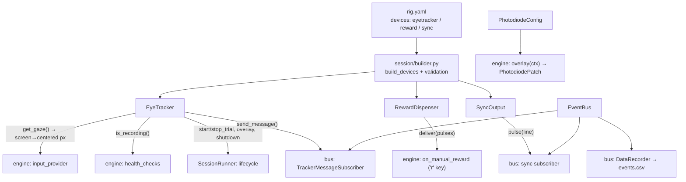
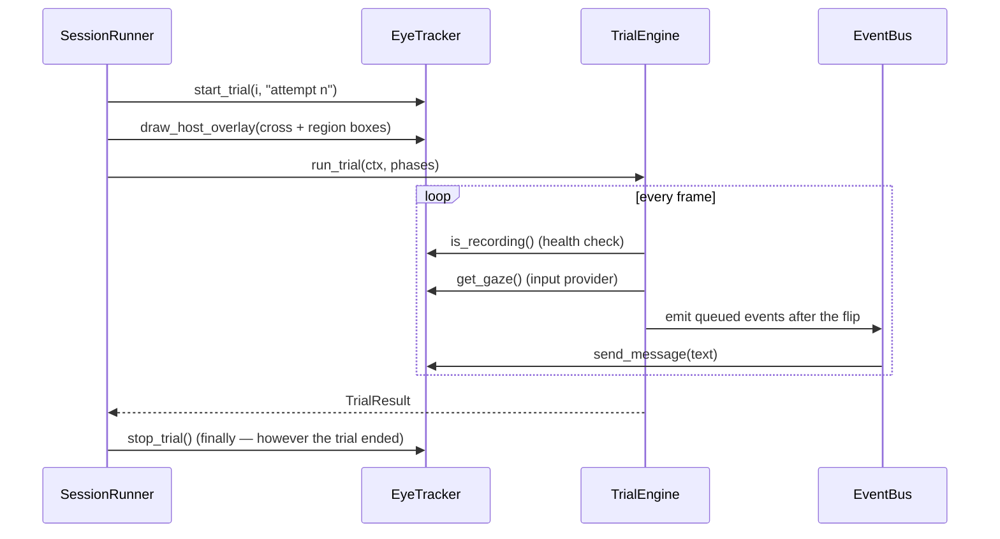
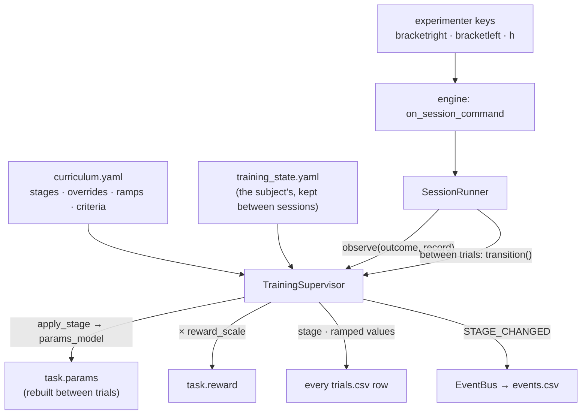
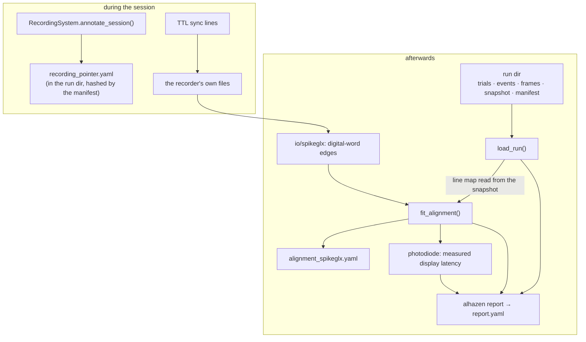

# Architecture

*How the package is put together and why it is shaped that way. It is a
living document: update it in the same change that changes the code.*

## 1. The shape of the package

A hardware-free core that runs complete simulated sessions and writes the
full documented data layout; a device layer that puts a real eye tracker,
reward pump and TTL sync behind protocols; and the task layer an experiment
actually writes against — one `Task` subclass, a library of reusable phases,
reward policy as data, and the scheduler library.

```
src/alhazen/
├── errors.py       # shared exceptions; outside the layer contract (anything may import)
├── core/           # clock, rng streams, events+bus, commands, trial vocabulary, TrialEngine
├── display/        # DisplayBackend protocol, simulated + psychopy backends, Screen, FrameMonitor
├── stimuli/        # Stimulus protocol, NullStimulus, FixationPoint, PhotodiodePatch
├── scenes/         # illusion-studio scenes: expressions, loader, headless renderer
├── devices/        # EyeTracker (eyelink/viewpixx/mouse_sim/scripted), RewardDispenser,
│                   #   SyncOutput, SubjectKeyboard, SpikeSource (spikeglx/simulated);
│                   #   eyetracker/calibration.py is our own cal graphics for the
│                   #   EyeLink, and viewpixx.py draws its own
├── neural/         # pure-numpy neural arithmetic: threshold spike detection, the live
│                   #   stream→session timebase, probe grids and RF accumulation — shared
│                   #   by the live device path and the offline analysis
├── paradigms/      # Condition, TrialSource, SimpleSequence, ConstantStimuli, staircases,
│                   #   QUEST+, adjustment, BlockPlan, SchedulerConfig + make_scheduler
├── task/           # Task, RewardPolicy, TrialSetup/TrialPlan, phases/ (the phase library),
│                   #   live.py (the between-trials live-analysis seam), templates/ (whole
│                   #   ready-made tasks: RF mapping for V1/V2/V4/MT)
├── training/       # curricula: stages, ramps, criteria, per-subject state
├── analysis/       # reading a run back: io/ readers, TTL alignment, photodiode, report
├── modes/          # the six ways to start an experiment (docs/modes.md)
├── session/        # SessionRunner, build_session, DataRecorder, the pause menu, check_rig
├── config/         # pydantic models (extra=forbid, frozen), YAML loader, snapshot writer
├── data/           # naming, SessionPaths, manifest, participants registry
├── dashboard/      # isolated local HTTP process, panel statistics, and the browser page
├── testing/        # PUBLIC fakes: FakeClock/FakeDisplay/FakeStimulus/Scripted*/EventCollector
├── _scaffold/      # the template `alhazen new` renders
└── cli/            # new · run · validate · check-rig · calibrate · report
```

Layering is enforced by import-linter (pyproject `[tool.importlinter]`),
top to bottom: `cli` → `session | testing | analysis` → `training` → `task` →
`data | dashboard` → `paradigms | devices` → `core | neural` →
`stimuli | scenes` → `display` → `config`. Imports point only downward;
`errors` sits outside the contract. `neural` shares core's line so that
both the device layer (live, during a session) and the analysis layer
(offline, over the files) can run the same spike detection and the same
map arithmetic without either importing the other.

Three placements carry the weight:

- **Devices** sit above core because they need the clock, `Event`, `Screen`
  and the config models — and *nothing below them imports devices*. Only
  `session/builder.py` wires them, which is what keeps the engine and every
  phase hardware-free.
- **Task** sits above paradigms (`Task.make_source` builds schedulers) and
  below session (the runner calls a task, never the reverse) — which is why
  `TrialSetup` and `TrialPlan` live in `task/plan.py` rather than with the
  runner that consumes them. **Training** sits between them: it re-validates
  parameters through the task's own model, and the runner drives it. Nothing
  in `task` knows a curriculum exists.
- **Analysis** shares the session line and imports none of session, task,
  devices or stimuli — so an analysis machine needs no renderer and no device
  SDK, and an analysis can never quietly re-declare what the rig was doing
  (§7).

The live dashboard is session infrastructure but runs in a separate spawned
process. The runner publishes replaceable snapshots only between trials and
receives browser commands only while paused, so a slow or closed browser
cannot enter the frame loop or delay a flip.

## 2. The frame loop (`core/engine.py`)

One loop per displayed frame, and the only code that touches the display, the
command source, and the bus:

1. poll experimenter commands (skip / pause / calibrate / quit / manual reward)
2. run per-frame health checks (e.g. "is the tracker still recording")
3. snapshot inputs into `ctx.inputs` (gaze, converted to centered px)
4. `phase.on_frame(ctx)` draws and decides (CONTINUE / ADVANCE / Outcome)
5. draw the rig's `overlay(ctx)`, if any — today, the photodiode patch
6. `display.flip()` — the only moment photons change
7. stamp the session clock; compute `ctx.dt` (duration of the just-shown frame)
8. feed the FrameMonitor (dropped-frame policy: log/warn/mark_trial/abort_run)
9. emit the events the phase queued via `ctx.emit_on_flip`, stamped now —
   the photon-honest timestamp

The overlay runs *after* the phase and *before* the flip, so it can see what
that frame queued. That is what lets the photodiode patch mark the exact flip
an event's timestamp refers to.

Invariants the tests pin:

- `TRIAL_START` emits immediately (it precedes every other event in the
  trial); visual events emit only after their flip.
- Every emitted event mirrors into the trial record as `t_<name>`.
- Phases are dumb: they only touch `TrialContext`, never hardware — which is
  why the whole engine runs against `alhazen.testing` fakes.
- Subscriber exceptions propagate out of `EventBus.emit` (a broken recorder
  or sync line aborts loudly).
- An unverifiable gaze/position is outside every region (the blink rule,
  `CircleRegion.contains(None) is False`).

### 2.1 `InputFrame` — what a phase can see

One snapshot per frame, assembled by the builder's input provider (step 3)
and handed to every phase as `ctx.inputs`. Phases never touch a device; this
is the whole of what they get.

| field | type | meaning |
|---|---|---|
| `gaze` | `tuple[float, float] \| None` | Where the subject is looking, in **centered px, y up**. `None` means unverifiable — a blink, a track loss, or no tracker at all. |
| `keys` | `tuple[str, ...]` | The **subject's** key presses since the previous frame, oldest first. A tuple, not one key: a fast double-press inside a frame must not be silently dropped. Distinct from the experimenter's keys (`core/commands.py`) — different person, different keys, different consequences. |
| `wheel` | `float` | Scroll-wheel movement over that frame, positive up — an adjustment task's knob. |

Two rules the fields carry:

- **The conversion happens once.** Trackers report screen px with y growing
  *down*; phases read centered px with y growing *up*. The builder's
  `make_input_provider` closure is the only place that changes. A second
  conversion site is how a task ends up silently mirrored about the
  horizontal midline.
- **`None` passes straight through as `None`.** An unverifiable position is
  never replaced by the last known one, and `CircleRegion.contains(None)` is
  False, so no region ever credits fixation that cannot be verified.

Fields are only ever **appended**, with defaults, so a phase or a test that
reads one of them is unaffected by the others.

The command source has two reads, and the difference is load-bearing.
`poll()` (step 1, every frame) asks the keyboard only for the keys the
command map binds, because reading a key *removes* it from the queue and the
subject's response keys are read from that same queue later in the same
frame. `poll_raw_keys()` asks for everything, and is called only from the
pause flow — where the session is stopped, nothing else is polling, and the
keys that matter (`space` to resume, `q`/`escape` to quit) are on purpose not
commands.

## 3. Experiment-declared vocabulary

The generalization at the heart of the package:

- **Events** are declared names (`EventSchema(("STIM_ON", ...))`), validated
  at emit time; `TRIAL_START/TRIAL_END/REWARD/PAUSED/RESUMED` are reserved.
- **Outcomes** are declared per task (`outcomes(CORRECT=dict(completed=True,
  success=True), ...)`); the framework interprets only `completed` (which
  drives scheduler re-queueing) and reserves `PAUSED`/`ABORTED`.
- **Trials** are assembled by the experiment's `build_trial(TrialSetup) ->
  TrialPlan(phases, stimuli, regions, record)`; derived measures come from
  the experiment's `score(record)` hook, never from the engine.

All four arrive together on one `Task` subclass (§5), which
`build_session(task=...)` reads them from.

## 4. The device layer

One protocol per device class, at least one real backend, one simulated, and
— where a test needs to *drive* the device — one deterministic double. Vendor
SDKs are imported inside the method that needs them, so `import alhazen` and
the whole default test suite work with none of them installed.

| Protocol | Backends | Notes |
|---|---|---|
| `EyeTracker` | `eyelink`, `viewpixx`, `mouse_sim`, `scripted` | screen-px gaze on the session clock; Host-PC overlay where one exists; the native recording landed in the run directory at teardown |
| `RewardDispenser` | `nidaq`, `simulated` | pulse train (n, width, gap); the waveform always ends at 0 V |
| `SyncOutput` | `nidaq`, `simulated`, `none` | one digital line per configured event name |
| `SpikeSource` | `spikeglx`, `simulated` | live threshold-crossing spikes on the session clock, drained between trials; a background fetch thread whose faults re-raise on the session's own thread. The simulated backend fires to a configured stimulus event from ground-truth receptive fields, so the whole live pipeline runs — and is asserted on — with no probe in any brain ([rf-mapping.md](rf-mapping.md)) |

`scripted` is test-only and is rejected by *both* `build_session` and
`check-rig` with a `ConfigError`: a rig YAML has no way to supply a gaze
trajectory, so naming it there is a broken config, and a session that "ran"
on replayed gaze would be worse than one that refused to start.

### 4.1 Calibration graphics, written here rather than vendored

pylink runs calibration by calling back into a display object the host
program supplies (draw a target here, take this camera-image line, what keys
were pressed). SR Research publishes an example implementation of that
callback surface; alhazen does not vendor it, because that file is
**GPL-2.0-or-later** and this package is MIT — a licence mix that would
propagate to every experiment installing it.
`devices/eyetracker/calibration.py` is alhazen's own implementation against
the same documented interface.

It is split so the interesting parts are testable with no SDK at all:
assembling the camera image, drawing crosshair overlays into it, and
translating key names and colour indices are plain functions with unit tests.
Only the thin `pylink.EyeLinkCustomDisplay` subclass needs the real SDK, and
it is defined inside `make_calibration_graphics()` because subclassing needs
pylink at class-definition time. Beeps are generated tones — alhazen ships no
sound assets, and a machine with no working audio still calibrates.

### 4.2 How a device reaches the engine

The engine has no device imports. `build_session` turns each device into a
narrow hook or a bus subscriber, and the runner owns their lifecycle:



Bus subscription order is fixed: **tracker messages → sync pulses →
recorder**. No subscriber depends on another's side effects, so the order is
not behaviorally load-bearing; it is kept fixed so the two hardware paths
(which can fail and abort the emit) run before the in-memory bookkeeping.

Two coordinate rules that only bite in analysis if broken:

- Trackers report **screen px, y down**; phases read **centered px, y up**.
  The conversion lives in exactly one closure (`make_gaze_input_provider`),
  reused by the test harness rather than reimplemented.
- `get_gaze() → None` (no sample, track loss, or an EyeLink `MISSING_DATA`
  sentinel — a blink is *data saying "no eye"*, not missing data) passes
  through as `None` and is therefore outside every region.

### 4.3 One trial's device lifecycle



`stop_trial()` is idempotent and guaranteed by a `finally`: a tracker left
believing it is still recording writes the next trial's samples into this
trial's segment. At teardown the runner adds `tracker.shutdown(...)`,
`sync.close`, `reward.close` — before the manifest is written, so the
retrieved recording is covered by it, and each as its own step, so one
device's failure never prevents another's release. Only the run directory and
the base name in that path are a promise; the suffix belongs to the backend
(§4.7).

**Reward policy is not here.** The only live path through the device layer is
the experimenter's manual-reward key: the engine delivers, *then* emits
`REWARD{manual: true}` — in that order, because an event claiming a reward
the pump never gave is a lie in the data.

### 4.4 Config that names events

`sync.event_lines` and `display.photodiode.events` are keyed by the
*experiment's own* event names, so they can only be validated against its
`EventSchema` — which is why that check lives in `build_session` and fails
loudly there, naming the offending key and the declared vocabulary. An
unvalidated typo would surface as a TTL pulse that silently never fires.

### 4.5 The photodiode patch

Every software timestamp is taken right after `flip()` returns: a claim about
when photons changed, not a measurement. `PhotodiodePatch` (installed as the
engine's overlay) turns white on exactly the frame whose flip carries a
configured event — the same flip that stamps the event and fires its sync
pulse — so a diode taped over the corner, a TTL line, and the recorded
timestamp all refer to one instant. It is drawn on *every* frame, white or
black, so the corner's mean luminance is constant. On a simulated display it
records its white/black trace into `states` instead of drawing.

### 4.6 `alhazen check-rig`

`check_rig(rig, pulse)` returns one `CheckResult` per component (config,
data_root, eyetracker, reward, sync); the CLI prints them and exits 1 if any
failed. Every check runs even after one fails — whoever came to check the
whole rig wants the complete picture from one invocation. It constructs the
*same* backend objects a session would (`make_tracker` / `make_reward` /
`make_sync`), so a clean check predicts a working session instead of
exercising a parallel code path. With `--pulse` it fires one 50 ms reward
pulse and one pulse per mapped sync line, because constructing a backend only
proves the SDK imports. It never opens a window, and says so rather than
implying the display was verified.

### 4.7 Two eye trackers behind one seam

`eyetracker.backend` selects between them and nothing else in a config
changes. What differs is entirely behind `EyeTracker`, and is worth naming
because the two devices are not the same shape of thing.

| | `eyelink` (SR Research) | `viewpixx` (VPixx TRACKPixx3) |
|---|---|---|
| Where it lives | a separate Host PC on the tracker subnet | a camera inside the display chassis, on the DATAPixx3 |
| Native recording | an EDF the Host PC writes to its own disk, retrieved at teardown | samples in the DATAPixx3's RAM ring buffer, drained to CSV by this machine |
| Gaze frame | screen px, y down | **centered px, y up** — converted once, in the backend |
| "No eye" | coordinates set to `-32768` | coordinates parked at `±9000`, or NaN |
| Eyes | tracker reports which one; binocular ties break to left | always binocular; `eyetracker.eye` picks `left`/`right`/`average` |
| Calibration | `doTrackerSetup()` runs it on the Host PC | alhazen draws the target grid in the session window and fits from it |
| Messages | written into the EDF, which then carries its own alignment | written to a sidecar CSV stamped on **both** clocks, because nothing can be written into the sample stream |
| Operator overlay | drawn on the Host PC's eye image | none — the only surface the device can draw on is the subject's screen |

Two consequences are load-bearing rather than cosmetic:

- **The buffer is drained every trial**, not once at teardown. The DATAPixx3's
  buffer is a fixed-size ring, so a session longer than the ring silently
  overwrites its own oldest samples — and looks completely normal doing it.
- **A ViewPixx run directory holds no EDF.** It holds `<base>_gaze.csv` (the
  samples, in VPixx's own format) and `<base>_gaze-messages.csv` (device
  clock, session clock, text). The second file is what the EDF gets for free:
  without it there is nothing relating the sample timestamps to anything else
  in the session.

## 5. The task layer

### 5.1 One Task per experiment task

```python
class SaccadeTask(alhazen.Task):
    name = "saccade-to-target"          # lowercase, filename-safe
    events = EventSchema(("STIM_ON", "SACCADE_ONSET", "LANDED"))
    outcomes = outcomes(CORRECT=dict(completed=True, success=True))  # ...and the rest
    params_model = SaccadeParams        # pydantic; validated before it is used
    reward = RewardPolicy(by_outcome={"CORRECT": RewardPulses(n_pulses=2)})

    def conditions(self, rng): ...      # default: one nameless condition
    def build_trial(self, setup): ...   # the one method every task writes
    def score(self, record): ...        # default: identity
```

The declarations are checked in `__init_subclass__`, at class-definition
time: a task missing its outcomes is a programming error the author should
meet while writing the file, not with a subject waiting. `make_source` reads
a `SchedulerConfig` from the params (§5.4) unless the task overrides it, and
`build_session(task=...)` fills in name, params, events, trial builder,
scheduler, score and reward policy — while the explicit parameters still work
and still win when both are given, which is what a test overriding one piece
of a real task needs.

### 5.2 The phase library (`task/phases/`)

| Phase | Ends when | Records |
|---|---|---|
| `AcquireFixation` | gaze holds the window for `hold_s` (timer **resets** on any excursion) or times out | `acquire_latency_s` |
| `HoldFixation` | the jittered duration elapses; any excursion is a break | `hold_duration_s` |
| `StimulusResponse` | gaze leaves the depart-region, or the deadline passes | `rt_ms`, `<depart_region>_x/y_dva` (where the eye left from — measured, never assumed to be the fixation point) |
| `LandingCheck` | gaze enters the target region, or the window times out | `endpoint_x/y_dva`, `endpoint_error_dva`, `endpoint_in_target` |
| `ResponseWindow` | a bound key is pressed, or the deadline passes | `response_key`, `rt_ms` |
| `AdjustmentLoop` | the commit key is pressed, or the deadline passes | `adjusted_value`, `adjustment_turns` |
| `FrameSequence` | a compiled `FrameTimeline` finishes | `sequence_frames` |
| `Blank` / `Feedback` | a fixed duration elapses | — |

Every constructor takes plain values — seconds, region names, stimulus keys,
Outcomes — and never a config model: resolving a `Duration` against the
measured refresh rate happens once, in `build_trial`. Every phase touches
only the `TrialContext`, which is what lets all of them be tested against a
fake clock and scripted inputs with no display, tracker or session.

Two rules recur and are load-bearing:

- the **blink rule**: an unverifiable gaze is outside every region, and the
  gaze check runs *before* the completion check, so a blink on the final
  frame of a hold is a break rather than a lucky pass;
- reaction times run from the **flip** that showed the onset event
  (`ctx.record["t_<event>"]`), not from the call that drew it.

`FrameTimeline` (in `display/frames.py`) is the schedule `FrameSequence`
plays: keyframes, linear ramps, visibility spans and events, all indexed by
frame. Frames rather than milliseconds because a display can only change on a
flip — "50 ms after onset" is a wish, "frame 3" is what happens.

### 5.3 Reward policy is data

```python
RewardPolicy(by_outcome={"CORRECT": RewardPulses(n_pulses=2)}, scale=1.0)
```

An outcome absent from the table earns nothing, so a typo fails safe rather
than paying out on the wrong trials. `scale` multiplies the pulse *count*
only — pulse width is the pump's calibration, not a measure of how generous
this session is — and is the dial a training stage turns.

The runner delivers after the trial ends and before the row is written, so
`record["rewarded"]` says what happened at the pump rather than what was
owed.

**A failed delivery is the one deliberate catch in the codebase.** Everywhere
else a device fault aborts loudly, but here the measurement already exists,
and losing a completed trial's data to report a juice-line problem would be
the worse failure. So it is logged with its traceback, recorded as
`rewarded=False`, marked with a reserved `REWARD_FAILED` event (its own
event, never a `REWARD` with a flag — they mean opposite things), shown on
screen, and handed to the pause flow so a human decides before the session
carries on rewarding nothing.

A **completed** trial that earns nothing emits the reserved `NO_REWARD`
event — again its own event rather than the absence of `REWARD`, because a
missing event is indistinguishable from one that failed to be written. An
*incomplete* trial gets neither: it earned nothing because it produced
nothing, which is a different statement.

### 5.4 Schedulers (`paradigms/`)

| Scheduler | Serves | Summary (`*_paradigm.csv`) |
|---|---|---|
| `SimpleSequence` | a fixed list, shuffled | none |
| `ConstantStimuli` | full factorial × `n_per_condition` | per-cell attempts and completions |
| `UpDownStaircase` / `InterleavedStaircases` | transformed up-down, one or many interleaved | final value, reversals, reversal mean |
| `QuestPlus` | the most informative intensity, per interleaved level | posterior mean of each parameter, entropy |
| `AdjustmentTrials` | one condition per setting to be made | completed / remaining |
| `BlockPlan` | any of the above, in blocks | completed trials per block |

All of them: draw randomness only from the injected Generator, hear about
**every** outcome, and re-serve any condition whose outcome was not
`completed`. Schedulers read `TrialResult.outcome` and never the record — a
scheduler reaching into measurements is how a scheduler and an analysis end
up disagreeing about what "correct" meant. `QuestPlus` takes a
`score: Callable[[TrialResult], bool]` for tasks titrating something other
than accuracy.

`SchedulerConfig` (+ `StaircaseConfig`, `QuestConfig`, `BlockConfig`) is the
config surface, so moving from constant stimuli to a staircase is a YAML edit
rather than a code edit. The scheduler's summary, when it has one, is written
to `<base>_paradigm.csv` at teardown; no file means the paradigm had nothing
to say.

QUEST+ is implemented here in numpy — posterior over a (threshold, slope,
lower asymptote, lapse rate) grid, min-entropy stimulus selection, updates in
log space — rather than delegating to a renderer's staircase class. It is
arithmetic, and a scheduler that dragged in the display stack would make
adaptive experiments impossible to run, or test, on a machine with no
renderer. Its test simulates an observer with a known threshold and checks
the estimate converges.

Two composition rules fall out of blocks and are worth stating:

- A **queue-based** scheduler gets one instance per block; an **adaptive**
  one is shared across blocks. Sharing a queue re-queues a failed condition
  at the end of the *whole* queue, so its retry lands in the last block
  rather than its own. An adaptive scheduler cannot be split that way — its
  estimate has to carry across the boundary, which is why it needs
  `trials_per_block`.
- End-of-block recycling needs no `recycle` parameter: a block is bounded by
  *completed* trials, so the inner scheduler's own re-queue already lands the
  retry inside the same block. A second queue in the wrapper could
  double-serve a condition.

### 5.5 Live analysis (`task/live.py`)

Some tasks need computation that watches the session as it runs and could
never fit a dashboard panel's trial-record columns — a receptive-field map
accumulating over a spike stream, a running PSTH. The seam is one optional
hook, `Task.live_analysis(wiring)`, returning a `LiveAnalysis`, with three
rules that keep it safe:

- **the builder wires it like a device**: the hook receives the spike
  source the *rig config* built (or None), so task code never constructs
  hardware and the same task runs on a rig with no `spikes:` entry —
  saying so on its panel rather than crashing or staying quiet;
- **never inside the frame loop**: the optional `on_event` bus subscriber
  may only take notes; the work happens in `on_trial`, which the runner
  calls between trials, after the scored row is written and before the
  dashboard publish — so the panels in that publish already include the
  trial;
- **`finish(run_dir)` runs in teardown before the manifest is written**
  (and before the spike source closes, so it can drain one last time), so
  whatever it saves is hashed with everything else the run produced.

Its `panels()` return finished payloads in the dashboard's own wire shapes
(§9), appended after the spec's panels under their own sidebar section.

### 5.6 Template tasks (`task/templates/`)

Whole tasks alhazen ships — the procedures every lab runs before its
experiment can begin — registered under the same `alhazen.tasks` entry
point group an experiment package uses, so `alhazen run --task rf-map-v1`
works with nothing else installed and the templates exercise the discovery
path every downstream task depends on. The first family is receptive-field
mapping for V1/V2/V4/MT ([rf-mapping.md](rf-mapping.md)): one base task,
four presets differing only in parameter defaults, every mode hook
implemented, and a live map wired through §5.5. A downstream experiment
runs a preset as-is, subclasses it to pin its own site's geometry, or
imports the pieces.

## 6. Training

Shaping an animal means running the same task at a difficulty it can actually
do, and moving that difficulty as it learns. A curriculum makes that *data*:
a config file an experimenter reads and edits, rather than a schedule buried
in task code.



When a session runs under a curriculum, the config snapshot is built *after*
the supervisor has applied stage 1 — so it records the parameters the session
actually ran at, not the file values the stage overrode.

### 6.1 A curriculum

```yaml
stages:
  - name: any-look
    overrides: {fix_window_dva: 8.0, hold_duration: {ms: 50}}
    reward_scale: 2.0
    criteria: {window: 20, min_trials: 10, promote_when: {completed_rate: 0.8}}
  - name: tighten
    ramps: [{param: fix_window_dva, start: 8.0, end: 3.0, over_completed_trials: 40}]
    criteria: {promote_when: {success_rate: 0.75}, demote_when: {completed_rate: 0.3}}
  - name: real-task      # no overrides: the task's own parameters
```

Overrides are dotted paths into the task's params model, re-validated through
that model — a stage that asks for something the task cannot express fails at
**session build**, naming the stage and the path, rather than running a
session at a difficulty nobody chose. Each stage's overrides apply to the
task's original parameters, never to the previous stage's output, so a
demoted subject genuinely goes back. Ramps move a parameter linearly with
*completed* trials in the stage (an unengaged hour earns no progress) and
never overshoot their end value.

### 6.2 Criteria

Metrics run over a sliding window of recent **attempts**, carried across
sessions — a criterion over the last 100 trials means the last 100 trials,
not "the last 100 of today", or a subject could be promoted twice on one good
afternoon. Built in: `completed_rate` (engagement — completed ÷ all
attempts), `success_rate` (accuracy among *completed* trials only, since a
broken fixation is not a wrong answer), `mean_rt_ms`. `register_metric` adds
more.

Nothing is decided until the window holds `min_trials` attempts. Demotion is
checked first and any single demote criterion fires it; promotion needs all
of them. A transition clears the window, so the new stage is judged on trials
run at that stage.

Every metric a curriculum names is checked against the registry when the
supervisor is built, alongside the stage-override check. A typo'd metric name
that raised the first time a window filled would mean an hour into a session
with an animal already working.

The window is fed the **scored** record: the same dict written to
`trials.csv`, after the task's `score` hook ran. A derived measure computed
there exists nowhere else, so a criterion could otherwise never gate on one.

### 6.3 What persists, and what a row says

`<data_root>/sub-<ID>/training_state.yaml` holds the stage, completed counts
per stage, the window, and every transition with its timestamp and session.
Plain YAML on purpose: an experimenter who needs to put an animal back a
stage on a Monday morning should be able to do it with a text editor. A
missing file is a first session; an unreadable one is loud and left in place,
because silently restarting an animal at stage 0 after a disk problem would
waste weeks and read as a behavioural regression.

Every trial row carries `stage`, `stage_completed_trials`, `reward_scale` and
each ramped parameter's current value (`ramp_<path>`) — which is what makes a
training session's data analysable on its own, rather than only in the
company of the curriculum file that produced it.

### 6.4 Runtime control

Transitions happen **between trials only**; a stage change mid-trial would
record one row at a difficulty that was true for part of it. The
experimenter's keys — `bracketright` promote, `bracketleft` demote, `h` hold
automatic transitions — reach the runner through an engine hook
(`on_session_command`) that passes on any command the frame loop has no
opinion about, so the engine stays ignorant of what a curriculum is. Each
transition emits the reserved `STAGE_CHANGED` event.

`SessionRunner._apply_stage_transition` is the single choke point every
transition flows through, and it re-reads `supervisor.reward_policy` there: a
stage rebinds `task.reward` to a scaled copy, and the runner pays from its
own reference, so without the refresh the pump keeps delivering the previous
stage's amount while every row stamps the new scale.

Teardown calls `supervisor.restore_base()`, putting the task's `params` and
`reward` back as handed over — a `Task` instance can outlive one session, and
stages are applied by mutating it in place.

## 7. Multi-device data

A session is only half the record when there is a neural recording beside it.
This is the other half: making the two findable, alignable, and checkable.



### 7.1 The pointer, written before trial 1

Most acquisition software cannot be annotated programmatically, so alhazen
records what it *can*: a `recording_pointer.yaml` in the run directory naming
the system and where its files are expected. It is written before the session
starts, so a crashed session still says what it was recording against, and
the manifest hashes it like everything else. `check-rig` covers the recorder
too — the failure that actually happens is an acquisition host's share that
did not mount, and it should be found on an empty rig.

### 7.2 Alignment

Two machines, two crystals, two ideas of what a second is. The TTL pulses put
the same events in both records; `fit_alignment` fits
`recording_time = offset + scale × session_time` and reports how well.

Three rules:

- **The line map comes from the run's own snapshot**
  (`RunData.sync_event_lines`), never from a caller's idea of the rig — a
  notebook that re-declares the channel map will one day be wrong about a
  session it was not written for.
- **Unmatched pulses are counted, never absorbed.** The fit seeds from an
  exhaustive search over endpoint pairings, refines by alternating
  nearest-pulse matching with refitting, and *refuses* when too few events
  match: two records of different sessions would otherwise produce a
  confident-looking transform. It refits offset and scale on the **final**
  match set, since a loop that stops on its iteration cap holds a match set
  one round newer than its last fit.
- **The fit is an artifact.** `alignment_<system>.yaml` beside the data,
  because an alignment recomputed next year with a different tolerance is a
  different alignment.

### 7.3 Measured display latency

The patch turned white on exactly the flip carrying an event; the diode
recorded when the screen really changed. Mapping the event's software time
through the alignment and taking the first edge at or after it gives display
latency — measured, not assumed. Reported as a median with a
median-absolute deviation, so one mismatched edge cannot double the apparent
jitter, and never matched backwards, since the screen cannot change before
the flip that changed it.

Before measuring anything, the loop checks that the channel is plausibly the
diode's: the patch flashes once per armed event, so a channel carrying more
than a few rising edges per armed event is refused by name. An unconnected
analog input is noise, its own min/max puts the auto threshold in the middle
of that noise, and a crossing lands just after every event — producing a
confident near-zero display latency that an analysis would then subtract from
every timestamp.

Sync-line numbers are read with an **end-anchored** pattern
(`line\s*(\d+)\s*$`). Unanchored, any earlier `line<digits>` wins, so a device
path under a directory called `baseline5` resolves to bit 5 — a confident
answer about a wire nobody chose.

### 7.4 `alhazen report`

```
alhazen report --run <run_dir> [--neural <spikeglx_run_dir>]
```

Prints and writes `report.yaml`: identity and seed, trial counts per outcome,
frame QA (dropped count, rate, worst interval, **and drops per trial** — a
session's total says nothing about whether they were spread evenly or all
landed in one trial's stimulus), the manifest verdict, and — with `--neural`
— the alignment summary, the measured display latency, and **events emitted
against pulses recorded for every mapped sync line**, not only the one the
alignment fitted on. A line that was wired but never pulsed is a rig fault
the busiest line's fit cannot reveal.

`completed_rate` reads the row's own `completed` column, which the engine
stamps in `_finalize`. Counting every row whose outcome was neither `PAUSED`
nor `ABORTED` is wrong for any experiment whose incomplete outcomes have
their own names — a broken fixation writes a row, so a shaping session's
engagement rate would read as 100% however the animal did.

Exits non-zero when the manifest failed or an alignment was refused, so it
can gate a pipeline. Every number is printed, including the good ones: "0
dropped frames" belongs in the record, not merely in the absence of a
warning.

**Anything written into a run directory re-writes the manifest.** A run
directory is append-only *by manifest rewrite*: `verify_manifest` reports an
unlisted file as a problem, so `AlignmentFit.save` and `SessionReport.save`
both call `write_manifest` (idempotently) after writing. Otherwise the first
report leaves unlisted files behind and every later report — and every
`load_run` — comes back not-ok, i.e. the tool breaks the thing it exists to
check.

### 7.5 Results bundles

An analysis that writes a CSV and nothing else cannot be reproduced — not
because the code is gone, but because *which inputs, which parameters and
which version produced that particular file* is gone.

`ResultsBundle(out_dir, parameters=…)` is an output directory plus a
`manifest.json` recording exactly that: every input with its sha256 and size
(a directory input — a recording — is recorded by name and contents instead,
since hashing gigabytes to identify it costs more than it is worth), every
table written, the parameters, and the alhazen version that produced them. An
empty result still writes its file: nothing on disk is indistinguishable from
the analysis never having run, which is the question the bundle exists to
answer.

### 7.6 Readers

`analysis/io/` holds the file formats: `spikeglx` (meta, memory-mapped
binary, digital-word bit extraction, analog channels), `kilosort` (spike
times, clusters, curation labels), `eyelink`/`asc` (EDF→ASC conversion with
an error that names the Developer's Kit, and a parser where a blink is NaN
rather than a position at the origin), and `session` (a run directory,
manifest-verified, returned as typed pandas DataFrames — a `csv.DictReader`
row hands back `row["success"] == "False"`, and `"False"` is truthy). All are
tested against synthetic files written by `tests/fixtures_neural.py`, so each
test can say what should come out rather than only that nothing crashed.

`analysis/rf.py` composes them for the RF-mapping templates: the probe grid
and counting window rebuilt from the run's **own snapshot**, flash onsets
from the flip-stamped events, spikes from Kilosort, clocks through the TTL
alignment — the offline recomputation of the live map, documented in
[rf-mapping.md](rf-mapping.md#offline-the-maps-properly).

## 8. Scenes

Stimuli designed in
[illusion-studio](https://github.com/sh4r11f/illusion-studio) and run
unchanged in experiments. A scene is JSON — shapes, gratings, dot fields, and
expressions that animate them — and the same file produces the same picture
in the studio and in a trial.

The full treatment, including the subset table, the language's
JavaScript-not-Python semantics, and the measured pixel tolerances, is in
[`scenes.md`](scenes.md). Three things are worth knowing here:

- **The primary renderer is headless.** `headless_render(scene, params, time,
  width, height)` returns a numpy array with no display, no window and no
  renderer, and the display path blits it. So what an experiment shows is
  exactly what a test inspects, on a machine with nothing installed.
- **Expressions are parsed, never `eval`'d**, and are pinned to the studio's
  own TypeScript by a fixture generated from it — including where the
  language is deliberately not Python (`round(2.5)` is 3, `-2 ** 2` is 4).
- **Out-of-subset scenes are refused by name and path.** A renderer that
  silently skipped a text layer would produce a stimulus that looks almost
  right, which in a psychophysics experiment is worse than one that refused.

Against the studio's own Skia-rendered reference images: everything computed
per pixel rather than per edge — gratings, Gabors, noise, stripes, dashes, a
translated block — is **pixel-identical**, and shapes differ only on their
anti-aliased rims (0.2–1.4% of pixels). Every reference PNG in the fixtures
directory is in the comparison set; a committed reference nobody compares
against is a file, not a test. The rules that parity depends on — nonzero
polygon winding, centred strokes, arc-length dashes, replacing (not
multiplying) layer opacity, and the dot field's stream-per-dot seeding and
index-ordered signal set — are enumerated in [`scenes.md`](scenes.md).

## 9. The database and the live dashboard

Both are *mirrors*: the run directory stays the record, and neither is
allowed to become one.

**`session/database.py`** mirrors each run into one SQLite file per
experiment (`data_root/experiment.sqlite3`), so a question about a whole
season is a query rather than a directory walk. It lives under `session/`
rather than `data/` because it speaks a session's whole vocabulary —
`SessionConfig`, `InputFrame`, `FrameRecord` — and those sit above `data/`,
which is pure disk and knows nothing about trials. Schema, run-id shape and
size policy: [`database.md`](database.md).

**`dashboard/`** runs a small HTTP server in a **child process** and pushes a
snapshot between trials. Three properties constrain the runner, and the rest
of the page is described in [`dashboard.md`](dashboard.md):

- **It never blocks a session.** The queue holds one unread snapshot; a slow
  or closed browser loses updates rather than stalling a trial.
- **It is read-only until the experimenter pauses from the keyboard**,
  enforced by the server against its own authoritative status rather than by
  the disabled buttons on the page. On entering a pause the runner discards
  whatever is already queued, so a command accepted just before a resume
  cannot fire at the *next* pause.
- **The browser draws; it does not analyse.** `dashboard/panels.py` computes
  every mark in Python, over the whole session and thinned to a bounded
  number of points — so each snapshot costs the same on trial 4000 as on
  trial 40, and no statistic lives in untested page JavaScript. A live
  analysis (§5.5) obeys the same division: its `panels()` are finished
  payloads (the receptive-field maps travel as a `heatmap` form the page
  only renders), appended after the spec's own panels.

The child starts before the display opens, so the whole remainder of
`build_session` runs inside a guard that stops it on any failure — otherwise
a tracker that will not connect leaves an orphaned server holding the port.

`devices/automated.py` supplies a scripted subject — gaze that moves from
fixation to a target on `STIM_ON`, alternating key answers after a response
cue — so an unattended machine can run a *visible* demonstration of a real
task through the real engine. It is a device, so it obeys the device
invariants: `get_gaze()` stamps from the **session clock**, received through
`configure(screen, clock)`. That clock is part of the protocol method for
every backend precisely so a backend cannot quietly reach for
`time.monotonic()` and put a second clock in the run.

## 10. Sessions, data, reproducibility

`build_session(...)` wires everything; `SessionRunner.run()` then:

1. writes `config_snapshot.yaml` **before trial 1** (a crashed session still
   documents itself) — merged config + seed + versions + git SHA + an
   environment digest (sha256 over installed distributions);
2. registers the subject in `participants.tsv`;
3. loops: `source.next()` → build → engine → `source.record()` for **every**
   outcome (schedulers own re-queueing) → recorder row for every outcome
   except `PAUSED` (which produced no measurement — its events still land in
   the events table, so the two tables deliberately do not join 1:1);
4. teardown attempts every step regardless of earlier failures (recorder →
   frame log → close log file → manifest → display), re-raising the first
   teardown error only if nothing else is propagating.

On-disk layout per run (see `data/paths.py`; overwriting an existing run's
trials file is refused):

```
<data_root>/participants.tsv
<data_root>/sub-<ID>/ses-<NNN>/run-<NN>_task-<name>/
  ├── sub-.._ses-.._run-.._task-.._<YYYYMMDD>_{trials,events,frames}.csv
  ├── config_snapshot.yaml   session.log   manifest.yaml   figures/
```

Randomness: one resolved seed → `SeedSequence.spawn` into named streams
(`core/rng.STREAMS`, append-only) — scheduler and task never share bits;
module-level `np.random` is never used.

Durations: `Duration(ms=…)` or `Duration(frames=…)`, resolved once against
the **measured** refresh rate (warm-up flips at build time; `resolve_refresh`
errors loudly if measured and nominal disagree).

## 11. Extending

Step-by-step recipes for each seam — stimulus, phase, paradigm, device
backend, display backend, training stage or metric — are in
[`how-to.md`](how-to.md). Four rules apply to all of them:

- **Satisfy the protocol structurally.** Every seam is a `Protocol`, not a
  base class; there is nothing to inherit from.
- **Import the vendor SDK inside the method that needs it**, and raise the
  typed error naming the extra or the installer. If you must subclass one of
  the SDK's classes, do it inside a factory, as `calibration.py` does.
- **Register the name in that seam's `make_*` factory**, which is the single
  place a config name resolves and what both `build_session` and `check-rig`
  call. Give it a config model with a `backend` literal.
- **Ship a simulated sibling in the same change**, so the default test suite
  keeps running with nothing installed.

## 12. The command line

Six commands, each doing one thing an experimenter needs, and each doing it
through the same code a session would — a tool whose "OK" comes from a
parallel implementation is a tool whose OK means nothing.

| | |
|---|---|
| `alhazen new <name>` | scaffold an experiment package: a Task, two rig configs, a task config, tests and a runner. Its tests pass and its session runs before anything is edited |
| `alhazen run --task ...` | run one session of an installed task, found through the `alhazen.tasks` entry-point group; picks the next free run number, prompts for subject and session if omitted |
| `alhazen validate --rig` | is this config file well-formed? |
| `alhazen check-rig --rig` | is this rig actually wired? Constructs the real backends; `--pulse` fires the pump and the sync lines |
| `alhazen calibrate ruler\|gamma` | draw a bar of a known angular size on the rig's own display and say what it should measure; fit and store a gamma curve from photometer readings |
| `alhazen report --run` | what happened, and does the data check out? With `--neural`, aligns the clocks and measures display latency |

The scaffold is vendored as files under `_scaffold/template/` and rendered
with stdlib `string.Template` — a scaffold needing a dependency to run would
be one more thing between a new user and their first session.

The acceptance test **installs** the rendered package (`pip --target`, in a
subprocess), then lists its entry point, runs its tests and runs a session
through `alhazen run` — because packaging is what breaks between a working
checkout and a rig, and injecting `src/` into `PYTHONPATH` exercises none of
it. Marked `slow`; runs in CI.

Every rendered config is **loaded through its real loader** in the scaffold's
tests. Checking that a file exists is not checking that it works: a
`devices:` key followed only by comments is YAML for `devices: null`, which
the non-Optional field rejects.

**The gamma loop closes.** `alhazen calibrate gamma` writes the fit beside
the rig config (`<rig>_gamma.yaml`), and `build_session` applies it through
`display.set_gamma` when the display opens — when the rig arrived as a path,
since a hand-built `RigConfig` has no file for one to sit beside. The path
helpers live in `config/gamma.py` rather than in the CLI, because the builder
sits below the CLI and must not import upward. A measurement made and never
applied leaves every "50% contrast" at 50% of code value rather than of
luminance — an afternoon with a photometer, wasted.

**The monitor is registered, not just described.** A rig config describes a
panel in alhazen's terms; PsychoPy keeps its own per-machine database of
monitors, and that is where Monitor Center writes, where a window looks up a
stored calibration, and what every other PsychoPy script on the rig reads.
`alhazen monitor register` writes one into the other (`display/monitors.py`),
under `monitor.name`, carrying the measured gamma if there is one.

The two then have one rule each. **The config owns the geometry**: every
degree goes through `Screen`, which reads the config, so a registration that
disagrees about width, distance or pixel size is stale and
`display.monitors.resolve` refuses to open a window against it — the
alternative is a session whose deg/px model differs from the one that placed
its stimuli, which nothing downstream could detect. **The registration owns
the calibration**: gamma, luminance grids and colour matrices stay on it, and
re-registering geometry never overwrites them. `check-rig` reports the
comparison, which makes it the one part of the display that can be verified
without opening a window.

**Documentation is checked, not just written.** Every ` ```python ` block
under `docs/` is compiled by a test — the landing page's own example carried
a `SyntaxError` for a whole release, because the docs were prose to every
tool in the repo. `docs/reference.md` is generated from the docstrings by
mkdocstrings, and the site builds under `--strict`.

### Compatibility

The public API is everything exported from `alhazen` and everything in the
documented modules. Deprecations warn for one minor version before removal
(`alhazen._deprecation`), naming the version and the replacement.

Three contracts outlast any version because they live on disk:
`core.rng.STREAMS` is append-only, `RESERVED_EVENTS` only ever gains names,
and the run-directory layout changes only in a major version with a
documented migration.

## 13. Testing

`pytest` runs the whole suite with no display, no hardware, no renderer, no
pylink and no nidaqmx installed — fakes live in the public `alhazen.testing`,
and the device doubles (`ScriptedTracker`, `SimulatedReward`, `SimulatedSync`)
in `alhazen.devices` alongside the real backends. `tests/support.py`'s
`SessionHarness` wires a full session to them, reusing the builder's own
closures so there stays exactly one gaze coordinate conversion in the
codebase. Markers: `display` (excluded by default) is reserved for real-window
smoke tests. CI (3 OSes × py3.10/3.12) runs ruff (lint+format), mypy, pytest,
and the import-layering contract.

Four examples double as acceptance tests, each a `Task` subclass:
`minimal_fixation` (a duration-based trial, no devices), `gaze_fixation` (a
gaze-contingent trial driven by `ScriptedTracker` in the default suite, by
`mouse_sim` under `[psychopy]`, and by nothing at all on the headless rig —
where every trial simply times out), `saccade_to_target` (the four-phase
saccade trial, built from library phases only), and `staircase_detection`
(key responses on interleaved staircases — this one needs a subject, so its
headless equivalent is the test suite).

One test is a probe rather than a regression test: a complete gaze-contingent
trial state machine — four phases, five outcomes — composed from
`alhazen.task.phases` with nothing hand-written, each outcome shown to be
reachable. While that keeps passing, bringing an existing experiment onto the
framework is a matter of its stimuli and its analysis, not its trial logic.
