# Architecture

*How the package is put together and why it is shaped that way. It is a
living document: update it in the same change that changes the code.*

## 1. The shape of the package

A hardware-free core that runs complete simulated sessions and writes the
full documented data layout; a device layer that puts a real eye tracker,
reward pump and TTL sync behind protocols; and the task layer an experiment
actually writes against — one `Task` subclass, a library of reusable phases,
reward policy as data, and the scheduler library.

```
src/alhazen/
├── errors.py       # shared exceptions; outside the layer contract (anything may import)
├── core/           # clock, rng streams, events+bus, commands, trial vocabulary, TrialEngine
├── display/        # DisplayBackend protocol, simulated + psychopy backends, Screen, FrameMonitor,
│                   #   text.reflow (hard-wrapped prose → paragraphs, for show_message),
│                   #   ruler.py (the bar `calibrate ruler` and measure mode draw)
├── stimuli/        # Stimulus protocol, NullStimulus, FixationPoint, PhotodiodePatch
├── scenes/         # illusion-studio scenes: expressions, loader, headless renderer
├── devices/        # EyeTracker (eyelink/viewpixx/mouse_sim/scripted), RewardDispenser,
│                   #   SyncOutput, SubjectKeyboard, SpikeSource (spikeglx/simulated);
│                   #   eyetracker/calibration.py is our own cal graphics for the
│                   #   EyeLink, viewpixx.py draws its own, guide.py is the screen
│                   #   before either, procedures.py validates and drift-corrects any
├── neural/         # pure-numpy neural arithmetic: threshold spike detection, the live
│                   #   stream→session timebase, probe grids and RF accumulation — shared
│                   #   by the live device path and the offline analysis
├── paradigms/      # Condition, TrialSource, SimpleSequence, ConstantStimuli, staircases,
│                   #   QUEST+, adjustment, BlockPlan, SchedulerConfig + make_scheduler
├── task/           # Task, RewardPolicy, TrialSetup/TrialPlan, phases/ (the phase library),
│                   #   live.py (the between-trials live-analysis seam)
├── training/       # curricula: stages, ramps, criteria, per-subject state
├── analysis/       # reading a run back: io/ readers, TTL alignment, photodiode, report
├── modes/          # the six ways to start an experiment (docs/modes.md)
├── session/        # SessionRunner, build_session, DataRecorder, the pause menu,
│                   #   eyetracker.py (the session's calibration/validation/drift
│                   #   results and dashboard panels), check_rig
├── config/         # pydantic models (extra=forbid, frozen), YAML loader, snapshot writer
├── data/           # naming, SessionPaths, manifest, participants registry, percents
│                   #   (a measured fraction written beside its threshold, §10.2)
├── dashboard/      # isolated local HTTP process, panel statistics, and the browser page
├── testing/        # PUBLIC fakes: FakeClock/FakeDisplay/FakeStimulus/Scripted*/EventCollector
│                  # and SortedSpikePublisher, the sorter that lives outside this repo
├── _scaffold/      # the template `alhazen new` renders
└── cli/            # new · run · validate · check-rig · sim-sorter · calibrate · report
```

Layering is enforced by import-linter (pyproject `[tool.importlinter]`),
top to bottom: `cli` → `modes` → `session | testing | analysis` → `training` →
`task` → `dashboard` → `paradigms | devices` → `core | neural` →
`stimuli | scenes` → `display` → `config | data | _scaffold`. Imports point
only downward; `errors` and `version` sit outside the contract. `neural`
shares core's line so that both the device layer (live, during a session) and
the analysis layer (offline, over the files) can run the same spike detection
and the same map arithmetic without either importing the other. `modes` sits
directly under `cli`, the only package that imports it, and above `session`,
which every mode builds or drives; the ruler that `--mode measure` and
`alhazen calibrate ruler` both draw lives in `display/ruler.py` so that
`modes` never imports from `cli`. `_scaffold` imports nothing from alhazen but
`errors`, and the bottom line keeps it that way.

Three placements carry the weight:

- **Devices** sit above core because they need the clock, `Event`, `Screen`
  and the config models — and *nothing below them imports devices*. Only
  `session/builder.py` wires them, which is what keeps the engine and every
  phase hardware-free.
- **Task** sits above paradigms (`Task.make_source` builds schedulers) and
  below session (the runner calls a task, never the reverse) — which is why
  `TrialSetup` and `TrialPlan` live in `task/plan.py` rather than with the
  runner that consumes them. **Training** sits between them: it re-validates
  parameters through the task's own model, and the runner drives it. Nothing
  in `task` knows a curriculum exists.
- **Analysis** shares the session line and imports none of session, task,
  devices or stimuli — so an analysis machine needs no renderer and no device
  SDK, and an analysis can never quietly re-declare what the rig was doing
  (§7).

The live dashboard is session infrastructure but runs in a separate spawned
process. The runner publishes replaceable snapshots only between trials and
receives browser commands only while paused, so a slow or closed browser
cannot enter the frame loop or delay a flip.

## 2. The frame loop (`core/engine.py`)

One loop per displayed frame, and the only code that touches the display, the
command source, and the bus:

1. poll experimenter commands (skip / pause / calibrate / quit / manual reward)
2. run per-frame health checks (today one: "is the tracker still recording,
   and still delivering" — §4.3). A check returns None, or a `HealthFault`:
   the reason, and what the device said about it (a bare reason string is
   still accepted). A failed check is a **system fault** — a device stopped,
   which is never the subject's doing — and its reason (`tracker_stopped`) is
   written as the row's `fault`, its words as `fault_detail` (§2.2). A check
   runs every frame, so it must not make a round trip to its device on the
   healthy path. While the trial is still measuring, it also aborts
   the trial: the reserved `ABORTED`, with the same reason as
   `abort_reason`, and the condition is served again. During the **closing
   phase** (the one declaring `must_be_last`, e.g. `TrialFeedback`) it
   aborts nothing: everything was measured before that phase began, so the
   row is flagged, a WARNING is logged, the phase runs to its end, and the
   trial keeps its outcome
3. snapshot inputs into `ctx.inputs` (gaze, converted to centered px)
4. `phase.on_frame(ctx)` draws and decides (CONTINUE / ADVANCE / Outcome)
5. draw the rig's `overlay(ctx)`, if any — today, the photodiode patch
6. `display.flip()` — the only moment photons change
7. read the session clock once — the flip's time, which steps 8–10 all
   record — and compute `ctx.dt` (duration of the just-shown frame)
8. feed the FrameMonitor (dropped-frame policy:
   log/warn/mark_trial/recycle_trial/abort_run; at the trial's end its
   `end_trial()` logs one line per trial with drops and, under
   `recycle_trial`, turns a trial that dropped more than
   `max_dropped_fraction` of its frames into the reserved `DROPPED_FRAMES`
   outcome — `completed=False`, so the scheduler re-serves it like a fixation
   break, with the outcome it would have had kept as
   `outcome_before_frame_qa` and the row flagged `fault: dropped_frames` (a
   system fault, §2.2); `max_consecutive_recycles` in a row abort the
   run naming the display. Only a COMPLETED trial can be recycled: one that
   already ended in a fixation break or a pause is being re-served for its
   own reason. **The verdict governs data quality only — never what the
   subject is told or paid.** It arrives after the closing phase has already
   judged the subject's own outcome (`TrialFeedback` sees the pre-QA outcome,
   by design), and `TrialResult` carries the replaced Outcome as
   `outcome_before_frame_qa`, with `response_outcome` resolving to it, so the
   runner pays on the response (§5.3). A correct trial the display recycles
   is shown as a success, paid, and served again; a display fault never
   costs the subject anything. Under every marking policy `n_dropped_frames`
   is `0` on a clean trial, never absent. On a simulated display the policy is stood
   down to `log` at build time — the flip times there measure how accurately
   the host can wait, not whether a panel is holding its refresh)
9. emit the events the phase queued via `ctx.emit_on_flip`, every one
   stamped with the flip's time from step 7 — the photon-honest timestamp.
   Not with the clock read again as each is emitted: by then the bus's
   subscribers (a tracker message, a sync pulse) have run for the events
   before it, and events shown by one flip would carry different, later
   times
10. hand the phase's mid-trial reward requests (`ctx.request_reward`) to the
    reward worker and emit a `REWARD` for each, stamped with that same flip;
    then report every delivery the worker has finished since the last frame
    as `REWARD_DELIVERED` or `REWARD_FAILED`, and every drop a manual reward
    cancelled as `REWARD_CANCELLED`. Neither step waits for the pump (§5.3)

The overlay runs *after* the phase and *before* the flip, so it can see what
that frame queued. That is what lets the photodiode patch mark the exact flip
an event's timestamp refers to.

Invariants the tests pin:

- `TRIAL_START` emits immediately (it precedes every other event in the
  trial); visual events emit only after their flip, and carry that flip's
  time — as do the frame log and the per-frame inputs for that frame.
  Events with no flip of their own (`TRIAL_START`, `TRIAL_END`, `PAUSED`, a
  manual `REWARD`, a drop's end) are stamped as they are emitted.
- Every emitted event mirrors into the trial record as `t_<name>`.
- Every record carries `fault`: `none` unless a system fault hit the trial
  (`dropped_frames`, `tracker_stopped`) — a value on every row, never an
  empty cell, for the reason `n_dropped_frames` is `0` on a clean trial.
- Phases are dumb: they only touch `TrialContext`, never hardware — which is
  why the whole engine runs against `alhazen.testing` fakes.
- Subscriber exceptions propagate out of `EventBus.emit` (a broken recorder
  or sync line aborts loudly).
- An unverifiable gaze/position is outside every region (the blink rule,
  `CircleRegion.contains(None) is False`).

### 2.1 `InputFrame` — what a phase can see

One snapshot per frame, assembled by the builder's input provider (step 3)
and handed to every phase as `ctx.inputs`. Phases never touch a device; this
is the whole of what they get.

| field | type | meaning |
|---|---|---|
| `gaze` | `tuple[float, float] \| None` | Where the subject is looking, in **centered px, y up**. `None` means unverifiable — a blink, a track loss, or no tracker at all. |
| `keys` | `tuple[str, ...]` | The **subject's** key presses since the previous frame, oldest first. A tuple, not one key: a fast double-press inside a frame must not be silently dropped. Distinct from the experimenter's keys (`core/commands.py`) — different person, different keys, different consequences. |
| `wheel` | `float` | Scroll-wheel movement over that frame, positive up — an adjustment task's knob. |
| `gaze_t` | `float \| None` | When the tracker took the sample behind `gaze`, in **seconds on the session clock**; `None` whenever `gaze` is `None`. A display frame that brings no new tracker sample repeats the previous one *with the same* `gaze_t`, so equal times mean one sample seen twice — a speed computed across it is a false zero — and the gap between two new samples is their real spacing, not the nominal frame period. |

Two rules the fields carry:

- **The conversion happens once.** Trackers report screen px with y growing
  *down*; phases read centered px with y growing *up*. The builder's
  `make_input_provider` closure is the only place that changes. A second
  conversion site is how a task ends up silently mirrored about the
  horizontal midline.
- **`None` passes straight through as `None`.** An unverifiable position is
  never replaced by the last known one, and `CircleRegion.contains(None)` is
  False, so no region ever credits fixation that cannot be verified.
- **A sample keeps its own time.** Every backend stamps `GazeSample.t` on
  the session clock when the sample was taken or first read, never simply
  "now": the EyeLink backend keeps the first-read time for as long as the
  link's newest sample has the same tracker timestamp, and the TRACKPixx3
  reader's time is when it read the device. The provider copies it into
  `gaze_t` untouched — time is not a coordinate, so the one conversion site
  stays the one conversion site.

Fields are only ever **appended**, with defaults, so a phase or a test that
reads one of them is unaffected by the others.

The command source has two reads, and the difference is load-bearing.
`poll()` (step 1, every frame) asks the keyboard only for the keys the
command map binds, because reading a key *removes* it from the queue and the
subject's response keys are read from that same queue later in the same
frame. `poll_raw_keys()` asks for everything, and is called only from the
pause flow — where the session is stopped, nothing else is polling, and the
keys that matter (`space` to resume, `q`/`escape` to quit) are on purpose not
commands.

### 2.2 System faults on the record

Two failures are the rig's, never the subject's, and the engine is where
both are seen: a health check that fails (a device stopped — today the eye
tracker, `tracker_stopped`, step 2) and frame QA's recycle (`dropped_frames`,
step 8). Every row names the one that hit its trial in a single column,
`fault`:

| The trial | `outcome` | `abort_reason` | `fault` | Lost to the fault? |
|---|---|---|---|---|
| nothing failed | its own | — | `none` | no |
| the tracker stopped while it was measuring | `ABORTED` | `tracker_stopped` | `tracker_stopped` | yes |
| the display dropped frames, and frame QA recycled it | `DROPPED_FRAMES` | — | `dropped_frames` | yes |
| the tracker stopped during its closing phase | its own | — | `tracker_stopped` | no |
| the experimenter skipped it | `ABORTED` | `skipped_by_user` | `none` | no — not a fault |

Beside it, `fault_detail` holds what the failed health check said about the
fault, in the device's words — "no new sample from the EyeLink for 58 ms
(limit 50 ms); the Host PC … reports recording ended (isRecording 3,
ABORT_EXPT) …" — so a pulled cable can be told from a Host PC abort
([eye-tracker.md](eye-tracker.md), "When the tracker drops out"). It is only
on a row whose fault a health check reported with a detail; a dropped-frames
row carries its own account in `frame_qa_reason`, and when frame QA's
recycle replaces a closing-phase tracker flag, the detail goes with it. Free
text, for a person: select on `fault`, never on this.

`fault` is on every row, `none` included: a value a reader can select on
(`trials.fault != "none"`), never an empty cell, for the reason
`n_dropped_frames` is `0` on a clean trial. It says which fault *hit* a
trial. Whether that fault *cost the trial its measurement* is a second
question, answered from the row alone by
`core.trial.lost_to_fault(outcome, row)`: `DROPPED_FRAMES`, or `ABORTED`
whose `abort_reason` is its `fault` — the engine writes both from the one
failed check, and that pairing is what tells a tracker abort from a skip.
`TrialResult.lost_to_fault` carries the answer, and an analysis applies the
same rule to trials.csv. What the session does about a lost trial is §5.3.

**A tracker that stops after the measurement.** A stop during the closing
phase — feedback on screen, everything already measured — used to be handled
like any other: the health check aborted the phase. When a measuring phase
had already decided the outcome, the trial kept it, but the feedback was cut
off before it was drawn and the row claimed an `abort_reason` for a trial
that was not aborted. When the closing phase was the one deciding the
outcome — a `LandingCheck` that ADVANCEs into `TrialFeedback(then=...)` —
the finished measurement came back `ABORTED` and was served again. Now the
engine flags the row, logs a WARNING and lets the phase finish, and the trial
keeps the outcome its own phases give it: it is paid, scheduled and counted
by that outcome, and nothing is lost to the fault. The flag stays because
the eye data for the end of that trial is missing, and an analysis of
anything during feedback (a pupil response to the reward) needs to know.

Two faults on one trial — the tracker stopped during feedback, then frame QA
recycled the trial — flag `dropped_frames`, the fault the trial is served
again for; the tracker stop is in the log. A failed health check is always a
device that stopped, never something the subject did, so a check added later
is treated like the tracker's: its reason becomes the row's `fault`.

## 3. Experiment-declared vocabulary

The generalization at the heart of the package:

- **Events** are declared names (`EventSchema(("STIM_ON", ...))`), validated
  at emit time; `TRIAL_START/TRIAL_END/REWARD/PAUSED/RESUMED` are reserved.
- **Outcomes** are declared per task (`outcomes(CORRECT=dict(completed=True,
  success=True), ...)`); the framework interprets only `completed` (which
  drives scheduler re-queueing) and reserves `PAUSED`, `ABORTED` (the
  experimenter's skip, or a device health check that failed) and
  `DROPPED_FRAMES` (frame QA's recycle).
- **Trials** are assembled by the experiment's `build_trial(TrialSetup) ->
  TrialPlan(phases, stimuli, regions, record)`; derived measures come from
  the experiment's `score(record)` hook, never from the engine.

All four arrive together on one `Task` subclass (§5), which
`build_session(task=...)` reads them from.

## 4. The device layer

One protocol per device class, at least one real backend, one simulated, and
— where a test needs to *drive* the device — one deterministic double. Vendor
SDKs are imported inside the method that needs them, so `import alhazen` and
the whole default test suite work with none of them installed.

| Protocol | Backends | Notes |
|---|---|---|
| `EyeTracker` | `eyelink`, `viewpixx`, `mouse_sim`, `scripted` | screen-px gaze on the session clock; Host-PC overlay where one exists; the native recording landed in the run directory at teardown |
| `RewardDispenser` | `nidaq`, `simulated` | pulse train (n, width, gap); the waveform always ends at 0 V. For a task that asks for reward mid-trial, `QueuedReward` wraps the backend and runs every delivery on one worker thread (§5.3); `alhazen.testing.ScriptedReward` holds and fails deliveries on the test's say-so |
| `SyncOutput` | `nidaq`, `simulated`, `none` | one digital line per configured event name |
| `SpikeSource` | `spikeglx`, `simulated` | live threshold-crossing spikes on the session clock, drained between trials; a background fetch thread whose faults re-raise on the session's own thread. The simulated backend fires to a configured stimulus event from ground-truth receptive fields, so a live analysis runs — and is asserted on — with no probe in any brain ([live-spikes.md](live-spikes.md)) |

`scripted` is test-only and is rejected by *both* `build_session` and
`check-rig` with a `ConfigError`: a rig YAML has no way to supply a gaze
trajectory, so naming it there is a broken config, and a session that "ran"
on replayed gaze would be worse than one that refused to start.

### 4.1 Calibration graphics, written here rather than vendored

pylink runs calibration by calling back into a display object the host
program supplies (draw a target here, take this camera-image line, what keys
were pressed). SR Research publishes an example implementation of that
callback surface; alhazen does not vendor it, because that file is
**GPL-2.0-or-later** and this package is MIT — a licence mix that would
propagate to every experiment installing it.
`devices/eyetracker/calibration.py` is alhazen's own implementation against
the same documented interface.

It is split so the interesting parts are testable with no SDK at all:
assembling the camera image, drawing crosshair overlays into it, and
translating key names and colour indices are plain functions with unit tests.
Only the thin `pylink.EyeLinkCustomDisplay` subclass needs the real SDK, and
it is defined inside `make_calibration_graphics()` because subclassing needs
pylink at class-definition time. Beeps are generated tones — alhazen ships no
sound assets, and a machine with no working audio still calibrates.

### 4.2 How a device reaches the engine

The engine has no device imports. `build_session` turns each device into a
narrow hook or a bus subscriber, and the runner owns their lifecycle:

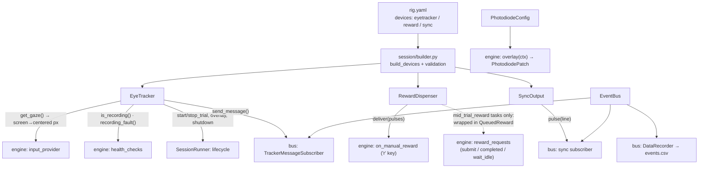

Bus subscription order is fixed: **tracker messages → sync pulses →
recorder**. No subscriber depends on another's side effects, so the order is
not behaviorally load-bearing; it is kept fixed so the two hardware paths
(which can fail and abort the emit) run before the in-memory bookkeeping.

Two coordinate rules that only bite in analysis if broken:

- Trackers report **screen px, y down**; phases read **centered px, y up**.
  The conversion lives in exactly one closure (`make_gaze_input_provider`),
  reused by the test harness rather than reimplemented.
- `get_gaze() → None` (no sample, track loss, or an EyeLink `MISSING_DATA`
  sentinel — a blink is *data saying "no eye"*, not missing data) passes
  through as `None` and is therefore outside every region.

### 4.3 One trial's device lifecycle

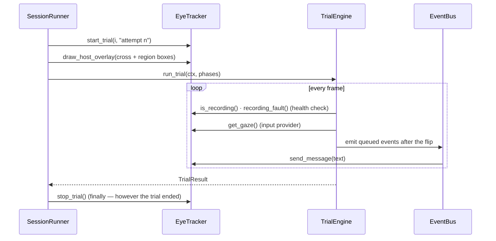

A tracker that stops recording mid-trial fails the health check: the engine
aborts the trial (`ABORTED`, `tracker_stopped`, and the tracker's words as
`fault_detail`) and the runner pays it the task's fault reward and serves it
again — or, in the trial's closing phase, the row is only flagged (§2.2;
§5.3, "System faults").

**Two questions, because one is not enough.** `is_recording()` is a flag
the backend keeps from `start_trial` to `stop_trial` — `procedures.py` reads
it to know whether a segment is already open — and it asks the device
nothing, so on its own it cannot see a recording that died in between. The
EyeLink and TRACKPixx3 backends also answer `recording_fault()`, an optional
capability (`devices/eyetracker/protocol.py`) that the builder's health
check calls when a tracker has it:

- **stale samples** — the newest sample not replaced for
  `eyetracker.max_sample_gap_ms` (50 ms on an EyeLink, 100 ms on a
  TRACKPixx3 by default). A blink is a sample saying "no eye", with a
  timestamp that still advances, so it never reads as one;
- **the device asked** — the EyeLink's `isRecording()`, only once the samples
  are stale, to say why; the TRACKPixx3's reader thread asking every half
  limit whether free-run sampling still feeds the session's buffer, and
  whether the register read failed — its live gaze report and its recorded
  samples are separate paths, and the first carries on when the second stops.

The healthy path costs no device round trip — the EyeLink reads pylink's
local link buffer, the TRACKPixx3 reads what its reader thread keeps current
— which is what lets it run every frame at 120 Hz ([eye-tracker.md](eye-tracker.md),
"When the tracker drops out", has the per-backend table and the rig
verification checklist).

**After a dropout.** Once `recording_fault()` has reported, the backend
remembers it until the next `start_trial`. Meanwhile a device that refuses
the stop at the trial's end, or the messages the dropout is followed by
(its `TRIAL_END`, the fault reward's `REWARD`), is logged rather than raised
— raising there, in the runner's `finally` or inside the engine's own
bookkeeping, would lose the trial's row over a failure the dropout already
explains. The next trial's `start_trial` is where the tracker is found to be
back or not: it re-opens the recording (the TRACKPixx3 also restarts a gaze
reader that died, once the device answers again, and re-arms a recording it
finds stopped), and a device that is gone raises a `TrackerError` naming the
rig and what the previous trial died of, which ends the session with its data
saved. A device that answers but keeps dropping out stops the session at the
pause screen after `eyetracker.max_consecutive_dropouts` trials in a row
(§5.3, "System faults").

`stop_trial()` is idempotent and guaranteed by a `finally`: a tracker left
believing it is still recording writes the next trial's samples into this
trial's segment. At teardown the runner adds `tracker.shutdown(...)`,
`sync.close`, `reward.close` — before the manifest is written, so the
retrieved recording is covered by it, and each as its own step, so one
device's failure never prevents another's release. Only the run directory and
the base name in that path are a promise; the suffix belongs to the backend
(§4.7). A recording a backend cannot hand over is a failed step, never only a
log line: an EyeLink whose link is down at teardown raises a `TrackerError`
naming the EDF left on its Host PC, and the database records the run as
`failed`. Both real backends release their device in a `finally`, whatever
else failed.

**Reward policy is not here.** Inside a trial the device layer is reached two
ways. The experimenter's manual-reward key: the engine delivers, *then* emits
`REWARD{manual: true}` — in that order, because an event claiming a reward
the pump never gave is a lie in the data. (For a task with mid-trial reward
the key cancels every drop still queued and is delivered next, §5.3.) And,
for a task that declares `mid_trial_reward`, a phase's `ctx.request_reward`,
which the engine hands to the reward worker after the flip (§5.3). Between
trials the runner waits for that worker to go idle (`engine.settle_rewards`)
*inside* the tracker's recording segment, so the eye data covers the last
drop's whole delivery, and before it pays the outcome. Teardown settles once
more — as its own step, before the recorder writes — for a trial a quit or a
fault cut short, and `reward.close` then joins the worker before releasing the
device.

### 4.4 Config that names events

`sync.event_lines` and `display.photodiode.events` are keyed by the
*experiment's own* event names, so they can only be validated against its
`EventSchema` — which is why that check lives in `build_session` and fails
loudly there, naming the offending key and the declared vocabulary. An
unvalidated typo would surface as a TTL pulse that silently never fires.

### 4.5 The photodiode patch

Every software timestamp is taken right after `flip()` returns: a claim about
when photons changed, not a measurement. `PhotodiodePatch` (installed as the
engine's overlay) turns white on exactly the frame whose flip carries a
configured event — the same flip that stamps the event and fires its sync
pulse — so a diode taped over the corner, a TTL line, and the recorded
timestamp all refer to one instant. It is drawn on *every* frame, white or
black, so the corner's mean luminance is constant. On a simulated display it
records its white/black trace into `states` instead of drawing.

### 4.6 `alhazen check-rig`

`check_rig(rig, pulse)` returns one `CheckResult` per component (config,
monitor, data_root, eyetracker, reward, sync, recording, spikes); the CLI
prints them and exits 1 if any failed. Every check runs even after one fails — whoever came to check the
whole rig wants the complete picture from one invocation. It constructs the
*same* backend objects a session would (`make_tracker` / `make_reward` /
`make_sync`), so a clean check predicts a working session instead of
exercising a parallel code path. With `--pulse` it fires one 50 ms reward
pulse and one pulse per mapped sync line, because constructing a backend only
proves the SDK imports. It never opens a window, and says so rather than
implying the display was verified.

A real eye tracker gets one step more than a connect: the **dropout test**.
check-rig opens a recording segment as a trial does, polls the session's own
health check (`make_tracker_health_check`) at 120 Hz for a second — nothing
may be reported — then stops the recording through the SDK behind the
session's back (`simulate_dropout`: the EyeLink's `stopRecording()`, the
TRACKPixx3's `TPxDisableFreeRun()`) and times the report. A stop that is not
reported within `max_sample_gap_ms` plus 50 ms, or a check that fires on
normal recording, fails the line. The record keeps the limit, the longest
gap seen while recording normally, the check's measured per-frame cost, the
latency and the tracker's own words ([eye-tracker.md](eye-tracker.md),
"Checking it before a session").

Each check also carries `evidence`: what that device did, in numbers. `ok`
answers "may the session start" and is gone as soon as the terminal scrolls;
the evidence is what makes today's checkout comparable with last week's, and
`session/checkout.py` writes it to a file the caller names (JSON, plus a
readable rendering beside it) on every run, passing or failing. It is
deliberately not a gate: a record that could fail a rig would be a second,
quieter set of thresholds living in a file nobody reads.

One check depends on something no repository here contains: `sorted_stream`
spikes come from a real-time sorter, somebody else's program on somebody
else's machine, so `FAIL spikes` was the one line an experimenter could not
have seen before the morning it mattered. `testing/sorter.py` closes that
gap — it publishes the `docs/live-spikes.md` contract (and, under `fault`,
each of the ways that contract gets broken), so the whole checkout including
its failures is rehearsable against `examples/rig-rehearsal.yaml` with no
hardware. It belongs in `testing/` rather than `devices/` for the same reason
`FakeDisplay` does: it is the *other side* of a seam, not a backend a session
ever constructs.

### 4.7 Two eye trackers behind one seam

`eyetracker.backend` selects between them and nothing else in a config
changes. What differs is entirely behind `EyeTracker`, and is worth naming
because the two devices are not the same shape of thing.

| | `eyelink` (SR Research) | `viewpixx` (VPixx TRACKPixx3) |
|---|---|---|
| Where it lives | a separate Host PC on the tracker subnet | a camera inside the display chassis, on the DATAPixx3 |
| Native recording | an EDF the Host PC writes to its own disk, retrieved at teardown | samples in the DATAPixx3's RAM ring buffer, drained to CSV by this machine |
| Gaze frame | screen px, y down | **centered px, y up** — converted once, in the backend |
| "No eye" | coordinates set to `-32768` | coordinates parked at `±9000`, or NaN |
| Eyes | tracker reports which one; binocular ties break to left | always binocular; `eyetracker.eye` picks `left`/`right`/`average` |
| Calibration | `doTrackerSetup()` runs it on the Host PC, after alhazen's guide screen | alhazen shows the guide, draws the target grid in the session window with a live "eyes:" line, and fits from it |
| Calibration state | the Host PC's | read from the device at `configure()` and after each `calibrate()`; **the gaze report is a calibrated read**, NaN without one, so `get_gaze()` is gated on it, `gaze_status()` says whether it was the calibration or the eye that was missing (the raw eye vectors are read beside the calibrated positions to tell), and the runner pauses before trial 1 with that reason. The device keeps a calibration across runs; the log says so at `configure()` |
| Validation, drift correction | `devices/eyetracker/procedures.py`, the same on both: generic over `get_gaze()`, results on the dashboard ([eye-tracker.md](eye-tracker.md)) | |
| Camera image | on the Host PC's own screen | read through `camera_frame()` into the dashboard's *Eye tracker* group while paused |
| Messages | written into the EDF, which then carries its own alignment | written to a sidecar CSV stamped on **both** clocks, because nothing can be written into the sample stream |
| Dropout detection | the newest link sample not replaced for `max_sample_gap_ms` (50 ms); `isRecording()` asked once it is, to say why | the gaze reader dead, or stalled past `max_sample_gap_ms` (100 ms); the reader asks the device every half limit whether free-run sampling still feeds the session's buffer |
| Operator overlay | drawn on the Host PC's eye image | none — the only surface the device can draw on is the subject's screen |

Two consequences are load-bearing rather than cosmetic:

- **The buffer is drained every trial**, not once at teardown. The DATAPixx3's
  buffer is a fixed-size ring, so a session longer than the ring silently
  overwrites its own oldest samples — and looks completely normal doing it.
- **A ViewPixx run directory holds no EDF.** It holds `<base>_gaze.csv` (the
  samples, in VPixx's own format) and `<base>_gaze-messages.csv` (device
  clock, session clock, text). The second file is what the EDF gets for free:
  without it there is nothing relating the sample timestamps to anything else
  in the session.

## 5. The task layer

### 5.1 One Task per experiment task

```python
class SaccadeTask(alhazen.Task):
    name = "saccade-to-target"          # lowercase, filename-safe
    events = EventSchema(("STIM_ON", "SACCADE_ONSET", "LANDED"))
    outcomes = outcomes(CORRECT=dict(completed=True, success=True))  # ...and the rest
    params_model = SaccadeParams        # pydantic; validated before it is used
    reward = RewardPolicy(by_outcome={"CORRECT": RewardPulses(n_pulses=2)})
    mid_trial_reward = False            # True: phases may call ctx.request_reward (§5.3)

    def conditions(self, rng): ...      # default: one nameless condition
    def build_trial(self, setup): ...   # the one method every task writes
    def score(self, record): ...        # default: identity
    def instructions(self): ...         # what the subject reads first; None: nothing, on purpose

    @classmethod
    def default_params(cls): ...        # the params file when no --params is given
    @classmethod
    def params_hook(cls, params, args): ...  # params derived from the invocation
```

The declarations are checked in `__init_subclass__`, at class-definition
time: a task missing its outcomes is a programming error the author should
meet while writing the file, not with a subject waiting. `make_source` reads
a `SchedulerConfig` from the params (§5.4) unless the task overrides it, and
`build_session(task=...)` fills in name, params, events, trial builder,
scheduler, score, reward policy and the subject's instructions — while the
explicit parameters still work and still win when both are given, which is
what a test overriding one piece of a real task needs.

#### What the subject reads first

A session can be started four ways — `alhazen run --task`, an experiment's
`run.py` (`run_experiment`), `build_mode_session` and `build_session(task=...)`
— and the task is the one thing all four are handed. So the wording shown
before trial one is the task's own: `instructions()` returns the text, and
`build_session` asks for it once, after a curriculum has set the stage's
params (the text may quote them) and before the run directory exists (a
missing file fails without leaving an empty run behind). Before this, only
`run.py` was handed the wording, and a real session started with
`alhazen run` showed the subject nothing.

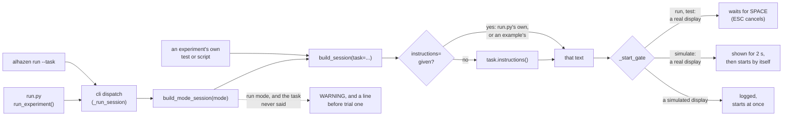

The method has three states, and they are told apart without calling it:

| the task | the session | `--mode run` |
|---|---|---|
| returns text | shows it | — |
| returns `None` | shows nothing: the task has declared it has none (an animal subject) | — |
| does not override it | shows nothing, as every task did before the hook existed | logs a WARNING naming `instructions()`, and prints and records `instructions: none — …` before trial one |

The third state exists so that a task that *forgot* is never mistaken for
one that *decided*. Only run mode warns — a pilot is run mode with a shorter
params file — because it is the session a subject actually sits through;
test mode rehearses whatever the task declares, and simulate has nobody to
read anything. A shared base class that returns `None` declares it for every
task under it. Returned text is checked when the session is built: a
non-string (a `Path` instead of the file's contents) is a `TypeError`, and
empty text a `ConfigError`, because shown it would be a blank screen waiting
for SPACE. A value written where the method belongs (`instructions = "..."`)
is refused when the class is defined.

An explicit `instructions=` — to `build_session`, `build_mode_session` or
`run_experiment` — still works and takes precedence over the task's, and
`instructions=""` turns the screen off whatever the task declares. What
decides the gate after the text is `session/builder.py` `_start_gate`, a
function of the display kind and `auto_start` alone, so the rule is pinned by
tests without a renderer.

#### Where a session's params come from

An installed package's entry point names the Task class and nothing else, so
`alhazen run --task` used to know nothing but the class: with no `--params`
it ran the params model's defaults — for one experiment 432 trials of a
576-trial design — and it could not start a task whose scheduler needs to
know who and which session, which only `run.py`'s `params_hook` could tell
it. Both now live on the class, as classmethods because they decide the
params the task is built with and so run before it exists
(`__init_subclass__` refuses them written as ordinary methods or as values):

- `default_params()` returns the task's params file — absolute, or relative
  to the file the method is written in, never to the working directory. A
  path that names no file is a `ConfigError` naming it, and nothing runs:
  the model's defaults are not the experiment, so they never stand in for a
  file the task declared. `None` (the default) keeps the model's defaults,
  which is what a task that declares nothing has always got.
- `params_hook(params, args)` derives params from the invocation — a
  search's state directory from the subject and the rig's data root, say.
  It runs once, between loading the params and constructing the task, and
  its result is re-validated through `params_model`. A task that does not
  override it is never called.

`cli/main.py` resolves them in `_run_session`, the dispatch both entry points
share, in this order:

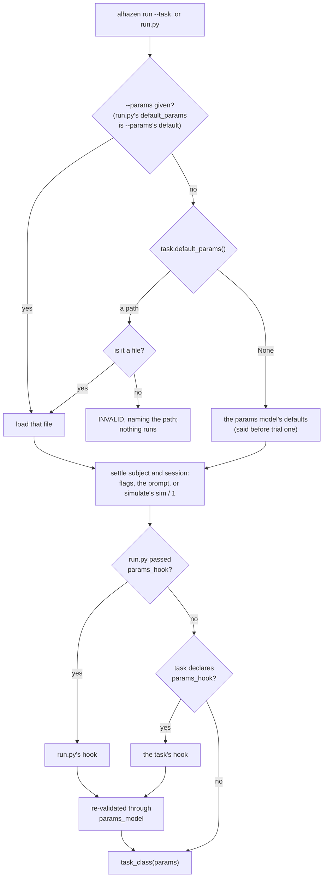

Three details carry the weight. **Precedence**: an explicit `--params`, then
`run_experiment(default_params=...)`, then the task's own; and
`run_experiment(params_hook=...)` *replaces* the task's hook rather than
chaining with it, so a `run.py` written before the hooks does exactly what it
did. **Order**: the subject and session are settled before the hook runs
(`_settle_subject_and_session`), because deriving params from them is what a
hook is for — it used to run first, so a subject typed at the prompt reached
it as `None` and a search state was filed under `sub-None`. The params file is
still loaded and checked before anyone is asked anything. **Record**:
`args.params` is set to the file that was loaded, so the snapshot's
`sources.task` names the task's own file when that is what ran, and the line
printed before trial one says `params: <file>` — or, for a task that declares
none, that the model's defaults are running.

### 5.2 The phase library (`task/phases/`)

| Phase | Ends when | Records |
|---|---|---|
| `AcquireFixation` | gaze holds the window for `hold_s` (timer **resets** on any excursion) or times out | `acquire_latency_s` |
| `HoldFixation` | the jittered duration elapses; any excursion is a break | `hold_duration_s` |
| `StimulusResponse` | gaze leaves the depart-region, or the deadline passes | `rt_ms`, `<depart_region>_x/y_dva` (where the eye left from — measured, never assumed to be the fixation point) |
| `LandingCheck` | gaze enters the target region, or the window times out. **Records where gaze first crossed into the region — mid-flight for any usable window — not where the saccade ended**; use `LandingSample` for landing error | `endpoint_x/y_dva`, `endpoint_error_dva`, `endpoint_in_target` |
| `LandingSample` | a fixed dwell after saccade onset (`dwell_s`), **or** saccade offset: the first *new* sample slower than `settle_speed_dva_per_s`, capped at `max_wait_s`. The region is ignored until then; the last valid sample is the endpoint, judged once. With `depart_region` (the fixation window), a sample still inside that window is never the endpoint and never settles — a blink at the cue counts as departure, and would otherwise end the trial as a miss at fixation | `endpoint_measured`, `endpoint_in_target`, `endpoint_x/y_dva`, `endpoint_error_dva`, `endpoint_latency_ms`, `endpoint_reference_x/y_dva`; `endpoint_settled` in the saccade-offset mode |
| `ResponseWindow` | a bound key is pressed, or the deadline passes. **Keys pressed before the cue was on screen are ignored**: a frame's keys are everything pressed since the previous frame's read, so they count only once that read came after the flip stamped `t_<onset_event>` — never on the phase's first frame (before the flip) or its second (the presses made while the cue waited for its flip). With `onset_event=None` keys count from the first frame, timed from phase entry | `response_key`, `rt_ms` (from the cue's flip) |
| `AdjustmentLoop` | the commit key is pressed, or the deadline passes | `adjusted_value`, `adjustment_turns` |
| `FrameSequence` | a compiled `FrameTimeline` finishes | `sequence_frames` |
| `Blank` / `Feedback` | a fixed duration elapses | — |
| `TrialFeedback` | a fixed duration elapses; **must be the trial's last phase**, and the engine refuses it anywhere else. As the trial's *closing* phase it runs whatever the trial ended as, so a fixation break gets feedback too — but never on `PAUSED` or `ABORTED`, which are not trial results, and it cannot change an outcome the trial already had. A tracker that stops while it is on screen does not cut it short: the row is flagged `fault: tracker_stopped` and the trial keeps its outcome (§2.2) | `feedback` (`success`/`failure`) from the task's own `verdict` predicate over the record, or `failure` without asking the predicate when the trial ended with a non-completed outcome — beside the outcome, never derived from it: a saccade that missed is still a completed, scored measurement. Recolours the fixation point, emits `FEEDBACK`; the session's `FeedbackSounder` beeps, because a phase touches no hardware. Draws only the fixation point unless `keep_drawing` names other stimuli to stay on screen (the figure just saccaded to): those are updated and drawn every frame *before* the point, so the colour stays on top, and are never recoloured. A name the trial has no stimulus for fails when the phase starts, naming it; a trial that ended with a non-completed outcome keeps nothing, because what it names may never have been shown |

Every constructor takes plain values — seconds, region names, stimulus keys,
Outcomes — and never a config model: resolving a `Duration` against the
measured refresh rate happens once, in `build_trial`. Every phase touches
only the `TrialContext`, which is what lets all of them be tested against a
fake clock and scripted inputs with no display, tracker or session.

Two rules recur and are load-bearing:

- the **blink rule**: an unverifiable gaze is outside every region, and the
  gaze check runs *before* the completion check, so a blink on the final
  frame of a hold is a break rather than a lucky pass;
- reaction times run from the **flip** that showed the onset event
  (`ctx.record["t_<event>"]`), not from the call that drew it.

#### Where a saccade lands: `LandingSample`

`LandingCheck` ends on the first frame gaze is inside the target region, so it
answers "did the eye pass through the target?". With a 3° window a 5° saccade
crosses in mid-flight, 2–3° short of where it comes to rest, and that crossing
is what it records. `LandingSample` records where the movement came to rest
instead: it ignores the region until the saccade is over, keeps the last
valid gaze sample on every frame, and tests that one endpoint once.

```mermaid
stateDiagram-v2
    [*] --> Waiting: on_enter reads onset from t_response_onset (missing raises ValueError)
    Waiting --> Waiting: every frame, draw and keep the last valid sample outside depart_region
    state ends <<choice>>
    Waiting --> ends
    ends --> Judge: dwell mode, now − onset ≥ dwell_s
    ends --> Judge: offset mode, a NEW sample outside depart_region slower than the threshold (settled)
    ends --> Judge: offset mode, now − onset ≥ max_wait_s (not settled)
    ends --> Waiting: none of these yet
    Judge --> Hit: endpoint within the region radius of the reference
    Judge --> Miss: outside it, or no valid sample outside depart_region (measured = False)
    Hit --> [*]: on_hit (an Outcome, or ADVANCE)
    Miss --> [*]: on_miss (an Outcome, or ADVANCE)
```

The saccade-offset rule is where the input layer matters. The rule:

- only a frame carrying a **new** sample (a `gaze_t` later than the previous
  one's, §2.1) is tested; a repeat carries no information, and a speed
  computed across it is a false zero that would end the phase mid-saccade;
- speed is the distance between two consecutive new samples, in degrees,
  over the **real** time between them — never the nominal frame period;
- a missing sample (blink, track loss) is **never settled**, and it also
  breaks the chain: the next valid sample has no honest predecessor, so it
  cannot settle either;
- a speed needs two samples, so the first new sample in the phase cannot
  settle;
- with `depart_region`, a sample still inside that window never settles
  (below).

A 30 Hz tracker behind a 60 Hz display, at 40 px per degree and a 30 °/s
threshold — every other frame repeats the previous sample:

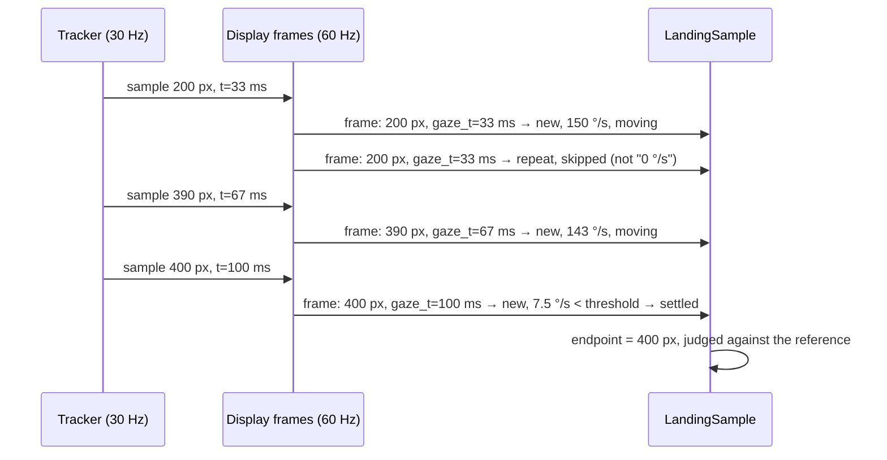

Saccade onset is the flip-stamped `t_<onset_event>` — by default
`RESPONSE_ONSET`, which `StimulusResponse` emits when gaze leaves the
fixation window; `onset_event=None` times from the phase's own start. The
reference the error is measured from defaults to the region's centre, and may
be a callable of the `TrialContext` for a figure that moves: it is read on the
frame the landing is judged, and the verdict becomes "within the region's
radius of the reference". Either verdict may be `PhaseAction.ADVANCE`, for a
trial whose next phase (feedback, a pursuit that starts at the landing) reads
the verdict off the record. When no valid sample arrived at all,
`endpoint_measured` is False, nothing else about the endpoint is written, and
the verdict is a miss. `LandingCheck` is kept unchanged because experiments
depend on its timing and columns; its docstring says loudly what it measures.

**Waiting for the eye to leave: `depart_region`.** Under the blink rule a
blink counts as leaving the fixation window, so a blink at the cue makes
`StimulusResponse` stamp the onset while the eye is still at fixation.
Without more, the first slow sample after the blink "settles" there and the
trial ends as a miss at fixation. `depart_region="fixation"` makes the phase
wait for the real saccade: a valid sample still inside that window has not
left, so it is never the endpoint — the endpoint is the last valid sample
*outside* it — and it never settles. It does stay in the speed chain: the
speed from the last sample inside to the first one outside is the saccade's
own speed, so that first sample is judged on it rather than excused for
having no predecessor. The dwell and the cap still run from the stamped
onset, and an eye that has not left by then gives `endpoint_measured` False
(and `endpoint_settled` False, in the offset mode), a miss, and no `LANDED` —
never a landing at fixation. Where the two windows overlap, a sample in the
overlap has not left. Nonsense is refused loudly: a departure window that is
the target itself at construction; and, when the trial starts, a name the
trial has no region for (listing the ones it has), or a window that contains
the verdict's centre — the target's centre or a fixed reference — since no
landing there could ever be a hit. The default, `None`, leaves every sample
eligible, as before.

`FrameTimeline` (in `display/frames.py`) is the schedule `FrameSequence`
plays: keyframes, linear ramps, visibility spans and events, all indexed by
frame. Frames rather than milliseconds because a display can only change on a
flip — "50 ms after onset" is a wish, "frame 3" is what happens.

### 5.3 Reward policy is data

```python
RewardPolicy(
    by_outcome={"CORRECT": RewardPulses(n_pulses=2)},
    on_fault=RewardPulses(n_pulses=1),  # a trial the eye tracker cut short
    scale=1.0,
)
```

An outcome absent from the table earns nothing, so a typo fails safe rather
than paying out on the wrong trials. `scale` multiplies the pulse *count*
only — pulse width is the pump's calibration, not a measure of how generous
this session is — and is the dial a training stage turns. `on_fault` is what
a trial pays when the eye tracker stopped before its outcome was decided
(below, "System faults"); it defaults to `None`, which pays nothing, and it
is scaled like everything else.

The runner delivers after the trial ends and before the row is written, so
`record["rewarded"]` says what happened at the pump rather than what was
owed.

**A failed delivery is the one deliberate catch in the codebase.** Everywhere
else a device fault aborts loudly, but here the measurement already exists,
and losing a completed trial's data to report a juice-line problem would be
the worse failure. So it is logged with its traceback, recorded as
`rewarded=False`, marked with a reserved `REWARD_FAILED` event (its own
event, never a `REWARD` with a flag — they mean opposite things), shown on
screen, and handed to the pause flow so a human decides before the session
carries on rewarding nothing.

A **completed** trial that earns nothing emits the reserved `NO_REWARD`
event — again its own event rather than the absence of `REWARD`, because a
missing event is indistinguishable from one that failed to be written. An
*incomplete* trial gets neither: it earned nothing because it produced
nothing, which is a different statement.

**Reward follows the subject's response, not frame QA.** The runner pays
`pulses_for(result.response_outcome.name)`, and decides `NO_REWARD` on that
outcome's `completed` flag. On every trial but one kind this is the trial's
outcome. The exception is a trial frame QA recycled into `DROPPED_FRAMES`
(§2, step 8): the subject did that trial and was shown its feedback, so it is
paid — or marked `NO_REWARD` — as the response it was, the event payload
naming that outcome (the row's `outcome_before_frame_qa`), while the
scheduler still serves the condition again for its data. `REWARD_FAILED`
and `rewarded` behave as on any paid trial. A task cannot get this by
paying `DROPPED_FRAMES`: that would pay recycled wrong answers too.

The same split holds elsewhere. What describes what the subject received
or was told — feedback, its tone, the reward events and the dashboard's
reward panel built from them — follows the response. What decides the
schedule and the data — re-serving, adaptive schedulers, `alhazen report`'s
outcome counts — follows the recycle. The failure streak that pauses a
session (`max_consecutive_failures`, §10) counts a recycled trial as the
completed trial it was.

#### System faults: failures that are not the subject's

The rule: **a subject is rewarded when a trial fails through no fault of
theirs, but the trial repeats, and is logged and flagged in the data.**
Exactly two failures are the rig's rather than the subject's — the two the
engine flags in the row's `fault` (§2.2) — and a trial *lost* to one of them
(`TrialResult.lost_to_fault`) is handled like this:

| | The display dropped frames | The eye tracker stopped recording |
|---|---|---|
| Detected by | frame QA's `recycle_trial`, after the trial ran to its end (§2 step 8) | the tracker health check, while the trial was still measuring (§2 step 2; how, §4.3) |
| Row | `outcome: DROPPED_FRAMES`, the response kept as `outcome_before_frame_qa`, `fault: dropped_frames` | `outcome: ABORTED`, `abort_reason: tracker_stopped`, `fault: tracker_stopped`, and what the tracker said as `fault_detail` |
| Served again | yes: `completed=False` | yes: `completed=False` |
| Paid | for the subject's response, as on any trial — `by_outcome` of `outcome_before_frame_qa`, or `NO_REWARD` for a completed response that pays nothing | the task's `RewardPolicy.on_fault`, scaled; nothing when the task sets none. Its REWARD (or REWARD_FAILED) payload carries `fault` beside `outcome: ABORTED` |
| Failure streak | **ends it** — the subject completed the trial, and ending a streak never counts against anyone | **neither counts nor ends it**, like `PAUSED` |
| Training criteria | left out of the window | left out of the window |
| `session.log` | one WARNING: the trial, the cause, what was paid, that it is served again | the same, with the tracker's words |
| Many in a row | frame QA's `max_consecutive_recycles` aborts the run, naming the display | `eyetracker.max_consecutive_dropouts` (3) in a row stop the session at the pause screen, headed with what the tracker said; a trial the tracker records through ends the streak, a pause neither counts nor ends it, and the count starts over after its pause |

The experimenter's skip (`ABORTED`, `skipped_by_user`) and a pause are not
faults: never flagged, never paid `on_fault`, counted as they always were.

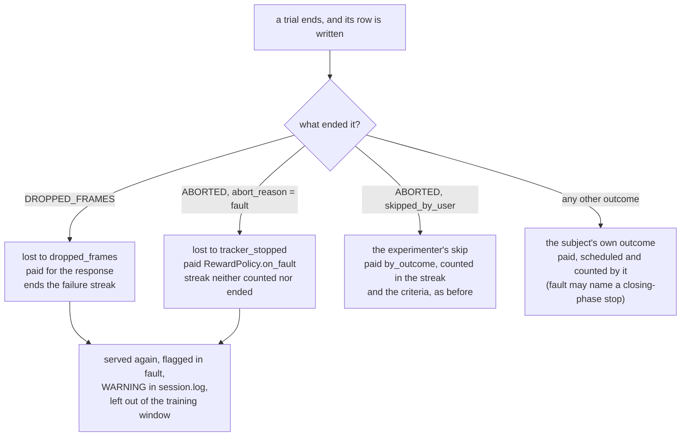

A trial whose tracker stopped only during its closing phase is not lost (it
kept its outcome, §2.2), so none of this applies to it: it is paid,
scheduled and counted by its own outcome, and only its row's `fault` and the
engine's WARNING say what happened. The runner and the training supervisor
ask the same function, `core.trial.lost_to_fault`, so they cannot disagree
about which trials these are.

`by_outcome` is never consulted for a tracker-stopped trial: its `ABORTED` is
the rig's, not a result the subject earned. An `ABORTED` entry in
`by_outcome` still pays the experimenter's skip. A health check added later
would be paid `on_fault` too — a failed check is always a device that
stopped.

#### Mid-trial reward

Some tasks pay *while* the trial runs — a monkey following a moving dot gets
a drop for every stretch its gaze stays in the window, through an 8 s
pursuit. A phase asks for one with `ctx.request_reward(pulses, reason)`:

```python
class Pursuit(alhazen.Task):
    ...
    mid_trial_reward = True    # declared next to `reward`


class FollowDot:               # a phase
    def on_frame(self, ctx):
        if ctx.extras["held_long_enough"]:
            ctx.request_reward(ctx.extras["drop"], "pursuit_hold")
        ...
```

The request only queues on the context — a phase still touches no hardware.
What happens to it:

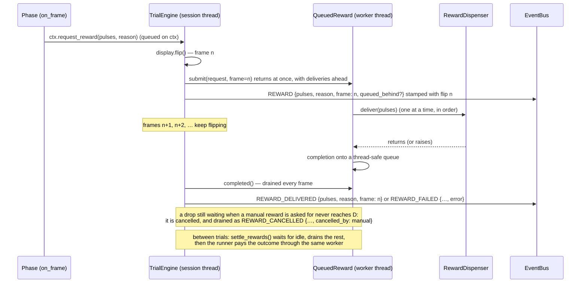

Which delivery goes on the valve next:

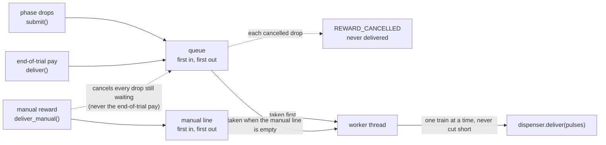

- **Declared, and checked at build.** `mid_trial_reward` is a class
  attribute beside `reward`. `build_session` refuses such a task on a rig
  with no `devices.reward` — before a run directory or a window exists —
  rather than at the first drop. `--mode test` and `--mode simulate` stand a
  `simulated` dispenser in and say so in the setup notes, so a laptop
  rehearsal still builds; `--mode run` does not. A request from a task that
  did *not* declare it raises `RewardRequestError` at the call, as does a
  request that could not open the valve (not a `RewardPulses`, zero pulses,
  an empty reason).
- **Never blocks the frame loop.** The builder wraps the dispenser in
  `QueuedReward`, whose worker thread delivers; `submit` returns at once. An
  8 s pursuit at 120 Hz cannot absorb a 200 ms pulse train inside a frame.
- **One path, one valve, one delivery at a time.** Every delivery of such a
  session goes through the same worker: the task's drops, the manual reward
  and the end-of-trial pay. None ever overlaps another on the valve, and none
  is merged. Drops and the end-of-trial pay go in the order asked for
  (`deliver()` waits its turn and re-raises a failure on the caller's
  thread); requests that arrive while one is delivering queue up, and none is
  dropped — except by the manual reward, below, and even then each one ends
  with an event of its own. A drop requested behind others carries
  `queued_behind: <count>` on its REWARD — every delivery ahead of it when it
  was commanded, a manual reward still waiting included — so a rig whose
  pulse train is longer than the task's drop interval shows in the data that
  it delivered late. Between trials the runner calls
  `engine.settle_rewards(ctx)`, which waits for the worker to go idle, *then*
  pays the outcome — so the end-of-trial pulse train never overlaps a drop.
- **The manual reward overrides the queue.** The experimenter's reward — `r`
  during a trial, R in the pause menu or the dashboard's button, all one hook
  that the builder's `make_manual_reward` routes to
  `QueuedReward.deliver_manual` — replaces whatever drops are waiting. Every
  drop still queued is cancelled: taken out of the queue and never
  delivered, each one ended by its own `REWARD_CANCELLED {pulses, reason,
  frame, cancelled_by: "manual"}`, and all of them named in one WARNING in
  the log. The train already on the valve finishes (next bullet), and the
  manual reward is delivered once, next. Drops asked for after it queue as
  usual: the queue builds up again by itself. The key stays synchronous, so
  its `REWARD {manual: true}` is still emitted after the pump and it still
  blocks the frame it was pressed on — for **at most the rest of the train on
  the valve plus its own**. The engine reports the cancellations, and any
  drop that finished on the valve while the key waited, before it emits the
  manual REWARD, so events.csv reads in the order things happened at the
  valve: the REWARD_CANCELLED events, then that drop's REWARD_DELIVERED, then
  the manual REWARD that caused them, all in the frame the key was pressed
  on. A cancellation is not a failure: it takes no pause, and it leaves
  `rewarded` alone. The end-of-trial pay is never cancelled — it is the
  trial's outcome, and it is made after `settle_rewards` has emptied the
  queue anyway. Between trials the queue is empty, so the pause menu's reward
  cancels nothing and goes straight to the valve. A manual reward that fails
  raises on the session thread, as it always has; what it cancelled stays
  cancelled, and each of those drops still gets its REWARD_CANCELLED — from
  teardown's settle, if the failure ended the session first.
- **A train on the valve is never cut short** — neither a drop's nor
  anything else's: a manual reward cancels only what is still waiting. Pulse
  width is what sets the volume delivered (it is the pump's calibration), so
  a train stopped part-way delivers an amount nobody measured, and its
  REWARD_DELIVERED could not say what arrived. And `NidaqReward` plays a
  finite buffered waveform: an analog-output task leaves its last generated
  sample on the line when it stops — the reason every waveform ends at 0 V —
  so stopping it mid-pulse would leave the valve open until a second write
  drove the line to 0 V, and a failure of that write would flood the
  subject. Interrupting would save at most one train's wait.
- **The worker never touches the bus.** It calls the dispenser and puts a
  plain-data completion on a thread-safe queue. The engine drains that queue
  on the session thread — every frame, and in `settle_rewards` — and emits
  the events, so the bus, the recorder and the trial record keep their one
  writer.
- **Events.** `REWARD` on the flip after the request, carrying
  `{manual: false, pulses, reason, frame}` (+ `queued_behind` when anything
  was ahead of it), so events.csv and the tracker's messages stamp the frame
  the drop was commanded on — the frame an analysis masks vergence and pupil
  transients around. `frame` counts the trial's flips from 0, across phases —
  the same `frame_index` as the database's `frame_inputs` table
  ([database.md](database.md)).
  The drop's end is its own event: `REWARD_DELIVERED` (reserved for this;
  an end-of-trial or manual REWARD is already emitted after the pump),
  `REWARD_FAILED` with the request's `reason` and the `error`, or
  `REWARD_CANCELLED` with `cancelled_by` when a manual reward overrode the
  queue. All three are stamped when drained — within a frame of the pump
  finishing, or, while a manual reward holds the frame, just before its
  REWARD — and carry the same `frame` as the REWARD they complete. The
  dashboard's reward panel counts a drop at its `REWARD_DELIVERED`, not at
  its REWARD, so a cancelled drop is never counted as juice.
- **Accounting.** A task that declares `mid_trial_reward` writes
  `n_mid_trial_rewards` (delivered), `n_mid_trial_reward_failures` and
  `n_mid_trial_rewards_cancelled` on every row — 0, never empty, on a trial
  with no drops. Together they account for every drop commanded: delivered +
  failed + cancelled is the number of the trial's drop REWARDs. `rewarded`
  means *juice reached the subject this trial*: True once any drop or the
  end-of-trial pay is delivered, False when deliveries were attempted and
  none arrived, absent when none was attempted — which, for a task that does
  not ask for mid-trial reward, is exactly what it always meant. A cancelled
  drop leaves it alone, since no delivery of it was attempted, and the manual
  reward counts as it always has: by its own REWARD, not in `rewarded`. On a
  trial lost to a system fault the drops delivered before it stay delivered
  and counted, and a tracker-stopped trial's `on_fault` is paid after them,
  through the same worker; the fault's WARNING line says how many drops came
  first.
- **`NO_REWARD`** still means "a completed trial that earned nothing". A
  trial whose phases asked for a drop earned it, so it gets no `NO_REWARD`
  even when its outcome pays nothing at the end — whether the pump then
  delivered it, failed, or a manual reward cancelled it (a failed drop is a
  `REWARD_FAILED` and a cancelled one a `REWARD_CANCELLED`, never a
  `NO_REWARD`).
- **A failed drop does not stop the trial.** The measurement is still being
  made. The failure is logged with its traceback, counted, and marked with
  `REWARD_FAILED`; once the trial is over and its row written, the runner
  hands it to the same pause flow an end-of-trial failure takes ("REWARD
  FAILURE — check the pump"), so a human looks at the pump before the session
  carries on. A cancelled drop is not a failure and takes no such pause.
- **A request with no flip to stamp it** — queued in a phase's `on_enter`,
  then the trial skipped or aborted before the next flip — was never
  commanded; `settle_rewards` logs it by reason at WARNING and delivers
  nothing.

### 5.4 Schedulers (`paradigms/`)

| Scheduler | Serves | Summary (`*_paradigm.csv`) |
|---|---|---|
| `SimpleSequence` | a fixed list, shuffled | none |
| `ConstantStimuli` | full factorial × `n_per_condition` | per-cell attempts and completions |
| `UpDownStaircase` / `InterleavedStaircases` | transformed up-down, one or many interleaved | final value, reversals, reversal mean |
| `QuestPlus` | the most informative intensity, per interleaved level | posterior mean of each parameter, entropy |
| `AdjustmentTrials` | one condition per setting to be made | completed / remaining |
| `BlockPlan` | any of the above, in blocks | completed trials per block |

All of them: draw randomness only from the injected Generator, hear about
**every** outcome, and re-serve any condition whose outcome was not
`completed`. Schedulers read `TrialResult.outcome` and never the record — a
scheduler reaching into measurements is how a scheduler and an analysis end
up disagreeing about what "correct" meant. The adaptive ones —
`UpDownStaircase` (so each of `InterleavedStaircases`) and `QuestPlus` —
take a `score: Callable[[TrialResult], bool]` for tasks titrating something
other than accuracy, and `make_scheduler` builds every adaptive kind with the
task's `score_trial` (default: `outcome.success`). The scorer is asked about
completed trials only; an attempt with no measurement is re-served, never
scored.

`SchedulerConfig` (+ `StaircaseConfig`, `QuestConfig`, `BlockConfig`) is the
config surface, so moving from constant stimuli to a staircase is a YAML edit
rather than a code edit. The scheduler's summary, when it has one, is written
to `<base>_paradigm.csv` at teardown; no file means the paradigm had nothing
to say.

QUEST+ is implemented here in numpy — posterior over a (threshold, slope,
lower asymptote, lapse rate) grid, min-entropy stimulus selection, updates in
log space — rather than delegating to a renderer's staircase class. It is
arithmetic, and a scheduler that dragged in the display stack would make
adaptive experiments impossible to run, or test, on a machine with no
renderer. Its test simulates an observer with a known threshold and checks
the estimate converges.

Two composition rules fall out of blocks and are worth stating:

- A **queue-based** scheduler gets one instance per block; an **adaptive**
  one is shared across blocks. Sharing a queue re-queues a failed condition
  at the end of the *whole* queue, so its retry lands in the last block
  rather than its own. An adaptive scheduler cannot be split that way — its
  estimate has to carry across the boundary, which is why it needs
  `trials_per_block`.
- End-of-block recycling needs no `recycle` parameter: a block is bounded by
  *completed* trials, so the inner scheduler's own re-queue already lands the
  retry inside the same block. A second queue in the wrapper could
  double-serve a condition.
- `trials_per_block` is an adaptive kind's block length. A queue-based
  kind's block already ends when its plan (cells × `n_per_condition`) is
  done — the completed count reaches the plan exactly as the queue empties —
  so `make_scheduler` refuses a `trials_per_block` below that plan with a
  `ConfigError` giving both numbers: it could only end the block with
  planned trials still queued, the retries at the tail first, and leave the
  cells uneven. A bound at or above the plan is accepted; it cuts nothing.

### 5.5 Live analysis (`task/live.py`)

Some tasks need computation that watches the session as it runs and could
never fit a dashboard panel's trial-record columns — a receptive-field map
accumulating over a spike stream, a running PSTH. The seam is one optional
hook, `Task.live_analysis(wiring)`, returning a `LiveAnalysis`, with three
rules that keep it safe:

- **the builder wires it like a device**: the hook receives the spike
  source the *rig config* built (or None), so task code never constructs
  hardware and the same task runs on a rig with no `spikes:` entry —
  saying so on its panel rather than crashing or staying quiet;
- **never inside the frame loop**: the optional `on_event` bus subscriber
  may only take notes; the work happens in `on_trial`, which the runner
  calls between trials, after the scored row is written and before the
  dashboard publish — so the panels in that publish already include the
  trial;
- **`finish(run_dir)` runs in teardown before the manifest is written**
  (and before the spike source closes, so it can drain one last time), so
  whatever it saves is hashed with everything else the run produced.

Its `panels()` return finished payloads in the dashboard's own wire shapes
(§9), appended after the spec's panels under their own sidebar section.
The worked example is the
[rf-mapping](https://github.com/sh4r11f/rf-mapping) experiment, whose
`LiveRFMap` turns the spike stream into receptive-field heat maps between
trials; [live-spikes.md](live-spikes.md) documents the seam and the spike
source together.

## 6. Training

Shaping an animal means running the same task at a difficulty it can actually
do, and moving that difficulty as it learns. A curriculum makes that *data*:
a config file an experimenter reads and edits, rather than a schedule buried
in task code.

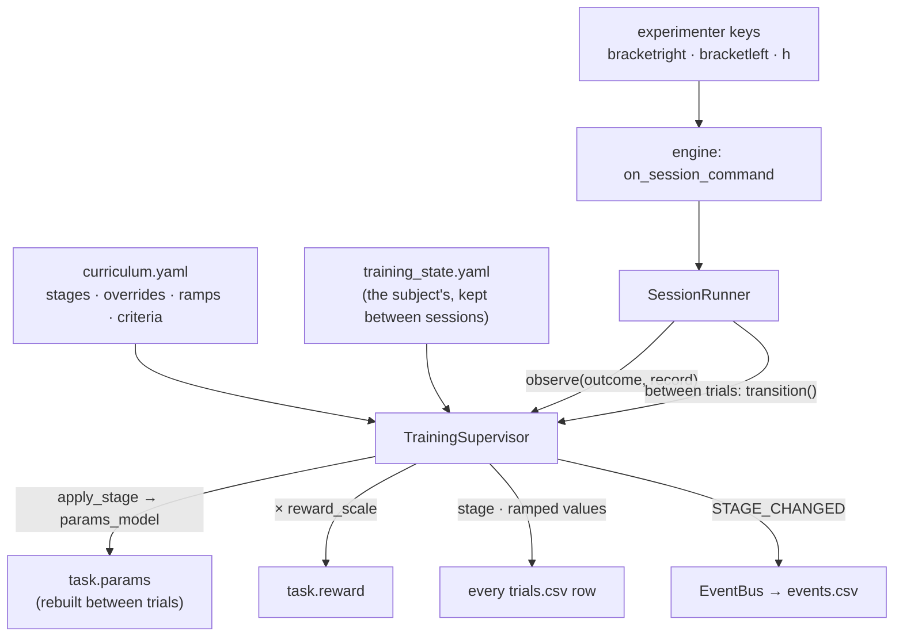

When a session runs under a curriculum, the config snapshot is built *after*
the supervisor has applied stage 1 — so it records the parameters the session
actually ran at, not the file values the stage overrode.

### 6.1 A curriculum

```yaml
stages:
  - name: any-look
    overrides: {fix_window_dva: 8.0, hold_duration: {ms: 50}}
    reward_scale: 2.0
    criteria: {window: 20, min_trials: 10, promote_when: {completed_rate: 0.8}}
  - name: tighten
    ramps: [{param: fix_window_dva, start: 8.0, end: 3.0, over_completed_trials: 40}]
    criteria: {promote_when: {success_rate: 0.75}, demote_when: {completed_rate: 0.3}}
  - name: real-task      # no overrides: the task's own parameters
```

Overrides are dotted paths into the task's params model, re-validated through
that model — a stage that asks for something the task cannot express fails at
**session build**, naming the stage and the path, rather than running a
session at a difficulty nobody chose. Each stage's overrides apply to the
task's original parameters, never to the previous stage's output, so a
demoted subject genuinely goes back. Ramps move a parameter linearly with
*completed* trials in the stage (an unengaged hour earns no progress) and
never overshoot their end value.

### 6.2 Criteria

Metrics run over a sliding window of recent **attempts**, carried across
sessions — a criterion over the last 100 trials means the last 100 trials,
not "the last 100 of today", or a subject could be promoted twice on one good
afternoon. Built in: `completed_rate` (engagement — completed ÷ all
attempts), `success_rate` (accuracy among *completed* trials only, since a
broken fixation is not a wrong answer), `mean_rt_ms`. `register_metric` adds
more.

The attempts are the *subject's*. Neither a paused attempt nor one lost to a
system fault (§5.3 — frame QA recycled it, or the eye tracker stopped before
its outcome was decided) ever enters the window, so no metric, no
`min_trials` count and no ramp sees it. Counted, a display dropping frames
would pull `completed_rate` down and demote a subject for the rig's failure.
A trial whose tracker stopped only during its closing phase kept its own
outcome, and counts like any other.

Nothing is decided until the window holds `min_trials` attempts. Demotion is
checked first and any single demote criterion fires it; promotion needs all
of them. A transition clears the window, so the new stage is judged on trials
run at that stage.

Every metric a curriculum names is checked against the registry when the
supervisor is built, alongside the stage-override check. A typo'd metric name
that raised the first time a window filled would mean an hour into a session
with an animal already working.

The window is fed the **scored** record: the same dict written to
`trials.csv`, after the task's `score` hook ran. A derived measure computed
there exists nowhere else, so a criterion could otherwise never gate on one.

### 6.3 What persists, and what a row says

`<data_root>/sub-<ID>/training_state.yaml` holds the stage, completed counts
per stage, the window, and every transition with its timestamp and session.
Plain YAML on purpose: an experimenter who needs to put an animal back a
stage on a Monday morning should be able to do it with a text editor. A
missing file is a first session; an unreadable one is loud and left in place,
because silently restarting an animal at stage 0 after a disk problem would
waste weeks and read as a behavioural regression.

Every trial row carries `stage`, `stage_completed_trials`, `reward_scale` and
each ramped parameter's current value (`ramp_<path>`) — which is what makes a
training session's data analysable on its own, rather than only in the
company of the curriculum file that produced it.

### 6.4 Runtime control

Transitions happen **between trials only**; a stage change mid-trial would
record one row at a difficulty that was true for part of it. The
experimenter's keys — `bracketright` promote, `bracketleft` demote, `h` hold
automatic transitions — reach the runner through an engine hook
(`on_session_command`) that passes on any command the frame loop has no
opinion about, so the engine stays ignorant of what a curriculum is. Each
transition emits the reserved `STAGE_CHANGED` event.

`SessionRunner._apply_stage_transition` is the single choke point every
transition flows through, and it re-reads `supervisor.reward_policy` there: a
stage rebinds `task.reward` to a scaled copy, and the runner pays from its
own reference, so without the refresh the pump keeps delivering the previous
stage's amount while every row stamps the new scale.

Teardown calls `supervisor.restore_base()`, putting the task's `params` and
`reward` back as handed over — a `Task` instance can outlive one session, and
stages are applied by mutating it in place.

## 7. Multi-device data

A session is only half the record when there is a neural recording beside it.
This is the other half: making the two findable, alignable, and checkable.

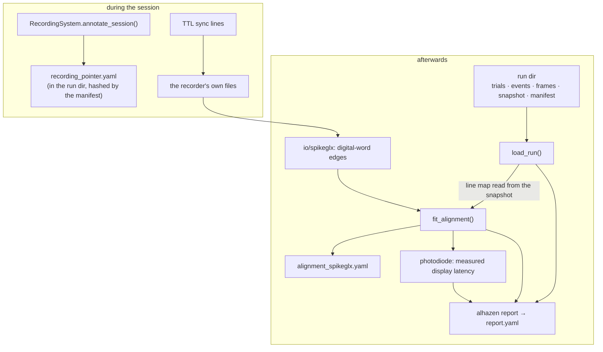

### 7.1 The pointer, written before trial 1

Most acquisition software cannot be annotated programmatically, so alhazen
records what it *can*: a `recording_pointer.yaml` in the run directory naming
the system and where its files are expected. It is written before the session
starts, so a crashed session still says what it was recording against, and
the manifest hashes it like everything else. `check-rig` covers the recorder
too — the failure that actually happens is an acquisition host's share that
did not mount, and it should be found on an empty rig.

### 7.2 Alignment

Two machines, two crystals, two ideas of what a second is. The TTL pulses put
the same events in both records; `fit_alignment` fits
`recording_time = offset + scale × session_time` and reports how well.

Three rules:

- **The line map comes from the run's own snapshot**
  (`RunData.sync_event_lines`), never from a caller's idea of the rig — a
  notebook that re-declares the channel map will one day be wrong about a
  session it was not written for.
- **Unmatched pulses are counted, never absorbed.** The fit seeds from an
  exhaustive search over endpoint pairings, refines by alternating
  nearest-pulse matching with refitting, and *refuses* when too few events
  match: two records of different sessions would otherwise produce a
  confident-looking transform. It refits offset and scale on the **final**
  match set, since a loop that stops on its iteration cap holds a match set
  one round newer than its last fit.
- **The seed search reaches past a late start.** A seed pairs one of the
  first few events with one of the first 8 pulses, and one of the last few
  events with one of the last 8; each double pairing fixes offset and scale
  exactly, and a scale outside 0.99–1.01 is discarded. Anchoring only the
  very first and last event, as it once did, refused any recording that
  started late or stopped early: that event has no pulse, so every seed tied
  it to another event's. How many events is set by the matched threshold —
  with 80% of 500 required, up to 100 may go unmatched, so events 0–100 are
  tried at each end; any later start is refused whatever the seed — and
  capped at `MAX_SEED_EVENTS` (128). Both refusals say how many events and
  pulses were compared at each end, so a late start is recognisable, and the
  matched-fraction refusal writes the fraction with as many decimals as it
  takes to be visibly below the threshold — "79.8% < 80%", never
  "80% < 80%" (the rule frame QA uses too, §10.2).
- **Cost stays bounded.** Seeds that draw the same line (event *i* with pulse
  *a* and event *i+1* with pulse *a+1*) are scored once; every seed is
  screened against 64 events spread over the session, and only the best 256
  are scored against all of them. A 500-event session aligns in about a
  tenth of a second; a 5000-event one missing its first 120 in a few.
- **A tie is refused, not broken by luck.** On a perfectly regular train
  with an end pulse missing, pulses 0–4 fit events 1–5 exactly as well as
  events 0–4. When a second map that places events more than a tolerance
  away explains as many events, and the winner does not fit at least twice
  as closely, the fit refuses and says the events are too evenly spaced.
  Real sessions vary from trial to trial; ±20 ms of variation against 0.1 ms
  of clock noise is already decisive. Ranking by closeness is also what
  keeps a stray pulse one trial-gap before the session from moving the whole
  map by a trial: both maps then explain every event, and only the right one
  fits to the clock noise.

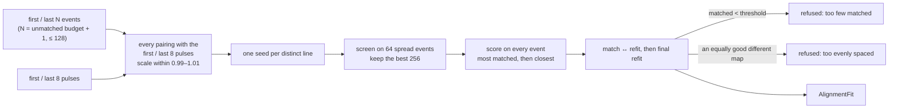
- **The fit is an artifact.** `alignment_<system>.yaml` beside the data,
  because an alignment recomputed next year with a different tolerance is a
  different alignment.

### 7.3 Measured display latency

The patch turned white on exactly the flip carrying an event; the diode
recorded when the screen really changed. Mapping the event's software time
through the alignment and taking the first edge at or after it gives display
latency — measured, not assumed. Reported as a median with a
median-absolute deviation, so one mismatched edge cannot double the apparent
jitter, and never matched backwards, since the screen cannot change before
the flip that changed it.

Before measuring anything, the loop checks that the channel is plausibly the
diode's: the patch flashes once per armed event, so a channel carrying more
than a few rising edges per armed event is refused by name. An unconnected
analog input is noise, its own min/max puts the auto threshold in the middle
of that noise, and a crossing lands just after every event — producing a
confident near-zero display latency that an analysis would then subtract from
every timestamp.

Sync-line numbers are read with an **end-anchored** pattern
(`line\s*(\d+)\s*$`). Unanchored, any earlier `line<digits>` wins, so a device
path under a directory called `baseline5` resolves to bit 5 — a confident
answer about a wire nobody chose.

### 7.4 `alhazen report`

```
alhazen report --run <run_dir> [--neural <spikeglx_run_dir>]
```

Prints and writes `report.yaml`: identity and seed, trial counts per outcome,
frame QA (dropped count, rate, worst interval, **and drops per trial** — a
session's total says nothing about whether they were spread evenly or all
landed in one trial's stimulus), the manifest verdict, and — with `--neural`
— the alignment summary, the measured display latency, and **events emitted
against pulses recorded for every mapped sync line**, not only the one the
alignment fitted on. A line that was wired but never pulsed is a rig fault
the busiest line's fit cannot reveal.

`completed_rate` reads the row's own `completed` column, which the engine
stamps in `_finalize`. Counting every row whose outcome was neither `PAUSED`
nor `ABORTED` is wrong for any experiment whose incomplete outcomes have
their own names — a broken fixation writes a row, so a shaping session's
engagement rate would read as 100% however the animal did.

Exits non-zero when the manifest failed or an alignment was refused, so it
can gate a pipeline. Every number is printed, including the good ones: "0
dropped frames" belongs in the record, not merely in the absence of a
warning.

**Anything written into a run directory is recorded in its manifest — and
only that.** `verify_manifest` reports an unlisted file as a problem, so
`AlignmentFit.save` and `SessionReport.save` both call `add_to_manifest`
with the file they wrote. Otherwise the first report leaves an unlisted file
behind and every later report — and every `load_run` — comes back not-ok,
i.e. the tool breaks the thing it exists to check.

They do not call `write_manifest`, which hashes the whole directory. That is
for the session's teardown, when every file there is the session's own.
Called by a report, it recorded a file damaged since the session under its
damaged hash: the report said "hash mismatch" once, and every check after it
said "verified". `add_to_manifest` replaces only the entries of the files it
is given, so the damage stays detectable. A run with no manifest (its session
never finished teardown) is not given one after the fact; the report still
writes its file, and a warning says it went unrecorded.

### 7.5 Results bundles

An analysis that writes a CSV and nothing else cannot be reproduced — not
because the code is gone, but because *which inputs, which parameters and
which version produced that particular file* is gone.

`ResultsBundle(out_dir, parameters=…)` is an output directory plus a
`manifest.json` recording exactly that: every input with its sha256 and size
(a directory input — a recording — is recorded by name and contents instead,
since hashing gigabytes to identify it costs more than it is worth), every
table written, the parameters, and the alhazen version that produced them. An
empty result still writes its file: nothing on disk is indistinguishable from
the analysis never having run, which is the question the bundle exists to
answer.

### 7.6 Readers

`analysis/io/` holds the file formats: `spikeglx` (meta, memory-mapped
binary, digital-word bit extraction, analog channels), `kilosort` (spike
times, clusters, curation labels), `eyelink`/`asc` (EDF→ASC conversion with
an error that names the Developer's Kit, and a parser where a blink is NaN
rather than a position at the origin), `viewpixx` (a TRACKPixx3 run's
`*_gaze.csv` and `*_gaze-messages.csv`: an affine device→session clock
**fit** from the two-clock message pairs that refuses a residual worse than a
sample period, a sample table in degrees where a lost eye or a blink flag is
a NaN row rather than a missing one, `event_times` and `trial_spans` from the
messages, and `gaze_frame` as an explicit setting, defaulting to the centred,
y-up frame a TRACKPixx3 this backend calibrated reports — measured on the rig,
and guarded by a check that refuses a run whose tracked gaze mostly falls off
the panel, which is what the wrong frame looks like. `read_run_binocular`
reads the same file keeping both eyes, for an experiment whose measurement is
the relation between them: one eye is not a reduced version of a vergence
measurement but none of it, and each eye carries its own `tracked` flag so
that one eye lost while the other tracks stays visible and usable), and `session` (a run directory, manifest-verified, returned as
typed pandas DataFrames — a `csv.DictReader` row hands back
`row["success"] == "False"`, and `"False"` is truthy). All are tested against
synthetic files written by `tests/fixtures_neural.py`, so each test can say
what should come out rather than only that nothing crashed — and the viewpixx
reader also against `tests/fixtures/trackpixx3/`, the header and messages of
a real recording, because its column names are the device's (`Timestamp`,
`Left Screen X`, VPixx's own `Right Fixaion`) and a fixture written in the
names the reader wanted once let it ship unable to open a real file.

An experiment's own analysis composes them: the
[rf-mapping](https://github.com/sh4r11f/rf-mapping) experiment, for one,
rebuilds its probe grid from the run's **own snapshot**, takes flash
onsets from the flip-stamped events, spikes from `io/kilosort`, and the
clock map from `sync` — recomputing offline what its live map estimated
during the session.

## 8. Scenes

Stimuli designed in
[illusion-studio](https://github.com/sh4r11f/illusion-studio) and run
unchanged in experiments. A scene is JSON — shapes, gratings, dot fields, and
expressions that animate them — and the same file produces the same picture
in the studio and in a trial.

The full treatment, including the subset table, the language's
JavaScript-not-Python semantics, and the measured pixel tolerances, is in
[`scenes.md`](scenes.md). Four things are worth knowing here:

- **The primary renderer is headless.** `headless_render(scene, params, time,
  width, height, dt)` returns a numpy array with no display, no window and no
  renderer, and the display path blits it. So what an experiment shows is
  exactly what a test inspects, on a machine with nothing installed.
- **Scene time follows the measured flips.** `SceneStimulus` adds up the `dt`
  its phase passes, which is the measured duration of each frame shown. A
  dropped frame moves the scene on by the time it actually took, and the
  picture due in between is never drawn. The same scene, params, `time` and
  `dt` always give the same pixels, but two runs of a trial show the same
  frames only if their flips took the same times. A sequence that must
  repeat exactly needs a schedule indexed by frame (`FrameTimeline`, §5.2);
  see [`scenes.md`](scenes.md#what-a-run-shows).
- **Expressions are parsed, never `eval`'d**, and are pinned to the studio's
  own TypeScript by a fixture generated from it — including where the
  language is deliberately not Python (`round(2.5)` is 3, `-2 ** 2` is 4).
- **Out-of-subset scenes are refused by name and path.** A renderer that
  silently skipped a text layer would produce a stimulus that looks almost
  right, which in a psychophysics experiment is worse than one that refused.

Against the studio's own Skia-rendered reference images: everything computed
per pixel rather than per edge — gratings, Gabors, noise, stripes, dashes, a
translated block — is **pixel-identical**, and shapes differ only on their
anti-aliased rims (0.2–1.4% of pixels). Every reference PNG in the fixtures
directory is in the comparison set; a committed reference nobody compares
against is a file, not a test. The rules that parity depends on — nonzero
polygon winding, centred strokes, arc-length dashes, replacing (not
multiplying) layer opacity, and the dot field's stream-per-dot seeding and
index-ordered signal set — are enumerated in [`scenes.md`](scenes.md).

## 9. The database and the live dashboard

Both are *mirrors*: the run directory stays the record, and neither is
allowed to become one.

**`session/database.py`** mirrors each run into one SQLite file per
experiment (`data_root/experiment.sqlite3`), so a question about a whole
season is a query rather than a directory walk. It lives under `session/`
rather than `data/` because it speaks a session's whole vocabulary —
`SessionConfig`, `InputFrame`, `FrameRecord` — and those sit above `data/`,
which is pure disk and knows nothing about trials. Schema, run-id shape and
size policy: [`database.md`](database.md).

**`dashboard/`** runs a small HTTP server in a **child process** and pushes a
snapshot between trials. Three properties constrain the runner, and the rest
of the page is described in [`dashboard.md`](dashboard.md):

- **It never blocks a session.** The queue holds one unread snapshot; a slow
  or closed browser loses updates rather than stalling a trial.
- **It is read-only until the experimenter pauses from the keyboard**,
  enforced by the server against its own authoritative status rather than by
  the disabled buttons on the page. On entering a pause the runner discards
  whatever is already queued, so a command accepted just before a resume
  cannot fire at the *next* pause.
- **The browser draws; it does not analyse.** `dashboard/panels.py` computes
  every mark in Python, over the whole session and thinned to a bounded
  number of points — so each snapshot costs the same on trial 4000 as on
  trial 40, and no statistic lives in untested page JavaScript. A live
  analysis (§5.5) obeys the same division: its `panels()` are finished
  payloads (a receptive-field map travels as a `heatmap` form the page
  only renders), appended after the spec's own panels. So does the
  session's eye-tracker monitor (`session/eyetracker.py`), whose
  calibration, validation and drift-correction results and camera image
  make up the *Eye tracker* group — and the runner's own *Frame intervals*
  panel (`panels.frame_intervals_panel`), a histogram of every flip-to-flip
  interval from the `FrameMonitor` in eighths of a frame period: the one
  panel drawn from the frame log rather than the trials, because the
  *shape* is what tells a vsync miss from a flip that never waited for
  vsync (frames under half a period, impossible on a locked panel), and no
  dropped-frame count can.

The child starts before the display opens, so the whole remainder of
`build_session` runs inside a guard that stops it on any failure — otherwise
a tracker that will not connect leaves an orphaned server holding the port.

`devices/automated.py` supplies a scripted subject — gaze that moves from
fixation to a target on `STIM_ON`, alternating key answers after a response
cue — so an unattended machine can run a *visible* demonstration of a real
task through the real engine. It is a device, so it obeys the device
invariants: `get_gaze()` stamps from the **session clock**, received through
`configure(screen, clock)`. That clock is part of the protocol method for
every backend precisely so a backend cannot quietly reach for
`time.monotonic()` and put a second clock in the run.

## 10. Sessions, data, reproducibility

`build_session(...)` wires everything; `SessionRunner.run()` then:

1. writes `config_snapshot.yaml` **before trial 1** (a crashed session still
   documents itself) — merged config + seed + versions + an environment
   digest (sha256 over installed distributions) + both git trees, the
   experiment's (`experiment_git_sha`) and alhazen's own
   (`alhazen_git_describe`). Both are read with `git describe --always
   --dirty`, so a session run from uncommitted changes to tracked files says
   `-dirty` rather than naming a commit that would not reproduce it; where
   there is no answer they read `not a source checkout` (not in a git
   repository) or `unknown` (git absent or not answering);
2. registers the subject in `participants.tsv`;
3. loops: `source.next()` → build → engine → `source.record()` for **every**
   outcome (schedulers own re-queueing) → recorder row for every outcome
   except `PAUSED` (which produced no measurement — its events still land in
   the events table, so the two tables deliberately do not join 1:1). A
   task's params may name `max_consecutive_failures`: after that many
   non-completed trials back to back the runner stops at the pause screen
   with the count and the last outcome as its heading, because a subject
   who is not seeing the stimulus — a calibration that passed but sits at
   the edge of the fixation window — otherwise looks like a session that
   is simply running. The streak is the subject's: a completed trial ends
   it, and so does a `DROPPED_FRAMES` trial (the subject completed it); a
   `PAUSED` trial and a trial the eye tracker cut short neither count nor
   end it; the experimenter's skip counts (§5.3, "System faults"). The
   tracker's dropouts have a streak of their own, the rig's rather than the
   subject's: after `eyetracker.max_consecutive_dropouts` of them in a row
   the pause screen leads with `THE EYE TRACKER DROPPED OUT ON 3 TRIALS IN A
   ROW` and what the tracker said, because each of those trials is served
   again and the session would otherwise loop on a dead tracker. A
   `BlockPlan` leaves a break when a block ends and
   another follows (`take_block_break`), and the runner takes it before
   the next block's first trial: the pause screen headed `BLOCK 3 OF 6
   COMPLETE — REST`, in its own colour, until SPACE — a rest is never the
   screen a fault puts up;
4. teardown attempts every step regardless of earlier failures (recorder →
   frame log → close log file → manifest → display), re-raising the first
   teardown error only if nothing else is propagating.

`session.log` (UTF-8, attached at the root logger at INFO) is meant to be
read as the record of the session's *structure*, so what it carries at INFO
is exactly that: `session start` (identity and seed), a `devices:` line naming
each device's backend, one `setup:` line per thing the mode decided before
trial 1 (`ModeSession.describe()` — reductions, stood-down devices, a
run-mode task that never declared its instructions; the terminal is not part
of the run directory), `block N of M starts/ends` from
`BlockPlan`, every calibration / validation (with per-target errors) / drift
correction verdict, one line per trial (`trial 12 attempt 1: CORRECT`, with
the abort or frame-QA reason where there is one, or the fault a closing
phase flagged), one line per trial that dropped frames (per-frame drops are
DEBUG; the frame log holds every interval), one WARNING per trial lost to a
system fault (the cause — for a tracker dropout, in the tracker's own words —
what the subject was paid, or that the task sets no `on_fault`, and that the
trial will be served again), one WARNING when a run of dropouts pauses the
session, and a
`session end:` line with the status and outcome counts —
or `session end: FAILED … <exception>` at ERROR, so a log that merely stops is
a crash and one that ends is a session.

On-disk layout per run (see `data/paths.py`; overwriting an existing run's
trials file is refused):

```
<data_root>/participants.tsv
<data_root>/sub-<ID>/ses-<NNN>/run-<NN>_task-<name>/
  ├── sub-.._ses-.._run-.._task-.._<YYYYMMDD>_{trials,events,frames}.csv
  ├── config_snapshot.yaml   session.log   manifest.yaml   figures/
```

Randomness: one resolved seed → `SeedSequence.spawn` into named streams
(`core/rng.STREAMS`, append-only) — scheduler and task never share bits;
module-level `np.random` is never used.

Durations: `Duration(ms=…)` or `Duration(frames=…)`, resolved once against
the **measured** refresh rate (warm-up flips at build time; `resolve_refresh`
errors loudly if measured and nominal disagree).

### 10.1 Messages are prose unless they say otherwise

`show_message(text, *, reflow=True)` is how the session talks to the subject
— the instructions, `stage: 2`, `REWARD FAILURE — check the pump`. The text a
caller writes is usually hard-wrapped (an `instructions.md` at 80 columns),
and the display wraps it again at its own measure, the smaller of 80% of the
screen's width and 34 letter heights. Left as given, every source line longer
than that measure became a full line and a stub: ragged text, orphaned words,
and a block tall enough to trip the shrink-to-fit that keeps a message on the
screen. So each backend first passes the text through `display.text.reflow`,
a pure function with no renderer behind it:

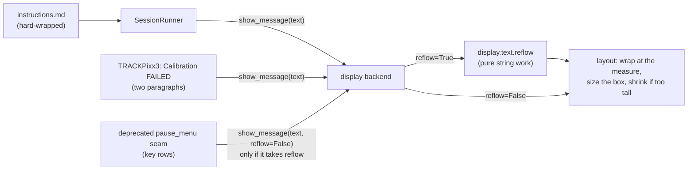

The rule, after `\r\n` and `\r` become `\n`:

- a blank (or whitespace-only) line separates paragraphs; a run of them is one
  break, and blank lines at either end are dropped;
- inside a paragraph a line joins the one before it with a single space —
  unless it starts with whitespace or a list marker (`-`, `*`, `+`, `•`,
  `1.`, `1)`, then a space), in which case it keeps its break and its text
  exactly, so an indented key list or a Markdown list survives;
- trailing whitespace goes; spaces inside a line stay, because they align
  columns.

The rule looks at each line alone, which keeps it predictable: a plain line
after an indented one joins it, just as a list item's wrapped text joins the
item. It is idempotent, so a caller that already reflowed loses nothing.

Reflow is on by default because nearly every message is prose. Text whose
every break is meaningful can pass `reflow=False` and is drawn exactly as
given. **Framework code never passes `reflow=` to a backend it did not build
itself**, so a display backend written before the argument existed, taking
the text alone, keeps working. The two messages with deliberate breaks get
them another way: the TRACKPixx3's calibration-failed notice is two
paragraphs (what happened, then what to do), which reflow keeps apart; the
deprecated `pause_menu` seam, whose unindented key rows would otherwise run
together, passes `reflow=False` only to a `show_message` whose signature
takes it. The real pause menu goes through `show_menu`, which never reflows.
The built-in backends take the argument the same way — keyword-only, default
`True` — and the ones with no screen keep it: `SimulatedDisplay` and
`testing.FakeDisplay` record `(text, reflow)` in `message_calls`, and the
simulated display logs the text as it would have been drawn.

### 10.2 A percent reads on the side of its threshold

Some messages print a measured fraction, a threshold, or both, beside a
verdict about which side of the threshold the fraction fell on:

| Message | Where it lands | The comparison |
|---|---|---|
| frame QA's recycle reason | the trial row's `frame_qa_reason`, `session.log`, `FrameQAError` | dropped fraction > `max_dropped_fraction` |
| the per-trial dropped-frames line | `session.log` | the same fraction, over or within the same budget |
| the failure-streak pause | the pause heading, `session.log` | the budget alone ("dropped over 10% of their frames") |
| the matched-fraction refusal | `DataError` from `fit_alignment` | matched fraction < `min_matched_fraction` |

Printed with a fixed number of decimals, each could state the opposite of
its own verdict. At the shipped 10% budget, 21 of 209 frames read "(10.0%),
over the 10% budget". A 7.5% budget read "8%". 399 of 500 matched events
read "(80% < 80%)". So all of them write their numbers through
`data/percents.py`:

- `threshold_percent` writes a threshold with the fewest decimals that
  state it: 0.1 is "10%", 0.075 is "7.5%".
- `compared_percents(value, relation, threshold, min_places=...)` writes the
  threshold the same way. It writes the value with the fewest decimals (at
  least `min_places`) whose printed text stands in `relation` to the
  threshold's. `relation` is the caller's own test: `>` for a recycled
  trial, `<=` for a trial within its budget (equal is within), `<` for the
  refusal. Frame QA asks for at least one decimal, the format its lines have
  always had, so "(15.0%)" is unchanged and only a fraction that would round
  onto the budget gains a decimal: "(10.05%)".

Each printed number is a correctly rounded value of its own number; nothing
is nudged across the line. If no number of percent decimals can separate the
two (a threshold within a float rounding error of the value), both are
printed in full as plain fractions, which still reads true. Asking for a
relation the numbers do not satisfy raises `ValueError`, rather than letting
the message state something false.

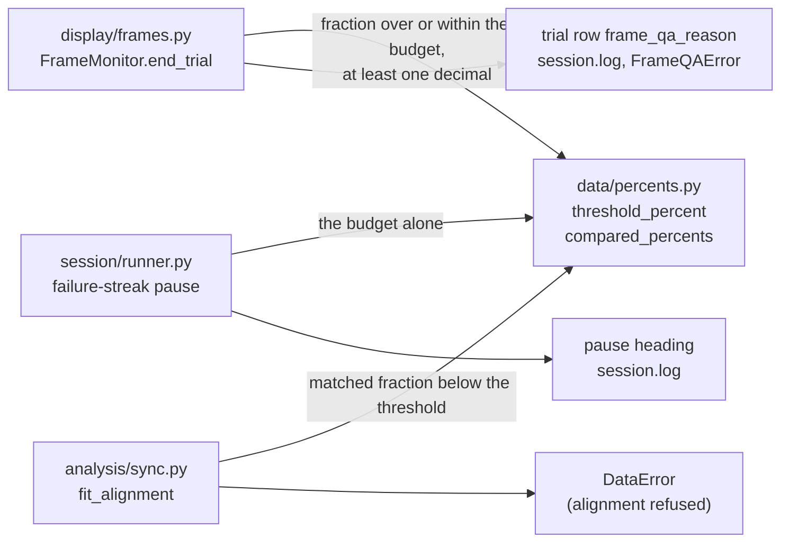

The rule lives in `data` because three layers need it: display, session and
analysis. `config | data` is the lowest line of the layering contract, so
every layer above it, those three included, may import from it. Of the two
packages on that line, `data` is the one kept ignorant of everything above
it; `config` holds the configuration models and their loader.

## 11. Extending

Step-by-step recipes for each seam — stimulus, phase, paradigm, device
backend, display backend, training stage or metric — are in
[`how-to.md`](how-to.md). Four rules apply to all of them:

- **Satisfy the protocol structurally.** Every seam is a `Protocol`, not a
  base class; there is nothing to inherit from.
- **Import the vendor SDK inside the method that needs it**, and raise the
  typed error naming the extra or the installer. If you must subclass one of
  the SDK's classes, do it inside a factory, as `calibration.py` does.
- **Register the name in that seam's `make_*` factory**, which is the single
  place a config name resolves and what both `build_session` and `check-rig`
  call. Give it a config model with a `backend` literal.
- **Ship a simulated sibling in the same change**, so the default test suite
  keeps running with nothing installed.

## 12. The command line

Six commands, each doing one thing an experimenter needs, and each doing it
through the same code a session would — a tool whose "OK" comes from a
parallel implementation is a tool whose OK means nothing.

| | |
|---|---|
| `alhazen new <name>` | scaffold an experiment package: a Task, two rig configs, a task config, tests and a runner. Its tests pass and its session runs before anything is edited |
| `alhazen run --task ...` | run one session of an installed task, found through the `alhazen.tasks` entry-point group; picks the next free run number, prompts for subject and session if omitted, runs the task's own params file when `--params` is not given, applies its params hook, and shows the subject its instructions (§5.1). An experiment's `run.py` starts the same session through the same dispatch |
| `alhazen validate --rig` | is this config file well-formed? |
| `alhazen check-rig --rig` | is this rig actually wired? Constructs the real backends; `--pulse` fires the pump and the sync lines |
| `alhazen sim-sorter` | publish the sorted-spike wire contract, so `check-rig` can be rehearsed with no sorter and no probe; `--fault` publishes a named non-conformance instead |
| `alhazen calibrate ruler\|gamma` | draw a bar of a known angular size on the rig's own display and say what it should measure; fit and store a gamma curve from photometer readings |
| `alhazen report --run` | what happened, and does the data check out? With `--neural`, aligns the clocks and measures display latency |

The scaffold is vendored as files under `_scaffold/template/` and rendered
with stdlib `string.Template` — a scaffold needing a dependency to run would
be one more thing between a new user and their first session. Its task names
its own params file (`default_params`, found from the task's own file) and
its instructions (§5.1), so its `run.py` passes only the task and a default
rig, and `alhazen run --task` starts the same session: a new experiment
starts with its two entry points agreeing rather than inheriting a gap
between them.

The acceptance test **installs** the rendered package (`pip --target`, in a
subprocess), then lists its entry point, runs its tests and runs a session
through `alhazen run` — because packaging is what breaks between a working
checkout and a rig, and injecting `src/` into `PYTHONPATH` exercises none of
it. Marked `slow`; runs in CI.

Every rendered config is **loaded through its real loader** in the scaffold's
tests. Checking that a file exists is not checking that it works: a
`devices:` key followed only by comments is YAML for `devices: null`, which
the non-Optional field rejects.

**The gamma loop closes.** `alhazen calibrate gamma` writes the fit beside
the rig config (`<rig>_gamma.yaml`), and `build_session` applies it through
`display.set_gamma` when the display opens — when the rig arrived as a path,
since a hand-built `RigConfig` has no file for one to sit beside. The path
helpers live in `config/gamma.py` rather than in the CLI, because the builder
sits below the CLI and must not import upward. A measurement made and never
applied leaves every "50% contrast" at 50% of code value rather than of
luminance — an afternoon with a photometer, wasted.

**The monitor is registered, not just described.** A rig config describes a
panel in alhazen's terms; PsychoPy keeps its own per-machine database of
monitors, and that is where Monitor Center writes, where a window looks up a
stored calibration, and what every other PsychoPy script on the rig reads.
`alhazen monitor register` writes one into the other (`display/monitors.py`),
under `monitor.name`, carrying the measured gamma if there is one — and then
looks the record up again and refuses if PsychoPy hands back different
numbers from the ones just written, so a stale file under the same name is
found at registration rather than by the next window. `monitor.name` is the
rig file's stem unless the file says otherwise (`load_rig`): a rig file is
one machine, and two files sharing PsychoPy's one default name would
overwrite each other's geometry.

The two then have one rule each. **The config owns the geometry**: every
degree goes through `Screen`, which reads the config, so a registration that
disagrees about width, distance or pixel size is stale and
`display.monitors.resolve` refuses to open a window against it — the
alternative is a session whose deg/px model differs from the one that placed
its stimuli, which nothing downstream could detect. **The registration owns
the calibration**: gamma, luminance grids and colour matrices stay on it, and
re-registering geometry never overwrites them. `check-rig` reports the
comparison, which makes it the one part of the display that can be verified
without opening a window.

**Documentation is checked, not just written.** Every ` ```python ` block
under `docs/` is compiled by a test — the landing page's own example carried
a `SyntaxError` for a whole release, because the docs were prose to every
tool in the repo. `docs/reference.md` is generated from the docstrings by
mkdocstrings, and the site builds under `--strict`.

### Compatibility

The public API is everything exported from `alhazen` and everything in the
documented modules. Deprecations warn for one minor version before removal
(`alhazen._deprecation`), naming the version and the replacement.

Three contracts outlast any version because they live on disk:
`core.rng.STREAMS` is append-only, `RESERVED_EVENTS` only ever gains names,
and the run-directory layout changes only in a major version with a
documented migration.

## 13. Testing

`pytest` runs the whole suite with no display, no hardware, no renderer, no
pylink and no nidaqmx installed — fakes live in the public `alhazen.testing`,
and the device doubles (`ScriptedTracker`, `SimulatedReward`, `SimulatedSync`)
in `alhazen.devices` alongside the real backends. `tests/support.py`'s
`SessionHarness` wires a full session to them, reusing the builder's own
closures so there stays exactly one gaze coordinate conversion in the
codebase. Markers: `display` (excluded by default) is reserved for real-window
smoke tests. CI (3 OSes × py3.10/3.12) runs ruff (lint+format), mypy, pytest,
and the import-layering contract.

Four examples double as acceptance tests, each a `Task` subclass:
`minimal_fixation` (a duration-based trial, no devices), `gaze_fixation` (a
gaze-contingent trial driven by `ScriptedTracker` in the default suite, by
`mouse_sim` under `[psychopy]`, and by nothing at all on the headless rig —
where every trial simply times out), `saccade_to_target` (the four-phase
saccade trial, built from library phases only), and `staircase_detection`
(key responses on interleaved staircases — this one needs a subject, so its
headless equivalent is the test suite).

One test is a probe rather than a regression test: a complete gaze-contingent
trial state machine — four phases, five outcomes — composed from
`alhazen.task.phases` with nothing hand-written, each outcome shown to be
reachable. While that keeps passing, bringing an existing experiment onto the
framework is a matter of its stimuli and its analysis, not its trial logic.
