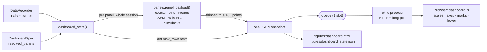

# Live dashboard

Alhazen can open a local browser dashboard before PsychoPy takes focus. The
dashboard receives a new immutable snapshot after every recorded trial; no
HTTP, serialization or plotting runs in the display frame loop.

Enable it in the rig configuration:

```yaml
dashboard:
  enabled: true
  auto_open: true
  port: 0                 # ask the OS for an unused loopback port
  max_rows: 1000          # trials/events per update; totals travel alongside
```

`max_rows` is why publishing stays cheap in a long session. Each update
serialises what it sends, so sending the whole history after every trial makes
the cost grow with the square of the session's length — real time spent
between trials, with a subject waiting. Only the most recent `max_rows` trials
and events travel as a record echo; `n_trials` and `n_events` carry the
totals. The state saved to `figures/` at teardown is always complete.

The **plots are never truncated by it.** Each panel arrives with its data
already computed over the whole session, so a cumulative curve does not begin
partway up in trial 4000 of a long run.

The server binds only to `127.0.0.1`, uses a random per-session token, and
loads no internet resources. `--dashboard` and `--no-dashboard` override the
rig for one run. `--no-dashboard-browser` starts the server without launching
the default browser; the URL is written to the session log.

## Focus safety and controls

The dashboard is deliberately read-only during a running experiment. Clicking
a browser on the presentation computer necessarily transfers OS focus before
Python can react, so a web Pause button cannot honestly promise not to affect
subject input.

Press **P** on the experimenter keyboard first. Once the subject display says
the run is paused, the dashboard enables Resume, Calibrate, Give reward, Quit,
and curriculum controls. The server also rejects control requests unless its
authoritative session state is `paused`; disabling the buttons is not the
security boundary. Space, C, R and Q remain available from the keyboard while
paused, so closing the browser cannot strand a session.

Commands queued before a pause begins are **discarded**. A click accepted in
the milliseconds between the browser seeing "paused" and the runner resuming
would otherwise sit in the queue and fire at the next pause — a reward
delivered, or a session quit, minutes after the click that asked for it.

Calibration and manual reward leave the run paused. Resume is always an
explicit action. Each successful or failed reward is written to `events.csv`,
including its configured pulse train.

## The plots

Every quantity gets the mark that answers the question being asked of it. A
session total is a number and is shown as a number; what deserves a plot is
its *shape over trials* — some trials pay more than others, and a curve that
goes flat at trial 260 says the subject stopped working, which no total can.



The split matters: **the browser draws, it does not analyse.** Every count,
bin edge, mean, error bar and running proportion is computed in
`alhazen.dashboard.panels`, in Python, where it is unit-tested. A running
accuracy that divides by the wrong denominator looks entirely plausible in a
browser, and the page's JavaScript has no test in this suite.

### Reading them

Panels are laid out two to a row, collapsing to one on a narrow window, and
each chart is measured against the card it was placed in — so a plot is as
large as the space it has, on any screen. Every chart on a page gets the same
drawing box, and every card reserves the same room for a legend and a caveat
line, so a row reads as a plate of figures rather than as a pile of cards.

### Groups

Panels are filed into groups, listed in the sidebar with a count each, and
selecting one shows only that group. The default groups follow from the kind:
**Session** (performance, reward, outcomes), **Behaviour** (responses,
reaction times, series, single numbers), **Gaze** (landings and saccade
vectors) and **Conditions** (anything grouped by a factor). Set `section=` on
a panel to file it under a name of your own — a task's pupillometry panels
under "Pupillometry", say — and it appears in the sidebar beside the rest.
The choice is remembered in the browser.

The drawing conventions are fixed across every panel, so a plot means the same
thing wherever it appears.

- **Axes carry units.** They are read off the column name's suffix — `rt_ms`
  is milliseconds, `endpoint_x_dva` is degrees of visual angle — which is the
  convention a trial record already follows. Set `unit=` on the panel for a
  column named some other way.
- **Error bars are the standard error of the mean**, and the number of trials
  behind each one is printed under it. A group with a single trial gets a bare
  dot: no spread was measured, and a zero-length bar would imply certainty.
- **The shaded band on `performance` is a 95% Wilson interval**, not the
  textbook normal one — which is badly wrong on the handful of trials where an
  experimenter is most tempted to read it, and can run past 0 or 1.
- **A proportion axis is pinned to 0–1.** Auto-scaling accuracy to 0.62–0.68
  turns noise into a dramatic-looking climb.
- **A histogram's axis is clipped to a robust window** (three interquartile
  ranges past the quartiles) and says how many trials fell outside it. One
  four-second trial must not squeeze sixty real ones into a single bar; the
  outliers are excluded from the drawn bins, never from `n` or the median.
- **Reward is measured in valve-open time**, not millilitres: volume per pulse
  is a property of the pump's calibration, which alhazen does not know. Open
  time is exactly proportional to it. If any delivery reached the record
  without its pulse train, the panel counts deliveries instead and says so
  rather than inventing a volume.
- **Landings are drawn at equal aspect** — a degree right is the same length on
  screen as a degree up — with the screen centre marked.
- **Every panel has a table view.** Whatever a hover readout shows is also
  reachable as text, under the plot.
- **Spines and outward ticks, no gridlines.** The reading conventions of a
  printed figure: the ink inside a plot is the data. Values a tick does not
  carry are on a direct label, in the hover readout, or in the table.
- **A mean marker appears only where a mean is a position.** With more than
  one target on screen, the mean landing falls between the clusters — where
  nothing landed — so the landing panel omits it.

Long series are thinned to at most 180 points before they are sent: more
points than a panel has pixels cost serialisation time and tell the reader
nothing. Thinning always keeps the first and the last point.

## Task-specific plots

Every task gets performance, reward, outcome, reaction-time, response and
saccade-landing panels. Panels tolerate missing fields and say what is
missing — "No rt_ms recorded yet" — so the same defaults work for tasks
without hand responses or gaze.

Add experiment-specific panels declaratively:

```python
from alhazen import DashboardPanel, DashboardSpec, Task


class MibTask(Task):
    dashboard = DashboardSpec(
        panels=(
            DashboardPanel(
                kind="grouped_mean",
                title="MIB by coherence",
                value="mib_signed_dva",
                group="coherence",
                completed_only=True,
            ),
            DashboardPanel(
                kind="stat",
                title="Median saccade latency",
                value="saccade_rt_ms",
                agg="median",
                completed_only=True,
            ),
        )
    )
```

Set `include_defaults=False` to replace rather than extend the standard
layout.

### The kinds

| kind | answers | drawn as |
| --- | --- | --- |
| `performance` | is the subject working? | running proportion over trials, with a 95% band and a moving window |
| `rewards` | how much has it earned, and is that still accruing? | cumulative step curve, failed deliveries marked |
| `outcomes` | how do attempts end? | horizontal bars, count and share |
| `responses` | which key is being pressed? | horizontal bars |
| `histogram` | what does one measurement's distribution look like? | binned columns with the median marked |
| `scatter` | where in space did the response land? | equal-aspect scatter with targets and the mean landing |
| `vectors` | how far, and which way, did the eye move? | every trial's displacement from one origin, on a polar grid |
| `series` | how does one quantity drift? | per-trial points with a moving mean |
| `grouped_mean` | does it differ across a condition? | group means ± SEM, with n |
| `stat` | one number | the number |

`performance` needs nothing declared: it reads the row's own `success` when
the task scores its outcomes, and falls back to the completion rate when it
does not — labelling the axis with whichever it used, never quietly swapping
one for the other. `rewards` reads the event stream, so it also counts manual
deliveries, unrewarded completions (`NO_REWARD`) and hardware failures
(`REWARD_FAILED`).

`scatter` and `vectors` are two questions about the same endpoints. `scatter`
plots them where they landed, with the targets marked, and answers *did it hit
the target*. `vectors` plots each one as a displacement from where the eye
started — every trial collapsed onto a single origin — and answers *how far,
and which way*. Amplitude and direction stay readable in the second even when
the fixation point moves between trials, which is what the origin columns are
for:

```python
DashboardPanel(
    kind="vectors",
    title="Landing relative to fixation",
    x="endpoint_x_dva",
    y="endpoint_y_dva",
    origin_x="fixation_x_dva",   # optional
    origin_y="fixation_y_dva",
    completed_only=True,
)
```

`StimulusResponse` records that origin for you. On the frame gaze leaves the
window it writes `<depart_region>_x_dva`/`_y_dva` — the last sample verifiably
*inside* it, which is where the eye actually was, not where the fixation point
was drawn. A trial whose origin was never verified (gaze lost throughout) is
left out of the panel rather than measured from an invented one.

If no such column exists at all, the origin falls back to the screen centre —
where this framework's fixation point sits — and the panel says so under the
plot rather than assuming it silently. Point `origin_x`/`origin_y` at the
target columns instead and the same panel becomes an endpoint-error plot.

Bin edges, group ordering and error bars are chosen for you. Numeric group
labels sort as numbers — the string order `"0.2" < "0.4" < "10"` is wrong
exactly when a level reaches double digits.

## Conditions

The panels know what the experiment varies. The session runner collects the
condition factors from the conditions the paradigm actually served — not from
a declaration, so they cannot drift — and they reach the dashboard on their
own:

- **the spatial panels are coloured by the first factor**, so a landing cloud
  separates by condition at a glance;
- **each factor earns two panels**: `Accuracy by <factor>` and
  `Landing error by <factor>`.

Nothing has to be declared for that to happen. To colour by a different
column, set `color_by` on the panel; to group by more, declare a
`grouped_mean` or `grouped_rate` panel of your own.

```python
DashboardPanel(
    kind="scatter",
    title="Landings by coherence",
    x="endpoint_x_dva",
    y="endpoint_y_dva",
    color_by="coherence",
)
```

The categorical colours are **Okabe-Ito**, the colour-vision-deficiency-safe
set scientific figures have used for two decades. The same three hexes serve
the light and dark themes and clear every gate in both under the harder
all-pairs test that a scatter plot needs.

Colour follows the *kind* of factor, not the taste of the panel. Numeric
levels are ordered — 0.05 really is less than 0.4 — so they take one hue from
light to dark and the reader sees the order in the colour. Named levels
("left", "right") have no order to show, so they take separate hues. Both
palettes are validated against the surface they are drawn on, which is what
caps how many levels can be told apart: five ordered, three named. Beyond
that the tail folds into one grey series and the panel says how many levels
went into it — a sixth colour would be one nobody could distinguish, and an
indistinguishable legend entry is worse than an honest "other".

The first **two** factors get automatic panels. Every factor adds two, and a
dashboard nobody can take in at a glance has stopped being monitoring; declare
the rest explicitly when you want them.

The landing panel groups `endpoint_error_dva` — how far the response fell from
the target it was given, which `LandingCheck` records — rather than the
endpoint's coordinate. A task with left and right targets averages its
endpoint x to roughly zero, and a panel reporting that would be reporting
perfect aim.

Grouped panels draw as dots with whiskers by default, or as bars with
`style="bars"`. Bars grow from zero, so they suit a proportion or a distance;
a signed mean has no meaningful baseline to grow from, which is why the
default is a dot. `grouped_rate` is bars unless you say otherwise, and its
interval is Wilson's — asymmetric near 0 and 1, which is exactly where a level
with a handful of trials puts it.

## Panel filters

Two filters apply to any panel:

- `completed_only=True` — the panel reads only trials that completed. It uses
  the row's own `completed` column, which the engine stamps from the outcome,
  so an experiment's own incomplete outcome (a broken fixation) is excluded
  whatever it is called.
- `rolling_window=N` — the panel reads only the most recent N trials, and says
  so under the plot. Useful live: a running reaction-time histogram over the
  last 50 trials shows a subject tiring, where the same histogram over the
  whole session does not.

```python
DashboardPanel(
    kind="histogram",
    title="Reaction time (last 50)",
    value="rt_ms",
    completed_only=True,
    rolling_window=50,
)
```

## Colour, contrast and theme

The page follows the reader's OS light/dark setting and carries a toggle that
overrides it. Both themes are chosen, not flipped: the two categorical colours
are validated in each mode for lightness, chroma, contrast against that mode's
surface, and separation under protanopia and deuteranopia. Identity never
rests on colour alone — every chart with more than one series carries a
legend, marks are direct-labelled at their endpoints, and the table view
carries every value in text.

Reward failures are the one status colour on the page. They appear as a red
cross on the reward curve, with "delivery failed" in the legend and the count
in the panel's header — colour, shape and words, because a pump failure is not
something to leave to a hue.

## Saved output

At shutdown, the final state is saved as `figures/dashboard_state.json` and a
self-contained `figures/dashboard.html`. Both are covered by the run manifest.
The saved page is the same page, with its snapshot baked in and nothing to
poll: it loads no fonts, scripts or styles from the network, so it still opens
years later on a machine with no internet.
