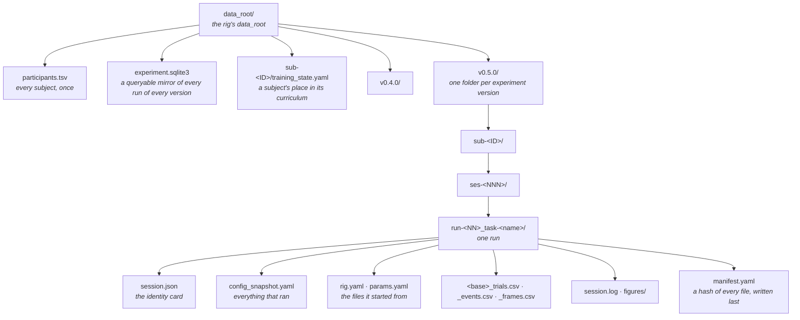

# Data on disk

*Where a session's data goes, what each file in a run folder is for, how the
experiment's version decides the folder, and what changed in alhazen 2.0.*

Every session that runs trials (`run`, `test`, `simulate`) writes one **run
folder**. The run folder is the record: the database and the live monitor are
mirrors of it, and nothing in it is ever overwritten — running the same
subject, session and task again makes the next run number.

## 1. The layout

A rig's `data_root` holds what belongs to the whole experiment at its top, and
one folder per **version of the experiment** below that. Every run sits inside
the version that recorded it:



The same tree as a listing, with the file name stem (`<base>`) spelled out:

```
data/
├── participants.tsv
├── experiment.sqlite3
├── sub-01/training_state.yaml          only for a subject trained under a curriculum
└── v0.5.0/
    └── sub-01/
        └── ses-001/
            └── run-01_task-saccade-bias/
                ├── session.json
                ├── config_snapshot.yaml
                ├── rig.yaml
                ├── params.yaml
                ├── sub-01_ses-001_run-01_task-saccade-bias_20260928_trials.csv
                ├── sub-01_ses-001_run-01_task-saccade-bias_20260928_events.csv
                ├── sub-01_ses-001_run-01_task-saccade-bias_20260928_frames.csv
                ├── session.log
                ├── figures/
                └── manifest.yaml
```

**What spans versions stays at the top.** A subject is the same person or
animal whatever version of the protocol they sit through, so the subject
registry (`participants.tsv`), the experiment database and each subject's
training state live at the unversioned root. Everything a single session
produced lives in its run folder, under its version.

**Rehearsals have a root of their own.** `test` and `simulate` write the same
tree under a sibling of the data root, `data-rehearsal/` for a `data_root` of
`data/` ([modes](modes.md#the-rehearsal-root)): its own `participants.tsv`,
its own database, its own `v<version>/` folders. Nothing a rehearsal writes is
ever under the real root.

**Run numbers count within a version.** The next run number is one past the
highest run folder already in `v<version>/sub-<ID>/ses-<NNN>/`
(`alhazen.modes.session.next_run`). A new version therefore starts at run 1,
and sub-01 ses-001 run-01 can exist once per version. The session number is
the experimenter's own, given on the command line; alhazen does not count it.

## 2. What each file is for

| File | Written | Holds | Read it when |
| --- | --- | --- | --- |
| `session.json` | before trial 1 | Which experiment and version, task, mode, subject, session, run, rig and params file, alhazen, and where the run's other files are (§3). | You want to know what a folder is without opening anything long. |
| `config_snapshot.yaml` | before trial 1 | The fully merged config the session ran — rig, params *as run*, seed, identity, the files each came from — and its provenance: the experiment and version, both git trees, versions, the environment's digest. | You need to reproduce the session, or know a value exactly. |
| `rig.yaml` | before trial 1 | The rig file the session was started with, byte for byte. Absent when the rig was built in code. | You want what a person wrote, comments and all. |
| `params.yaml` | before trial 1 | The params file the session was started with, byte for byte. Absent when the task ran on its params model's defaults. | Same, for the task's parameters. |
| `<base>_trials.csv` | teardown | One row per trial that produced a measurement; every row carries `experiment_version`. | Analysing behaviour. |
| `<base>_events.csv` | teardown | Every event, stamped with the flip that showed it. | Timing, alignment. |
| `<base>_frames.csv` | teardown | Every frame interval, and which were dropped. | Display quality. |
| `<base>_paradigm.csv` | teardown | A scheduler's end-of-session state (an adaptive fit, per-cell counts), when it has one. | Adaptive designs. |
| `session.log` | throughout | The session's structure: start, the experiment and version, devices, every trial, the end. | Something looks wrong. |
| `figures/` | teardown | The live monitor's final state, when the monitor ran. | Looking back at the session as it was watched. |
| `recording_pointer.yaml` | at build | Where the external recording of this run is, when the rig names a recorder. | Aligning to neural data. |
| `manifest.yaml` | last | A sha256 of every other file, and the experiment version (schema 2). | Checking nothing changed since (`alhazen report`, `verify_manifest`). |

`session.json`, the snapshot and the two copies are written together, before
trial 1, **all or none**: the snapshot goes last, and a failure part-way
removes what was already written. So a folder with a snapshot always has the
other three, and a folder whose record could not be written is left as the
build left it — not a run, and its number can be used again.

### The copies are the files, not what ran

`rig.yaml` and `params.yaml` are what the session was *started from*, read
when the session was built. What *ran* can differ, and the snapshot is the
authority on what ran:

- `test` and `simulate` turn trial counts down (`reduced:` lines before trial
  1, and in `session.log`);
- a task's params hook (`Task.params_hook`) or a curriculum stage rewrites
  parameters;
- a rig file that builds on another (`extends:`) is only part of the rig on
  its own — the snapshot holds the merged result, the copy holds the file
  that was named.

## 3. `session.json`

A compact identity card, JSON so any language reads it with its standard
library. `schema_version` is the card's own format number (the on-disk
schema versions in [versioning](versioning.md) §3); a reader gates on it.

```json
{
  "schema_version": 1,
  "experiment": {
    "name": "saccade-bias",
    "version": "0.5.0",
    "version_source": "pyproject.toml",
    "git": "v0.5.0-3-gabc1234"
  },
  "task": "saccade-bias",
  "mode": "run",
  "subject": {"id": "01"},
  "session": 1,
  "run": 1,
  "seed": 2718281828,
  "date": "20260928",
  "created": "2026-09-28T14:03:11+00:00",
  "rig": {"name": null, "source": null, "file": "C:/lab/saccade-bias/configs/rig-lab.yaml"},
  "params_file": "C:/lab/saccade-bias/configs/task.yaml",
  "alhazen": {"version": "2.0.0", "git_describe": "not a source checkout"},
  "files": {
    "snapshot": "config_snapshot.yaml",
    "manifest": "manifest.yaml",
    "rig": "rig.yaml",
    "params": "params.yaml",
    "trials": "sub-01_ses-001_run-01_task-saccade-bias_20260928_trials.csv",
    "events": "sub-01_ses-001_run-01_task-saccade-bias_20260928_events.csv",
    "frames": "sub-01_ses-001_run-01_task-saccade-bias_20260928_frames.csv",
    "log": "session.log"
  }
}
```

| Field | Meaning |
| --- | --- |
| `experiment.version_source` | Where the version was read: `pyproject.toml`, `installed metadata`, or `given to build_session` (§4). |
| `experiment.git` | `git describe --always --dirty` of the experiment's repository — the snapshot's `experiment_git_sha`. `-dirty` means the commit alone does not reproduce what ran. |
| `mode` | `run`, `test` or `simulate`; null for a session built with `build_session` directly. |
| `rig.name`, `rig.source` | For a rig chosen by name, the name and where it was found; null for a rig given as a path. |
| `rig.file`, `params_file` | Where the originals were, on the machine that ran the session; null when that layer came from no file. |
| `files` | Paths relative to the run folder, with forward slashes, so the card still reads right after the folder is moved. A file that was not written (no rig or params file) is null. |

## 4. The experiment's version

**Where it comes from.** The version in the `pyproject.toml` nearest above
the module that defines the task's class — the experiment's own repository
(`alhazen.config.experiment.find_experiment`). It is read from the file, not
from installed package metadata, because an editable install's metadata keeps
the version it was installed with: bump the file and forget to reinstall, and
the metadata would file new data under the old version. A task installed from
a wheel, with no source tree, falls back to its distribution's metadata.

A caller can say it instead: `build_session(experiment_version="0.5.0",
experiment_name="saccade-bias")` (and the same two arguments on
`build_mode_session`) — for a session wired from parts, with no task class to
read one from, or a test. It is recorded as `given to build_session`.

**No version, no session.** A project whose `pyproject.toml` declares no
`[project] version`, a version that cannot name a folder (letters, digits and
`. + _ -` only, as PEP 440 versions are), and a hand-wired session given no
version are all refused with a `ConfigError` that says what to write — before
a window opens or a file is written. A default would file data under a
version nobody declared.

**Where it is recorded.** The folder (`v<version>/`); the snapshot's
provenance (`experiment_name`, `experiment_version`,
`experiment_version_source`); `session.json`; the `experiment_version` column
of every trial row; the manifest; the database (`runs.experiment_version`, and
the front of every `run_id`); an `experiment:` line in `session.log`; and the
run named in a trained subject's transition history
(`v0.5.0/ses-001_run-01`). A file copied out of its folder still says which
protocol produced it.

**When to bump it.** Bump your experiment's version whenever its protocol
changes; data from different versions never mix. The protocol is anything
that changes what a subject sees, does or is paid: stimuli, timing, the trial
structure, the conditions and their counts, the task's logic, the reward
rules. A fix to a comment, the README or the analysis code is not a protocol
change. When in doubt, bump: a version folder with one session in it costs
nothing, and two protocols sharing a folder cost an analysis.

## 5. Reading runs back

A reader handed a run folder is unchanged by 2.0: `load_run(run_dir)`,
`alhazen report --run <run folder>` and `verify_manifest` read a run from
before 2.0 and one from after it the same way.

To find the runs under a data root, use `alhazen.data.find_runs`. It reads
both layouts — the 2.0 one under `v<version>/`, and the one before it that
started at `sub-<ID>/` — and says which each run came from:

```python
from alhazen.data import find_runs

for run in find_runs("data"):
    # experiment_version is None for a run recorded before alhazen 2.0.
    print(run.experiment_version, run.subject, run.session, run.run, run.task, run.path)
```

The database finds a run by its numbers (`ExperimentDatabase.find_run`,
`frame_snapshot`). Since the same numbers can exist once per version, a
question that matches runs of more than one version is refused rather than
answered with either: pass `experiment_version=`.

## 6. Migrating to 2.0

**What moved.** New runs are written one level deeper, under
`<data_root>/v<version>/`. Nothing is moved: runs recorded before 2.0 stay
where they are, directly under the data root, and are still read (§5).
`participants.tsv`, `experiment.sqlite3` and training state did not move.

**Before the first 2.0 session:**

1. **Give the experiment a version.** Its `pyproject.toml` needs
   `[project] version = "..."`. A project scaffolded with `alhazen new` has
   `0.1.0` already.
2. **Move the old database aside.** `experiment.sqlite3` is now schema 3 (a
   run's version is part of its identity), and a schema 2 file is refused
   before the session starts, with the path in the message. The database is a
   mirror — the run folders are the record — so moving it loses nothing; a
   new one is built from the next session onward.

**Scripts and code that change:**

- A script that finds runs with a glob such as `data/sub-*/ses-*/run-*` finds
  none of the runs recorded since the upgrade. Call
  `alhazen.data.find_runs(data_root)`, which reads both layouts; or glob
  `data/v*/sub-*/ses-*/run-*` for runs from 2.0 on (and keep the old glob for
  the old ones). A script that needs one version's data globs
  `data/v0.5.0/sub-*/...`.
- A script that concatenates trials tables can now select or group by the
  `experiment_version` column rather than by where the file was found.
- An experiment's own run counter (a copy of `next_run` in a `run.py`) counts
  the wrong folder: use `alhazen.modes.session.next_run(data_root, subject,
  session, experiment_version=...)`.
- `build_session` without `task=` needs `experiment_version=`;
  `SessionPaths.create` needs `experiment_version=`; a `SessionRunner` built
  by hand needs `identity=RunIdentity(experiment=...)`;
  `ExperimentDatabase.write_run` needs `experiment_version=`.
- A database `run_id` now starts with the version:
  `v0.5.0/sub-01/ses-001/run-01/task-saccade-bias/20260928`.
- The run manifest is schema 2 (it records `experiment_version`); a schema 1
  manifest from before 2.0 still verifies, and keeps its number when a report
  is saved into its run.
