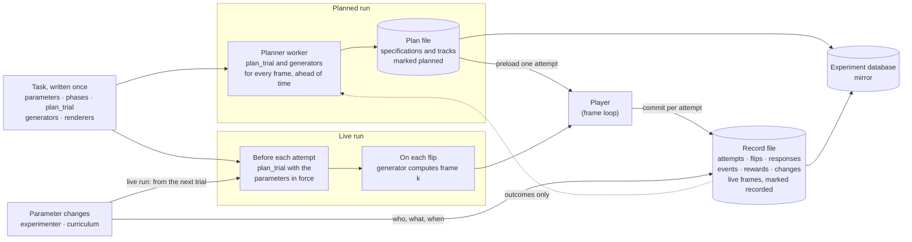
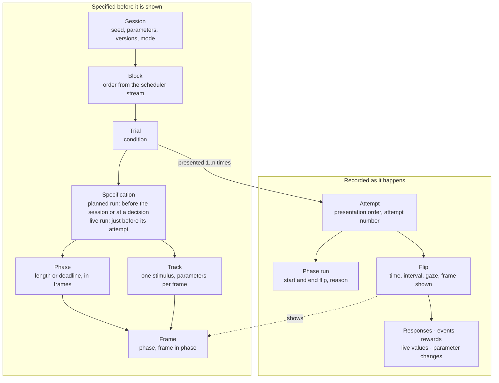
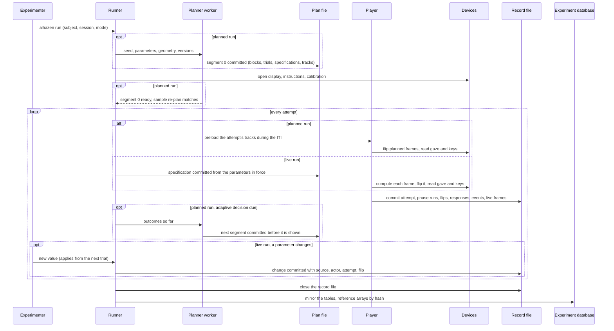
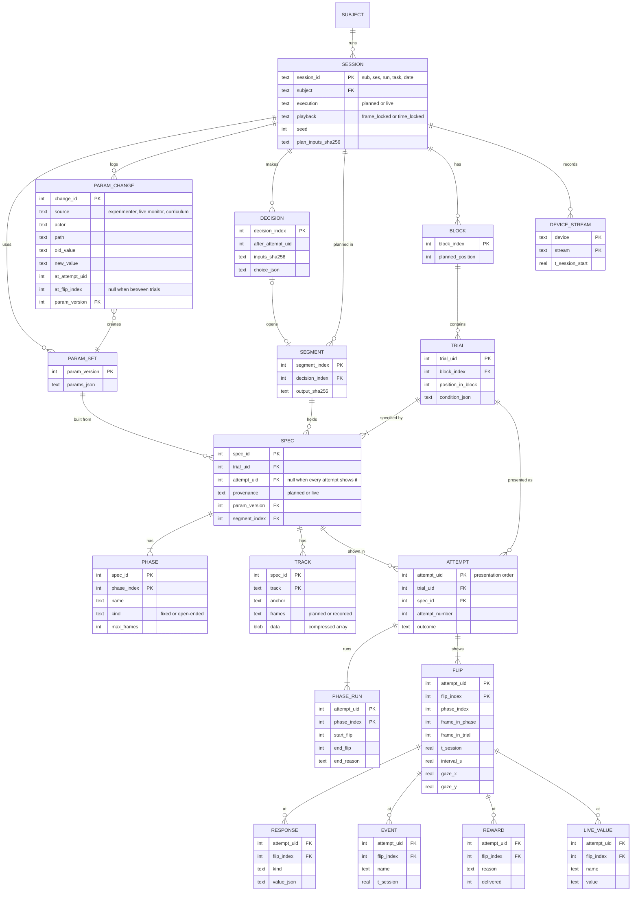
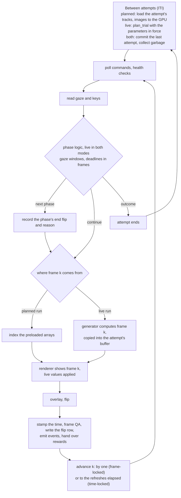
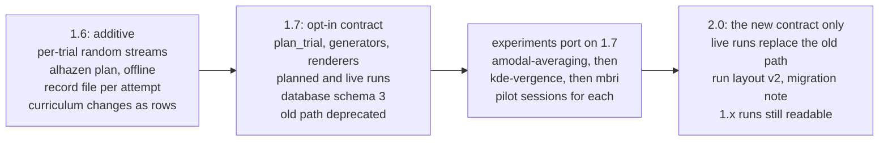

# Precomputed sessions: plan every trial and frame before it is shown

> **Status: proposal, awaiting decisions.** Written against alhazen 1.5.0.
> Nothing here is built. Section 14 lists the decisions it needs from you.
> Reading time: about 25 minutes.

## 1. Summary

Today alhazen builds each trial just before it runs and computes every frame
inside the frame loop, and nothing records what a frame showed. This proposal
makes every session a known, addressable data set, in two modes that share one
task definition and one data model. A **planned run** (data collection)
computes the whole session before it starts — block order, conditions, phase
lengths in frames, and every stimulus parameter of every frame — so the frame
loop only looks frames up. A **live run** (training, or any run the
experimenter adjusts) specifies each trial just before it runs, computes frames
on the flip as today, and records every frame and every parameter change as it
happens. Both write the same tables, keyed by session, block, trial, attempt,
phase and frame, with a column saying *planned* or *live*. The top risks: (1)
planning time for dense dot fields — one trial at mbri's densest setting takes
about a minute to compute, and that setting is 51 times too slow to run live
today; (2) a one-time migration of the stimulus contract, the Task API and the
run layout, which needs alhazen 2.0; (3) storage — modest for parameters
(15–210 MB per session), prohibitive for images, so images stay opt-in.

## 2. Terms used here

| Term | Meaning |
|---|---|
| Session | One run of one task: one `alhazen run`, one seed, one run directory (alhazen's `run-NN`; `ses-NNN` still groups runs). |
| Trial | One unit of measurement the scheduler serves — a condition. Its identity is `trial_uid`. |
| Specification | Everything needed to show a trial: its phases, their lengths, its tracks. |
| Attempt | One presentation of a trial. A recycled trial has several; their order is recorded, not planned. |
| Phase | One step of a trial. A *fixed* phase has a planned length; an *open-ended* phase ends when the subject acts, or at a deadline. |
| Frame, flip | A *frame* is one planned or computed picture; a *flip* is one screen refresh on which a frame was shown. |
| Track | One stimulus's parameters for every frame of a trial (say 90 dot positions × 1,500 frames), stored as one array. |
| Generator | The task's function that produces a track's frame *k*, directly or by stepping from frame *k* − 1. |
| Planner, player | The planner computes plans in a worker process; the player is the frame loop. |
| Segment | The part of a plan made at one moment: segment 0 before trial 1, later ones at adaptive decisions. |
| Stream | A random number generator derived from the session seed; a *spawn key* names one deterministically (NumPy's `SeedSequence`). |
| Pure function | One whose output depends only on its inputs: no clock, no global state, no hidden randomness. |
| Digest | A SHA-256 hash: a short fingerprint that changes if any byte changes. |
| ITI | Inter-trial interval: the pause between trials (0.3–0.5 s in these experiments). |
| Frame QA | alhazen's dropped-frame check and its policy: mark, recycle or abort (`display/frames.py`). |
| Mirror | The experiment database, `experiment.sqlite3`: a queryable copy of the run directories, rebuildable from them. |

## 3. What happens today, and what it costs

- **Frames are computed live, from measured time.** Each flip, `on_frame`
  calls `stimulus.update(ctx.dt)` and `draw()`, where `ctx.dt` is the measured
  duration of the previous frame (`core/engine.py`). kde-vergence and
  amodal-averaging move their stimuli by accumulated `dt`; mbri steps its dot
  engine once per frame. Phase lengths are clock comparisons; no phase has a
  frame index.
- **What a frame showed is not recorded.** kde-vergence rebuilds dot positions
  from the seed and a formula in time; amodal-averaging rebuilds its figure
  from `t − t_STIM_ON`; mbri cannot rebuild its noise field, whose seed is never
  written.
- **A trial's randomness depends on history.** All three experiments draw from
  one shared `task` stream in call order, including inside phases:
  `HoldFixation` draws its jitter only once fixation is acquired, so one failed
  fixation changes the seeds, baselines and targets of every later trial. In
  mbri the direction shuffle shares a generator with the search's random
  sampling, which the live monitor's search panel triggers after every trial — so
  turning the live monitor on or off changes later blocks' direction order.
- **Some stimuli cannot run live.** Measured for this proposal: one step of
  mbri's dot engine takes 0.9 ms at its reference setting, 17 ms mid-space and
  422 ms at its densest corner — 2 and 51 times the 8.33 ms frame at 120 Hz.
  amodal-averaging's demo re-renders its figure each frame (19–107 ms), and
  scenes rasterise a whole image per frame.
- **Data waits in memory until teardown.** `DataRecorder` and
  `FrameInputBuffer` write only at the end, so a crash loses every row.
- **Frame-indexed playback exists but is unused.** `FrameTimeline` and
  `FrameSequence` replay a frame-indexed schedule; no experiment uses them.
  This proposal generalises what they already state: "frame 3" is what
  happens; "50 ms after onset" is a wish.

## 4. Requirements

Functional:

1. Planned runs: a trial's specification and every per-frame stimulus
   parameter are on disk before any of its frames is shown.
2. A planned run with no adaptive part is planned completely before trial 1.
3. Adaptive designs are planned in segments, each from the seed and the
   responses so far, each on disk before it is shown.
4. Open-ended phases work; the flip on which each phase ended, and why, is
   recorded.
5. Every flip is logged with the frame it showed, its time and its interval.
6. Everything is addressable by (session, block, trial, attempt, phase, frame)
   and joins to gaze, responses, events, rewards and device samples.
7. A plan is reproducible from its recorded inputs; a verifier reports the
   first difference.
8. A recycled trial is the same trial presented again, with its order and
   attempt number recorded.
9. Live runs: parameters can change mid-session (experimenter or curriculum),
   and every frame shown and every change — what, who, when — is recorded.
10. A task is written once and runs in either mode.
11. Precomputed images are available per stimulus, off by default.
12. Existing runs stay readable; experiments move over in stages.

Non-functional:

| Quantity | Target | Reason |
|---|---|---|
| Stimulus math per flip, planned run | none: an index and an upload | your requirement; what makes mbri's dense fields showable |
| CPU per flip before the flip call, p99, excluding blocking device I/O | ≤ 2 ms at 120 Hz | a quarter of the frame; headroom for OS, GPU, event I/O |
| Recording a frame's parameters, live run | ≤ 5 µs per flip | invisible inside the frame |
| Writing one attempt's rows | ≤ 0.2 s, in the ITI | the ITI is 0.3–0.5 s |
| Planning before trial 1 | ≤ instructions + calibration (≥ 2 min); ≤ 60 s for kde-vergence and amodal-averaging | nobody waits |
| Planning an adaptive segment | a trial within the ITI; a block within the block break | the subject should not notice |
| Data lost to a crash | at most the attempt in progress | today: the whole session |
| Plan durable before its first frame is shown | always | "known before it is shown" |
| Plan storage per session | warn above 1 GB; refuse above a set limit | a run directory stays copyable |
| Look up one flip (stimulus, gaze, events) | ≤ 50 ms | interactive analysis |
| Reproducibility | byte-identical on the same machine and versions; within 0.001 px elsewhere | floating point varies by CPU and build |

## 5. Assumptions ledger

- Displays run at 120 Hz nominal: an 8.33 ms frame.
- Session sizes are the experiments' current configs: kde-vergence 128 trials
  of ~1,500 frames; amodal-averaging 576 trials of 350–470 frames; mbri's
  search 304 completed trials in 19 blocks of 16, ≤ ~170 dot frames each.
- Recycled attempts add ~20% to the trials presented (a guess; real logs would
  replace it).
- *Measured* timings were taken for this proposal on a laptop (Intel
  i7-10875H, 8 cores, numpy 2.5). A rig may be 2× faster or slower; no
  conclusion here changes by that factor.
- Instructions and calibration take ≥ 2 minutes for a human, longer for a
  monkey.
- The rig has an SSD, ≥ 16 GB of RAM and a GPU with ≥ 4 GB.
- Dropped frames: 5.6% on the VPixx rig's kde-vergence rehearsal (each one
  missed refresh); under 1% on a healthy rig.

## 6. Workload estimates

| | kde-vergence | amodal-averaging | mbri search |
|---|---|---|---|
| Trials per session | 128 | 576 | 304 (19 blocks × 16) |
| Frames per trial | ~1,400–1,650 | ~350–470 | ≤ ~170 with dots |
| What changes per frame | 90 dots: x, y, size | image pose; 2–3 occluders | 20–339 dots: x, y, opacity |
| Bytes per frame (float32) | 1,080 | 28–48 (pose) to ~1,200 (vertices) | 240–4,070 |
| Arrays per session | 207 MB raw; 52 MB as 1/16-px integers + zlib (*measured*) | ~15 MB (pose) to ~0.1 GB (vertices) | 12–210 MB (*measured* per trial) |
| Planning one trial, one core | ~0.1 s: 9 ms compute, 57 ms compress, 37 ms commit (*measured*) | ~0.05 s | 0.08 s / 2.9 s / ~60 s at reference / mid / densest (*measured*) |
| Planning a session or block | ~13 s per session (~2 s on 8 cores) | ~20–40 s per session (a few s on 8) | per block: 1.3 s / 46 s / 16 min (8 cores: 0.2 s / 6 s / 2 min) |
| Flips per session | ~200,000 | ~230,000 | ~150,000–230,000 |

Also measured: a flip row is ~70 bytes (~15 MB per session), and committing a
kde-vergence attempt's 1,500 flip rows takes 20 ms. Indexing one frame of a
preloaded array takes ~1 µs, against 25 µs for kde-vergence's current sin and
cos. In a live run, copying a frame's parameters into the attempt's buffer
takes 1.2–1.5 µs, and writing a kde-vergence attempt's frames takes 33–145 ms
in the ITI, depending on compression. For comparison, a 1920 × 1080 RGB image
is 6.2 MB: one kde-vergence trial as images would be 9.3 GB.

What these numbers decide:

- Everything fits on one machine and in one run directory.
- Parameters are cheap to store for every frame; images are not, except short
  or small clips (§10.9).
- For kde-vergence and amodal-averaging, removing the math saves microseconds;
  their gain is knowing and recording what was shown. For mbri and scenes, the
  math is why frames drop or cannot be shown, and precomputing is the fix.
- Recording a live run costs ~1.5 µs per flip, so live runs can be fully
  recorded. They keep today's limit: mbri's mid and dense settings cannot be
  computed in time.
- mbri's dot placement dominates planning: it makes planning a parallel worker
  process working block by block, and makes the densest corner a decision of
  its own (open question 6).
- The hard problem is neither storage nor speed. It is keeping adaptive and
  gaze-dependent trials deterministic and addressable (§10.1, §10.2).

## 7. Design overview: two modes, one contract

A task is written once, as four things:

- its **parameters model**, as today — what a live run may change;
- **`plan_trial`** — from a condition, the parameters and the trial's own
  random stream, it returns the specification: phases with lengths or
  deadlines in frames, jitter already drawn, and tracks;
- one **generator** per track — frame *k*'s parameters, by formula (the
  kde-vergence cylinder) or by stepping (rdk-generator's engine);
- one **renderer** per kind of stimulus, with `load` and `show` (§10.6).

The modes differ only in *when* `plan_trial` and the generators run:

| | Planned run (data collection) | Live run (training, adjustments) |
|---|---|---|
| `plan_trial` runs | in the planner, before trial 1 or at an adaptive decision | just before each attempt, with the parameters in force |
| Generators run | in the planner, for every frame | on each flip |
| Frames on disk | before they are shown (`planned`) | as they are shown (`recorded`) |
| Parameters may change | never within the run | between trials; a short list at once (§10.11) |

Solid arrows carry data. The dashed arrow is the feedback adaptive designs
need: the scheduler hears outcomes, never measurements (today's rule).

| Component | Role | Guarantee | Price | Not to be trusted for |
|---|---|---|---|---|
| Task code | parameters, phases, `plan_trial`, generators, renderers | one definition serves both modes | generators must be deterministic: no clock, no inputs | — |
| Planner worker | runs the planning code ahead of time | a segment is committed before any of its frames is shown; same inputs, same bytes | planning time; a second process | responses — it sees only outcomes |
| Plan file | specifications, planned tracks | append-only by segment, with digests | 15–210 MB per session | when a frame was shown |
| Scheduler | block and trial order; adaptive choices | a pure function of seed and outcomes, recorded as decisions | adaptive runs plan in segments | measurements |
| Player | the frame loop | no stimulus math in a planned run; every flip logged | preloading in the ITI | — |
| Record file | everything that happened | one commit per attempt: a crash loses at most the running one | per attempt: ~20 ms planned, 50–165 ms live (it also writes frames) | device-native data, which stays in device files |
| Experiment database | cross-session queries | rebuildable from run directories | a copy at teardown | being the record |

The run directory stays the system of record. It gains two SQLite files per
session — plan and record — beside the device recordings.

## 8. The hierarchy, and how everything is addressed

Planning runs from big to small, as you described: block order, then each
block's trials and conditions (both from the scheduler stream), then each
trial's phase lengths, jitter and targets, then each frame's parameters (both
from the trial's own stream). In a live run, a track's values are computed on
the flip and written as shown; the rest of the left box is still written
before the attempt.

Two address spaces meet at the flip:

- **Specified:** (session, trial, phase, frame in phase); for a track running
  across phases, (session, trial, track, frame in trial).
- **Shown:** (session, attempt, flip). An attempt names its trial and
  specification; a flip names the frame it showed.
- **Time:** each flip has a session time, so eye samples (1–2 kHz) and neural
  data join by time: flip *i* covers the interval up to flip *i* + 1.

So "on this trial, this frame": the flip row gives time and gaze; the track
gives what was drawn; responses, events, rewards and changes carry the flip;
device samples fall inside its interval.

## 9. Session lifecycle

- The planner starts when the session is built and works during the
  instructions and calibration. Trial 1 waits only if segment 0 is unfinished;
  the console and live monitor show progress.
- Before trial 1 the worker re-plans three trials and compares bytes. A
  mismatch means the planning code is not deterministic: the run refuses to
  start, naming the trial and track.
- An attempt writes a "started" row when it begins and the rest when it ends,
  so a crash leaves evidence of the running attempt and loses nothing older.

## 10. Decisions

### 10.1 Adaptive designs

Staircases and QUEST+ choose each value from previous responses. mbri's search
chooses θ (five stimulus parameters) per block from every response so far,
including earlier sessions (its state file), and its confirmation runs feed
that state. Curricula change parameters between trials. None of this is known
at session start.

| Option | Price | Verdict |
|---|---|---|
| A. Plan the tree of every response path | 2ⁿ paths: up to 2⁶⁰ for a 60-trial staircase | rejected |
| B. Plan each trial at every candidate value, pick at run time | N× the work and storage; impossible for a continuous θ | rejected as a default |
| C. Plan everything response-independent before trial 1, and each adaptive part when its decision is made, before it is shown | the plan is complete only up to the next decision; planning must fit the gap | **recommended** |

What keeps C deterministic and addressable:

1. **Every trial has its own random stream**, from the session seed, the
   trial's identity and a named purpose ("jitter", "dots", "target"). Trial 57's
   dots are the same whether planned at session start or an hour later,
   whatever came before. This appends one stream name to `core.rng.STREAMS`,
   which the append-only contract allows; purposes are hashed names, so adding
   one never shifts another's draws.
2. **Every decision is a row**: the attempts whose outcomes it saw, the
   scheduler's state digest, any carried-over state by hash (mbri's search
   state, a subject's training state), and its choice. Replaying the recorded
   outcomes through a fresh scheduler must reproduce every choice (§10.8).
3. **Nothing else draws from planning streams.** The live monitor, the simulated
   subject and any display-only random sampling get their own, so a panel can
   never change a trial.

Segment size follows the design: the whole session for kde-vergence and
amodal-averaging; one block for mbri's search, planned at the block boundary in
parallel (§10.7); one trial for staircases, QUEST+ and curricula, planned in
the ITI. A staircase's next value is one of two, so both can be planned during
the current trial.

### 10.2 Phases that end when the subject acts

| Kind | Examples | Planned as |
|---|---|---|
| Fixed | `HoldFixation` (jittered), kde-vergence's baseline and 8 s pursuit, feedback | an exact number of frames |
| Open-ended | `AcquireFixation` (≤ 2–5 s), `StimulusResponse` (≤ 0.5–0.6 s), `LandingSample` (≤ 0.15–0.4 s), `ResponseWindow` (≤ 3 s) | frames up to the deadline |
| Ended early | a fixation break | unchanged: unshown frames are never shown |

Recommendation:

- Every phase is planned as frames 0 to max − 1 (its length or deadline). The
  player shows the phase's frame *k* on its *k*-th flip. When the subject acts
  on frame *k* the phase ends there, and the record keeps its start flip, end
  flip and reason (planned end, subject acted, deadline, break, abort).
- A track has an **anchor**: its own phase (restarting with it), or a phase
  from which it runs on across later boundaries, indexed by frame in trial.
  Such a track is planned to the longest possible trial.
- Gaze decides **which prefix** of the plan is shown and **when** each phase
  starts — never **what** a frame contains.

kde-vergence's pursuit, concretely: today one cylinder keeps its clock through
the landing, and gaze only decides when pursuit starts (and so when the
cylinder ends, 8 s later). In the plan the cylinder is one track anchored at
stimulus onset, planned to this trial's longest possible length — its baseline
(≤ 2.8 s, drawn when planning) + saccade ≤ 0.6 s + landing ≤ 0.4 s + pursuit
8 s, at most 1,416 frames — and pursuit is a fixed 960-frame phase starting on
the landing flip. Nothing on screen changes at the landing, as today. The
landing is judged against the target's planned position on the flip it is
judged — what `live_target_px` computes today, now a lookup that is also on
disk — and the analysis's `target_phi + ω·(t_pursuit_on_stim + Δt)` becomes a
lookup too.

Content that depends on *where* or *what* the subject chose is rare here, and
gets one of two mechanisms: **branches** when the alternatives are few (≤ 8):
plan each, show one, record which; or **live values**, a short whitelist the
player may set from inputs (feedback colour, visibility, a position offset,
an adjustment knob), each recorded on its flip.

Cost: planned frames never shown. Static content is stored as one value and a
length, so long fixation deadlines are free; moving content costs its
deadline minus the typical wait — ~80 kde-vergence frames per trial (the
saccade and landing windows), ~0.09 MB.

### 10.3 Dropped frames

A dropped frame is a refresh on which the new frame was not ready, so the
previous one stayed up a refresh longer.

| Refresh | 0 | 1 | 2 | 3 | 4 | 5 |
|---|---|---|---|---|---|---|
| Frame-locked: frame shown | 0 | 1 | 1 (held) | 2 | 3 | 4 |
| Time-locked: frame shown | 0 | 1 | 1 (held) | 3 | 4 | 5 |

- **Frame-locked** shows every frame, in order; after a drop everything
  happens one refresh later. The sequence is exactly the plan, and the trial
  runs long: at the VPixx rig's 5.6%, a 1,500-frame trial runs ~84 refreshes
  (0.7 s) long, and a moving target pauses at each drop.
- **Time-locked** shows the frame due now, skipping the ones the display
  missed. Timing and average speed are exact; the frames shown are a subset of
  the plan. This is what wall-time animation does today.

Recommendation: one policy per task (`playback: frame_locked | time_locked`),
default **frame-locked**, because it shows exactly what was planned.
kde-vergence and amodal-averaging should declare **time-locked**: their stimuli
are trajectories in time, and a target that pauses at every drop changes the
pursuit gain being measured. mbri stays frame-locked, as today. Live runs
follow the same policy. Two policies in one trial are rejected: two clocks make
phase boundaries ambiguous.

Recording is the same under both: each flip names the frame shown and its
interval; a held frame's interval exceeds 1.5 refreshes; under time-locked,
the skipped frames are those no flip shows. Frame QA — mark, recycle, abort —
is unchanged and still judges the display, never the subject.

### 10.4 Recycling and attempts

The trial is the identity; each presentation is an attempt, with its place in
the presentation order, its attempt number (1, then 2 for the first retry),
and its outcome.

**Same content or new content on a retry?**

| | Same content (**recommended default**) | Fresh content per attempt |
|---|---|---|
| Meaning | identical frames: same dots, same jitter | randomness from (trial, attempt number) |
| Planning during the run | none | each retry planned before it is shown: ~0.1 s for kde-vergence, up to ~1 min for mbri's densest fields |
| Data | one specification per trial | one per attempt |
| Risk | a repeated stimulus: little of it after a fixation break; all of it after a completed trial recycled for dropped frames (< 1% on a healthy rig) | none |
| Today | a change — re-serves build new content | the same |

Recommend same content by default, with `retry_content: fresh` per task where
a repeat would be a confound. Live runs specify every attempt afresh, so their
retries are always fresh.

**Where does a retry go?** Where it goes today: to the end of its block's
remaining trials, or wherever an adaptive scheduler re-serves it (QUEST+ at
that staircase's next turn). The plan's order is never rewritten: the planned
order is on the trial rows, the order run on the attempt rows.

The `attempt` column changes meaning. Today it counts servings of a condition
key — it runs 1–4 in kde-vergence with no failures, because each block holds
four copies of every condition. The new attempt number counts presentations of
one trial; the CSV export keeps the old column (§10.10).

### 10.5 Data model

- **The run directory stays the record; the database stays a mirror**,
  rebuildable from run directories (today's rule).
- **Two files per session.** The *plan file* holds what was decided before it
  was shown: blocks, trials, decisions, specifications, planned tracks. The
  planner writes it in a planned run; the runner writes it, one specification
  per attempt, in a live run. The *record file* holds what happened, including
  a live run's frames. Two files, because SQLite has one writer at a time and a
  planned run has two processes.
- **Rows for anything up to one per flip; compressed arrays for anything per
  element per frame** (dots, vertices, pixels) and for dense device streams —
  the split `device_chunks` already makes for neural data.
- **Provenance is a column.** A specification is `planned` or `live`; a
  track's frames are `planned` (on disk before shown) or `recorded` (written as
  shown).

Every table also carries `session_id`, omitted from the diagram for space. Eye
samples and neural data stay as today — `DEVICE_STREAM` with samples or
compressed chunks — joined to flips by session time. A planned specification
belongs to its trial and every attempt shows it; a live one (or a fresh retry)
belongs to one attempt. Each specification names the parameter set it was
built from, and each change to that set is a `PARAM_CHANGE` row; today's stage
and ramp columns and `STAGE_CHANGED` event become derived from them.

Where the per-frame arrays live:

| Store | For | Against |
|---|---|---|
| One SQLite row per element per frame | pure SQL | ~17 million rows (~1 GB) per kde-vergence session; slow to write |
| **Compressed chunks in SQLite**, one per specification per track (**recommended**) | standard library only; each commit is atomic, so a crash cannot damage a written segment; the pattern `device_chunks` uses; one trial reads and decodes in ~20 ms (*measured*) | arrays opaque to SQL; readers outside Python need a small decoder (zlib; dtype and shape stored beside each chunk) |
| Parquet files (a column-oriented table format) | typed; read by pandas, R, MATLAB and DuckDB (an SQL engine that queries such files directly) | a new core dependency (pyarrow, tens of MB) for a core kept deliberately light; written whole, so one file per segment |
| NPZ (numpy's zipped arrays) | numpy only | Python-only in practice; no atomic appends; no partial reads when compressed |
| HDF5 (a hierarchical array format) | chunked; MATLAB reads it; NWB, the Neurodata Without Borders standard, is built on it | another dependency; a crash while appending can damage the whole file |

The mirror copies every table but by default references track chunks by path
and hash — 200 kde-vergence sessions would otherwise add ~10 GB to a database
meant to stay movable. Parquet or NWB exports can come later as derived data:
cheap to reverse, unlike the record format.

| Per session | kde-vergence | amodal-averaging | mbri |
|---|---|---|---|
| Plan file | ~55 MB | ~15–100 MB | ~15–210 MB |
| Record file | ~15–20 MB (plus frames, if live) | ~20 MB | ~15–20 MB |
| One flip with stimulus, gaze and events | ~20 ms (one chunk decode, then cached) | same | same |
| All flips of the session | ~0.3 s | same | same |

### 10.6 The runtime player

A renderer has two calls, the same in both modes:

- **`load`**, in the ITI: allocate, convert, upload textures.
- **`show(frame)`**, once per flip: set the elements from that frame's
  parameters and draw — from preloaded arrays in a planned run, or from the
  generator's just-computed output in a live run.

Live in both modes: gaze and keys, region checks, phase transitions, event
stamping, frame QA, feedback colour, mid-trial reward, the photodiode overlay,
commands and health checks — all cheap, none computing stimulus content.

| Per flip (8.33 ms) | Today | Planned run |
|---|---|---|
| Commands, health check, gaze, keys | ~0.2–1 ms (estimate; depends on the tracker) | same |
| Phase logic | < 0.05 ms | same |
| Stimulus math | kde-vergence 0.025 ms, amodal-averaging 0.04–0.29 ms, mbri 0.9–422 ms (*measured*); scenes: a whole image | ~0.001 ms (*measured*) |
| Upload and draw | ~0.3–1 ms for a few hundred elements (estimate); several ms for a full-screen image | same for elements; a preloaded texture is only bound |
| Bookkeeping after the flip | new Python objects each frame; garbage-collector pauses of several ms | preallocated arrays; collector off during the attempt |
| Event I/O on event flips | tracker message ~0.1–0.5 ms; kde-vergence's rig waits 2 ms per TTL pulse (a digital sync signal) | unchanged — outside this proposal, worth its own fix |

A live run costs what today costs plus ~1.5 µs per flip. Preloading is one
attempt ahead, never the session: a kde-vergence trial reads and decodes in
~20 ms (*measured*).

### 10.7 Planning cost, and when planning runs

- Planning runs in a **worker process** started when the session is built, so
  it overlaps the instructions and calibration; the frame loop never plans.
- Segment 0 is planned **in presentation order**, so block 1 is ready first.
  By default trial 1 waits for all of segment 0. A task may opt in to
  **streaming**: start once block 1 is planned.
- Trials are independent (§10.1), so they are planned **in parallel**, which
  turns a mid-space mbri block from 46 s into ~6 s.
- The worker runs below normal priority, off the frame loop's core. If frame
  QA sees drops rise while it works, it pauses during attempts and works only
  in ITIs and breaks.

With the §6 numbers: kde-vergence (~13 s) and amodal-averaging (a few seconds
on 8 cores) finish long before calibration does. mbri plans each block after
its search picks θ (~1 s, by its own design notes): 0.2 s at the reference
setting and ~6 s mid-space fit a block break; ~2 minutes at the densest corner
does not comfortably — and today those settings cannot be shown at all (open
question 6).

### 10.8 Reproducibility and verification

- **The plan is a pure function** of the seed, the validated parameters, the
  rig geometry (pixels, centimetres, viewing distance), the refresh rate used
  for frame arithmetic, the code versions (alhazen, the experiment package and
  its git commit, numpy), and each adaptive segment's decision inputs. All are
  written into the plan file, with an inputs digest and one digest per
  segment.
- **Refresh rate.** Durations are resolved today against the *measured* rate,
  so a plan would depend on a measurement. Recommend the *nominal* rate for
  frame arithmetic, checked against the measurement as today
  (`resolve_refresh`), and the measurement recorded: a plan can then be made,
  and re-made, from the configuration alone.
- **`alhazen plan verify`** re-plans a run from its stored inputs — replaying
  recorded outcomes through the scheduler for adaptive segments — and reports
  the first differing trial, track and frame. Each experiment's CI (its
  automated test runs) runs it on a fixture seed, so nondeterminism fails
  there, not in a session.
- **Live runs verify too.** A live specification is a pure function of the
  seed, the trial and the parameter set it names, so the same check recomputes
  a live trial and compares it with what was recorded — except where live
  values intervened, which the record lists.
- **Floating point** is byte-identical only on the same CPU family and builds;
  elsewhere the verifier compares within 0.001 px and reports the largest
  difference. The stored plan, not a re-run, is the record.
- **Per-flip log**: the frame shown (phase, frame in phase, frame in trial),
  time and interval. The player also stores a checksum of the arrays it loaded
  per attempt, tying what was shown to the plan's bytes.

### 10.9 Optional precomputed images

Worth it when drawing from parameters is too slow for the frame, or impossible
live: scenes, a filtered noise movie, amodal-averaging's full re-render. Not
for dots and shapes, which the GPU draws from parameters in well under a
millisecond.

| Image (RGB, 8-bit) | Per frame | One second at 120 Hz |
|---|---|---|
| 1920 × 1080 | 6.2 MB | 746 MB |
| 512 × 512 | 0.79 MB | 94 MB |
| 256 × 256 | 0.20 MB | 24 MB |

Lossless compression gains 1.5–10×. Identical frames are stored once (by
content hash), and a periodic stimulus stores one period — a drifting grating
costs its period, not its duration.

An image track is an ordinary track whose per-frame value is an image id, with
the images stored as chunks in the plan file. `load` uploads the attempt's
images as textures in the ITI; `show(k)` binds texture *k*. A 4 GB GPU holds
~500 full-HD frames (4 s at 120 Hz), which bounds an attempt, not a session.
The planner estimates the size first and refuses above a budget, naming the
stimulus. Scenes take their time from frame index ÷ rate instead of `dt`, so
they plan like everything else; amodal-averaging's pre-rendered inducer is a
one-image track. In a live run an image stimulus renders on the flip, as
today, and its parameters — not its pixels — are recorded.

### 10.10 Migration

This changes the stimulus contract (`update(dt)` and `draw()` become
generators and renderers), the Task contract (`build_trial` becomes
`plan_trial` with frame-counted phases), the meaning of `attempt` and
`trial_index`, the run layout and the database schema. `docs/versioning.md`
allows layout changes only in a MAJOR version with a migration note: this is
alhazen 2.0, reached in stages.

- **1.6** changes nothing existing. The record file is written beside today's
  CSVs, so crash safety arrives first, and `alhazen plan` lets a task be
  planned, inspected and verified offline.
- **1.7** is opt-in per task. Training keeps running as today until its task
  opts in, then runs live. `build_trial` and `update(dt)` warn from 1.7 until
  2.0 removes them, as the deprecation policy requires.
- **Porting** is checked with pilot sessions against each experiment's 1.x
  sessions: frame QA, timing, outcome rates.
- **2.0**: live runs are today's compute-each-frame behaviour, now recording
  what they show. 1.x run directories are never rewritten; readers choose by
  the manifest's layout version; the 2.0 mirror ingests 1.x runs with their
  attempts and flips and no specifications. An old database is refused as
  today and rebuilt from the run directories.

| Experiment | What it changes |
|---|---|
| amodal-averaging (first: no adaptivity, short trials) | hold and preview jitter move from `on_enter` into `plan_trial`; the figure and occluders become one pose track from STIM_ON; each distinct inducer becomes an image asset; feedback colour is a live value; the analysis looks up the pose instead of `travel·sin(2π(t − t_STIM_ON)/T)`; time-locked |
| kde-vergence | the cylinder becomes one track (x, y, size per dot) from stimulus onset; the silhouette scan and target choice stay in planning; the hold jitter leaves `on_enter` (its monkey proposal asks for this already); the landing reference and the analysis's θ become lookups; pursuit is a fixed phase started by the landing; time-locked |
| mbri (last: adaptive, expensive) | dot fields come from rdk-generator's `simulate()` at planning time, with both seeds recorded and the shown frames stated (`simulate()` records frame 0, which mbri never shows); `AdaptiveSearch` becomes a planning-side scheduler whose θ choices are decision rows citing the observations and the search state by hash; the direction shuffle gets its own stream; blocks plan in parallel; the densest corner is decided (open question 6) |

### 10.11 Live runs: training and adjustments

Monkey training changes stimulus and task parameters during a session, which a
plan made at session start cannot allow. Live runs keep that freedom and lose
none of the addressability.

| Change | Source | Takes effect |
|---|---|---|
| Stage promotion or demotion; ramp steps | the curriculum | the next trial (today's rule) |
| Any task or stimulus parameter | the experimenter, from the pause menu or the paused live monitor | the next trial |
| Promote, demote, hold | the experimenter's stage keys, as today | the next trial |
| Live values: feedback colour, visibility, a position offset, window sizes (open question 8) | the experimenter's keys, or phase logic | the next flip |

Every change is a `PARAM_CHANGE` row — source, actor, parameter path, old and
new value, the attempt and flip it took effect on, and the new parameter set —
and every specification names its parameter set. "Which parameters did trial
57 run with, and who set them" is one join. The parameters in force are
rebuilt from the change log each trial, so a change that was not recorded
cannot take effect.

**Cost.** Computing frames costs what it costs today. Recording them costs
~1.5 µs per flip plus 50–165 ms per kde-vergence attempt in the ITI
(*measured*; less for smaller stimuli), and the storage of a planned run of
the same trials. Live runs keep today's limits: mbri's mid and dense settings
are still too slow.

**Declaring the mode.** The mode belongs to the run and is written into the
snapshot, the session row and the log's first lines. The most specific
declaration wins:

| Where | Declares | Default |
|---|---|---|
| Command line | `--execution`, for rehearsals and debugging | none |
| Curriculum stage | `execution:` per stage | live for training stages |
| Task parameters | `execution: planned` or `live` | planned |

The rig configuration does not declare it: the mode is about the protocol, not
the hardware.

**Switching.** Recommend one mode per run, with automatic handover at a run
boundary:

- **A planned run never changes parameters.** Asking to change one — or a
  planner failure mid-run — offers "continue live": the planned run ends at the
  trial boundary (complete up to there) and the next run starts live at once,
  with the same subject and session, the next run number, and the change
  applied and recorded. The subject sees a rest screen.
- **Promotion into a planned stage ends the live run and starts a planned
  run.** The planner works during the rest screen (kde-vergence: ~13 s).
- **In a planned run the curriculum only observes**: its criteria are
  evaluated and reported, and acted on at the next run.

Every run then stays one kind of data set. Switching inside a run is open
question 7.

**Training to data collection.** The curriculum's final stage is the data task
itself: it overrides nothing, like the `real-task` stage of the shaping
example, and declares `execution: planned`. Promotion into it makes the next
run a planned run with exactly the data task's parameters, and its snapshot
says so.

## 11. Failure analysis

| Failure | Detected by | Blast radius | Mitigation |
|---|---|---|---|
| Planning slower than calibration | worker progress against its estimate | the subject waits before trial 1 | progress shown; parallel workers; streaming opt-in; the estimate is known from `alhazen plan` beforehand |
| Planning code raises | the worker's exception, re-raised on the session thread | segment 0: no start; later: a pause | the error names trial, track and phase; `alhazen plan` in CI catches most; "continue live" |
| Planning code not deterministic | the start-of-run re-plan of three trials | reproducibility | refuse to start, naming the first difference |
| Adaptive segment late | the runner reaches an uncommitted trial | the ITI stretches | wait with the fixation point up to a limit (say 30 s), then pause with the reason |
| Disk full | free-space check at build (plan plus expected recordings, twice over); write errors | the run cannot be recorded | refuse at build; a failed record write pauses the run — a trial that cannot be recorded is never run |
| Crash or power cut | an attempt started and never ended | at most that attempt | every commit forced to disk (`fsync`); SQLite recovers committed rows; the next run is a new run, as today |
| A device fails mid-run (tracker, neural recorder) | the per-flip health check; TTL alignment afterwards | the attempt (ABORTED, re-served); a stretch of neural data | unchanged; plan and flips stay complete, so the gap is exactly identified |
| Experimenter skips, pauses or quits | commands | the attempt in progress | recorded as ABORTED or PAUSED; unpresented trials stay in the plan, visibly unpresented |
| Frames drop beyond budget | frame QA | the attempt (recycled) or run (aborted) | unchanged; the flip log shows every held frame |
| Plan made by other code, or for another refresh rate | code digest and rate in the plan; `resolve_refresh` | wrong content or timing | the player refuses the plan |
| Preloading exhausts memory | the planner's per-attempt size estimate | drops or a crash | one attempt ahead only; the image budget |
| Planner steals CPU from the frame loop | drop rate while it works | dropped frames | low priority, separate core; pause it during attempts |
| SQLite leaves its write-ahead log (`-wal`, `-shm` files) in the run directory | manifest verification | the manifest fails | checkpoint and close both files before the manifest is written |

| Situation | Mode | What the subject notices |
|---|---|---|
| Normal | segment 0 ready before trial 1; segments planned in ITIs and breaks | nothing |
| Planning 2× slower than calibration | wait before trial 1, or stream if allowed | a longer wait before trial 1 |
| Planning 10× slower (mbri's densest corner) | block by block on all cores | long breaks |
| Adaptive segment late | the ITI stretches, then a pause | a longer blank, then a pause |
| Planner fails mid-run | "continue live" at the trial boundary | a rest screen |
| Record file cannot be written | pause; the experimenter decides | the session stops |

Never dropped: a trial's plan before it is shown, the flip log, a committed
attempt, a parameter change.

## 12. Evolution

| Load ×10 | What breaks first | Path |
|---|---|---|
| Elements per frame (900 dots) | plan size (~0.5 GB per kde-vergence session); decoding (~0.2 s, still within the ITI) | quantise further; or store the generating values (each dot's phase and height) and run the generator at `load` |
| Refresh rate (240–360 Hz, 3×) | the frame falls to 2.8–4.2 ms | planned runs already do no math; move blocking device I/O (the 2 ms TTL wait) off the frame loop |
| Trials per session | planning time (kde-vergence ~2 min on one core) | parallel workers; streaming |
| Sessions per study (2,000) | the mirror's flip table (~400 million rows) | partition the mirror by subject, or export flips to Parquet for DuckDB — derived, so reversible |
| Image tracks | storage and GPU memory | deduplication, periodic reuse, the budget refusal |

Cheap to reverse: the mirror's schema, the chunk codec (zlib today; zstd, in
Python's standard library from 3.14, once alhazen requires that version),
exports, the player's internals.
Expensive, and where review time is best spent: what a run records. A plan
input, decision input, change field or flip column missing from the first
runs is missing from them for ever, so these are fixed before 1.7 ships.

## 13. Rejected alternatives

- **Pre-rendered images for every stimulus**: 6.2 MB a frame; 9.3 GB for one
  kde-vergence trial.
- **Enumerating response paths, or planning every candidate value**:
  exponential, or N× the work and impossible for a continuous θ.
- **Live runs only, recording what was shown**: it answers "what was shown"
  afterwards, but nothing is known before a trial, the math stays in the loop
  (mbri's mid and dense fields still cannot be shown), and nothing can be
  checked before a subject sits down. It survives as the live mode.
- **Two task definitions, one per mode**: they would drift apart; the
  generator contract serves both from one.
- **Keeping `update(dt)` beside the new contract**: content that depends on
  measured frame times can be neither planned nor recorded the same way.
- **One row per element per frame; Parquet, NPZ or HDF5 as the record**: see
  §10.5.
- **Planner and runner writing one SQLite file**: two processes contending for
  one writer lock.
- **Time-locked playback as the global default**: every task's frames would
  diverge from its plan on every drop.

## 14. Open questions for the user

1. **Retry content.** (A) a retry shows the same frames; (B) fresh content per
   attempt; (C) per task, defaulting to A. *Recommendation: C* — no planning
   during the run, simpler joins; B only where a repeat is a confound.
2. **Playback policy.** (A) frame-locked by default, time-locked per task; (B)
   time-locked by default; (C) frame-locked for everything. *Recommendation:
   A*, with kde-vergence and amodal-averaging declaring time-locked.
3. **Refresh rate for frame arithmetic.** (A) nominal, checked against the
   measurement; (B) measured, as today. *Recommendation: A* — plans become
   reproducible from the configuration alone, and the two rates differ by
   hundredths of a percent.
4. **Where per-frame arrays live.** (A) compressed chunks in the run's SQLite
   files; (B) Parquet files, adding pyarrow to the core; (C) A now, a Parquet
   export later. *Recommendation: C.*
5. **Plan complete before trial 1?** (A) always, for non-adaptive designs; (B)
   streaming by default; (C) required by default, streaming per task.
   *Recommendation: C.*
6. **mbri's densest settings** (51× the frame budget live; ~2 min per block to
   plan on eight cores). (A) cap the search space where high density meets
   short lifetimes; (B) speed up rdk-generator's placement first; (C) accept
   long breaks there. *Recommendation: A now, B as its own project* — the cap
   is needed today anyway, since those trials cannot be shown correctly live.
7. **Switching modes.** (A) one mode per run, automatic handover at a run
   boundary; (B) switching inside a run, provenance per segment; (C) no
   switching — the experimenter starts a new run by hand. *Recommendation: A*
   — every run stays one kind of data set, and the subject only sees a rest
   screen.
8. **What may change mid-trial.** (A) nothing — everything waits for the next
   trial; (B) the live values of §10.2 (feedback colour, visibility, a
   position offset); (C) B plus window sizes, for trainers who widen a
   fixation window while the animal fixates. *Recommendation: C in live runs,
   B in planned runs*, each change recorded on its flip.
9. **The 1.x CSV files in 2.x.** (A) keep `trials.csv`, `events.csv` and
   `frames.csv` as exports with their 1.x meanings; (B) drop them in 2.0.
   *Recommendation: A* for all of 2.x — analysis scripts read them.
