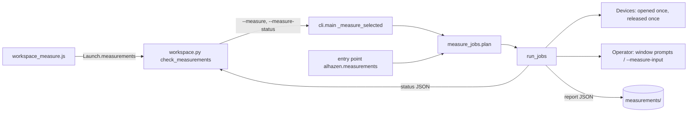

# Design: selectable rig measurements, quiet startup timing, the calibration request

Status: implemented on `feature/neuro-oct7-rig-measure-090424` (local, not
released). Owner request 2026-10-07.

## 1. Summary

Measure rig becomes a queue of selectable measurement jobs (a small registry,
a sequential runner, one report), the dashboard's Task parameters box becomes a
checklist for that mode, the PsychoPy frame-rate banner goes while the one
measured rate that frame math uses stays, and a real eye tracker is asked to
calibrate before trial 1 instead of silently running on a held model. Top
risks: a job reporting a number it did not measure; hardware actuated without
an operator's decision (reward); a session starting on a stale calibration.

## 2. Requirements (examples)

- When `--measure tracker.accuracy` is given without `tracker.calibration`, the
  plan is refused naming the prerequisite; with both, calibration runs first
  whatever the order they were ticked.
- If the rig has no reward device, `reward.volume` is *unavailable* and no
  device is opened; the report's `ok` is false.
- If the operator presses N at the arming prompt, no pulse is sent and the job
  is *cancelled*; if `deliver` raises, the job is *failed* with
  `delivered: "uncertain"` and nothing is retried.
- When the dashboard's Stop run interrupts a run, the running job and every
  queued one become *cancelled*, devices are released, finished results stay
  in the report.
- A TRACKPixx3 holding yesterday's calibration still gets the request before
  trial 1; ENTER calibrates; R is offered only for a compatible, recorded,
  same-subject calibration.
- A session measures its refresh rate once, quietly; a wrong rate is still a
  loud error.

Change scenarios: adding a measurement is one `MeasurementJob` in a package and
an entry point, no alhazen change; a new dashboard shell mounts
`workspace_measure.js` without touching the runner.

## 3. Assumptions

- Operator-entered readings are what instruments showed; ranges refuse
  implausible values but cannot detect a plausible typo.
- Reward plan limits: ≤ 500 pulses, ≤ 1000 ms each, ≤ 60 s valve-open total.
- Neural listening window 0.5–10 s (default 2 s); noise block 0.5 s, ≤ 16 AP channels.
- The calibration ledger is per rig (`monitor.name`) under the unversioned data root.

## 4. Change map

| Touched | Callers / contract | Decision |
|---|---|---|
| `modes/measure_jobs.py` (new), `measure_builtin.py`, `measure_stats.py` | CLI `_measure_selected`, workspace probe | additive; legacy `run_measurements` untouched |
| `modes/measure.py` | `measure_display` detail gains `intervals_s` | additive report field |
| `config/gamma.py` | `fit_gamma`, `read_measurements` moved from `cli/calibrate.py`, re-exported | structure only |
| `cli/main.py` | new flags; `--skip/--presses` refused with `--measure` | additive |
| `cli/workspace.py`, `dashboard.py` | probe `measurements`, `Launch.measurements`, run detail `measurement` | additive; old projects keep the fixed list |
| assets `workspace_measure.{js,css}`, shell mount in `workspace.{html,js}` | `window.MeasureChoice` | module + separate thin mount |
| `display/psychopy_backend.py` | `open`, `measure_refresh_rate` | behaviour: no banner, same guard |
| `session/startup_calibration.py`, builder, runner, `EyeTrackerMonitor.on_calibrated`, `CALIBRATION_CHOICE` | session start | behaviour change for real trackers, documented |
| `devices/spikes.py`, `session/checks.py` | public `parse_stream`, `spikeglx_connection`, `check_spikes` | additive |

## 5. Design

| Module | Secret it hides | Interface | Price | Not to rely on |
|---|---|---|---|---|
| `measure_jobs` | order, device lifetime, state honesty, report/status format | `MeasurementJob`, `plan`, `run_jobs`, `JobContext.number/confirm/keep_tracker_recording` | one more concept (job) | job execution order beyond `order`; device objects outliving the run |
| `measure_builtin` | how each claim is measured on hardware | `builtin_jobs()`, `rig_devices()`, `WindowOperator` | thin wrappers, hardware-only paths tested with stand-ins | DPI, µV, colour, end-to-end latency |
| `measure_stats` | the arithmetic | pure functions | — | — |
| `startup_calibration` | when to ask, what counts as reusable | `asks_for_calibration`, `StartupCalibration.request`, `CalibrationLedger` | a prompt at every real session start | reuse without a matching record |
| `workspace_measure.js` | checklist rules mirrored for the page | `MeasureChoice.*` | duplicates server rules (server is the authority) | any DOM outside its container |

## 6. Failure analysis

| Boundary | Failure | Handling |
|---|---|---|
| job → device | device missing/unsupported | unavailable before opening, or `JobUnavailable` at run |
| job → operator | ESC / N | `OperatorCancelled`: this job cancelled, run continues |
| job → reward | timeout / driver error mid-train | failed, `delivered: uncertain`, no retry; container must be emptied |
| run ← Ctrl-C / Stop | interrupt | current + queued cancelled; `Devices.close` releases in reverse, each attempted; report saved by `on_finish` |
| job → hardware exception | anything else | error state with message; later jobs still run |
| prerequisite produced nothing | — | blocked, never measured on the old model |
| report file exists | same-second run | `-N` suffix, exclusive create |
| server ← page | forged/empty/unknown selection, missing subject | refused before a run record (check_measurements, measurement_subject) |
| two launches | concurrent rig use | existing one-run lock in `Workspace.start` |
| startup calibration | aborted / failed / unknown outcome | back to the request; only explicit A accepts unknown; reuse re-read |
| ledger write | OSError | logged; calibration stands; later reuse not offered |
| refresh | unstable / wrong | `DisplayError` / `resolve_refresh` `ConfigError`, unchanged |

## 7. Tests

`tests/unit/test_measure_jobs.py` (registry, plan, runner states, stop/cleanup,
status/report, statistics with known inputs, every built-in job with
instrument stand-ins, operator keys, CLI), `test_workspace_measurements.py`
(probe, server checks, command, status, asset), `tests/js/workspace_measure.test.mjs`,
`test_startup_refresh.py`, `test_startup_calibration.py` (EyeLink and TRACKPixx3
via the SDK fakes), plus the existing suites unchanged.

## 8. Evolution

- Report schema 2 keeps every schema-1 field; readers of the old file keep working.
- CLI: `--measure` is additive; without it nothing changes.
- Workspace: a project whose alhazen predates the catalog keeps the fixed list;
  re-registering picks the catalog up.
- Startup calibration is a behaviour change for real trackers (one prompt per
  session). Reversible by removing the builder wiring; no data format changes
  besides the new reserved `CALIBRATION_CHOICE` event and the ledger file.
- Debt: the page mirrors the server's selection rules (tested on both sides);
  device-rate precision and EyeLink ASC conversion depend on vendor tools.

## 9. Rejected alternatives

- Running every measurement when none is selected: hides what was asked.
- A single "key latency" number: mixes person, panel and software.
- Applying a gamma fit automatically: an explicit `calibrate gamma` keeps provenance and rollback.
- Importing kde-vergence from alhazen: entry points keep the dependency one-way.
- Rendering the bead on the monitor: the check exists to change real depth.
