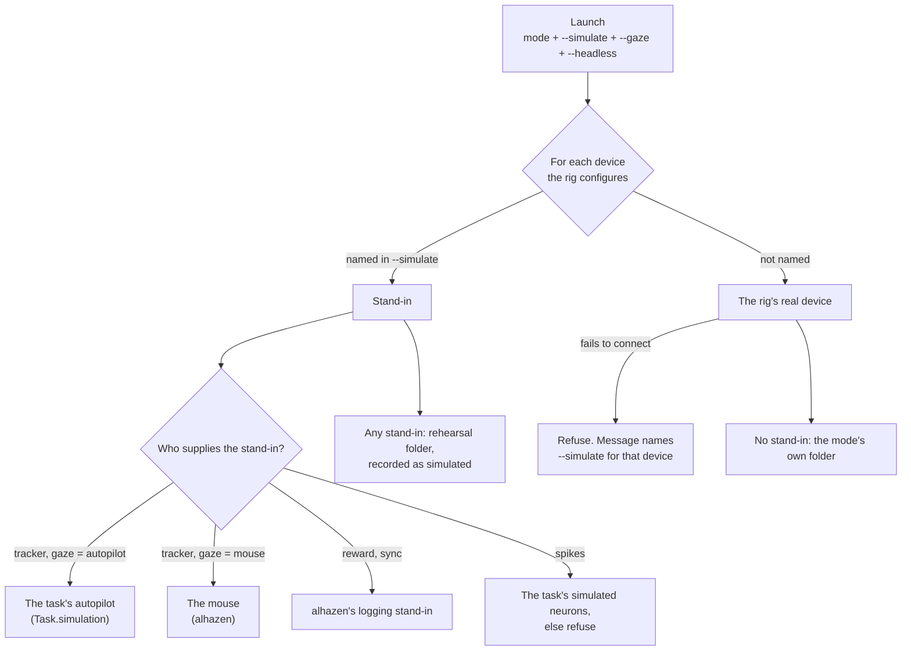

# Simulation as a choice, not a mode

*A proposal. Nothing here is built yet. It replaces `--mode simulate` with a
choice, made at launch, of which devices to stand in for; every session,
training stage and rig measurement supplies its own stand-ins.*

## 1. Summary

Today "simulate" is one of seven modes. It decides three things at once: no
device acts on a subject, the task's autopilot plays the subject, and the data
goes to the rehearsal folder. That bundle is why a training stage can only be
rehearsed headless from the workspace, and why a rig measurement on a laptop
says "unavailable" where a simulated one would at least show what the task is.

The proposal separates the three:

- **What is simulated** is chosen per launch, device by device.
- **Who plays the subject** is chosen per launch, when the eye tracker is one
  of the simulated devices: the task's autopilot, or the mouse.
- **Where the data goes** follows from the first: a launch with any stand-in
  is a rehearsal.

The top three risks: stand-in data read as real data; a breaking change to a
command both experiments and the workspace use; and measurements that look
measured when they were simulated.

## 2. Requirements

Terms: a **stand-in** is a simulated replacement for one device. A
**rehearsal** is a launch with one or more stand-ins.

Behaviour, as examples:

1. `run.py --mode test --simulate tracker --gaze mouse` runs the test session
   with the mouse as gaze and every other device as the rig file says.
2. `run.py --mode training --stage fixate --simulate all --gaze autopilot`
   opens a window and shows the stage being worked by the task's autopilot.
   Adding `--headless` runs the same thing with no window.
3. `run.py --mode run` on a rig whose tracker does not connect refuses before
   anything is written, and its message names `--simulate tracker`. Nothing
   is ever simulated because a connection failed.
4. `run.py --mode run --simulate reward` runs, files the data under the
   rehearsal folder, and records `simulated: [reward]`.
5. `--simulate tracker` without `--gaze` is refused: the choice is asked
   for, not guessed. The workspace asks it in the launch form.
6. `--gaze autopilot` on a task with no autopilot is refused before the
   window opens, naming the task (as simulate mode does today).
7. `--mode measure --simulate all` runs every measurement that has a
   simulated version, marks each result *simulated*, and stores no
   calibration.
8. `--mode simulate` is refused with the command that replaces it.

Change scenarios the design has to keep local:

- Adding a new device kind adds one name to the list of things that can be
  simulated and one default stand-in. No mode changes.
- A task adding an autopilot changes that task only.
- A new measurement adds its own simulated version beside its real one.

## 3. The design

### What can be simulated

| Name | Stand-in | Supplied by |
| --- | --- | --- |
| `tracker` | autopilot gaze, or the mouse (`--gaze`) | the task (autopilot); alhazen (mouse) |
| `response` | follows the tracker: the autopilot answers, or the person does | the task |
| `reward` | deliveries logged, no valve opened | alhazen |
| `sync` | pulses logged, no line driven | alhazen |
| `spikes` | simulated neurons | the task; refused if it has none |
| `all` | every device the rig configures | |

The display is not in this list. `--headless` stays a separate flag and is
allowed only with `--gaze autopilot`, because a person needs a window.

### Rules

1. **Nothing is simulated unless asked.** A device that fails to connect is a
   refusal in every mode.
2. **Any stand-in makes the launch a rehearsal.** Its data goes to the
   rehearsal folder (`<data_root>-rehearsal`, or the training folder's
   rehearsal sibling), the development-rig refusal does not apply, and the
   list of stand-ins is written into `session.json` and the snapshot.
3. **The mode keeps its meaning.** `run` is the full session, `test` the
   short one, `training` one stage. Simulation no longer changes trial counts.
4. **A stand-in never calibrates.** A simulated measurement is reported as
   simulated and writes no gamma file, no reward calibration, nothing a real
   session later reads.

### Each task supplies its own

- **Sessions and training stages** keep the hook they have,
  `Task.simulation(seed)`. It already returns stand-ins for the tracker,
  the response device, the spikes and (when the autopilot must know the
  answer) the task itself. What changes is who asks: any mode, for the parts
  named in `--simulate`, instead of simulate mode for all of them.
- **Rig measurements** gain the same idea per job. A job declares a simulated
  version: the same procedure run on a stand-in instrument (a model panel
  with a known gamma for luminance, scripted drags for the mouse, simulated
  gaze for tracker accuracy). A job with none stays *unavailable* and says so.

| Module | Hides | Callers learn | Price |
| --- | --- | --- | --- |
| `modes/simulation.py` (extended) | which stand-in each device gets, and who supplies it | `--simulate`, `--gaze` | one more thing to pass through session building |
| `MeasurementJob.simulated` | how a measurement behaves with no instrument | a job's result may say *simulated* | each job writes a second, small procedure |

### The workspace

One **Simulate** panel in the launch form replaces the Simulate entry in the
Mode menu and the Headless, Mouse and "Rehearse this stage" ticks:

- a tick per device the rig configures, and "all";
- when the tracker is ticked: *autopilot* or *mouse*, with no default;
- when autopilot is chosen: *no window*, off by default, so a training stage
  is watched unless you ask otherwise.

## 4. Failure analysis

| What could go wrong | How it is prevented |
| --- | --- |
| Stand-in data analysed as real | rehearsal folder, plus the stand-in list in `session.json`; a test holds both |
| A real session quietly simulated | rule 1: no stand-in without the flag; a failed connection refuses |
| `--simulate` naming a device the rig does not have | refused by name, before anything opens |
| A simulated measurement saved as a calibration | rule 4, enforced where calibrations are written |
| A person asked to sit a headless session | `--headless` refused unless gaze is the autopilot |

## 5. Evolution

This removes a mode, so it is breaking and follows the deprecation policy
(docs/versioning.md §4): one release that adds the new and warns on the old,
then the removal.

| Step | Release | What |
| --- | --- | --- |
| 1 | 2.15 | `--simulate` and `--gaze` on run, test and training; stand-ins recorded |
| 2 | 2.15 | simulated versions of the rig measurements |
| 3 | 2.15 | the workspace's Simulate panel |
| 4 | 2.15 | `--mode simulate`, `--mouse` and the rehearse tick still work, with a deprecation warning that names the replacement |
| 5 | — | kde-vergence and amodal-averaging move their commands, docs and tests |
| 6 | 3.0 | `--mode simulate` and `--mouse` removed |

Old commands and their replacements:

| Before | After |
| --- | --- |
| `--mode simulate` | `--mode test --simulate all --gaze autopilot` (simulate already runs the reduced session that test runs) |
| `--mode simulate --headless` | the same, with `--headless` |
| `--mode test --mouse` | `--mode test --simulate tracker --gaze mouse` |
| workspace: Training, "Rehearse this stage" | Training, Simulate: all, autopilot |

Runs already recorded with mode `simulate` stay readable: the name remains
known to the readers after the mode can no longer be started.

## 6. Open questions

1. **`run` with a stand-in.** This proposal allows it, as a rehearsal
   (example 4). The alternative is to refuse `--simulate` in `run` entirely
   and keep real-data mode strictly real. Which?
2. **One release or two?** Steps 1 to 4 can ship together as 2.15, or the
   measurements (step 2) can follow in 2.16.
