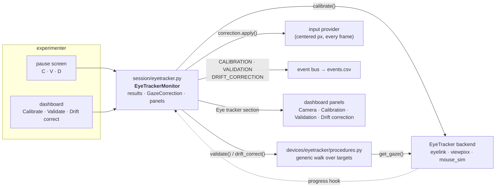

# Calibrating, validating and drift-correcting the eye tracker

A calibration fits the tracker's gaze model. It says nothing about how good
the fit is, and it does not survive a headrest settling or a camera being
nudged. This page is about the three procedures a session runs on a tracker,
who drives them, where their results go, and what the subject and the
experimenter see while they run.

| Procedure | What it does | How long | Key while paused | Dashboard button |
|---|---|---|---|---|
| **Calibration** | fits the gaze model over a target grid | minutes | `C` | Calibrate |
| **Validation** | shows the same targets again and measures the error at each, in degrees | ~1 s per target | `V` | Validate |
| **Drift correction** | one target at the centre; the measured offset is applied to every gaze position from then on | ~1 s | `D` | Drift correct |

All three run **between trials, from the pause screen**, on the session's
clock, and each one goes on the record as an event (`CALIBRATION`,
`VALIDATION`, `DRIFT_CORRECTION`, all reserved names) whose payload carries
the outcome — so an analysis can tell which trials sit between which
calibration and how good it was.

## Who does what



- **The backend owns the calibration**, because the two real trackers
  calibrate differently: the EyeLink's Host PC drives its own procedure and
  alhazen mirrors it into the subject window; the TRACKPixx3 has no Host PC,
  so alhazen walks the targets itself (`viewpixx.py`). Both return a
  `CalibrationResult` — `ok`, layout, target count, which eye, advance mode,
  a note in the device's own words.
- **Validation and drift correction are generic** (`procedures.py`). They use
  the `EyeTracker` protocol's `get_gaze()`, the display, the screen and a key
  source, nothing else — so they run identically on an EyeLink, a TRACKPixx3,
  the mouse and a scripted replay, and are tested on the last of those.
- **The monitor** (`session/eyetracker.py`) is the session's one view of all
  of it: it runs the procedures, keeps the latest result of each, owns the
  `GazeCorrection` the input provider applies, publishes progress to the
  dashboard while a procedure runs, emits the events, and produces the
  dashboard's *Eye tracker* section.

## The calibration guide

Before the first target appears, the subject display shows a guide — the
same terminal-green panel every instruction screen uses (see
[Instruction screens](#instruction-screens)) — so nobody is guessing whether
to press something:

```
CALIBRATION

tracker   TRACKPixx3
eye       LEFT eye read by the session; both eyes are calibrated
targets   HV5 — 5 targets over 60% of the screen, centre first
advance   MANUAL — press SPACE when the subject is fixating each target

keys
SPACE       accept this target (refused while no eye is in the image)
BACKSPACE   go back one target
ESC         abort — the previous calibration is kept

eyes: both tracked

press SPACE to start, ESC to abort
```

The lines are facts from the rig config and the device, composed by each
backend from `devices/eyetracker/guide.py`:

- **eye** — the TRACKPixx3 fits both eyes and the session reads
  `eyetracker.eye`; the EyeLink's eye is set on its Host PC and the session
  reads whichever the tracker reports. The guide says which case this is.
- **targets** — the layout (`calibration_type`) and how many targets it
  stands for, over what fraction of the screen (`calibration_area`), centre
  first.
- **advance** — `eyetracker.calibration_advance`: `manual` (the default; the
  experimenter presses SPACE for each target) or `auto` (the tracker accepts
  a target once the subject holds it — the EyeLink's own automatic
  calibration, alhazen's walk for the TRACKPixx3). Manual is the default
  because a target accepted while the subject looked elsewhere fits the
  model to the wrong point and every sample in the session inherits it.
- **eyes: …** — the live line, redrawn ten times a second on the TRACKPixx3:
  *both tracked*, *left only*, *right only*, or *NO EYE IN THE CAMERA
  IMAGE — check position, focus and LED (accept is refused)*. The EyeLink's
  camera is on its Host PC's own screen, so its guide has no live line.

During the TRACKPixx3 walk the same eye line stays under the target, and
SPACE is refused while no eye is in the image — a target accepted blind is
the one mistake a calibration cannot recover from.

## Validation and drift correction

Both walk targets the same way: the target appears, the first `settle_s`
(0.5 s) are ignored as the saccade to it, then a `sample_s` (0.3 s) window
of gaze is averaged into the measurement. The window is chosen by the
advance mode:

- **manual** — SPACE when the subject is on the target; the window is the
  0.3 s that follow. A blink inside it is dropped, not failed.
- **auto** — the newest 0.3 s of gaze is watched; the first window in which
  every sample is within `stable_deg` (1°) of its mean is taken. A target
  with no stable fixation in `timeout_s` (10 s) is recorded as **missed** —
  a fact about the subject, reported as such, never a guess.

SPACE accepts in either mode, BACKSPACE steps back a target, ESC abandons the
procedure: the same three keys as the calibration walk, so the experimenter
learns one set. On a simulated display (`--mode simulate`, tests) the walk
advances automatically.

**Validation** shows the calibration's own targets (centre first). It
*passes* when the **worst** target error is at most `accuracy_max_deg`
(1.0° by default) and no target was missed — the worst, not the mean,
because one corner the model gets wrong is one region of the screen the
whole session gets wrong. It runs by itself after every calibration that was
not aborted and that the tracker did not itself call bad — there is nothing
to measure against a calibration that did not take — unless
`validate_after_calibration: false`.

**Drift correction** shows one target at the centre and measures the offset
between it and the reported gaze. If the offset is within `drift_max_deg`
(3.0°) it is *applied*: the `GazeCorrection` shifts by it, and the input
provider subtracts it from every gaze position from the next frame on —
inside phases, fixation windows, gaze contingency, everything. Corrections
accumulate across the session and reset when a calibration reports
success. An offset past the limit is **refused**: that is a calibration that
no longer applies, and shifting the whole gaze model by it would only hide
that.

The measured frame is the one the trial logic sees: gaze is converted from
screen px to centered px and corrected exactly as `make_input_provider`
does, so a validation error of 0.5° is the error a fixation window will
experience.

## From the pause screen and the dashboard

Press **P** on the experimenter keyboard, and the pause screen lists what
this session can do — with a tracker wired, `C` recalibrate, `V` validate
and `D` drift-correct, in that order. Each one runs, redraws the menu when
it is done (the session stays paused), and logs its summary:

```
validation passed: mean 0.41°, worst 0.62° (limit 1°)
drift correction applied: offset 0.48° (limit 3°)
```

With the dashboard on, the same three are buttons, live only while the
session is paused. While a procedure runs the dashboard's status turns to
**calibrating**, the buttons go inert, and the notice follows the walk —
`calibrating: target 2 of 5 · eyes: both tracked`, `validating: target 4 of
5` — published at most twice a second so the walk never waits on the
browser. When it ends, the notice shows the result line and the panels
update.

The **Eye tracker** section of the panels holds:

- **Camera** (TRACKPixx3 only) — the eye image the tracker sees, read while
  the session is paused or calibrating and refreshed about once a second
  through a pause, with the *eyes:* status beside it. The EyeLink's camera
  is on its Host PC. `eyetracker.camera_image: false` turns it off, and the
  panel says so rather than showing nothing. The copy saved to `figures/`
  at teardown leaves the pixels out: a photograph of the subject does not
  belong in the run directory.
- **Calibration** — the verdict (calibrated / NOT calibrated / aborted, or
  *result unknown* when the tracker reported nothing either way — an EyeLink
  Host PC that never ran one, or the scripted tracker in tests), layout,
  target count, advance mode, eye, time, and the backend's note.
- **Validation** — targets and measured gaze positions on a degree grid at
  equal aspect, with mean and worst error, misses, and the verdict; the
  per-target errors under the plot.
- **Drift correction** — the offset applied or refused, the total correction
  now in force, and the limit.

## Configuration

```yaml
devices:
  eyetracker:
    backend: viewpixx
    eye: left
    calibration_type: HV5          # H3 · HV3 · HV5 · HV9 · HV13 (EyeLink); HV5 · HV9 · HV13 (TRACKPixx3)
    calibration_area: 0.6          # fraction of the screen the grid spans
    calibration_advance: manual    # or auto
    validate_after_calibration: true
    accuracy_max_deg: 1.0          # worst target error a validation may have
    drift_max_deg: 3.0             # largest offset a drift correction will apply
    camera_image: true             # TRACKPixx3 only: the dashboard's camera panel
```

Every field is checked when the rig loads: a layout the EyeLink does not
accept, a limit of zero, or a TRACKPixx3-only field on an EyeLink rig fails
there — not on the Host PC's screen in another room with the subject already
seated.

## Instruction screens

Every message the session puts on the subject display — the instructions
before the first trial, `stage: 2` on a curriculum change, the calibration
guide — is drawn the same way: monospace text in pale green on a near-black
panel with a green outline, sized to what it says. It looks like a terminal
on purpose, and the three panel colours alone say what kind of screen is up:

| Colour | Screen |
|---|---|
| green (`display.palette.TERMINAL_GREEN`) | a message: instructions, the calibration guide, stage changes — and the one-line notices too, `REWARD FAILURE — check the pump` or `Calibration FAILED` included, since a message box is a message box whatever it says |
| orange (`session.pause.PAUSE_COLOR`) | the pause menu |
| red (`session.pause.FAULT_COLOR`) | the pause menu when nobody asked for the pause — the one a reward failure opens |

A simulated display records every panel it is asked to draw — the message
box in `FakeDisplay.messages` (the text), the pause menu in
`FakeDisplay.menus` as `(title, body)` — which is how the tests assert what a
subject would have seen.
