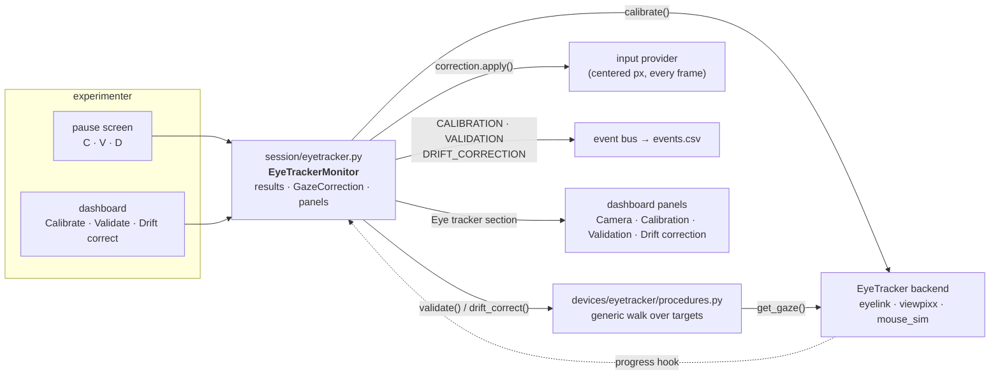
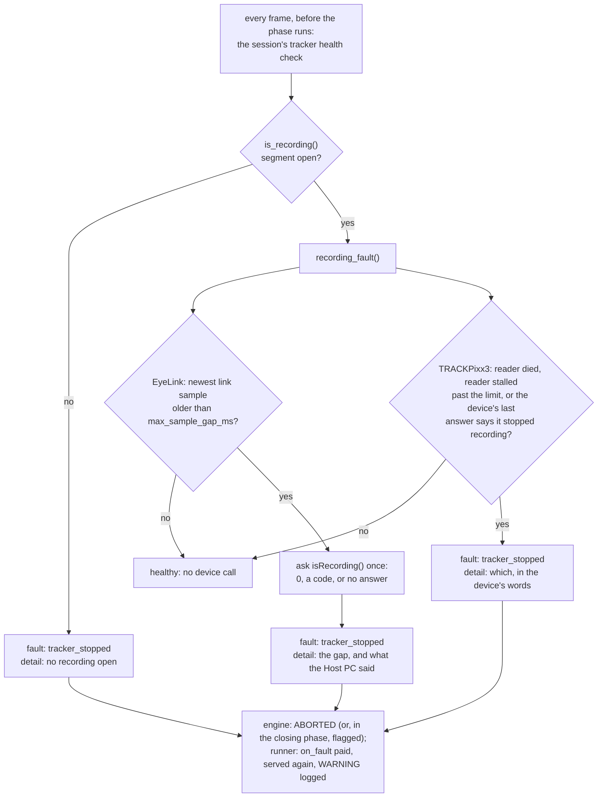

# Calibrating, validating and drift-correcting the eye tracker

A calibration fits the tracker's gaze model. It says nothing about how good
the fit is, and it does not survive a headrest settling or a camera being
nudged. This page is about the three procedures a session runs on a tracker,
who drives them, where their results go, and what the subject and the
experimenter see while they run.

| Procedure | What it does | How long | Key while paused | Dashboard button |
|---|---|---|---|---|
| **Calibration** | fits the gaze model over a target grid | minutes | `C` | Calibrate |
| **Validation** | shows the same targets again and measures the error at each, in degrees | ~1 s per target | `V` | Validate |
| **Drift correction** | one target at the centre; the measured offset is applied to every gaze position from then on | ~1 s | `D` | Drift correct |

All three run **between trials, from the pause screen**, on the session's
clock, and each one goes on the record as an event (`CALIBRATION`,
`VALIDATION`, `DRIFT_CORRECTION`, all reserved names) whose payload carries
the outcome — so an analysis can tell which trials sit between which
calibration and how good it was.

## Who does what



- **The backend owns the calibration**, because the two real trackers
  calibrate differently: the EyeLink's Host PC drives its own procedure and
  alhazen mirrors it into the subject window; the TRACKPixx3 has no Host PC,
  so alhazen walks the targets itself (`viewpixx.py`). Both return a
  `CalibrationResult` — `ok`, layout, target count, which eye, advance mode,
  a note in the device's own words.
- **Validation and drift correction are generic** (`procedures.py`). They use
  the `EyeTracker` protocol's `get_gaze()`, the display, the screen and a key
  source, nothing else — so they run identically on an EyeLink, a TRACKPixx3,
  the mouse and a scripted replay, and are tested on the last of those.
- **The monitor** (`session/eyetracker.py`) is the session's one view of all
  of it: it runs the procedures, keeps the latest result of each, owns the
  `GazeCorrection` the input provider applies, publishes progress to the
  dashboard while a procedure runs, emits the events, and produces the
  dashboard's *Eye tracker* section.

## The calibration guide

Before the first target appears, the subject display shows a guide — the
same terminal-green panel every instruction screen uses (see
[Instruction screens](#instruction-screens)) — so nobody is guessing whether
to press something:

```
CALIBRATION

tracker   TRACKPixx3
eye       LEFT eye read by the session; both eyes are calibrated
targets   HV5 — 5 targets over 60% of the screen, centre first
advance   MANUAL — press SPACE when the subject is fixating each target

keys
SPACE       accept this target (refused while no eye is in the image)
BACKSPACE   go back one target
P or ESC    stop and go back to the pause menu — the previous calibration is kept

eyes: both tracked

press SPACE to start, P or ESC to go back to the pause menu
```

The lines are facts from the rig config and the device, composed by each
backend from `devices/eyetracker/guide.py`:

- **eye** — the TRACKPixx3 fits both eyes and the session reads
  `eyetracker.eye`; the EyeLink's eye is set on its Host PC and the session
  reads whichever the tracker reports. The guide says which case this is.
- **targets** — the layout (`calibration_type`) and how many targets it
  stands for, over what fraction of the screen (`calibration_area`), centre
  first.
- **advance** — `eyetracker.calibration_advance`: `manual` (the default; the
  experimenter presses SPACE for each target) or `auto` (the tracker accepts
  a target once the subject holds it — the EyeLink's own automatic
  calibration, alhazen's walk for the TRACKPixx3). Manual is the default
  because a target accepted while the subject looked elsewhere fits the
  model to the wrong point and every sample in the session inherits it.
- **eyes: …** — the live line, redrawn ten times a second on the TRACKPixx3:
  *both tracked*, *left only*, *right only*, or *NO EYE IN THE CAMERA
  IMAGE — check position, focus and LED (accept is refused)*. The EyeLink's
  camera is on its Host PC's own screen, so its guide has no live line.

During the TRACKPixx3 walk the same eye line stays under the target, and
SPACE is refused while no eye is in the image — a target accepted blind is
the one mistake a calibration cannot recover from.

One press of SPACE is enough. A key pressed while the walk is busy between
two refreshes (reading the eye status, drawing, updating the dashboard) is
kept, not thrown away, and the keyboard is cleared once when each target
appears, so a press meant for the previous target never accepts the next.
P, the session's pause key, stops the walk just as ESC does: the previous
calibration is kept and the pause menu comes back, where C starts again from
the first target.

## Validation and drift correction

Both walk targets the same way: the target appears, the first `settle_s`
(0.5 s) are ignored as the saccade to it, then a `sample_s` (0.3 s) window
of gaze is averaged into the measurement. The window is chosen by the
advance mode:

- **manual** — SPACE when the subject is on the target; the window is the
  0.3 s that follow. A blink inside it is dropped, not failed.
- **auto** — the newest 0.3 s of gaze is watched; the first window in which
  every sample is within `stable_deg` (1°) of its mean is taken. A target
  with no stable fixation in `timeout_s` (10 s) is recorded as **missed** —
  a fact about the subject, reported as such, never a guess.

SPACE accepts in either mode, BACKSPACE steps back a target, ESC abandons the
procedure: the same three keys as the calibration walk, so the experimenter
learns one set. On a simulated display (`--mode simulate`, tests) the walk
advances automatically.

**Validation** shows the calibration's own targets (centre first). It
*passes* when the **worst** target error is at most `accuracy_max_deg`
(1.0° by default) and no target was missed — the worst, not the mean,
because one corner the model gets wrong is one region of the screen the
whole session gets wrong. It runs by itself after every calibration that was
not aborted and that the tracker did not itself call bad — there is nothing
to measure against a calibration that did not take — unless
`validate_after_calibration: false`.

A validation that does not pass is a **warning**, not a stop. The pause menu
comes back headed, in amber, with how it fell short (*VALIDATION ABOVE THE 1°
LIMIT — worst 1.32°*, or *INCOMPLETE* with the targets missed) and both ways
on: SPACE resumes on it, C recalibrates. Whether a calibration is good enough
for this subject today is the experimenter's call. Whatever it is, it is on
the record: the VALIDATION event carries every target's error whether the
validation passed or not, the log lists them, and resuming on a validation
that did not pass logs a WARNING and puts its numbers in the RESUMED event
(`on_failed_validation`).

**Drift correction** shows one target at the centre and measures the offset
between it and the reported gaze. If the offset is within `drift_max_deg`
(3.0°) it is *applied*: the `GazeCorrection` shifts by it, and the input
provider subtracts it from every gaze position from the next frame on —
inside phases, fixation windows, gaze contingency, everything. Corrections
accumulate across the session and reset when a calibration reports
success. An offset past the limit is **refused**: that is a calibration that
no longer applies, and shifting the whole gaze model by it would only hide
that.

The measured frame is the one the trial logic sees: gaze is converted from
screen px to centered px and corrected exactly as `make_input_provider`
does, so a validation error of 0.5° is the error a fixation window will
experience.

## From the pause screen and the dashboard

Press **P** on the experimenter keyboard, and the pause screen lists what
this session can do — with a tracker wired, `C` recalibrate, `V` validate
and `D` drift-correct, in that order. Each one runs, redraws the menu when
it is done (the session stays paused), and logs its summary:

```
validation passed: mean 0.41°, worst 0.62° (limit 1°)
drift correction applied: offset 0.48° (limit 3°)
```

With the dashboard on, the same three are buttons, live only while the
session is paused. While a procedure runs the dashboard's status turns to
**calibrating**, the buttons go inert, and the notice follows the walk —
`calibrating: target 2 of 5 · eyes: both tracked`, `validating: target 4 of
5` — published at most twice a second so the walk never waits on the
browser. When it ends, the notice shows the result line and the panels
update.

The **Eye tracker** section of the panels holds:

- **Camera** (TRACKPixx3 only) — the eye image the tracker sees, live while
  the session is paused or calibrating (about fifteen frames a second while
  paused, ten through a calibration), with the *eyes:* status and the
  expected iris size beside it. The EyeLink's camera is on its Host PC.
  `eyetracker.camera_image: false` turns it off, and the panel says so rather
  than showing nothing. The copy saved to `figures/` at teardown leaves the
  pixels out: a photograph of the subject does not belong in the run
  directory.

  Under the image, **Iris size** sets the diameter, in camera px, that the
  TRACKPixx3 searches its image for when it fits each pupil: the setting
  LabMaestro adjusts from its camera view. When an eye keeps dropping out of
  tracking, step it with − and + (2 px at a time) or type a value, while
  paused or during a calibration, and watch the *eyes:* line. The session
  reads the device back and shows what it holds. Every change is logged and
  recorded as a TRACKER_SETTING event with the value and the one before it.
  Set `eyetracker.iris_size_px` to start every session from a known size;
  left unset, the session logs the size the device holds.
- **Calibration** — the verdict (calibrated / NOT calibrated / aborted, or
  *result unknown* when the tracker reported nothing either way — an EyeLink
  Host PC that never ran one, or the scripted tracker in tests), layout,
  target count, advance mode, eye, time, and the backend's note. After a
  TRACKPixx3 calibration that took, it is a **plot** like the validation's:
  each target, and where the fitted gaze model puts each eye's fixation on it,
  with each eye's mean and worst error. The session keeps the raw eye vectors
  the device measured at each target and evaluates the polynomial the device
  fitted on them, in VPixx's own form (pypixxlib's calibration example), so it
  is the plot LabMaestro shows. A calibration is a fit to those very
  fixations, so its errors flatter it; the validation measures the fit on
  fresh ones. The CALIBRATION event carries the same per-target numbers.
- **Validation** — targets and measured gaze positions on a degree grid at
  equal aspect, with mean and worst error, misses, and the verdict; the
  per-target errors under the plot.
- **Drift correction** — the offset applied or refused, the total correction
  now in force, and the limit.

## A TRACKPixx3 with no calibration

The TRACKPixx3's gaze report is a *calibrated* read: the device evaluates its
calibration polynomial, and with no calibration on it every position comes
back NaN and every blink flag set, whether or not the camera sees an eye.
Read as "no eye", that is a misdiagnosis — it cost an afternoon on the rig —
so the backend does three things about it:

- it reads the **raw eye vectors** beside the calibrated positions (the same
  device call hands both back; pypixxlib's own wrapper discards the raw ones),
  so `gaze_status()` can say *which* is missing: "NO CALIBRATION on the
  device — the camera SEES the eye" is a different problem from "no eye in
  the camera image";
- `get_gaze()` reports no position while the device says it holds no
  calibration, and warns once per uncalibrated stretch rather than once per
  frame;
- the session **pauses before trial 1** with `TRACKER NOT CALIBRATED` as the
  reason, so the experimenter calibrates (C, or the dashboard's Calibrate)
  before any trial runs on gaze that is not a position.

The device keeps a calibration across runs. At `configure()` the log says
whether it holds one from before the session — whose, it cannot say — so a
session that ran on a previous subject's calibration is at least a session
whose log says so. Validate it, or calibrate again, before trusting it.

## When the tracker drops out mid-trial

A recording can die in the middle of a trial: the link cable is pulled, the
EyeLink Host PC's operator stops recording, the DATAPixx3 loses power or
another program takes it over. A trial that runs on after that has no eye
data behind it and looks like any other trial. So the session asks, on every
frame, whether the tracker is still delivering, and a trial whose tracker
stops is a **system fault** ([architecture.md](architecture.md) §2.2, and
§5.3 "System faults"): `ABORTED`, `fault: tracker_stopped`, paid the task's
`RewardPolicy.on_fault`, served again, held against nobody. A stop during the
trial's closing phase (its feedback, after the measurement) only flags the
row.

`is_recording()` alone could never see this. It is a flag each backend sets
at `start_trial()` and clears at `stop_trial()` — it asks the device nothing
— so a recording that died in between went unnoticed. The check the session
runs now asks a second question, `recording_fault()`, which the EyeLink and
TRACKPixx3 backends answer from their device.

### How a dropout is detected

Two signals:

1. **Stale samples.** While a tracker records, samples keep arriving. A blink
   is a sample that says "no eye" (the EyeLink's `-32768`, the TRACKPixx3's
   `±9000`), not a missing sample, so its timestamp still advances. When the
   newest sample has not been replaced for `eyetracker.max_sample_gap_ms`,
   the recording is called dead. The gap is measured on the session clock
   from when the newest sample was first seen, or from the start of the
   trial's recording if none has arrived since. So the time between trials,
   when nothing is recording, is never counted.
2. **Ask the device.** Its answer says *why*, and for the TRACKPixx3 it is
   the only way to see the recording stop at all.

| | EyeLink | TRACKPixx3 |
|---|---|---|
| the newest sample | pylink's `getNewestSample()`, new when its tracker timestamp changes | the gaze reader thread's newest report (a USB read every 4 ms) |
| stale after (default) | 50 ms | 100 ms |
| the device is asked | `isRecording()`, once the samples are stale, to say why: 0 is "still recording" (so the samples stopped on the way: the cable, the network), a code is how the Host PC's recording ended, no answer is a dead link | by the reader thread, every half limit: is free-run sampling on, is the sample buffer where the session put it (`TPxIsFreeRun`, `TPxGetBuffBaseAddr` after `DPxUpdateRegCache`), and did that register read fail (libdpx's sticky error) |
| also a dropout | — | the reader's last device call raised (the reader has stopped) |

The TRACKPixx3 needs the device asked because its live gaze report and its
recorded samples are separate paths: switch free-run sampling off and the
gaze report carries on while nothing is recorded. The reader also polls the
device's sticky error flag, because libdpx's free functions do not raise. A
USB transfer to a device that went away leaves the gaze read writing nothing,
without raising, and shows up only in that flag.



**What the check costs.** It runs every frame, 120 times a second on a
120 Hz rig, so the healthy path makes no round trip to a device:

- **EyeLink:** `getNewestSample()`, which copies the newest sample out of
  pylink's own link buffer (pylink's link thread fills it; the Host PC is
  not asked). `get_gaze()` makes the same call in the same frame.
  `isRecording()` is called only once the samples have been stale for the
  limit, once per dropout. How long it takes on the rig is not known yet. It
  may be a round trip to the Host PC, which is why it is kept out of the
  healthy frames. The checklist below measures it.
- **TRACKPixx3:** no device call on the render thread. The check reads what
  the reader thread keeps current: its newest report's time and the device's
  latest answer. The reader makes one extra register round trip every half
  limit (every 50 ms at the default). That is 2 ms as a rule and 20-40 ms at
  worst, the costs measured on the rig for its gaze read.

`get_gaze()` on the TRACKPixx3 stops treating a report as a position when it
is 100 ms old, or `max_sample_gap_ms` plus 5 ms if that is later. Because the
check runs before `get_gaze()` in every frame, a stalled reader is always
called a dropout first. That way it can never show up as a missing position
that a fixation phase would count as the subject breaking fixation.

### What is recorded

The row's `fault` says `tracker_stopped`. The new **`fault_detail`** column
beside it says what the tracker said. So does the fault's WARNING line in `session.log`. The column is there
only on a row whose fault a health check reported. The wording is the
backend's, for a person to read; select on `fault`, never on this.

| What happened | `fault_detail` (abridged) |
|---|---|
| EyeLink: the Host PC's operator stopped recording | `no new sample from the EyeLink for 58 ms (limit 50 ms); the Host PC at 100.1.1.1 reports recording ended (isRecording 3, ABORT_EXPT): its operator aborted the experiment` |
| EyeLink: the cable pulled, the Host PC unaware | `…; the Host PC at 100.1.1.1 still reports recording (isRecording 0), so the samples stopped on their way here — check the link cable and the network …` |
| EyeLink: the link down | `…; the Host PC at 100.1.1.1 did not answer isRecording() (…): the link to it is down — …` |
| TRACKPixx3: its recording switched off | `the TRACKPixx3 stopped recording samples into the session's buffer: free-run sampling is off` |
| TRACKPixx3: the device gone | `the TRACKPixx3 did not answer a register read (DPX_ERR_…): the USB link or the DATAPixx3 stopped responding` |
| TRACKPixx3: a USB call that never returned | `no gaze report from the TRACKPixx3 for 112 ms (limit 100 ms): the gaze reader is stuck in a device call — …` |
| TRACKPixx3: a device call raised | `the TRACKPixx3 stopped answering: …` |

### After a dropout

- **The rest of the trial.** The recording is gone, so a device that refuses
  what comes next is expected: the stop at the trial's end, and the messages
  after the dropout (the trial's `TRIAL_END`, the fault reward's `REWARD`).
  Such a failure is logged, as a WARNING, or as an ERROR for TRACKPixx3
  samples that could not be drained, rather than raised. Raising there would
  end the session inside the trial's own bookkeeping and lose its row.
  Without a dropout, the same failures raise as they always have. A
  TRACKPixx3 message the device could not stamp is left out of
  `<base>_gaze-messages.csv` rather than written with no device time, which
  would pull the analysis's clock fit off.
- **The next trial's start.** This is where a tracker is found to be back,
  or not. The EyeLink starts recording again. The TRACKPixx3 restarts a gaze
  reader that died, once one read proves the device answers, and checks that
  the device is recording into the session's buffer, re-arming it with a
  warning if not. If the device is gone, the start raises a `TrackerError`
  that says what to check (the Host PC's address; the DATAPixx3's power and
  USB cable) and what the previous trial's recording died of. The session
  ends there, and its teardown saves everything it can still reach, as after
  any failure. An EyeLink's EDF is the exception: it is on the Host PC, and
  a dead link cannot bring it over. Teardown then raises a `TrackerError`
  naming the file (`edf_host_filename`, `alhazen.EDF` by default) and where
  it belongs in the run directory, the run is recorded as `failed` (in the
  database, the saved dashboard and session.log's last line),
  and the link is closed all the same. Copy the file off the Host PC by hand before
  the next session: every session opens its EDF under that same name.
  (With no run behind it — `check-rig` — a dead link loses nothing and is
  only logged.)
- **A tracker that keeps dropping out.** If the device answers but drops
  out again, trial after trial, each trial is served again. Left alone, that
  would be a loop that pays the fault reward every time. So after
  `max_consecutive_dropouts` trials in a row (3 by default) the session stops
  at the pause screen, in red, headed:

  ```
  THE EYE TRACKER DROPPED OUT ON 3 TRIALS IN A ROW — last: <what the tracker
  said>. Check the tracker and its connection to this machine before resuming;
  those trials are served again
  ```

  The pause menu's C/V/D are there for after the fix. A trial the tracker
  records through ends the run of dropouts. The count starts over after the
  pause. An experimenter's own pause neither counts nor ends it. This is
  separate from the subject's failure streak (`max_consecutive_failures`),
  which leaves tracker-stopped trials out altogether.

### Checking it before a session: `alhazen check-rig`

After connecting, check-rig runs the detection on the tracker itself, with
the session's own code:

1. It opens a recording segment as a trial does. The TRACKPixx3 is configured
   first, which starts its recording and gaze reader and needs no window.
   Then it polls the session's own health check at 120 Hz for 1 s. Nothing
   may be reported. It writes down the longest stretch without a new sample.
2. It stops the recording through the SDK, behind the session's back: the
   EyeLink's `stopRecording()` (the Host PC leaves record mode, as when its
   operator stops recording), or the TRACKPixx3's `TPxDisableFreeRun()`.
3. It polls until the health check reports. The check passes if the report
   comes within the limit plus 50 ms.

```
OK   eyetracker: eyelink at 100.1.1.1 responded; a stop through the SDK was reported in 50 ms (limit 50 ms)
FAIL eyetracker: eyelink at 100.1.1.1 responded, but a stop through the SDK was NOT reported within 2 s — dropout detection is not working on this tracker, …
FAIL eyetracker: eyelink at 100.1.1.1 responded, but the dropout check fired while the tracker was recording normally — it would abort every trial: …
```

The `--record` file keeps all of it under the eye tracker's `dropout` key:

| key | what it is |
|---|---|
| `limit_ms` | the `max_sample_gap_ms` tested |
| `longest_gap_ms` | the longest stretch without a new sample while recording normally. The margin between this and the limit is how close ordinary delivery comes to a false dropout |
| `check_us_mean`, `check_us_max` | what one health-check call cost, healthy, on this machine: the per-frame price |
| `stopped_by` | what the check did to stop the recording |
| `latency_ms`, `detail` | how fast the stop was reported, and the sentence a session's row would carry — for the EyeLink, it includes what `isRecording()` answered after the stop |
| `detecting_check_us` | what the call that caught it cost (the EyeLink's includes `isRecording()`) |
| `false_alarm`, `error`, `verdict`, `ok` | what went wrong, if anything, and the verdict |

The summary beside it prints the same numbers.

### A manual cable-pull test

check-rig stops the recording through the SDK, which is not the same as a
cable coming out. Once per rig, and after changing a cable or the network,
pull it for real:

1. Start a session in test mode with the tracker live (`--mode test`), and
   let a few trials run.
2. Mid-trial, **pull the tracker's cable**: the EyeLink's Ethernet cable
   between this machine and the Host PC, or the TRACKPixx3's USB cable
   between this machine and the DATAPixx3. Plug it back in a few seconds
   later.
3. Expect that trial to end as `ABORTED` within about the limit (50 ms on
   the EyeLink, 100 ms on the TRACKPixx3). Its row should say `fault:
   tracker_stopped`, and `fault_detail` should say what the tracker said.
   `session.log` should carry the same words in the fault WARNING.
4. Expect the next trial either to record again (the cable is back) or to end
   the session with `could not start recording` / `is not answering` naming
   the rig. Leave the cable out for three trials' worth of starts, if the
   device keeps answering, and expect the red `THE EYE TRACKER DROPPED OUT ON
   3 TRIALS IN A ROW` pause.
5. Do the same with the EyeLink Host PC's own stop, from its record screen,
   and with the DATAPixx3's power switched off.

### Rig verification checklist

The detection was built against simulated SDKs (`tests/fake_sdk.py`). What
they assume about the real devices has to be checked on the rig, once per
tracker, and again after an SDK update:

- [ ] **`alhazen check-rig --record …` passes the dropout test.** Keep the
      record. Its `dropout.detail` is what the tracker answers after a stop
      through the SDK. On the EyeLink, it should name a non-zero
      `isRecording` code (`TRIAL_ERROR` or similar). An answer of 0 means
      pylink still reports recording after `stopRecording()`: detection then
      rests on the stale samples alone, which still works, but report it.
- [ ] **What `isRecording()` returns while recording normally** (EyeLink).
      Expect `0`. Check it with the session closed and nothing else
      connected to the Host PC:

      ```python
      import pylink
      el = pylink.EyeLink("100.1.1.1")   # the rig's host_ip
      el.startRecording(1, 1, 1, 1); pylink.pumpDelay(100)
      print(el.isRecording())            # expect 0
      # now stop recording on the Host PC's own screen, then:
      print(el.isRecording())            # expect a code: -1, 1, 2 or 3
      el.close()
      ```
- [ ] **What it returns after a Host PC stop and after a cable pull**
      (EyeLink). The manual test above: `fault_detail` names the code, or
      `isRecording 0`, or no answer. Write down which, for each.
- [ ] **The per-frame cost.** `dropout.check_us_mean` and `check_us_max`
      should be a small fraction of a frame (8.3 ms at 120 Hz), microseconds
      rather than milliseconds. Also look at the session's `frames.csv`
      around trials: turning dropout detection on must not have added
      dropped frames. On the EyeLink, `detecting_check_us` is the price of
      `isRecording()`. It is paid once per dropout, but write it down: if it
      is milliseconds, it is a round trip.
- [ ] **The limit against the real sample rate.** Read the EyeLink's rate
      off the Host PC (its setup screen; 250, 500, 1000 or 2000 Hz). The
      limit should span at least ten samples, which the 50 ms default does at
      250 Hz and up. On both trackers, `dropout.longest_gap_ms` should sit
      well under the limit: well under half of it, run after run. On the
      TRACKPixx3 this is the USB read's tail. If it creeps toward the limit,
      raise `max_sample_gap_ms` rather than letting normal recording abort
      trials.
- [ ] **No false alarm on the TRACKPixx3, calibrated and not.** The
      device keeps a calibration across runs, so the uncalibrated case comes
      up rarely. The first time it does (a fresh device, or right after a
      calibration that did not take), run check-rig then too. The reader
      treats any libdpx error left behind after its reads as a device that
      stopped answering. If the uncalibrated gaze read sets such an error,
      check-rig fails with `fired while the tracker was recording normally:
      … did not answer a register read`. Report it if so.
- [ ] **`TPxDisableFreeRun` exists in the rig's pypixxlib.** check-rig says
      `this pypixxlib has no TPxDisableFreeRun()` if not.
- [ ] **A real cable pull and a real Host PC stop are caught** (the manual
      test above), within about the limit, with the next trial recording
      again once the cable is back.

## Configuration

```yaml
devices:
  eyetracker:
    backend: viewpixx
    eye: left
    calibration_type: HV5          # H3 · HV3 · HV5 · HV9 · HV13 (EyeLink); HV5 · HV9 · HV13 (TRACKPixx3)
    calibration_area: 0.6          # fraction of the screen the grid spans
    calibration_advance: manual    # or auto
    validate_after_calibration: true
    accuracy_max_deg: 1.0          # worst target error a validation may have
    drift_max_deg: 3.0             # largest offset a drift correction will apply
    camera_image: true             # TRACKPixx3 only: the dashboard's camera panel
    iris_size_px: 120              # TRACKPixx3 only: expected iris size, camera px
    max_sample_gap_ms: 100         # no new sample for this long mid-trial = a dropout
                                   #   (default: 50 on an EyeLink, 100 on a TRACKPixx3)
    max_consecutive_dropouts: 3    # dropouts in a row before the session pauses
```

Every field is checked when the rig loads: a layout the EyeLink does not
accept, a limit of zero, or a TRACKPixx3-only field on an EyeLink rig fails
there — not on the Host PC's screen in another room with the subject already
seated.

`max_sample_gap_ms` has bounds. It must be at least 20 ms on an EyeLink:
five samples at the slowest rate an EyeLink records at, 250 Hz. On a
TRACKPixx3 it must be at least 50 ms, past one slow USB read (20-40 ms,
measured on the rig). It can be at most 1000 ms on either: past a second, a
fixation phase has usually ended the trial as the subject's failure before
the dropout is called. There is no sample rate in the rig config to check it
against. The EyeLink's rate is set on its Host PC and the TRACKPixx3's by
VPixx's tools, so the floor is the slowest delivery each backend can have,
and the checklist above compares the limit with the rig's real rate. Left
out, the backend's default is written into the config as it loads, so the
run's `config_snapshot.yaml` records the number the session ran with. Both
fields are refused on `mouse_sim`, which streams nothing that could stop.

## Instruction screens

Every message the session puts on the subject display — the instructions
before the first trial, `stage: 2` on a curriculum change, the calibration
guide — is drawn the same way: monospace text in pale green on a near-black
panel with a green outline, sized to what it says. It looks like a terminal
on purpose, and the three panel colours alone say what kind of screen is up:

| Colour | Screen |
|---|---|
| green (`display.palette.TERMINAL_GREEN`) | a message: instructions, the calibration guide, stage changes — and the one-line notices too, `REWARD FAILURE — check the pump` or `Calibration FAILED` included, since a message box is a message box whatever it says |
| orange (`session.pause.PAUSE_COLOR`) | the pause menu |
| red (`session.pause.FAULT_COLOR`) | the pause menu when nobody asked for the pause — the one a reward failure opens |

A message's text is treated as prose: hard-wrapped lines inside a paragraph
are joined and re-wrapped at the box's own width, a blank line starts a new
paragraph, and an indented line or a list item (`- `, `* `, `1. `) keeps its
line break. So an `instructions.md` wrapped at 80 columns reads as paragraphs
rather than as lines broken twice; to keep a table or a key list laid out,
indent its rows, or separate lines with a blank line, as the
`Calibration FAILED` notice does. A caller whose every line break matters
can pass `show_message(text, reflow=False)`.
`alhazen.display.reflow` is the same rule as a function, for checking what a
text will look like without a display.

A simulated display records every panel it is asked to draw — the message
box in `FakeDisplay.messages` (the text) and `FakeDisplay.message_calls` (the
text and its `reflow` flag, as given), the pause menu in `FakeDisplay.menus`
as `(title, body)` — which is how the tests assert what a subject would have
seen.
