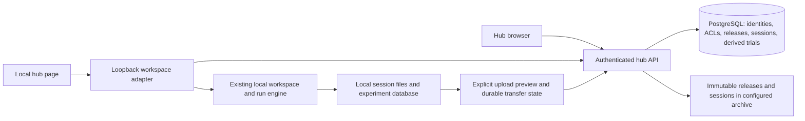

# Experiment Hub: development design

Status: isolated feature branch, not deployed. The existing 2.13 local dashboard remains the default. This document is canonical; project progress links to it.

## Summary and scope
Turn alhazen into a portable experiment hub while preserving its local, timing-sensitive execution model. A separately installed hub service owns accounts, the catalogue, immutable experiment releases, libraries and private session indexes. Rigs download verified releases, explicitly trust executable code, select their own interpreter and calibrated rig, and use the existing General / Run / Data / History workflow. Data upload is opt-in, recoverable and never part of the frame loop. The service never imports or executes uploaded experiments. The highest risks are execution of community code, cross-user data exposure, and falsely reporting a multi-file upload as durable.

Development includes a real local end-to-end pilot, not just screens. No GitHub publication, release, infrastructure provisioning, real participant-data upload or server deployment is approved.

## Requirements with checks
1. A visitor can inspect published catalogue metadata and open sign-in / registration; private experiments and collected data never appear there.
2. An invited pilot user registers, signs in and signs out. A second user cannot read the first user's private experiments, sessions, artifacts or pending uploads by guessing identifiers.
3. A user uploads an experiment package with manifest, compatibility declarations and hashes. A new release is immutable; publishing one release never silently publishes later uploads. Publishing requires an explicit licence and confirmation that source contains no participant data or private configuration.
4. On a clean rig, a user adds a public experiment to their library, downloads a pinned release, reviews the executable-code warning and registers it with an explicitly chosen interpreter. Existing local experiments remain available without a hub account.
5. Selected local rig, subject, experimenter, calibration, human/monkey reward protections, training mode and run-history semantics remain owned by the existing launcher, not reimplemented by the hub.
6. The operator previews an upload and opts in. Transfers resume after interruption with the same upload identity; differing content cannot overwrite a completed session. Completion is acknowledged only after complete file hashes and a database commit. Raw immutable session files are retained; normalized query tables are derived and rebuildable.
7. The owner can filter sessions, inspect trials, export CSV/JSON and download original artifacts through authorization-checked endpoints. No public SQL or arbitrary server-file endpoint.
8. Network failure leaves installed experiments usable and data on disk. Logout does not delete local collected data. No automatic deletion or forced upgrade.
9. A package with traversal, duplicate/case-colliding paths, links, encrypted members, an oversized expansion or wrong hashes is refused before install. Hub credentials, rig-local files, participant registries and data are excluded from source packages.
10. Tests run with synthetic users/data. Production hosting and durability remain explicitly unverified until deployed and a restore drill succeeds.

## Assumptions ledger (proposed pilot bounds, not measurements)
- 50 users, 5 rigs, 20 sessions/day; metadata peak 50 reads/s and 5 writes/s, average about 0.1 request/s.
- Typical session 0.5 GB with about 1,000 trials; about 10 GB/day, 7 TB and 15 million trial rows in two years. Actual eye/neural/video streams may dominate this estimate.
- Trial/session metadata goes into PostgreSQL. Large streams, images, package bytes and immutable original files stay in a configured filesystem artifact root, grouped by experiment. These are complementary records, not competing databases.
- Package cap 256 MiB compressed, 1 GiB expanded, 10,000 members. Session cap initially 20 GiB, 10,000 files. Transfer chunks at most 8 MiB. Limits must fail visibly and be configurable server-side.
- Metadata target p50 <200 ms and p99 <1 s at pilot load; a target, not a benchmark claim. Transfers are bounded and independently throttled. No high-availability promise on a job-scheduled pilot host.
- Invite-gated registration for the private pilot; open registration is a future deployment decision. No unconfigured email workflow pretending to send mail. Admin recovery is explicit, audited and revokes old sessions.
- Private by default for experiments and all collected data. Becoming public applies only to a pinned code release, never subjects, rigs, sessions or device credentials.
- No billing, ratings, comments, remote task execution, automated hardware calibration or remote start/stop in this increment.

## What the estimates decide
A single API service and one PostgreSQL instance can handle this metadata workload. No cache, distributed queue, search cluster or microservices are justified. Disk/bandwidth capacity and operator recovery matter far more than account-row scale. Raw frame/gaze streams do not belong as one row per sample in the account database; preserve them as checksummed artifacts and expose authorized downloads. At ten times the assumed data rate, quota and upload scheduling are the first constraints, not catalogue reads.

## Change map
- New optional `alhazen.hub` package: server, authentication, catalogue, package format, storage, client and sync.
- New additive `alhazen hub` CLI. Optional hub dependencies must not become imports required by a plain core install.
- Small adapter `cli/workspace_hub.py` plus additive `/hub` and `/api/hub/` routes in the loopback dashboard; preserve workspace token/origin checks and the default `/` behavior. `alhazen dashboard --hub` may open the new landing surface, while the existing dashboard is still reachable.
- New static hub frontend, following the repository's vanilla JS/CSS pattern, served by both the hub and the local adapter. No replacement of the experiment frame loop, core, devices, session recorder, rig schemas, people registry or local experiment database.
- Optional dependency/package-data additions, new tests, documentation and deployment templates. No edits to existing test expectations merely to hide failures.
- Existing contracts read: Workspace.add/register/start, DataView, Uploads, ExperimentDatabase, loopback dashboard token/CSP, argparse main, wheel package-data.

What this map decides: additive modules rather than a rewrite of the 2,800-line workspace; keep network and authentication away from hardware/timing. This is several cohesive commits, with package/auth/data contracts frozen before parallel client/UI work. Existing registries are neither migrated nor renamed.

## Architecture

All local session recording stays local. Remote arrows are retryable only with named upload/session identities. No network call participates in frame timing.

| Component | Decision hidden / interface | Guarantee | Price / not trusted for |
|---|---|---|---|
| Auth | Password hashing and opaque server sessions | Argon2 passwords, revocable hashed tokens, rate limits, CSRF/origin checks | Pilot invites and admin recovery; not institutional identity proof |
| Relational store | User/library/visibility and commit state | Server-side ownership checks and transactional publication | Migration and backup operations; not blob storage |
| Immutable artifact store | Physical archive location | Staged writes, checksums, no silent overwrite | Filesystem/DB commit recovery; not execution sandbox |
| Package module | Archive safety and manifest | Same validation in server and rig | Validation is not a security audit of executable code |
| Rig adapter | Remote protocol and local registration | Local credential isolation; explicit trust per release | Existing local OS user is the security boundary |
| Upload state | Partial transfer and replay | Idempotent chunks and commit; local originals retained | Disk usage; not a second real-time recorder |
| Hub UI | Visitor/library/data navigation | Meaningful loading/error/empty states and pinned-version choices | UI never grants permission; server checks every operation |

## Data and consistency
Account and authorization records are authoritative in the relational database. Immutable source bundles and raw session manifests/files are the experiment/session source of truth; normalized trial tables and summaries are marked derived. Metadata references only opaque relative keys, never physical deployment paths. There is no timestamp-based last-write-wins for research data. Private reads and publish/library mutations provide read-your-writes through the primary database. Incomplete sessions are visibly staging, never queryable as completed. Indexing failures are visible and retryable without discarding raw data.

Public visibility applies to the chosen publication version. Uploading a new private version cannot alter it. Unpublishing stops new server downloads; it cannot retract code already downloaded to rigs. Collected data belongs to the collecting user, not automatically to the experiment author. Lab/team membership is deferred until an explicit permission model is needed; no broad admin UI exposes another user's data by default.

## Failure analysis
| Failure | Detection / blast radius | Response |
|---|---|---|
| Hub offline or job rescheduled | Bounded client timeout | Catalogue/sync unavailable; installed local runs unchanged |
| Interrupted/duplicate upload | Chunk offset and digest; stable client session key | Resume verified chunks; return existing receipt for an identical commit |
| Different data reused under one identity | Manifest hash conflict | Reject, retain both local source and server prior version |
| Disk full / quota | Size reservations and write failure | Visible failure, no completed receipt; retry only after remediation |
| DB unavailable after blob staging | No committed metadata pointer | Orphan staging bytes are not visible; retry/reconcile by immutable digest |
| Crash between chunk write and DB offset | Reconcile durable extent and checksum | Never advance beyond verified bytes; repeat identical chunk safely |
| Compromised public package | No server execution; local trust prompt | Do not auto-install/run; a virtualenv is not a sandbox |
| Credential expiry/revocation | 401 with typed error | Require login; never fall back to another user |
| Broken/wrong database schema | Startup check | Refuse startup; no destructive auto-reset |
| Source accidentally contains local secrets/data | Package exclusions, file preview, history/diff scan | Refuse known sensitive paths; author reviews content before sharing |
| Backup/host loss | Operator restore drill | Do not call an upload a backup; retain rig originals |

At 2x load, cap concurrent uploads and allow queued/manual retries while metadata remains responsive. At 10x, reject additional transfers with 429 and retry guidance rather than unbounded memory/threads. Authentication and authorization always fail closed. Optional catalogue previews may remain empty/offline; no stale permission bypass.

## Hosting and operations
The institutional cluster can host a private pilot as an allocated lightweight service job, with a private tunnel/access path. Do not run an internet service on a shared login node or assume public incoming ports. API authentication is separate from cluster SSH authentication. Service restarts and scheduler outages are normal degraded states. The database must use a storage configuration explicitly supported by that host; never put a live SQLite WAL database on the shared archive filesystem. SQLite is only for local development with one process. PostgreSQL is the deployed pilot backend, tested separately.

All actual paths, account names, hosts, keys and connection strings are injected from operator-private configuration outside Git. The desired experiment/archive root is recorded only in that private configuration. Templates use required environment variables, not personal values. No deployment or real-data transfer until the user approves hosting, access, consent/retention policy and a backup/restore plan. The artifact root is not a guaranteed backup by itself.

## Verification and evolution
Check account isolation on every private endpoint, CSRF/origin, session revocation, expiry, rate limiting, immutable releases, unpublished-download behavior, broken hashes, archive attacks, interrupted upload/replay, DB/FS failure and complete reconstruction of synthetic sessions. Run a genuine server + two users + source publication + local download + local simulated run + selected upload + filtered data/export flow. Preserve existing local tests; run Python, JS, type/lint/import gates and software-design integrity checks. Inspect desktop and phone screenshots of the actual frontend.

Changing hosting should change configuration, not the experiment engine. Moving to object storage changes the artifact implementation, not manifests. Adding organizations later needs explicit membership ACLs and migrations; do not smuggle them into usernames now. Ten times metadata volume may need pagination/index tuning; ten times raw data needs storage quota review and independent transfer capacity. Version API paths and package manifests; refuse unknown major schemas. Do not release, change downstream pins or touch running main until reviewed.

## Added requirements: scientific documentation (user, current development)
Each experiment can carry a methods-style description: scientific purpose, tasks, stimuli, procedure, measures, controls and references. Every documented task has a parameter reference (names, meanings, units, defaults, constraints and relevant interactions) and a paper-like timeline plus stimulus/apparatus schematic. Conditional/event-driven phases and failure/abort branches must not be drawn as falsely fixed-duration steps. Figures are explanatory, not assertions of rig calibration. Authoring is versioned with the source package; the renderer never executes an uploaded diagram or Markdown script.

Placement: experiment detail has Overview / Methods / Tasks & parameters / Versions; methods and selected-task diagrams live in their reading views. Local run controls stay focused; a compact link may lead back to the task guide, never an overlay during an active trial. A global Alhazen guide explains its actual modes and capabilities and remains readable offline on a rig. Missing legacy documentation is honestly labelled, not fabricated. Include one source-checked, runnable scaffold example to prove the documentation contract and scientific rendering, not fake marketplace activity. No downstream repositories are changed just to invent documentation coverage.

Keep prose in authored Markdown, structured task/parameter/timeline/diagram data in a documented JSON descriptor, and the actual parameter schema authoritative for validation where available. Changing experiment code or defaults requires reviewing its documentation; resolved values must name the version/source. Data/state dependencies are references, not unrelated copies.

## Current phase: native AI-assisted experiment authoring (server: docs/hub/ai.md)
Users bring their own provider API keys. No active AI feature or key collection in this increment. Plan a credential abstraction with encrypted server storage (operator-provided wrapping key) or local OS keyring as appropriate; never browser localStorage, source packages, logs, database exports or public listings. No user source, participant data or credentials go to an AI provider without explicit scoped consent; showing available data is not permission to transmit it.

AI works on a private draft or fork of an imported immutable version and creates reviewable patch proposals. Ground it in alhazen's actual APIs/modes, task code, parameter schemas, methods and diagrams; show changes to protocol, timing, reward, data format and docs together. Run static checks, unit tests and hardware-free simulation in an isolated authoring environment before acceptance. AI never silently installs dependencies, controls a live rig, calibrates hardware, changes an active session, uploads participant data or publishes. Human acceptance creates a new version; the imported original and historical run provenance remain intact. Provider choice/model/budget and key rotation/revocation remain explicit. This adds a private authoring workflow later, not a generic chat bolted onto the Run screen now.
