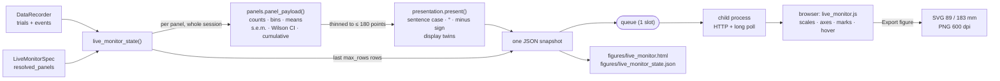
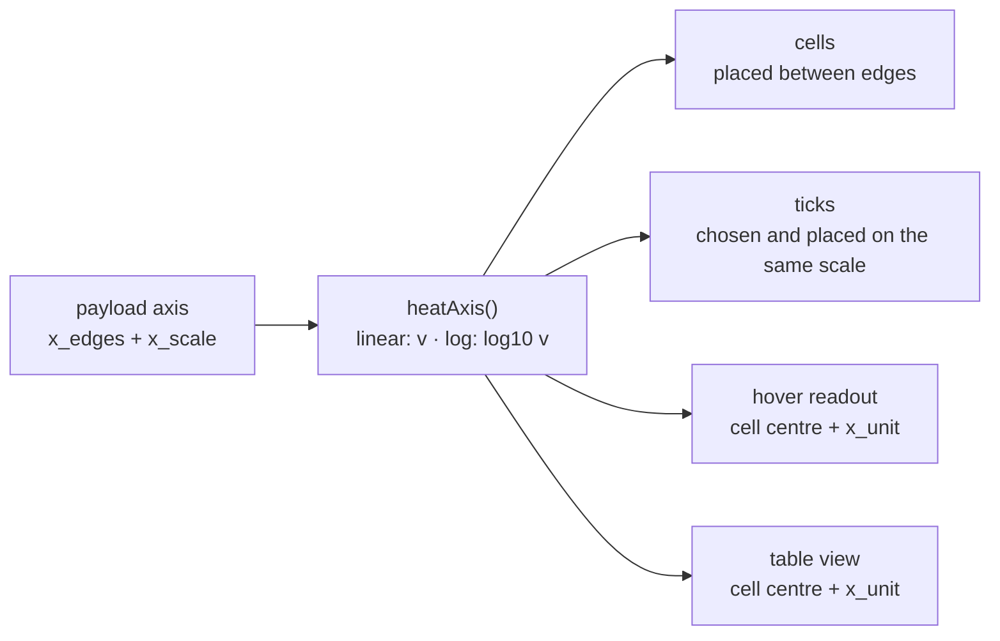
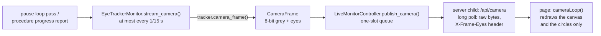
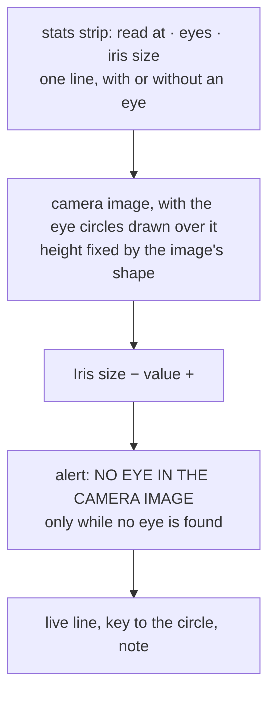
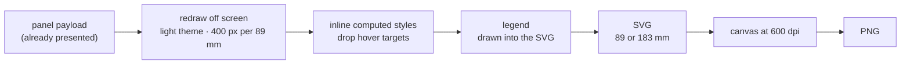

# Live monitor

To add experiment repositories, edit parameters, choose rigs, and launch
previews or recordings from a web app, use `alhazen dashboard`: see the
[experiment workspace](workspace.md). This page describes the separate live
monitor for a running session. During a run started from the workspace, the
workspace embeds this page in its **Live monitor** tab (see
[Live monitor](workspace.md#live-monitor)); from a terminal, `python run.py`
opens it in its own browser tab as before.

## The old names, and 2.0

Until 1.8 this page and its code were "the dashboard". That word now means the
experiment workspace only, and in 1.9 the live monitor's names changed with
it. The old spellings kept working through 1.9 and 1.10, with a
`DeprecationWarning` naming the replacement, and **2.0 removed them**
([versioning](versioning.md) §4). Code or a rig file still using one now
fails: a rig file's `dashboard:` section and a task's `dashboard = ...` are
refused with a message naming the new name; the rest fail as any unknown
import, attribute, keyword or flag does. Use the right-hand column:

| Before 1.9 | Since 1.9 |
| --- | --- |
| `alhazen.dashboard` (and `.spec`) | `alhazen.live_monitor` |
| `DashboardSpec`, `DashboardPanel`, `DashboardConfig` | `LiveMonitorSpec`, `LiveMonitorPanel`, `LiveMonitorConfig` |
| `Task.dashboard = DashboardSpec(...)` | `Task.live_monitor = LiveMonitorSpec(...)` |
| rig file `dashboard:` section | `live_monitor:` |
| `--dashboard`, `--no-dashboard`, `--no-dashboard-browser` | `--live-monitor`, `--no-live-monitor`, `--no-live-monitor-browser` |
| `build_session(dashboard=, open_dashboard=)`, the same on `build_mode_session` | `build_session(live_monitor=, open_live_monitor=)` |
| console line `dashboard: http://…` | `live monitor: http://…` |

The two saved files kept their old names through 1.x, because run-directory
file names are an on-disk contract that changes only in a MAJOR version
(§3 of the same page). 2.0 renamed them:

| Up to 1.10 | Since 2.0 |
| --- | --- |
| `figures/dashboard.html` | `figures/live_monitor.html` |
| `figures/dashboard_state.json` | `figures/live_monitor_state.json` |

A run recorded before 2.0 keeps the old names; nothing is renamed on disk. A
script that opens the saved state of runs from both sides of the upgrade
looks for `live_monitor_state.json` first and `dashboard_state.json` second
([data on disk](data.md) §6).

Alhazen can open a local live monitor in the browser before PsychoPy takes focus. The
live monitor receives a new immutable snapshot after every recorded trial; no
HTTP, serialization or plotting runs in the display frame loop.

Enable it in the rig configuration:

```yaml
live_monitor:
  enabled: true
  auto_open: true
  port: 0                 # ask the OS for an unused loopback port
  max_rows: 1000          # trials/events per update; totals travel alongside
```

`max_rows` is why publishing stays cheap in a long session. Each update
serialises what it sends, so sending the whole history after every trial makes
the cost grow with the square of the session's length — real time spent
between trials, with a subject waiting. Only the most recent `max_rows` trials
and events travel as a record echo; `n_trials` and `n_events` carry the
totals. The state saved to `figures/` at teardown is always complete.

The **plots are never truncated by it.** Each panel arrives with its data
already computed over the whole session, so a cumulative curve does not begin
partway up in trial 4000 of a long run.

The server binds only to `127.0.0.1`, uses a random per-session token, and
loads no internet resources. The page takes the token out of the address bar
as soon as it has read it (it keeps it for its own requests, and a reload of
the tab still works). The server refuses a malformed request with a 400
rather than guessing: a query parameter that is not an integer or is given
twice, a request id that is not a string of 1 to 64 characters, or a body
whose length is negative (larger than 4 KiB gets a 413). `--live-monitor` and `--no-live-monitor` override the
rig for one run. `--no-live-monitor-browser` starts the server without launching
the default browser; the URL is written to the session log.

## Focus safety and controls

The live monitor is deliberately read-only during a running experiment. Clicking
a browser on the presentation computer necessarily transfers OS focus before
Python can react, so a web Pause button cannot honestly promise not to affect
subject input.

Press **P** on the experimenter keyboard first. Once the subject display says
the run is paused, the live monitor enables Resume, Calibrate, Validate, Drift
correct, Give reward, Quit, and curriculum controls. The server also rejects
control requests unless its authoritative session state is `paused`;
disabling the buttons is not the security boundary. Space, C, V, D, R and Q
remain available from the keyboard while paused, so closing the browser
cannot strand a session.

Commands queued before a pause begins are **discarded**. A click accepted in
the milliseconds between the browser seeing "paused" and the runner resuming
would otherwise sit in the queue and fire at the next pause — a reward
delivered, or a session quit, minutes after the click that asked for it.

The eye-tracker procedures and manual reward leave the run paused. Resume is
always an explicit action. Each successful or failed reward is written to
`events.csv`, including its configured pulse train.

While a calibration, validation or drift correction runs, the status reads
**calibrating**, the buttons are inert, and the notice follows the
procedure's progress (`validating: target 3 of 5`); when it ends, the notice
shows the result line and the *Eye tracker* panels update. See
[eye-tracker.md](eye-tracker.md).

## The plots

Every quantity gets the mark that answers the question being asked of it. A
session total is a number and is shown as a number; what deserves a plot is
its *shape over trials* — some trials pay more than others, and a curve that
goes flat at trial 260 says the subject stopped working, which no total can.



The split matters: **the browser draws, it does not analyse.** Every count,
bin edge, mean, error bar and running proportion is computed in
`alhazen.live_monitor.panels`, in Python, where it is unit-tested. A running
accuracy that divides by the wrong denominator looks entirely plausible in a
browser, and the page's JavaScript is tested (`tests/js/`) only for how it
draws, never for what it computes.

What the reader sees is decided once, after the numbers. `presentation.present()`
rewrites every payload in a journal figure's conventions: labels in sentence
case, column and outcome names as words (`FIX_BREAK` is "Fix break",
`saccade_latency_ms` is "Saccade latency (ms)"), abbreviations in their own
case ("RT", "IQR", "s.e.m."), degrees of visual angle as "°", and a true minus
sign. Prose (axis titles, notes, stat labels) is rewritten in place. Data
values (a level, an outcome, a response key) keep their record form, because
code that maps a panel back to its trials compares them with the record. Each
gains a display twin beside it, and the page draws the twin:

| raw, unchanged | display twin |
| --- | --- |
| `items[].label` | `items[].display_label` |
| `series[].name` | `series[].display_name` |
| `groups[].label` | `groups[].display_label` |
| `groups[].series` | `groups[].display_series` |
| `band.name` | `band.display_name` |
| `maps[].name` | `maps[].display_name` |
| `color_label` | `display_color_label` |

A live monitor saved before the twins existed still draws, from the raw values.

### Reading them

Panels are laid out two to a row, collapsing to one on a narrow window, and
each chart is measured against the card it was placed in — so a plot is as
large as the space it has, on any screen. Every chart on a page gets the same
drawing box, and every card reserves the same room for a legend and a caveat
line, so a row reads as a plate of figures rather than as a pile of cards.

### Groups

Panels are filed into groups, listed in the sidebar with a count each, and
selecting one shows only that group. The default groups follow from the kind:
**Session** (performance, reward, outcomes), **Behaviour** (responses,
reaction times, series, single numbers), **Gaze** (landings and saccade
vectors) and **Conditions** (anything grouped by a factor). Set `section=` on
a panel to file it under a name of your own — a task's pupillometry panels
under "Pupillometry", say — and it appears in the sidebar beside the rest.
The choice is remembered in the browser.

The drawing conventions are fixed across every panel, so a plot means the same
thing wherever it appears.

- **Axes carry units.** They are read off the column name's suffix — `rt_ms`
  is milliseconds, `endpoint_x_dva` is degrees of visual angle — which is the
  convention a trial record already follows. Set `unit=` on the panel for a
  column named some other way.
- **Error bars are defined on the panel.** A `grouped_mean` whisker is the
  standard error of the mean and a `grouped_rate` whisker a 95% Wilson
  interval, and the legend says which: a journal will not print an error bar
  the figure does not define. The number of trials behind each bar is printed
  under it, as *n* = 12. A group with a single trial gets no whisker: no
  spread was measured, and a zero-length bar would imply certainty.
- **The shaded band on `performance` is a 95% Wilson interval**, not the
  textbook normal one — which is badly wrong on the handful of trials where an
  experimenter is most tempted to read it, and can run past 0 or 1.
- **A proportion axis is pinned to 0–1.** Auto-scaling accuracy to 0.62–0.68
  turns noise into a dramatic-looking climb.
- **A histogram's axis is clipped to a robust window** (three interquartile
  ranges past the quartiles) and says how many trials fell outside it. One
  four-second trial must not squeeze sixty real ones into a single bar; the
  outliers are excluded from the drawn bins, never from `n` or the median.
- **Reward is measured in valve-open time**, not millilitres: volume per pulse
  is a property of the pump's calibration, which alhazen does not know. Open
  time is exactly proportional to it. If any delivery reached the record
  without its pulse train, the panel counts deliveries instead and says so
  rather than inventing a volume.
- **Landings are drawn at equal aspect** — a degree right is the same length on
  screen as a degree up — with the screen centre marked.
- **Every panel has a table view.** Whatever a hover readout shows is also
  reachable as text, under the plot.
- **Spines and outward ticks, no gridlines, and every axis ends on a labelled
  tick.** The reading conventions of a printed figure: the ink inside a plot
  is the data, and an axis that stops at an unlabelled value leaves the reader
  guessing what its end is worth. Values a tick does not carry are on a direct
  label, in the hover readout, or in the table.
- **Panels carry their title and no letter.** They used to be lettered
  a, b, c in the order shown, the way a figure plate letters them; the owner
  asked for the letters to go (2026-10-06).
- **A mean marker appears only where a mean is a position.** With more than
  one target on screen, the mean landing falls between the clusters — where
  nothing landed — so the landing panel omits it.

Long series are thinned to at most 180 points before they are sent: more
points than a panel has pixels cost serialisation time and tell the reader
nothing. Thinning always keeps the first and the last point.

## Task-specific plots

Every task gets performance, reward, outcome, reaction-time, response and
saccade-landing panels. Panels tolerate missing fields and say what is
missing — "No rt_ms recorded yet" — so the same defaults work for tasks
without hand responses or gaze.

Add experiment-specific panels declaratively:

```python
from alhazen import LiveMonitorPanel, LiveMonitorSpec, Task


class MibTask(Task):
    live_monitor = LiveMonitorSpec(
        panels=(
            LiveMonitorPanel(
                kind="grouped_mean",
                title="MIB by coherence",
                value="mib_signed_dva",
                group="coherence",
                completed_only=True,
            ),
            LiveMonitorPanel(
                kind="stat",
                title="Median saccade latency",
                value="saccade_rt_ms",
                agg="median",
                completed_only=True,
            ),
        )
    )
```

Set `include_defaults=False` to replace rather than extend the standard
layout.

### The kinds

| kind | answers | drawn as |
| --- | --- | --- |
| `performance` | is the subject working? | running proportion over trials, with a 95% band and a moving window |
| `rewards` | how much has it earned, and is that still accruing? | cumulative step curve, failed deliveries marked |
| `outcomes` | how do attempts end? | horizontal bars, count and share |
| `responses` | which key is being pressed? | horizontal bars |
| `histogram` | what does one measurement's distribution look like? | binned columns with the median marked |
| `scatter` | where in space did the response land? | equal-aspect scatter with targets, the mean landing, and any regions the task outlines |
| `vectors` | how far, and which way, did the eye move? | every trial's displacement from one origin, on a polar grid |
| `series` | how does one quantity drift? | per-trial points with a moving mean |
| `grouped_mean` | does it differ across a condition? | group means ± s.e.m., with *n*; several factors side by side or crossed |
| `stat` | one number | the number |

`performance` needs nothing declared: it reads the row's own `success` when
the task scores its outcomes, and falls back to the completion rate when it
does not — labelling the axis with whichever it used, never quietly swapping
one for the other. `rewards` reads the event stream, so it also counts manual
deliveries, mid-trial drops (each once, when its `REWARD_DELIVERED` arrives),
fault rewards (a `REWARD` carrying `fault`, paid on a trial the eye tracker
cut short — see "System faults" in [architecture.md](architecture.md)),
unrewarded completions (`NO_REWARD`) and hardware failures (`REWARD_FAILED`).

`scatter` and `vectors` are two questions about the same endpoints. `scatter`
plots them where they landed, with the targets marked, and answers *did it hit
the target*. `vectors` plots each one as a displacement from where the eye
started — every trial collapsed onto a single origin — and answers *how far,
and which way*. Amplitude and direction stay readable in the second even when
the fixation point moves between trials, which is what the origin columns are
for:

```python
LiveMonitorPanel(
    kind="vectors",
    title="Landing relative to fixation",
    x="endpoint_x_dva",
    y="endpoint_y_dva",
    origin_x="fixation_x_dva",   # optional
    origin_y="fixation_y_dva",
    completed_only=True,
)
```

`StimulusResponse` records that origin for you. On the frame gaze leaves the
window it writes `<depart_region>_x_dva`/`_y_dva` — the last sample verifiably
*inside* it, which is where the eye actually was, not where the fixation point
was drawn. A trial whose origin was never verified (gaze lost throughout) is
left out of the panel rather than measured from an invented one.

If no such column exists at all, the origin falls back to the screen centre —
where this framework's fixation point sits — and the panel says so under the
plot rather than assuming it silently. Point `origin_x`/`origin_y` at the
target columns instead and the same panel becomes an endpoint-error plot.

A landing is often judged against regions rather than a point, such as the
inducers of an averaging display. Name a record column in `shapes` and the
scatter outlines them:

```python
LiveMonitorPanel(
    kind="scatter",
    title="Landings by separation",
    x="landing_x_dva",
    y="landing_y_dva",
    color_by="separation",
    shapes="inducer_shapes_dva",
)
```

Each trial's value is a list of shapes, or that list as JSON text, in the
panel's own x/y units: `{"kind": "circle", "x": cx, "y": cy, "r": radius}` or
`{"kind": "rect", "x": cx, "y": cy, "width": w, "height": h}`. A rect is its
centre and size, axis-aligned. A shape many trials carry is drawn once, as an
outline under the points, in the colour of the one `color_by` level that
showed it; a shape several levels share belongs to none of them and is drawn
in grey. Shapes count toward the axis range and are never thinned with the
points. Past 64 distinct outlines the panel draws the first 64 and says how
many it left out. A malformed shape raises an error naming the trial and the
column, rather than the panel drawing less than the task described. `shapes`
on any kind other than `scatter` is refused when the panel is declared.

Bin edges, group ordering and error bars are chosen for you. Numeric group
labels sort as numbers — the string order `"0.2" < "0.4" < "10"` is wrong
exactly when a level reaches double digits.

## Conditions

The panels know what the experiment varies. The session runner collects the
condition factors from the conditions the paradigm actually served — not from
a declaration, so they cannot drift — and they reach the live monitor on their
own:

- **the spatial panels are coloured by the first factor**, so a landing cloud
  separates by condition at a glance;
- **each factor earns two panels**: `Accuracy by <factor>` and
  `Landing error by <factor>`.

Nothing has to be declared for that to happen. To colour by a different
column, set `color_by` on the panel; to group by more, declare a
`grouped_mean` or `grouped_rate` panel of your own.

```python
LiveMonitorPanel(
    kind="scatter",
    title="Landings by coherence",
    x="endpoint_x_dva",
    y="endpoint_y_dva",
    color_by="coherence",
)
```

The categorical colours are **Okabe-Ito**, the colour-vision-deficiency-safe
set scientific figures have used for two decades. The same three hexes serve
the light and dark themes and clear every gate in both under the harder
all-pairs test that a scatter plot needs.

Colour follows the *kind* of factor, not the taste of the panel. Numeric
levels are ordered — 0.05 really is less than 0.4 — so they take one hue from
light to dark and the reader sees the order in the colour. Named levels
("left", "right") have no order to show, so they take separate hues. Both
palettes are validated against the surface they are drawn on, which is what
caps how many levels can be told apart: five ordered, three named. Beyond
that the tail folds into one grey series and the panel says how many levels
went into it — a sixth colour would be one nobody could distinguish, and an
indistinguishable legend entry is worse than an honest "other".

The first **two** factors get automatic panels. Every factor adds two, and a
live monitor nobody can take in at a glance has stopped being monitoring; declare
the rest explicitly when you want them.

The landing panel groups `endpoint_error_dva` — how far the response fell from
the target it was given, which `LandingSample` and `LandingCheck` record —
rather than the endpoint's coordinate. A task with left and right targets
averages its endpoint x to roughly zero, and a panel reporting that would be
reporting perfect aim.

Grouped panels draw as dots with whiskers by default, or as bars with
`style="bars"`. Bars grow from zero, so they suit a proportion or a distance;
a signed mean has no meaningful baseline to grow from, which is why the
default is a dot. `grouped_rate` is bars unless you say otherwise, and its
interval is Wilson's — asymmetric near 0 and 1, which is exactly where a level
with a handful of trials puts it.

A `grouped_mean` panel can take several factors. Side by side
(`group=("alignment", "separation")`), each factor is averaged on its own over
every trial, one colour per factor. Those are marginal means, and the panel
says so under the plot, because bars for several factors on one axis look like
the cells of a design. With `cross=True` it draws one bar per combination of
levels instead ("near / static"), each over the trials that had exactly that
combination and with its own *n*; a trial missing any of the factors sits in no
cell. `cross=True` on a panel with fewer than two factors, or on any other
kind, is refused when the panel is declared.

## Panel filters

Two filters apply to any panel:

- `completed_only=True` — the panel reads only trials that completed. It uses
  the row's own `completed` column, which the engine stamps from the outcome,
  so an experiment's own incomplete outcome (a broken fixation) is excluded
  whatever it is called.
- `rolling_window=N` — the panel reads only the most recent N trials, and says
  so under the plot. Useful live: a running reaction-time histogram over the
  last 50 trials shows a subject tiring, where the same histogram over the
  whole session does not.

```python
LiveMonitorPanel(
    kind="histogram",
    title="Reaction time (last 50)",
    value="rt_ms",
    completed_only=True,
    rolling_window=50,
)
```

## Colour, contrast and theme

The page follows the reader's OS light/dark setting and carries a toggle that
overrides it. Both themes are chosen, not flipped: the two categorical colours
are validated in each mode for lightness, chroma, contrast against that mode's
surface, and separation under protanopia and deuteranopia. Identity never
rests on colour alone — every chart with more than one series carries a
legend, marks are direct-labelled at their endpoints, and the table view
carries every value in text.

Reward failures are the one status colour on the page. They appear as a red
cross on the reward curve, with "delivery failed" in the legend and the count
in the panel's header — colour, shape and words, because a pump failure is not
something to leave to a hue.

## Live-analysis panels

A task's live analysis (`Task.live_analysis`, architecture §5.5 and
[live-spikes.md](live-spikes.md)) can add panels whose data does not come
from the trial records at all — the
[rf-mapping](https://github.com/sh4r11f/rf-mapping) experiment's
receptive-field maps are the first. They obey the same division of labour:
computed in Python between trials, delivered as finished payloads, appended
after the spec's panels under their own sidebar section.

They introduce one wire form of their own, `heatmap`: one or many cell
matrices on a shared colour scale (small multiples with one colourbar,
because per-map scales would quietly break the comparison), `null` cells
drawn muted as *not measured yet* — never as zero. The scale interpolates
the theme's own ordinal ramp, so it follows light and dark like every other
mark; the theme toggle repaints it. Hover reads out the cell's position,
value and flash count, and the table view lists every cell.

### The heatmap form

A receptive-field map has two axes in the same unit, degrees, and is read by
its shape. Other heatmaps are not like that. mbri's search shows a slice of
its posterior across two different parameters — speed, 4 to 32 dva/s on a log
scale, by dot density, 0.2 to 3 dots/dva² on a log scale — and its reader
needs to read real coordinates off the map. So a heatmap can say, per axis,
how its cells map to real values, and the page then draws real axes for it.
The fields marked *new* are what this adds; each changes nothing when it is
left out.

| field | | meaning |
| --- | --- | --- |
| `maps` | required | `[{name, matrix, centroid?}]`; `matrix[row][col]`, row 0 the **bottom** row; a cell is a finite number or `null` (not measured yet). Every map has the same shape. |
| `x_edges`, `y_edges` | required | the cells' boundaries in real units, strictly increasing: `cols + 1` and `rows + 1` of them |
| `x_scale`, `y_scale` | new; optional, both or neither | `"linear"` or `"log"`. Giving them draws the axes: ticks, tick labels and axis titles |
| `x_unit`, `y_unit` | new; optional | the unit the hover readout writes after a coordinate and the table's column head names (`"dva/s"`, `"°"`) |
| `vmin`, `vmax` | `vmin` new and optional; `vmax` as before | the colour range: `vmin` is the bottom of the colourbar (0 when left out), `vmax` its top. `vmin` needs `vmax` and must be below it |
| `x_label`, `y_label`, `value_label` | optional | the axis titles and the colourbar's caption |
| `flashes` | optional | a count per cell, shown in the hover readout and the table |

**The axes come from the edges and the scale — one mapping, used four
times.** The payload gives the cells' edges in real units and says whether
each axis is linear or logarithmic. From those two facts the page places the
cells, chooses and places the ticks, and writes the cell positions in the
hover readout and in the table. The alternative — the payload sending its own
tick positions and labels — was rejected: the cells would then be placed by
one description and labelled by another, and nothing would keep the two
agreeing. A slice drawn on a 0–1 grid with "4", "8", "16", "32" written under
it reads correctly at the ticks, while its hover and table still say 0.25 and
0.5. With edges and a scale there is no second description to drift.



- **A log axis places everything at `log10` of its value**, so equal ratios
  take equal lengths: 4 to 8 is as long as 16 to 32. Its edges must all be
  positive.
- **A cell's position is its centre on its own scale**: the midpoint of its
  edges on a linear axis, their geometric mean (√(a·b)) on a log one. That is
  where the cell sits on the drawn axis, so the hover and the table give the
  value a reader of the ticks would read there. A payload that evaluates each
  cell at its centre on the same scale (mbri's search does) gets back exactly
  the coordinates it computed.
- **Both ends of an axis are labelled** with their values, because the map's
  extent is data: the axis ends where the cells end, and the reader must not
  have to extrapolate along a log scale to find it. Between the ends, ticks
  sit at round values: on a linear axis steps of 1, 2, 2.5 or 5 times a power
  of ten, as on every other panel; on a log axis the densest of 1–9, 1–2–5,
  1–3 and whole decades (every second or third decade over a wide range) that
  fits the axis's length. A log axis spanning less than about a factor of
  two holds almost no such values, and is nearly straight anyway, so it takes
  the linear steps. A tick whose label would touch its neighbour's is
  dropped; an end label is never dropped.
- **Tick labels carry no unit**; the axis title does, as on every panel.
- **Aspect.** Cells keep the data's aspect ratio when both axes are linear
  and give the same unit (or neither gives one): a degree up is then as long
  as a degree across, as a receptive field needs. Otherwise there is no
  shared length to keep — a decade of speed is not a length of density — and
  each map is drawn square.

**The colour range.** `vmin` and `vmax` set the colourbar's two ends; a
payload that gives no `vmin` keeps today's scale from 0 to `vmax`. Narrowing
the range is how a quantity living in 0.30–0.49 gets the whole ramp. A value
outside the range is drawn in the colour of the end it passed, and is never
clipped in silence:

- the colourbar grows an arrow-head at that end;
- the legend says how many cells fell outside and how far, as in
  *3 cells below the colour range (lowest 0.12)*;
- the hover readout of such a cell says *below the colour range* (or above)
  and which colour it is drawn as; the table always holds the true value.

This applies to every heatmap, with or without `vmin`: before, a negative
value on a scale from 0 was drawn as 0 and the page said nothing.

**Units say what they are.** The hover readout writes `x_unit` after the x
coordinate and `y_unit` after the y coordinate (`11.3 dva/s, 0.775
dots/dva²`), and the table's column heads name them (`Speed (dva/s)`; a unit
the title already ends with is not repeated). An axis with no unit gets a bare
number. The one exception keeps existing pages as they are: a heatmap that
gives *none* of `x_scale`, `y_scale`, `x_unit`, `y_unit` reads out its
coordinates as 2.7 did — followed by "dva" whenever it has an `x_label` —
because the receptive-field maps it was written for are in degrees and rely on
it.

**Existing pages are unchanged.** A heatmap with none of the new fields, and
every value inside its colour range (every receptive-field map, by
construction: rates are never negative and `vmax` is their maximum), draws
exactly what 2.7 drew — the same cells, colours, titles, colourbar, legend,
hover and table, with no axes. `tests/js/heatmap.test.mjs` pins that against
drawings recorded from the 2.7.0 renderer. The only difference an old payload
can show is the out-of-range marking above, and only where cells fell outside
its range.

**Checked before it is sent — and a bad one never stops a session.**
`alhazen.live_monitor.heatmap.check_heatmap` says what a heatmap payload must
be, and refuses one with `SessionError` naming the field: maps of different
shapes or ragged rows, a cell that is not a finite number or `null` (JSON has
no NaN, and one NaN in an update breaks the page's reading of all of it),
edges that are not strictly increasing or are the wrong length for the
matrix, an unknown scale, one scale without the other, a log axis with an
edge at or below 0, a unit that is not text, and a colour range that is
empty, the wrong way round, or a `vmin` without a `vmax`.

`live_monitor_state()` runs that check on every heatmap among the extra
panels. What a failure does depends on who is asking:

- **In a session**, the runner passes `on_invalid_panel`, and a malformed
  heatmap is loud without stopping anything. session.log gets one ERROR
  naming the panel and the problem — once per panel and problem, not on
  every update it stays that way for — and the panel goes out as a red card
  saying *Malformed map:* and the same problem, in the live page and in the
  page saved to `figures/`. The trials go on being recorded. A payload can
  turn malformed through its data alone, in the middle of a recording (a
  flat surface whose colour range is its own minimum and maximum, a NaN), and
  the live monitor is a view of the data, not the data.
- **Called directly** — by a test, or a tool that builds a state itself —
  it raises `SessionError` naming the panel, as for any other malformed
  input.

`check_heatmap` stays strict and public so that an experiment can call it in
its own tests, on the payloads its live analysis builds: a test is where a
payload's mistakes should fail, since a session will only report them.

What mbri sends for its posterior slice — the edges in real units, and four
fields more than before:

```python
{
    "form": "heatmap",
    "maps": [{"name": "posterior mean", "matrix": matrix.tolist()}],  # row 0 = lowest density
    "x_edges": speed_edges,       # 22 edges, 4 ... 32, equal ratios
    "y_edges": density_edges,     # 22 edges, 0.2 ... 3, equal ratios
    "x_scale": "log",
    "y_scale": "log",
    "x_unit": "dva/s",
    "y_unit": "dots/dva²",
    "x_label": "speed (dva/s)",
    "y_label": "dot density (dots/dva²)",
    "value_label": "balanced accuracy",
    "vmin": 0.30,                 # optional: the colour range
    "vmax": 0.49,
}
```

## Eye-tracker panels

A session with a tracker gets an **Eye tracker** group from
`session/eyetracker.py`: the latest calibration's verdict as a `stat` tile
(red when the tracker reports failure), the latest validation as a `scatter`
of targets and measured gaze on a degree grid with the errors in its stats
strip, the latest drift correction as a `stat` tile, and — on a TRACKPixx3 —
the camera image. Like the live-analysis panels they are computed in Python
and delivered finished.

The camera is the one panel that is a picture, and it introduces the
`image` wire form: width, height and one grayscale byte per pixel, drawn
straight into a canvas with nearest-neighbour scaling (a blurred-up eye looks
out of focus, and focus is one of the things being checked). It is read only
while the session is paused or a procedure is running, and left out of the
copy saved to `figures/`; the saved panel says so in its place.

On the live page the image **streams**. A state publish carries a session's
worth of JSON and rebuilds every panel, so an image sent that way moved about
once a second. Frames go on their own channel instead. The session sends one
about fifteen times a second while paused (`CAMERA_STREAM_S` in
`session/eyetracker.py`) and on every progress report of a procedure, which
is ten a second through a TRACKPixx3 calibration. Each goes into a one-slot
queue, where a newer frame replaces one the server has not collected. The page
long-polls `/api/camera` for the frame after the last one it received, gets
the raw bytes with the size and time in headers, and redraws only the canvas.
The line under the image gives the frame rate, or says why no frame is
arriving.

**Eye markers travel with their frame.** A tracker that knows where it found
each eye fills `CameraFrame.eyes` (the TRACKPixx3 does), and the page draws a
circle of the expected iris size on each. On the stream they ride in one more
header of the same answer, `X-Frame-Eyes`: JSON, a list of `{eye, x, y,
iris_px}` in the frame's own px. An empty list means no eye was found, and
clears the circles. No header means the tracker cannot say, and the page
draws the picture alone. A frame sent in the state instead (no live page, so
no stream) carries the same list as the panel's `eyes`. The circles are an
SVG laid over the canvas, in the image's px, so they are redrawn with every
frame and never sit on an older one.



**Nothing above the camera's controls changes height.** The *eyes* value in
the strip above the image is one word. Under the image come the tracker's
controls, and only then the panel's alert (`alert` in its data: no eye in the
image) and the line that says whether the image is live. So the − and + of
the iris size stay under the pointer while an eye drops in and out, and the
alert never covers the picture.



## Frame-timing panel

Every session gets a **Frame intervals** panel in the *Session* group, built
by the runner from its frame monitor rather than from the trial records: a
histogram of every flip-to-flip interval so far, in bins an eighth of a frame
period wide from zero to two and a half periods, with frames beyond that
counted in the note along with the longest. Its stats strip shows the frame
count, the median, the dropped count (red past one percent) and the number of
frames **under half a period** — red if there are any, because that is
physically impossible on a vsync-locked display and means the flip is not
waiting for vsync at all.

A count of dropped frames cannot show that. A headless rehearsal here had a
median interval of 8.343 ms (119.9 Hz, perfect on paper) and 338 frames under
4 ms; "308 dropped frames" hid it, and the histogram shows it as a second
mode at a glance. That shape is the difference between a genuine vsync miss
and a clock that is not locked to the panel.

## Figures for publication

Every chart panel has an **Export figure** row: an SVG at a journal's single
column (89 mm) or double column (183 mm), or a PNG at 600 dpi. The figure is
not a screenshot of the card. It is drawn again, off screen, in the light
theme and at a scale that sets tick labels at about 7 pt and prints a 1 px
line at 0.6 pt, whatever the reader's theme or window width. Each element's
computed style is written onto it, so the SVG needs no stylesheet and opens the
same in a vector editor as in a browser, and its text is set in Arial or
Helvetica. The legend is drawn inside the figure (no panel letter: a plate's
letters are the paper's to set), and a bar chart is cropped to its rows.



A failed export says so in the page, with the reason, rather than quietly
saving nothing. File names carry the title and the width, such as
`saccade-latency-89mm.svg`.

## Saved output

At shutdown, the final state is saved as `figures/live_monitor_state.json` and a
self-contained `figures/live_monitor.html` (before 2.0: `dashboard_state.json`
and `dashboard.html`). Both are covered by the run manifest.
The saved page is the same page, with its snapshot baked in and nothing to
poll: it loads no fonts, scripts or styles from the network, so it still opens
years later on a machine with no internet.
