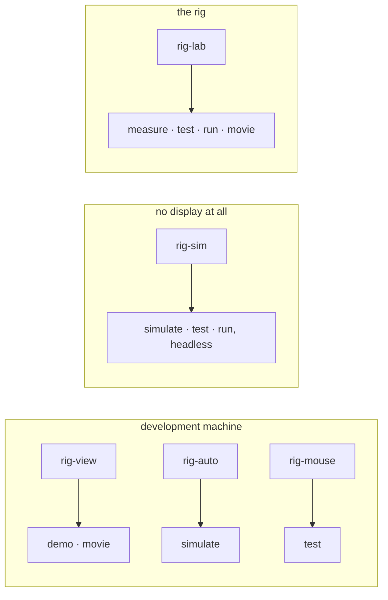
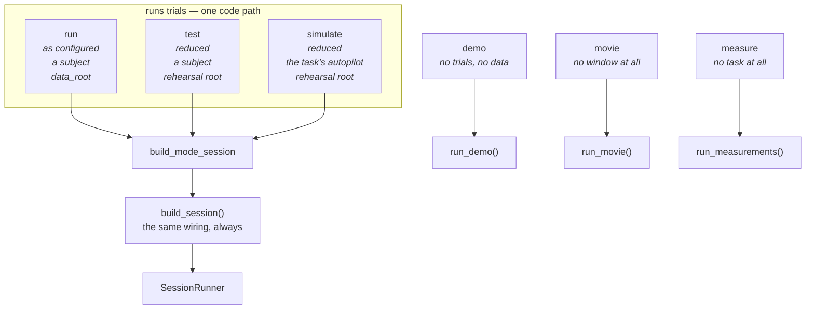

# The six modes

Every experiment needs the same six ways of being started, and before this
package each one wrote them again. Two of alhazen's own experiments had
independently grown a stimulus viewer, an autopilot, a ruler check, a
hand-edited config for short runs and a movie writer — the same things,
written twice, including the same off-by-one in the run-number counter.

| mode | what it does | needs a task? | writes data? |
|---|---|---|---|
| `measure` | is this rig telling the truth? display, response keys, eye tracker | no | a report |
| `demo` | look at the stimulus, with nothing else running | yes | no |
| `movie` | write the stimulus to movie files, for a demo you can send | yes | movie files |
| `simulate` | the whole session, driven by a simulated subject | yes | to the rehearsal root |
| `test` | the whole session with fewer trials, for a person to sit through once | yes | to the rehearsal root |
| `run` | the experiment | yes | to the rig's data root |

```
alhazen run --mode demo --task kde-vergence --rig configs/rig-view.yaml
alhazen run --mode movie --task kde-vergence --rig configs/rig-lab.yaml --out movies
alhazen run --mode measure --rig configs/rig-lab.yaml
alhazen run --mode test --task kde-vergence --rig configs/rig-lab.yaml --sub s01 --ses 1
```

An experiment's own `run.py` takes the same flags, through the same code —
see [Starting an experiment](#starting-an-experiment).

## One rig file per purpose

Every mode takes `--rig`, and the temptation is one rig file per machine.
It does not survive contact: the dev modes want different things from the
same machine — a bare window to look at, a dashboard for a dry run, a mouse
standing in for gaze, nothing at all for a headless test — and one file
serving them all accumulates flags nobody remembers. So the convention, and
what `alhazen new` scaffolds, is one file per **machine and purpose**:

| rig file | built for | display | devices | data |
|---|---|---|---|---|
| `rig-sim.yaml` | tests, CI, ssh — any mode, headless | simulated | none | `data/` |
| `rig-view.yaml` | `demo`, `movie` | a window | none | `data/dev/` |
| `rig-auto.yaml` | `simulate`, watched live with the dashboard | a window | none | `data/dev/` |
| `rig-mouse.yaml` | `test`, played by hand | a window | `mouse_sim` gaze | `data/dev/` |
| `rig-mac.yaml` | any dev mode on a Mac | a window | `mouse_sim` gaze | `data/dev/` |
| `rig-lab.yaml` | `run` — and `measure`, `test` and `movie` against the real geometry | fullscreen | the rig's own | `data/` |



Two properties make the set safe rather than merely tidy. First, every dev
rig points `data_root` at `data/dev`, a tree apart from subject data, so a
rehearsal can never land where the analysis looks for subjects — and
`rm -rf data/dev*` resets the development state without touching a session.
Second, the monitor numbers in each file are that machine's own. They decide
what a degree of visual angle is, so they are measured per machine
(`alhazen calibrate ruler` checks them with a tape measure), and a rig file
is never copied between machines with its numbers left as they were.

The scaffolded dev rigs ship with starting-point numbers and say so loudly;
`rig-mac.yaml` also carries the Retina notes — device pixels versus points is
worth exactly one 2x error, once.

## Why three of them are one program



`run`, `test` and `simulate` differ in exactly three things: the trial counts,
who supplies the gaze and the keypresses, and which directory the data lands
in. Everything else — the phases, the stimuli, the scheduler, the recorder,
the config snapshot, the analysis that reads it afterwards — is the same code.

That is not tidiness, it is the whole value of a rehearsal. A test mode that
built its session differently would be a second implementation of the
experiment, and the day it drifted from the first is the day it stopped
rehearsing anything.

`demo`, `movie` and `measure` are separate programs because none of them runs
a trial — and `movie` never even opens a window.

## `test` — the whole experiment, shorter

Sit through the experiment once before a subject does: every phase, every
condition, the block breaks, the instructions, and the analysis afterwards.

**What it reduces.** Every `SchedulerConfig.n_per_condition`, and the trial
counts of any staircase or QUEST+ block. Found by *type*, walking the params
model, not by field name — experiments do not agree on the name. One task
calls it `paradigm`; another declares `saccade_paradigm` and
`pursuit_paradigm` and schedules them into separate blocks. A reduction that
looked for `paradigm` would silently do nothing to the second, and silently
running the full session when you asked for a short one is the worst outcome
available.

**What it does not touch: block structure.** Blocks are part of what a
rehearsal is for — the break is where a subject stops concentrating and where
the experimenter has to do something — they cost almost nothing once each
block holds one trial per cell, and a task may constrain its own block count
in ways this cannot know. One of alhazen's experiments requires the block
count to be a multiple of its motion levels and would refuse a reduced one.

**It announces every number it changes.** Before the first trial:

```
mode: test — the whole session with fewer trials, for a person to sit through once
data: data/dev-rehearsal  (NOT the rig's data root)
reduced: saccade_paradigm.n_per_condition: 10 -> 1
reduced: pursuit_paradigm.n_per_condition: 7 -> 1
```

A mode that quietly redesigned the experiment would put numbers in the config
snapshot that are not the numbers that ran, and the snapshot is the record of
what happened.

The reduced params are re-validated through the task's own model, so a
reduction that breaks the experiment's rules fails here, with the model's own
complaint — not halfway into the session it was meant to rehearse.

## The rehearsal root

`test` and `simulate` write real files in real formats. That is the point:
you want to run the analysis over them. It is also exactly why they must not
land where the analysis looks for subjects.

```
data/            <- run
data-rehearsal/  <- test, simulate
```

A sibling of the rig's `data_root`, not a subdirectory. An analysis globbing
`data_root/sub-*` finds nothing of a rehearsal either way, but a sibling is
also obvious in a file listing, and a directory nobody can see is a directory
somebody eventually analyses by accident.

## `simulate` — nobody in the chair

A gaze-contingent task on a rig with no gaze source ends every trial
`NO_FIXATION`. That is a non-completed outcome, so its condition is re-served,
so the session never ends. Correct for the experiment, useless as a smoke
test. `simulate` substitutes a subject:

```python
from alhazen.modes.simulation import Simulation

class MyTask(Task):
    def simulation(self, seed: int) -> Simulation:
        return Simulation(
            tracker=MyParticipant(seed=seed),
            response=MyHands(seed=seed + 1),   # optional
            task=None,                          # optional — see below
            describe={"seed": seed},
        )
```

`task` is there because one of alhazen's experiments needs it: its autopilot's
gaze has to know where *this trial's* target is, and target position is drawn
per trial, so a scripted trace cannot do it. Substituting a task subclass that
publishes the current plan is the smallest honest way to connect them.

**It refuses a rig with real hardware.** Driving a real rig with an invented
subject writes a run directory full of numbers that look exactly like a
session and are not one.

## `demo` — look at the stimulus

The stimulus is the one thing in an experiment that no test can check. A test
can assert that dot *k* is where the formula says; it cannot assert that a
human sees a transparent cylinder, that a percept flips on its own, or that an
illusory strip appears at all.

```python
from alhazen.modes.demo import DemoControl, DemoView

class MyTask(Task):
    def demo_views(self, setup) -> list[DemoView]:
        return [DemoView(name="main", caption="the ambiguous cylinder",
                         draw=lambda elapsed: ..., key="1")]

    def demo_controls(self, setup) -> list[DemoControl]:
        return [DemoControl("t", "show / hide the target", toggle)]
```

`setup` carries the display, the screen, the params and an rng. `draw` is
called once a frame with the seconds since that view was selected, so a still
display ignores it and a moving one uses it.

**The window comes from `PsychoPyDisplay`**, not from a hand-rolled
`visual.Window`. That is the difference between judging the stimulus a session
shows and judging one that resembles it: the backend applies the registered
monitor and the measured gamma, and refuses to open if the framebuffer is not
the size the rig config claims. Both experiments had the hand-rolled version,
and on a Retina Mac — the machine a stimulus is most often judged on — that
meant judging it at half its designed size.

The viewer keeps `RIGHT`, `SPACE`, `LEFT`, `S`, `ESC` and `Q` for itself and
refuses a binding that would shadow one, because it checks its own keys first
and the on-screen table is the only documentation anybody reads.

## `movie` — a demo you can send

A moving stimulus is the one part of an experiment a figure in a paper cannot
carry, and `demo` only helps the person in the room. Movie mode writes the
conditions to `.mp4` files for everyone else — collaborators, a lab meeting,
reviewers.

```python
from alhazen.modes.movie import MovieClip, MovieSetup

class MyTask(Task):
    def movie_clips(self, setup: MovieSetup) -> list[MovieClip]:
        return [
            MovieClip(
                name="occluder-near",
                label="occluder motion · near",
                frames=lambda: self.trial_frames(setup, "occluder", "near"),
            ),
            # ... one clip per condition worth showing
        ]
```

The task composites the pixels — each clip yields numpy frames, `(h, w)`
luminance or `(h, w, 3)` RGB, in 0..1 floats or uint8, **one frame per screen
flip** — because the pixels are the experiment's own. Everything after the
frames is the mode's: the encoder, `--scale`, `--clip <name>` selection, and
`--sheet`, which tiles every clip into one movie with a caption over each
panel, all running on one clock.

**What a movie is, exactly.** Every frame is built by the experiment's own
geometry on the screen of the rig `--rig` names, at that rig's resolution,
pixels-per-degree and refresh rate — the stream's length in frames divided by
the refresh rate *is* the clip's duration. Cut movies against the lab rig's
config, not a laptop's: the movie previews the rig, and the rig is where the
sizes are true.

**What it is not.** It does not open a window and does not capture one, so it
can say nothing about frame timing, tearing, or what a monitor actually
emitted — that is `measure`'s job, and the frame-QA log's during a session.
And it is not the renderer's own output: whether the stimulus *looks right*
on a real display is `demo`'s question.

Frames outside 0..1 are refused by name rather than clipped: clipped quietly,
a compositing bug ships in a movie that looks merely "a bit off", which is
the worst possible place to discover a rendering error.

The encoder is an extra (`pip install "alhazen-vision[movie]"`), because
imageio-ffmpeg ships an ffmpeg binary a rig that never writes a movie should
not have to install. The mode says so, naming that command, if it is missing.

## `measure` — is the rig telling the truth?

Three rig properties sit under every number an experiment produces, and all
three can be wrong without anything complaining:

- **the display** — a degree comes from `width_px / width_cm`, and durations
  are counted in frames of `refresh_rate_hz`;
- **the response keys** — a reaction time is a flip-to-key interval, and the
  input path adds delay and jitter to it;
- **the eye tracker** — a gaze-contingent trial asks whether the subject is
  inside a window, and a tracker 1.5° out answers a different question from
  the one the design asked.

It reports rather than passes judgement on numbers alhazen invented: what was
measured, what the config claims, and where they disagree. The exit code is
non-zero on a disagreement, so it can gate a pre-session script.

`--skip` takes any of `display`, `geometry`, `keys`, `tracker`, and is
validated against that list — an experimenter who thinks they skipped the
tracker and did not will sit through it wondering why.

Reports are written beside the **rig config**, timestamped and never
overwritten. They describe the machine, they outlive the data, and a rig that
has drifted is only visible by comparing two of them.

!!! note "What the key-latency number is, and is not"
    Flip-to-key contains the panel's latency, the person's reaction time and
    the input hardware, and nothing separates them without hardware alhazen
    does not have. So it reports two things and says what each one is: the
    **poll lag**, which is alhazen's own contribution and has no human in it,
    and the **flip-to-key distribution**, which is dominated by the person.
    Where a photodiode is configured the marker flips the patch too, so a
    simultaneous recording holds the ground truth for the display half.

## Starting an experiment

An experiment package ships a `run.py` so it can be started without installing
anything. It needs to say two things — which task, and where the subject's
wording comes from:

```python
from alhazen.cli.modes import run_experiment

raise SystemExit(
    run_experiment(
        task_class=MyTask,
        default_rig=HERE / "configs" / "rig-sim.yaml",
        default_params=HERE / "configs" / "task.yaml",
        instructions=lambda: subject_instructions(HERE / "instructions.md"),
        argv=sys.argv[1:],
    )
)
```

The flags are shared with `alhazen run` through the same code, because two
entry points that drifted apart would mean a flag behaving one way at the rig
and another way in a script.
