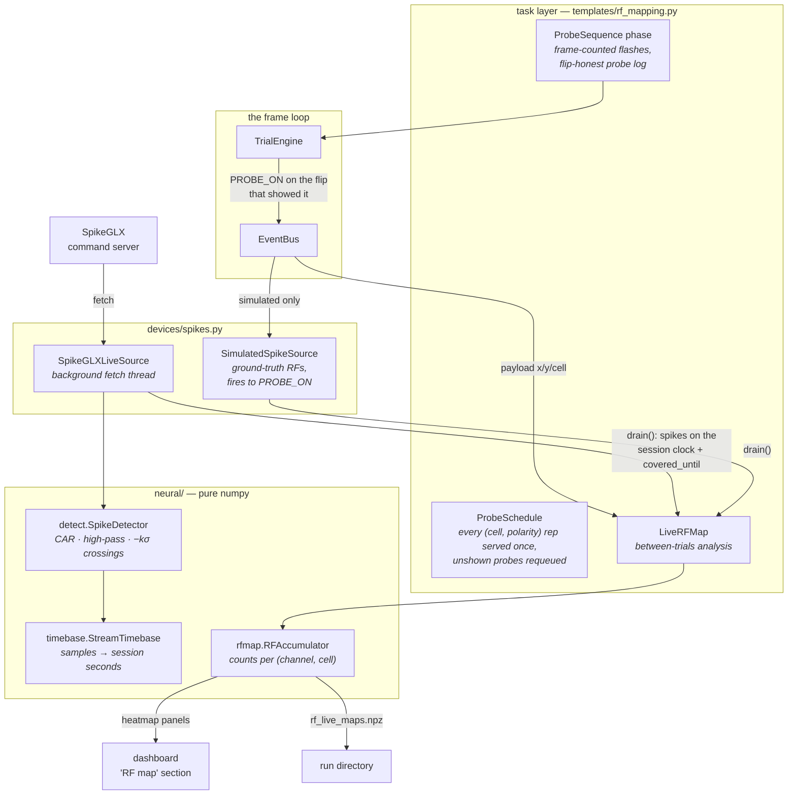
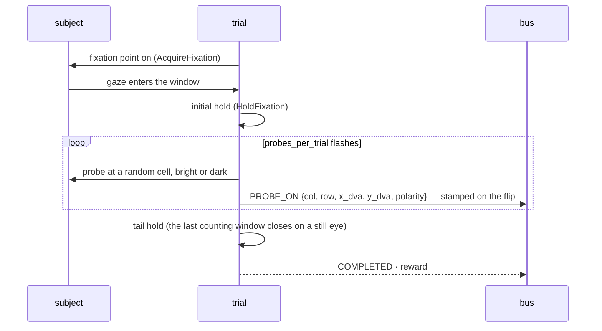

# RF mapping — the template tasks

*Ready-made receptive-field mapping for V1, V2, V4 and MT, with a live map
in the dashboard. The first entries in `alhazen.task.templates`: whole
tasks alhazen ships, registered like any experiment's, for the procedures
every physiology rig runs before its experiment can begin.*

```bash
pip install alhazen-vision
alhazen run --task rf-map-v1 --rig configs/rig-lab.yaml --sub m01 --ses 1
```

The subject holds fixation while bright and dark squares flash one at a
time at random cells of a grid. Spikes are counted in a fixed window after
each flash; counts per cell become a receptive-field map, per channel,
updating in the browser dashboard between trials — while the probe is
still in the brain and still movable.

## The pieces, and where they live



The layering carries the weight: `neural/` is pure arithmetic (importable
by the analysis machine, no sockets, no SDK), `devices/spikes.py` is a
device seam like any other (a protocol, a real backend, a simulated
sibling, a `make_spikes` factory), and the task template composes library
phases plus one phase of its own. The builder wires them — task code never
constructs hardware.

## The four presets

One base task, four sets of defaults scaled to the area's receptive
fields. Every number is a **starting point**: recording sites live at
particular eccentricities, and the grid should be re-centred and re-sized
for yours.

| task | grid | probe | flash / isi | counting window |
|---|---|---|---|---|
| `rf-map-v1` | 16×16 over 8° | 0.5° | 100 / 100 ms | 30–100 ms |
| `rf-map-v2` | 12×12 over 12° | 1.0° | 100 / 100 ms | 40–110 ms |
| `rf-map-v4` | 10×10 over 14° | 1.75° | 150 / 100 ms | 50–150 ms |
| `rf-map-mt` | 10×10 over 20° | 3.0° | 100 / 100 ms | 30–120 ms |

Flashed squares drive MT well enough to *place* fields; direction tuning
is a follow-up task's job, not a mapping grid's.

## One trial



Scheduling is **per probe, not per trial**. The schedule serves every
(cell, polarity) repetition exactly once across however many fixation
trials it takes; probes shown before a fixation break keep their data (the
flash happened, the spikes are real) and the unshown remainder goes to the
back of the queue. A subject that breaks often costs time, never coverage.
The per-cell tally lands in `*_paradigm.csv` at teardown.

The probe log is recorded three ways, deliberately redundant: every flash
is a flip-stamped `PROBE_ON` event (the record offline analysis uses),
every trial row carries the same log as `rf_probes_json` plus counts, and
the live map's final state is saved as `rf_live_maps.npz`.

## The live map

`LiveRFMap` is the task's *live analysis* — a seam any task can use
(`Task.live_analysis(wiring)`, see the architecture doc): the builder
hands it the rig's spike source, the runner drives it **between trials
only**, and its panels join the dashboard beside the built-in ones.

Between trials it drains the spike source and folds in every flash whose
counting window the stream has fully covered; flashes still inside the
detector's latency stay pending and fold in next trial, so the newest
flashes are never silently undercounted. The dashboard's "RF map" section
shows the pooled population map plus the most responsive channels (or the
channels `map_channels` pins), on one shared colour scale, with the
estimated field centre marked.

**What the live map is, and is not.** It counts *threshold crossings*
(`neural/detect.py`: optional common-average reference, a moving-average
high-pass, −4.5 σ crossings against a robust noise estimate) against a
*network clock estimate* (`neural/timebase.py`: minimum-offset over recent
fetches — sub-millisecond on a lab LAN, a few ms worst case, drift-bounded
by a sliding window). Both are fine inside a 50–150 ms counting window and
neither is the sorted analysis: the offline path recomputes the same maps
from Kilosort units and the TTL alignment (`analysis/rf.py`).

## Configuring the rig: `devices.spikes`

```yaml
devices:
  # where the SpikeGLX files land afterwards (the run pointer)...
  recording:
    backend: spikeglx
    data_dir: /mnt/acq/data
    run_glob: "*_g0"
  # ...and the live stream out of the same acquisition, for the map
  spikes:
    backend: spikeglx
    host: 192.168.1.50     # the acquisition machine
    port: 4142             # SpikeGLX: Options > Command Server Settings
    stream: imec0          # imec<N>, obx<N>, or nidq
    channels: all          # or "0:383", "0:127,256:383", "5,9,12"
    fetch_interval_ms: 200
    threshold_sigmas: 4.5
    car: true              # needs ≥16 monitored channels; refused otherwise
```

The live client uses the official SpikeGLX-CPP-SDK Python bindings
(`sglx_pkg`), which ship with the SDK rather than on PyPI — put its
`Python/sglx_pkg` package on the rig's `PYTHONPATH` with the built
`SglxApi` library beside it. The backend says exactly this if the import
fails. `alhazen check-rig` connects, confirms an acquisition is running
and reports the stream and channel count, then disconnects; a session
build does the same before the subject is in the chair, and refuses to
start against a SpikeGLX that is not acquiring.

The simulated sibling runs the whole pipeline with no hardware:

```yaml
devices:
  spikes:
    backend: simulated
    sim_channels: 6            # ground-truth RFs, auto-spread or pinned:
    # sim_rf_centers_dva: [[-7.0, -6.0], [-3.0, -2.0], ...]
    sim_rf_sigma_dva: 1.5
    sim_peak_hz: 120.0
    sim_baseline_hz: 3.0
```

It subscribes to the bus and fires to each `PROBE_ON` by the flash's
distance from its ground-truth centres — so a simulated session's
dashboard shows those exact fields being recovered, and the test suite
asserts *known field in, same field out* end to end.

## All six modes

The presets implement every mode hook, so an experiment inheriting one
gets the full set:

- **demo** — the grid's geometry (cells, probe size, both polarities) and
  the flash sequence at configured speed;
- **movie** — the probe sequence composited in numpy at the named rig's
  geometry, for a clip you can send;
- **simulate** — a fixating autopilot; pair with a `spikes: simulated` rig
  and the live map runs end to end (`examples/rf_mapping/rig-demo.yaml`
  opens the dashboard on exactly this);
- **test / run** — the session, shortened or real. One caveat, announced
  before the first trial rather than discovered during it: the automatic
  test-mode reduction finds `SchedulerConfig` trial counts, and this task
  schedules *probes* — so a rehearsal runs the full grid unless you hand it
  a smaller design (`--params` with, say, a 4×4 grid at one repetition);
- **measure** — taskless, as always.

## Using it from an experiment

Three levels of involvement, shown in `examples/rf_mapping/`:

1. **Run a preset as-is** — `alhazen run --task rf-map-v4 --rig ... `
   with a params YAML for the session's grid centre and repetitions.
2. **Subclass a preset** for your preparation:

    ```python
    from alhazen.task.templates.rf_mapping import V4RFMapParams, V4RFMapTask

    class ArrayV4MapParams(V4RFMapParams):
        grid_center_x_dva: float = -5.0   # the array's aggregate field
        grid_center_y_dva: float = -4.0

    class ArrayV4MapTask(V4RFMapTask):
        name = "rf-map-v4-array"
        params_model = ArrayV4MapParams
    ```

3. **Import the pieces** — `ProbeSequence`, `ProbeSchedule`, `LiveRFMap`,
   or the `neural` arithmetic — into a task of your own.

## Offline: the maps, properly

`analysis/rf.py` recomputes the maps from the records: the grid and the
counting window from the run's **own snapshot** (never re-declared by
hand), probe onsets from the flip-stamped events, spikes from Kilosort,
clocks aligned by the TTL pulses:

```python
from alhazen.analysis import rf
from alhazen.analysis.io.kilosort import read_kilosort
from alhazen.analysis.io.session import load_run
from alhazen.analysis.sync import align_run

run = load_run(run_dir)
fit = align_run(run, neural_run_dir)                # TTL clock alignment
spikes = read_kilosort(sort_dir, sample_rate_hz=30000.0)
maps, unit_ids = rf.map_from_spike_times(
    rf.probe_onsets(run),
    spike_times_s=fit.to_behavior(spikes.times_s),  # recording → session clock
    spike_labels=spikes.clusters,
    grid=rf.probe_grid(run),
    window_s=rf.counting_window(run),
)
on_maps, _ = rf.map_from_spike_times(
    rf.probe_onsets(run),
    spike_times_s=fit.to_behavior(spikes.times_s),
    spike_labels=spikes.clusters,
    grid=rf.probe_grid(run),
    window_s=rf.counting_window(run),
    polarity="bright",                              # ON and OFF subfields
)
```

Each flash's polarity travels in the event payload, so ON and OFF maps
are a filter, not a second session. The saved `rf_live_maps.npz` (counts,
flashes, edges, channel ids, window) is the live map's own record — QA for
the session, not a substitute for this.
