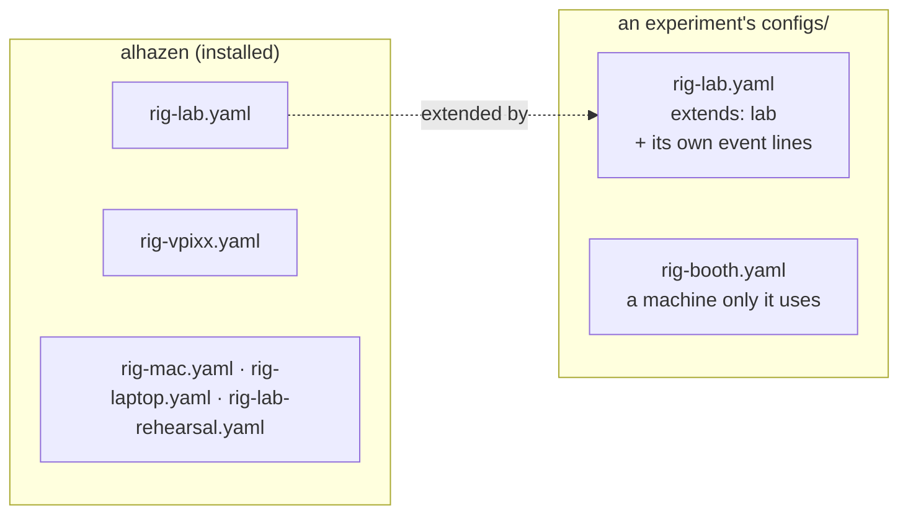
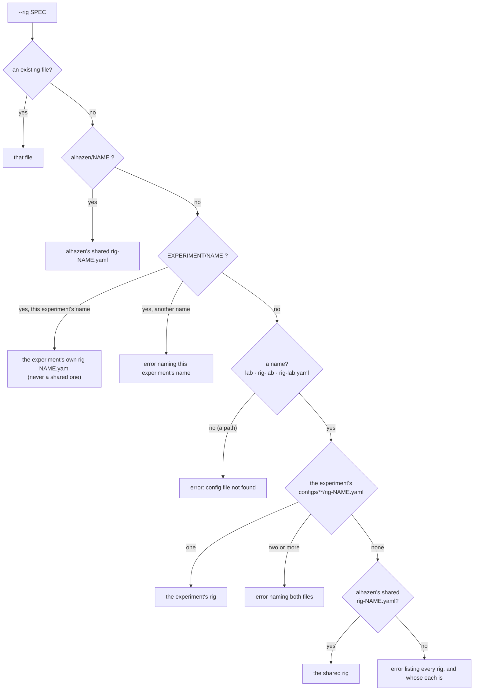
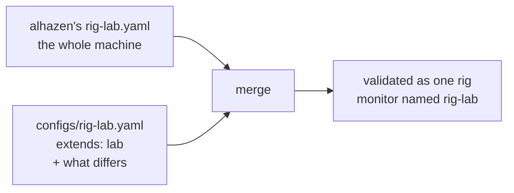
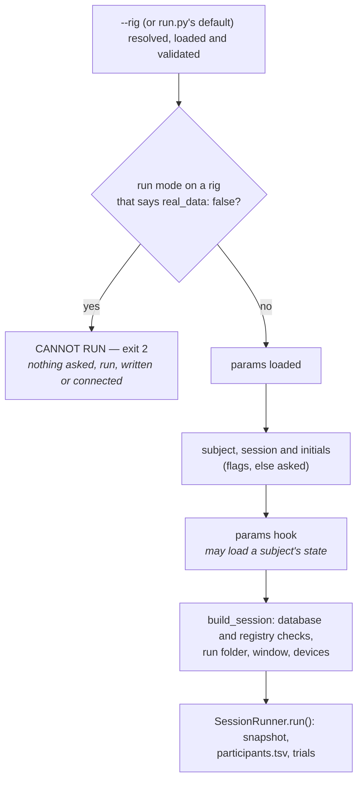

# Rigs

*What a rig file is, the rigs alhazen ships for every experiment to share,
how `--rig` finds one by name, and how an experiment builds its own rig on a
shared one.*

## 1. What a rig is

A **rig** is one YAML file describing one machine: its monitor (size, distance,
refresh rate), its display backend, its devices (eye tracker, reward line,
sync lines), whether the live monitor opens, and where its data goes. It says
nothing about what you are about to do on the machine — that is the
[mode](modes.md)'s business — so every mode takes every rig as it stands. The
one thing a rig does say is whether real data may be collected on it at all:
run mode refuses a development rig (§5).

A rig file is named `rig-<name>.yaml` (or `.yml`), and **the rig is called
`<name>`**: `rig-lab.yaml` is the rig `lab`.

Several experiments run on the same few machines. Each used to keep its own
copy of every one of them, and the copies drifted apart. So alhazen ships the
machines they share, and an experiment keeps only what is its own:



## 2. The shared rigs

They live in alhazen's installation (`alhazen/rigs/`), were taken from the
reference experiment's (amodal-averaging's) own files, and keep those files'
comments on why each setting is what it is.

| Name | Machine | For | Real data |
|---|---|---|---|
| `lab` | EyeLink 1000 on its own Host PC, a solenoid and four TTL lines on an NI DAQ, a photodiode corner | real sessions whose events a neural recording is aligned to; a monkey can be run here | collected |
| `lab-rehearsal` | none: `lab` with every device stood down to a simulated one | rehearsing the lab's checkout (`alhazen check-rig --rig lab-rehearsal --pulse`) and whole sessions away from the rig | refused |
| `vpixx` | the VPixx booth: VIEWPixx panel, TRACKPixx3 in the chassis, no reward or sync | real sessions with human volunteers | collected |
| `laptop` | the development laptop (Windows 11, its own 2560×1440 panel at 165 Hz, never the ultrawide beside it), no devices | writing and trying an experiment | refused |
| `mac` | a MacBook Pro 14", no devices | the same, on a Mac; replace its monitor numbers with yours (§4) | refused |

The last column is each file's `real_data:` line: run mode, the one mode that
records real data, refuses the three development rigs before anything is
written, and an experiment can still collect on one of those machines on
purpose (§5).

A shared rig names **no events**. The sync lines and the photodiode mark
events that a *task* declares, and a session refuses a rig naming an event its
task never declares (a pulse for an event that never fires is a TTL silently
missing from the recording). So as shipped, `lab`'s four sync lines pulse
nothing and its photodiode patch never flashes; an experiment adds its own
event names by extending it (§4). The EDF file name and a calibration limit
tighter than alhazen's 1.0° default are left to each experiment for the same
reason.

## 3. Naming a rig

Everything that takes `--rig` — `alhazen run`, an experiment's `run.py`,
`validate`, `check-rig`, `calibrate`, `monitor` — takes a **name** or a
**path**:

```bash
python run.py --task my-task --mode test --rig lab --sub dev --ses 1   # a name
alhazen check-rig --rig configs/rig-lab.yaml --pulse                  # a path still works
```

`lab`, `rig-lab` and `rig-lab.yaml` all mean the rig named `lab`. A path to a
file that exists always means exactly that file, as it did before names.
Otherwise the name is looked up in this order:



- **The experiment's own rig comes first.** An experiment rig *shadows*
  (hides) a shared rig of the same name: `--rig lab` is the experiment's lab.
  `--rig alhazen/lab` always means the shared one.
- **A name can say whose rig it is.** `alhazen/<name>` is a shared rig, and
  `<experiment>/<name>` is one of the experiment's own — `<experiment>` being
  its short name, the `[project] name` in its `pyproject.toml` (the folder's
  name when it has none): `--rig amodal-averaging/lab`. That spelling is the
  experiment's own rig and never falls back to a shared one. An experiment
  name that is not the one searched is refused, naming the right one; so is
  the spelling when no experiment folder is found to check it against. The
  experiment workspace and `alhazen rigs` show every rig this way; a bare
  name keeps working exactly as before.
- **Subfolders count.** `configs/rooms/rig-booth.yaml` is `booth`, as the
  workspace has always found rigs.
- **Two of the experiment's files with one name are an error**, naming both —
  whichever were picked, the other would be silently ignored. Rename one, or
  give the path of the one you mean.
- **Which experiment.** With a task — `alhazen run --task`, or an experiment's
  own `run.py` — it is the experiment the task's code belongs to: the folder
  holding its `pyproject.toml`, wherever the command is typed. With no task
  (`validate`, `check-rig`, `calibrate`, `monitor`, `alhazen rigs`, and
  `alhazen run --mode measure`) it is the current folder, as a relative path
  would be. A task installed from a wheel has no folder of its own; the
  current folder stands in.

`run_experiment(default_rig=...)` takes a name too: `default_rig="laptop"`
starts on the experiment's own laptop, else the shared one. It is what the
run.py `alhazen new` writes passes.

## 4. Extending a shared rig

An experiment rig may begin with `extends: <name>`, naming a shared rig, and
then say only what it does differently. The reference experiment's lab rig,
which used to be a whole file of its own, becomes:

```yaml
# configs/rig-lab.yaml — the shared lab, with this experiment's events and
# its tighter calibration limit.
extends: lab
display:
  photodiode:
    events: [STIM_ON]          # the patch flashes on stimulus onset
devices:
  eyetracker:
    edf_host_filename: amodal.EDF
    accuracy_max_deg: 0.5      # landing position is the dependent measure
  sync:
    event_lines:
      STIM_ON: Dev1/port0/line0
      GO_CUE: Dev1/port0/line1
      SACCADE_ONSET: Dev1/port0/line2
      LANDED: Dev1/port0/line3
```

Everything it does not mention — the monitor, the frame QA policy, the
reward line, the photodiode's corner — is the shared lab's.



How the two files merge:

| In the experiment's file | Effect |
|---|---|
| a section (a mapping), e.g. `devices: {eyetracker: {...}}` | merged key by key into the shared rig's section, down to the leaves |
| any other value: a number, a string, a list | replaces the shared rig's value; a list is replaced whole, not appended to |
| `null`, e.g. `devices: {reward: null}` | removes what the shared rig has there |
| an empty section, e.g. `devices: {}` | **refused**: in a whole file it means "none of these", but merged it would keep everything the shared rig has — the opposite, silently. Write the nulls instead |

The rules around it, each refused with the file named when broken:

- **Only a shared rig can be extended** — `lab` or `alhazen/lab`, never
  another of the experiment's rigs — so what a rig builds on is one file, the
  same wherever alhazen is installed.
- **A shared rig extends nothing**, so there is never a chain to follow.
- **The merged rig is validated** as a whole, and an error in it names both
  files. A typo in the experiment's file is still a typo.
- **The monitor is named after the experiment's file**
  (`configs/rig-booth.yaml` extending `lab` registers with PsychoPy as
  `rig-booth`), unless either file sets `monitor.name`.

Another monitor on the same kind of machine is an override too: a Mac other
than the shared one is `extends: mac` with a `monitor:` section of its own.

## 5. Real data only on a rig meant for it

Every experiment's `run.py` starts on the rig `laptop` when a command names no
`--rig`. Run mode drives a rig exactly as written, and the shared laptop has
no eye tracker, so a forgotten `--rig` used to open a fullscreen window, file
a run under the real `data/v<version>/`, register the subject, and get no
gaze — a gaze-contingent task then ends every trial `NO_FIXATION`, which is
re-served, until somebody quits. An experiment whose params hook carries state
across sessions (an adaptive search) also loaded that subject's real state and
saved it again. All of it was junk, filed where the analysis looks for
subjects.

So a rig says whether real data may be collected on it, in one line:

```yaml
real_data: false   # a development rig: run mode refuses it
```

A **development rig** is a rig whose settings say `real_data: false`: a
machine for writing, trying and rehearsing an experiment, not for collecting
its data. alhazen's shared rigs each say which they are:

| Rig | `real_data` | Why |
|---|---|---|
| `lab` | `true` | the lab rig: real tracker, reward and sync lines |
| `vpixx` | `true` | the VPixx booth: real panel and tracker, human volunteers |
| `laptop` | `false` | the development laptop: no tracker, a GPU shared with everything else (it drops frames as a matter of course), and a desk at no measured distance |
| `mac` | `false` | the same on a Mac, and its monitor numbers are an example MacBook's, not any measured panel's |
| `lab-rehearsal` | `false` | no machine at all: the lab with every device simulated and no window, so a run here would file a scripted participant's arithmetic as a subject. The lab it rehearses collects |

**The default is `true`.** A rig that does not say may collect, so every
experiment rig written before this — a booth only one experiment uses, a lab
rig written as a whole file — runs exactly as it did. **A rig that extends a
shared one inherits its answer**, like everything else it does not mention
(§4): `extends: laptop` is a development rig, `extends: lab` collects, and a
`real_data:` line in the experiment's file overrides either. The scaffold
(`alhazen new`) writes `real_data: false` into the Mac rig it generates and
`real_data: true` into its lab rig.

### What is refused, and when

Only run mode records real data (`Mode.writes_real_data`), so only run mode is
refused. Measure, demo, movie, simulate and test take a development rig as
they always have: test and simulate are what a development rig is for, and
their data goes to the rehearsal root.

The refusal comes as soon as the rig is read, before anything else a session
does:



So a refused session leaves nothing: no prompt to answer, no params hook run,
no run folder, no `participants.tsv` row, no database row, no subject state,
no window, no tracker connection. `build_mode_session` makes the same check
(a `ConfigError`) for code that starts a run-mode session itself, and the
experiment workspace makes it before a launch (§10).

The refusal names the rig, says it is a development rig, and says what to
type instead — the experiment's rigs that do collect, found the way
`alhazen rigs` finds them:

```text
CANNOT RUN: run mode records real data, and alhazen/laptop (alhazen's shared rig) is a development rig: its settings say `real_data: false`. Nothing was started and nothing was written.
  No --rig was given, so run.py started on its default rig.
  To record a subject, name the machine it sits at: --rig lab or --rig vpixx (the rigs here that collect real data).
  To try the session on this machine, use --mode test or --mode simulate; their data goes to the rehearsal root.
  To record real data on this machine on purpose, give the experiment its own configs/rig-laptop.yaml saying `extends: laptop` and `real_data: true` (docs/rigs.md §5).
```

### Collecting on a development machine, on purpose

A real pilot on the laptop — a keyboard-only task, say — is still possible,
and is said where it is recorded: the experiment's own rig file.

```yaml
# configs/rig-laptop.yaml — the keyboard pilot of October 2026 runs on the
# development laptop on purpose: real data, no tracker.
extends: laptop
real_data: true
```

`--rig laptop`, and run.py's default, find the experiment's own laptop before
the shared one (§3), so nothing else changes. Because the exception is a
file, it is version-controlled, says why in its own comment, and is part of
every run it records: the run folder's `rig.yaml` is the file as written, its
`rig-merged.yaml` the whole rig, and the snapshot's `config.rig` carries
`real_data: true`. There is deliberately no command-line flag for it: a flag
leaves nothing in the repository, has to be typed again at every session, and
is exactly the kind of thing a person in a hurry types to make an error go
away.

### Nothing is written before a refusal

The same promise holds for every check that can refuse a real session at its
start, not only this one. Most of them run before the run folder exists; a
few can only run once the window is open or a device is connected, after the
folder was made. Those leave nothing either: the build **removes what it
created**. `SessionPaths.create` notes the folders it made — the run folder,
its `figures`, and each level above that did not exist yet (`ses-…`,
`sub-…`, `v…`, even the data root) — and a build that fails removes them
again, deepest first, as does a session that is refused at its start before
its snapshot is written. Only folders it made itself, and only while they
hold nothing it did not make: a level that holds another run is left, and
alhazen never deletes a file. The data root is then exactly as it was, and
the run number is not spent (`next_run` counts folders).

Moving the folder's creation after those checks instead was weighed and
rejected: the runner's own check at the start (below) comes after the build
however late the folder is made, and "release what you acquired" is already
how the build treats the window and every device.

The one file a build used to write, the recording pointer
(`recording_pointer.yaml`), is now written right after the snapshot, so the
build itself writes no file at all.

| Refusal | Where | Before | Now |
|---|---|---|---|
| run mode on a development rig | the command line, before params | (new) | nothing written |
| a flag the mode refuses, a missing `--task`/`--sub`, an invalid rig or params file | the command line | nothing written | nothing written |
| no version to file under, a database from a newer alhazen, other initials for the subject, mid-trial reward with no dispenser, a simulated clock on a real display | `build_session`, before the run folder | nothing written | nothing written |
| the window refused (a framebuffer that is not the rig's size, Windows display scaling), a refresh rate that disagrees, a rig naming an event the task does not declare, a tracker or spike source that will not connect, a scheduler that refuses, `validate_after_break` with no tracker | `build_session`, after the run folder | an empty run folder, its number spent (with the pointer in it on a rig with a recorder, which then refused the number outright) | removed |
| another session registered the subject with other initials since the build; the snapshot cannot be written | `SessionRunner.run()`, before the snapshot | an empty run folder | removed |

An older database moved aside by `check_schema` is a migration, not a
refusal's leftover: it is kept, renamed, whatever happens next.

## 6. Listing them: `alhazen rigs`

```text
$ alhazen rigs
rigs for C:\projects\amodal-averaging (experiment amodal-averaging) — give --rig a NAME, with or without its owner, or the path to a rig file

  NAME                   SOURCE      FILE                    NOTE
  amodal-averaging/lab   experiment  configs/rig-lab.yaml    extends alhazen/lab
  alhazen/lab            alhazen     rig-lab.yaml            shadowed by the experiment's lab (reach this one with --rig alhazen/lab)
  alhazen/lab-rehearsal  alhazen     rig-lab-rehearsal.yaml
  alhazen/laptop         alhazen     rig-laptop.yaml
  alhazen/mac            alhazen     rig-mac.yaml
  alhazen/vpixx          alhazen     rig-vpixx.yaml

alhazen's shared rigs (alhazen 2.0.0) are in ...\site-packages\alhazen\rigs
```

Each rig is listed by its qualified name, owner first, which `--rig` takes
as it is (`--rig amodal-averaging/lab`); the bare name (`--rig lab`) means
the same rig. When the experiment's `pyproject.toml` cannot be read, the
folder's name stands in and a note on stderr says why.

`--project PATH` lists another experiment's. It exits 1 when a rig there would
be refused by name — a file that cannot be read, or two files sharing a name —
so a pre-session script can stop on it.

## 7. What a session records

The config snapshot's `sources` records the rig's **file** under `rig`, as it
always has, and beside it the rig's `rig_name` and its `rig_source`
(`experiment` or `alhazen`). The snapshot's `config.rig` is the merged rig, so
a session that ran on an extending rig is fully described without either file.

## 8. Measurements of a shared rig

`alhazen calibrate gamma` keeps its fit beside the rig's file, and measure mode
keeps its reports in `measurements/` beside it. A shared rig's file is inside
alhazen's installation, which a reinstall replaces, so for one of those they
are kept where the experiment's own file of that name would be —
`configs/rig-lab_gamma.yaml`, `configs/measurements/` — and found there again
by the shared rig, and by an experiment rig of that name if one is added later.
Run from a folder with no `configs/`, both refuse before measuring anything.

## 9. Moving an experiment onto the shared rigs

1. Delete a rig file that is identical to the shared one (`rig-laptop.yaml`,
   `rig-mac.yaml` in several experiments): `--rig laptop` then finds the
   shared rig.
2. Replace a rig that differs from a shared one in a few places with
   `extends:` and those places (§4). `alhazen validate --rig lab` shows the
   result loads, and `alhazen rigs` shows what extends what.
3. Keep whole files for machines only this experiment uses.

## 10. In the dashboard

The [experiment workspace](workspace.md)'s **Rig** menu lists every rig by
name — `lab`, not `rig-lab.yaml` — in two groups: **This experiment** and
**Shared (alhazen)**. The shared rigs are the ones the *project's* alhazen
ships, which registering the project asks its interpreter for; the workspace's
own alhazen may be another version. In the menu:

- an experiment rig that extends a shared one reads `lab · extends alhazen/lab`;
- a shared rig shadowed by the experiment's own reads
  `alhazen/lab (hidden by this experiment's lab)`, so the two `lab`s cannot be
  confused once the menu is closed;
- the summary under it describes the rig as it would run, merged, and says
  whose it is; a development rig (§5) adds **Real data: refused**.

In Run mode on a development rig the note under the launch button says,
before anything is launched, that the launch will be refused and what to
choose instead. The launch itself is refused by the workspace with the words
of §5, naming the rigs in the menu that do collect, before a run record or
anything else is written; the page shows them in its error banner.

A shared rig launches as `--rig alhazen/<name>`; an experiment rig as its
file. The run's `run.json` records `rig` (what was launched), `rig_name` and
`rig_source`, and the history shows the name. The run folder's `rig.yaml` is
the rig as it ran: the file itself for a whole rig, the merged rig for one
that extends — with the experiment's file as written beside it, as
`rig-source.yaml`.

Before a launch the workspace checks the rig, so one that cannot run is
refused before a run folder exists. It reads the rig as the project's alhazen
will: a project still on alhazen 1.x may call the live monitor's section
`dashboard:` (its name before 1.9, [live monitor](live_monitor.md)), and
launches; a project on 2.0 whose rig still says `dashboard:` is refused with
the message its own session would give, naming `live_monitor:`.

A project registered before the workspace listed shared rigs has none in its
menu, and the page says so: open **Project settings** and save to register it
again.
