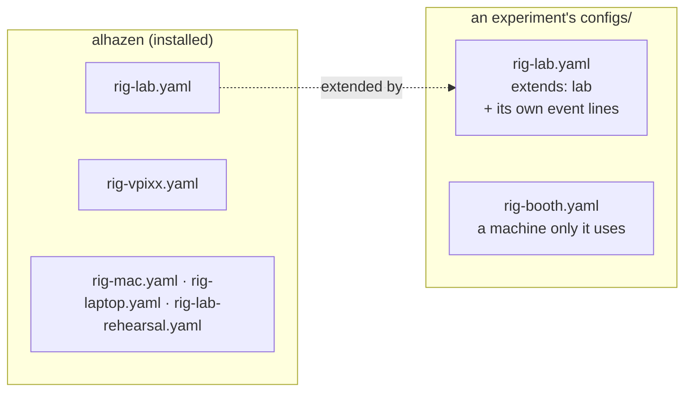
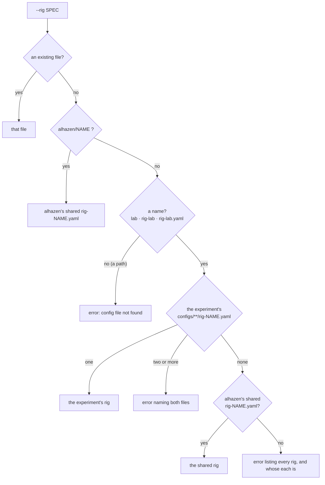
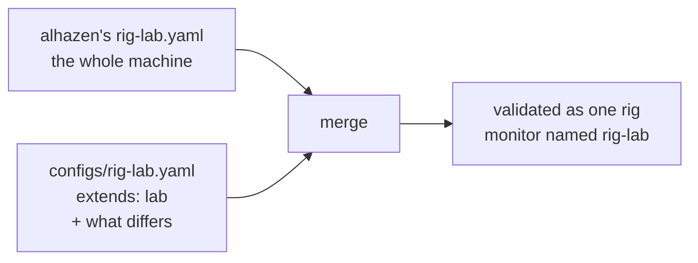

# Rigs

*What a rig file is, the rigs alhazen ships for every experiment to share,
how `--rig` finds one by name, and how an experiment builds its own rig on a
shared one.*

## 1. What a rig is

A **rig** is one YAML file describing one machine: its monitor (size, distance,
refresh rate), its display backend, its devices (eye tracker, reward line,
sync lines), whether the live monitor opens, and where its data goes. It says
nothing about what you are about to do on the machine — that is the
[mode](modes.md)'s business — so every mode takes every rig as it stands.

A rig file is named `rig-<name>.yaml` (or `.yml`), and **the rig is called
`<name>`**: `rig-lab.yaml` is the rig `lab`.

Several experiments run on the same few machines. Each used to keep its own
copy of every one of them, and the copies drifted apart. So alhazen ships the
machines they share, and an experiment keeps only what is its own:



## 2. The shared rigs

They live in alhazen's installation (`alhazen/rigs/`), were taken from the
reference experiment's (amodal-averaging's) own files, and keep those files'
comments on why each setting is what it is.

| Name | Machine | For |
|---|---|---|
| `lab` | EyeLink 1000 on its own Host PC, a solenoid and four TTL lines on an NI DAQ, a photodiode corner | real sessions whose events a neural recording is aligned to; a monkey can be run here |
| `lab-rehearsal` | none: `lab` with every device stood down to a simulated one | rehearsing the lab's checkout (`alhazen check-rig --rig lab-rehearsal --pulse`) and whole sessions away from the rig |
| `vpixx` | the VPixx booth: VIEWPixx panel, TRACKPixx3 in the chassis, no reward or sync | real sessions with human volunteers |
| `laptop` | the development laptop (Linux, 4096×2304 at 120 Hz), no devices | writing and trying an experiment |
| `mac` | a MacBook Pro 14", no devices | the same, on a Mac; replace its monitor numbers with yours (§4) |

A shared rig names **no events**. The sync lines and the photodiode mark
events that a *task* declares, and a session refuses a rig naming an event its
task never declares (a pulse for an event that never fires is a TTL silently
missing from the recording). So as shipped, `lab`'s four sync lines pulse
nothing and its photodiode patch never flashes; an experiment adds its own
event names by extending it (§4). The EDF file name and a calibration limit
tighter than alhazen's 1.0° default are left to each experiment for the same
reason.

## 3. Naming a rig

Everything that takes `--rig` — `alhazen run`, an experiment's `run.py`,
`validate`, `check-rig`, `calibrate`, `monitor` — takes a **name** or a
**path**:

```bash
python run.py --mode test --rig lab --sub dev --ses 1   # a name
alhazen check-rig --rig configs/rig-lab.yaml --pulse    # a path still works
```

`lab`, `rig-lab` and `rig-lab.yaml` all mean the rig named `lab`. A path to a
file that exists always means exactly that file, as it did before names.
Otherwise the name is looked up in this order:



- **The experiment's own rig comes first.** An experiment rig *shadows*
  (hides) a shared rig of the same name: `--rig lab` is the experiment's lab.
  `--rig alhazen/lab` always means the shared one.
- **Subfolders count.** `configs/rooms/rig-booth.yaml` is `booth`, as the
  workspace has always found rigs.
- **Two of the experiment's files with one name are an error**, naming both —
  whichever were picked, the other would be silently ignored. Rename one, or
  give the path of the one you mean.
- **Which experiment.** With a task — `alhazen run --task`, or an experiment's
  own `run.py` — it is the experiment the task's code belongs to: the folder
  holding its `pyproject.toml`, wherever the command is typed. With no task
  (`validate`, `check-rig`, `calibrate`, `monitor`, `alhazen rigs`, and
  `alhazen run --mode measure`) it is the current folder, as a relative path
  would be. A task installed from a wheel has no folder of its own; the
  current folder stands in.

`run_experiment(default_rig=...)` takes a name too: `default_rig="mac"` starts
on the experiment's own mac, else the shared one.

## 4. Extending a shared rig

An experiment rig may begin with `extends: <name>`, naming a shared rig, and
then say only what it does differently. The reference experiment's lab rig,
which used to be a whole file of its own, becomes:

```yaml
# configs/rig-lab.yaml — the shared lab, with this experiment's events and
# its tighter calibration limit.
extends: lab
display:
  photodiode:
    events: [STIM_ON]          # the patch flashes on stimulus onset
devices:
  eyetracker:
    edf_host_filename: amodal.EDF
    accuracy_max_deg: 0.5      # landing position is the dependent measure
  sync:
    event_lines:
      STIM_ON: Dev1/port0/line0
      GO_CUE: Dev1/port0/line1
      SACCADE_ONSET: Dev1/port0/line2
      LANDED: Dev1/port0/line3
```

Everything it does not mention — the monitor, the frame QA policy, the
reward line, the photodiode's corner — is the shared lab's.



How the two files merge:

| In the experiment's file | Effect |
|---|---|
| a section (a mapping), e.g. `devices: {eyetracker: {...}}` | merged key by key into the shared rig's section, down to the leaves |
| any other value: a number, a string, a list | replaces the shared rig's value; a list is replaced whole, not appended to |
| `null`, e.g. `devices: {reward: null}` | removes what the shared rig has there |
| an empty section, e.g. `devices: {}` | **refused**: in a whole file it means "none of these", but merged it would keep everything the shared rig has — the opposite, silently. Write the nulls instead |

The rules around it, each refused with the file named when broken:

- **Only a shared rig can be extended** — `lab` or `alhazen/lab`, never
  another of the experiment's rigs — so what a rig builds on is one file, the
  same wherever alhazen is installed.
- **A shared rig extends nothing**, so there is never a chain to follow.
- **The merged rig is validated** as a whole, and an error in it names both
  files. A typo in the experiment's file is still a typo.
- **The monitor is named after the experiment's file**
  (`configs/rig-booth.yaml` extending `lab` registers with PsychoPy as
  `rig-booth`), unless either file sets `monitor.name`.

Another monitor on the same kind of machine is an override too: a Mac other
than the shared one is `extends: mac` with a `monitor:` section of its own.

## 5. Listing them: `alhazen rigs`

```text
$ alhazen rigs
rigs for C:\projects\amodal-averaging — give --rig a NAME, or the path to a rig file

  NAME           SOURCE      FILE                    NOTE
  lab            experiment  configs/rig-lab.yaml    extends alhazen/lab
  lab            alhazen     rig-lab.yaml            shadowed by the experiment's lab (reach this one with --rig alhazen/lab)
  lab-rehearsal  alhazen     rig-lab-rehearsal.yaml
  laptop         alhazen     rig-laptop.yaml
  mac            alhazen     rig-mac.yaml
  vpixx          alhazen     rig-vpixx.yaml

alhazen's shared rigs (alhazen 2.0.0) are in ...\site-packages\alhazen\rigs
```

`--project PATH` lists another experiment's. It exits 1 when a rig there would
be refused by name — a file that cannot be read, or two files sharing a name —
so a pre-session script can stop on it.

## 6. What a session records

The config snapshot's `sources` records the rig's **file** under `rig`, as it
always has, and beside it the rig's `rig_name` and its `rig_source`
(`experiment` or `alhazen`). The snapshot's `config.rig` is the merged rig, so
a session that ran on an extending rig is fully described without either file.

## 7. Measurements of a shared rig

`alhazen calibrate gamma` keeps its fit beside the rig's file, and measure mode
keeps its reports in `measurements/` beside it. A shared rig's file is inside
alhazen's installation, which a reinstall replaces, so for one of those they
are kept where the experiment's own file of that name would be —
`configs/rig-lab_gamma.yaml`, `configs/measurements/` — and found there again
by the shared rig, and by an experiment rig of that name if one is added later.
Run from a folder with no `configs/`, both refuse before measuring anything.

## 8. Moving an experiment onto the shared rigs

1. Delete a rig file that is identical to the shared one (`rig-laptop.yaml`,
   `rig-mac.yaml` in several experiments): `--rig laptop` then finds the
   shared rig.
2. Replace a rig that differs from a shared one in a few places with
   `extends:` and those places (§4). `alhazen validate --rig lab` shows the
   result loads, and `alhazen rigs` shows what extends what.
3. Keep whole files for machines only this experiment uses.

## 9. In the dashboard

The [experiment workspace](workspace.md)'s **Rig** menu lists every rig by
name — `lab`, not `rig-lab.yaml` — in two groups: **This experiment** and
**Shared (alhazen)**. The shared rigs are the ones the *project's* alhazen
ships, which registering the project asks its interpreter for; the workspace's
own alhazen may be another version. In the menu:

- an experiment rig that extends a shared one reads `lab · extends alhazen/lab`;
- a shared rig shadowed by the experiment's own reads
  `alhazen/lab (hidden by this experiment's lab)`, so the two `lab`s cannot be
  confused once the menu is closed;
- the summary under it describes the rig as it would run, merged, and says
  whose it is.

A shared rig launches as `--rig alhazen/<name>`; an experiment rig as its
file. The run's `run.json` records `rig` (what was launched), `rig_name` and
`rig_source`, and the history shows the name. The run folder's `rig.yaml` is
the rig as it ran: the file itself for a whole rig, the merged rig for one
that extends — with the experiment's file as written beside it, as
`rig-source.yaml`.

Before a launch the workspace checks the rig, so one that cannot run is
refused before a run folder exists. It reads the rig as the project's alhazen
will: a project still on alhazen 1.x may call the live monitor's section
`dashboard:` (its name before 1.9, [live monitor](live_monitor.md)), and
launches; a project on 2.0 whose rig still says `dashboard:` is refused with
the message its own session would give, naming `live_monitor:`.

A project registered before the workspace listed shared rigs has none in its
menu, and the page says so: open **Project settings** and save to register it
again.
