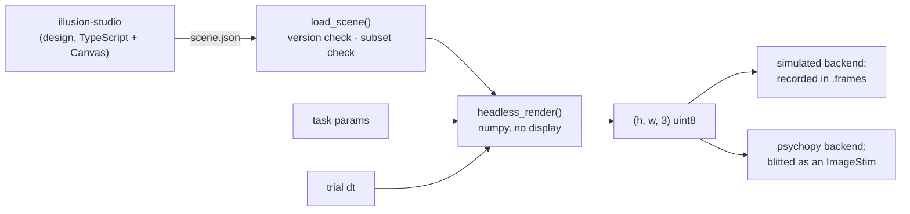

# Scenes: stimuli designed elsewhere, run unchanged

A **scene** is a JSON description of a stimulus — shapes, gratings, dot
fields, and expressions that animate them — designed in
[illusion-studio](https://github.com/sh4r11f/illusion-studio) and rendered
here inside a trial. The point is that the same file produces the same
picture in both places: designing a stimulus and running an experiment with
it stop being two implementations of the same idea.



## What alhazen renders

| Primitive | Rendered | Notes |
|---|---|---|
| `rect` | yes | fill, stroke, `cornerRadius` |
| `circle` | yes | fill, stroke |
| `ellipse` | yes | including `rotation` |
| `line` | yes | polyline, `strokeWidth`, `closed` |
| `polygon` | yes | fill and stroke |
| `stripes` | yes | `vertical`, `horizontal`, `both` |
| `grating` | yes | sine and square; `envelopeSigma` makes it a Gabor |
| `dotField` | yes | positions are a pure function of (seed, index, time) |
| `noise` | yes | uniform and gaussian, from the scene's own seed |
| `group` | yes | nested layers under a shared transform |
| `text` | **no** | glyphs depend on installed fonts, so it cannot be reproduced |
| `pixelProgram` | **no** | per-pixel interpreted code; use a dedicated primitive |
| `path`, `wedge`, `repeat` | **no** | no experiment has needed them yet |

Layer features: `opacity`, `visible` and `transform`
(translate/rotate/scale/origin) are rendered. `blend` modes, `clip` paths and
`ref()` cross-layer reads are **not**.

A scene using anything in the "no" column is **refused at load**, by name and
by path:

```
layers[2].element is a 'text', which is outside the subset alhazen renders
layers[2].element.x uses ref() — outside the subset alhazen renders
```

Refusing is the whole design. A renderer that silently skipped a text layer
would produce a stimulus that looks almost right, and "almost right" in a
psychophysics experiment is a result nobody can interpret.

Every expression in a scene is **compiled at load**, and every identifier in
it resolved against the function library, the builtin variables (`time`,
`dt`, `width`, `height`, `dpr`, `params`) and any names passed as
`load_scene(..., declared_params=[...])`. So a typo in a ternary branch this
session happens never to take is an error when the file is opened, not on the
frame that finally reaches it — which could be minutes into a session.
`scene_param_names(scene)` reports every `params.<name>` a scene reads, which
is how an experiment finds out what a scene wants before running one.

## Determinism

Same scene, same params, same time ⇒ same pixels. Three things make that
true:

- **The RNG is ported, not substituted.** `scenes/rng.py` is a bit-exact port
  of the studio's mulberry32, pinned by sequences generated from the
  TypeScript itself. `numpy.random` would give different — equally random,
  entirely other — dots.
- **Nothing reads a wall clock.** Scene time comes from the trial's `dt`, so
  two runs of the same trial show the same frames.
- **Dot fields have no incremental state.** A dot's position is computed from
  its index and the current time, so seeking to a moment gives what playing
  to it would.

## The expression language

Any numeric field can be `{"expr": "..."}`. It is a small language of its own
— arithmetic, comparisons, a ternary, a fixed function set, seeded noise — and
it is **parsed, never `eval`'d**: a scene is data from a file, and handing a
file to `eval` is handing it the interpreter.

Parity with the studio matters more than agreement with Python, so several
behaviours are deliberately JavaScript's:

| Expression | Here (and in the studio) | Plain Python would give |
|---|---|---|
| `round(2.5)` | 3 | 2 (banker's rounding) |
| `round(-2.5)` | −2 | −2 |
| `-1 % 3` | −1 (sign of the dividend) | 2 (sign of the divisor) |
| `mod(-1, 3)` | 2 | — (the language's own, always non-negative) |
| `-2 ** 2` | 4 (unary binds tighter) | −4 |
| `2 ** 3 ** 2` | 512 (right-associative) | 512 |
| `1 < 2` | 1.0 | True |
| `0 \|\| 7` | 7 (returns the operand) | 7 |

Every row is pinned by `tests/fixtures_expr_parity.json`, generated by running
the studio's own `expr.ts` under node — so these agree with what the
TypeScript does, not with a second reading of what it appears to do.

`time` is in **seconds**; `dt` is in **milliseconds**. That is the format's
quirk, kept exactly, so an expression written in the studio means the same
thing here.

## Pixel parity

`tests/unit/test_scenes_golden.py` renders the studio's own reference scenes
and compares against its committed PNGs — which were produced by Skia, a
production 2-D rasteriser. Measured, then pinned:

| scene | mean abs difference | pixels differing by > 8/255 |
|---|---|---|
| stripes | **0.00** (pixel-identical) | none |
| grating (sine) | 0.24/255 | none |
| gabor | 0.24/255 | none |
| circle | 0.15/255 | 0.6% |
| polygon | 0.18/255 | 1.3% |
| grating (square) | 2.27/255 | 0.8% |

Where the differences are, and why:

- **Anti-aliased rims.** Two rasterisers cannot agree pixel-for-pixel on an
  edge: where a boundary falls between pixels, one may write 200 and the
  other 55. That is the 0.6% on the circle and most of the 1.3% on the
  polygon. Interiors and flat fills are exact — there is a test asserting
  precisely that.
- **The square wave's transitions.** A square grating flips between two
  levels; half a pixel of difference at the flip is a whole-value difference
  at 0.8% of pixels.
- **Nothing else.** The procedural primitives match to within a single
  luminance level, because they are the same arithmetic on the same grid.

Getting there required matching two conventions exactly, both of which were
wrong on the first attempt and both of which are the kind of thing that
produces a stimulus that looks plausible and is not what was designed:

- a grating is sampled at **integer offsets from the patch centre**, not at
  pixel centres — half a pixel is a visible phase shift at a high spatial
  frequency;
- a positive stripe `offset` moves the pattern **left**, not right;
- a grating's amplitude is `127 × contrast` — a fixed fraction of the 8-bit
  range, so contrast means the same at every `baseLuminance`;
- stripes default to `period: 1`, `thickness: 1`, and bars are **not clipped**
  to the box in the direction they repeat;
- a polygon fills by **nonzero** winding, so a self-crossing outline has no
  hole in it;
- strokes are **centred** on the edge, lines have **butt** caps and **miter**
  joins, and `dash` runs along the whole path's arc length;
- layer `opacity` **replaces** the inherited alpha, so the innermost declared
  value wins;
- a `dotField` seeds a stream per dot, treats the first
  `round(count × coherence)` dots as the signal set, honours `lifetime` and
  `wrap`, and defaults `speed` to 60 px/s.

## Coordinates

A scene is written in logical pixels with y growing **down** from the
top-left, like a canvas. alhazen's screen is centered pixels with y growing
**up**. The conversion happens once, in `SceneStimulus.scene_to_screen` —
never inside the drawing code, which is why `render.py` can be read against
the scene format directly.

A scene declares its own canvas with the format's own top-level `width` and
`height`:

```json
{ "version": 1, "background": "#808080", "width": 400, "height": 400, "layers": [...] }
```

It is rendered at that size and **letterboxed** onto the screen: one scale
factor for both axes, so a 4:3 scene on a 16:9 screen gets bars at the sides
rather than being stretched into a stimulus whose spatial frequency differs by
axis. The factor is `stimulus.scale`, recorded rather than implicit — an
analysis converting a scene coordinate into degrees needs it — and
`stimulus.size_px` is the drawn rectangle. Pass `scale=` to override it; a
scene that declares no size is rendered at the screen's own size, where the
letterbox factor is exactly 1.

```python
stimulus.scene_to_screen(200, 0)   # the scene's top-centre, in centered px
```

An earlier version of alhazen read the size from an invented `canvas:
{width, height}` block. Scenes written against that still load, with a
warning; move the two fields up a level.

## Versioning

A scene carries `version`. alhazen renders version 1 and refuses anything
else, telling the user to open it in the studio and save it: the studio
carries the format's migrations, and alhazen deliberately does not fork them.

## Using one in a task

```python
from alhazen.scenes import SceneStimulus, load_scene

scene = load_scene(HERE / "drifting_gabor.json")
stimulus = SceneStimulus(setup.display, setup.screen, scene, params={"contrast": 0.8})
# ...then hand it to any phase that draws stimulus keys:
TrialPlan(phases=[...], stimuli={"scene": stimulus})
```

`examples/scene_stimulus/` is that, complete: a drifting Gabor shown inside a
fixation trial, with the experiment varying its orientation and the scene
file owning everything about how it looks.
