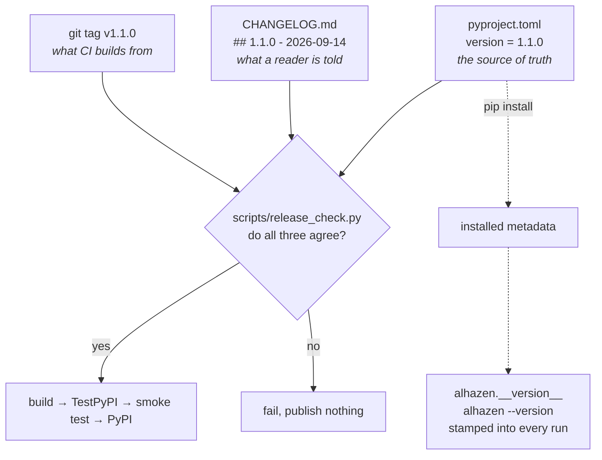
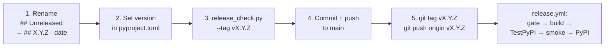

# Versioning and releases

*What alhazen's version number promises, where it is written down, and how a
release is cut. Every rule here is enforced by a test or a CI job — none of it
relies on remembering.*

## 1. What the number means

alhazen follows [semantic versioning](https://semver.org). Given `MAJOR.MINOR.PATCH`:

| Bump | Means | Example |
| --- | --- | --- |
| **MAJOR** | Something that used to work no longer does. Needs a migration note. | A run-directory file is renamed. |
| **MINOR** | New behaviour; everything that worked still works. | A new phase, a new scheduler, a new device backend. |
| **PATCH** | A fix, with no new surface. | A dropped-frame count that was off by one. |

**The public API** — the surface those rules apply to — is everything exported
from `alhazen` (its `__all__`) and everything documented in the
[API reference](reference.md). Anything starting with `_` is not public, and
neither is anything reachable only by importing a submodule the reference does
not list.

Three further things are compatibility contracts even though they are not
Python API, because they live **on disk** and outlast any one version. Section
3 covers them.

## 2. Where the number is written

There is one declared source of truth — `version` in `pyproject.toml` — and two
places that must agree with it. They cannot silently disagree, because nothing
gets built until a gate says they match:



The number is never typed into Python. `alhazen/version.py` reads it back out
of the installed package metadata, and everything else — `alhazen.__version__`,
`alhazen --version`, the config snapshot, a results manifest — calls that one
function. From a source tree with nothing installed it returns `"unknown"`,
which is deliberate: that string is stamped into data, and a guessed number
would misattribute someone's session to a version that never produced it.

### Why the gate exists

A published version number is spent forever. PyPI refuses a reupload, and an
experiment that pinned `alhazen==1.1.0` gets whatever was uploaded under that
name for the rest of time. Without the gate, `git tag v1.1.0` on a repo whose
`pyproject.toml` still says `1.0.0` builds and publishes **1.0.0**, silently,
under a tag claiming otherwise.

`scripts/release_check.py` runs in two modes:

- **No `--tag`** — do `pyproject.toml` and `CHANGELOG.md` agree right now?
  `tests/unit/test_versioning.py` runs this on every commit, so the two cannot
  drift apart between releases.
- **`--tag v1.1.0`** — the release-day question. Everything above, plus the tag
  names that same version, plus nothing is still sitting under `Unreleased`
  that the release notes would omit. `.github/workflows/release.yml` runs this
  before the build job.

## 3. The on-disk contracts

These outlast versions, so they get stricter rules than the Python API. All
three are pinned by `tests/unit/test_contracts.py` against a recorded baseline
in `tests/fixtures/contracts.json`.

| Contract | Rule | Breaking it costs |
| --- | --- | --- |
| **`core.rng.STREAMS`** | Append-only. Never remove, never reorder. | `spawn_streams` splits the session seed by a name's *position*, so a reorder changes what every past seed produces. Re-running a study's own seed would give different trials, with nothing to say why. |
| **`RESERVED_EVENTS`** | May gain names, never lose them. | An analysis reads these names out of data recorded years earlier. |
| **The run-directory layout** | File names, column meanings, manifest and snapshot formats change only in a MAJOR version, with a documented migration. | Every script anyone wrote to find a run's trials file. |

Adding to any of them is normal: append the stream, add the event, and update
`tests/fixtures/contracts.json` in the same commit. A test failing on a
*removal* is the contract doing its job.

### On-disk schema versions

Each format that a reader gates on carries its own integer. They are
independent of alhazen's version and of each other, they only ever go up, and
the baseline pins them so a decrement fails the suite — a lowered number would
make new files claim to be an older format and sail past the readers' checks.

| Format | Declared in | Now |
| --- | --- | --- |
| Experiment database | `session/database.py` (`SCHEMA_VERSION`) | 2 |
| Results bundle manifest | `analysis/results.py` (`SCHEMA_VERSION`) | 1 |
| Run manifest | `data/manifest.py` (`MANIFEST_SCHEMA_VERSION`) | 1 |
| Recording pointer | `devices/recording.py` (`POINTER_SCHEMA_VERSION`) | 1 |
| Training state | `training/state.py` (`SCHEMA_VERSION`) | 1 |
| Scene format | `scenes/model.py` (`SUPPORTED_VERSION`) | 1 |

## 4. Deprecating something

Nothing public disappears without a release in which it still works and says it
is going — experiment packages live in other repositories on other people's
schedules. One MINOR version of warning, then removal:

```python
from alhazen._deprecation import deprecated


@deprecated(since="1.1", removed_in="1.2", instead="Task.build_trial")
def old_thing(target):
    return target
```

The warning names the version it goes away in and what to use instead, because
one that says only "deprecated" leaves the reader exactly where they started.
For a single argument on a function that still exists, use
`warn_deprecated_argument` from inside the function.

## 5. Cutting a release



Steps 1 and 2 belong in the **same commit** — that is what the always-on check
enforces. Step 3 is the same gate CI will run; running it locally means a
mismatch costs an edit rather than a deleted tag.

```bash
# 3. before committing
python scripts/release_check.py --tag vX.Y.Z

# 5. after the release commit is on main
git tag vX.Y.Z
git push origin vX.Y.Z
```

The tag triggers `.github/workflows/release.yml`, which re-runs the gate, then
builds, publishes to **TestPyPI first**, installs the result on Linux, macOS
and Windows and imports it, and only then publishes to PyPI. A release that
cannot be installed is discovered by installing it — doing that on the real
index means living with the number forever.

If the gate fails after you have already pushed the tag, delete it
(`git push --delete origin vX.Y.Z`), fix the mismatch, and tag again. Nothing
was published, because the gate runs before the build.
