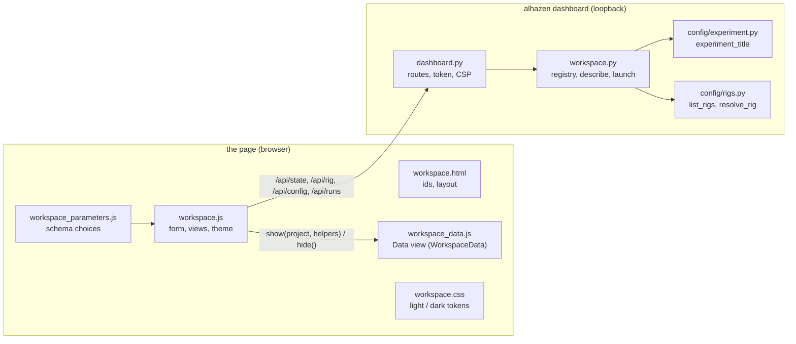
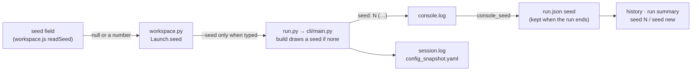
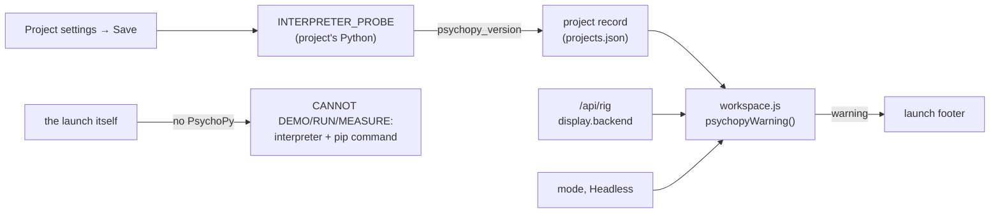
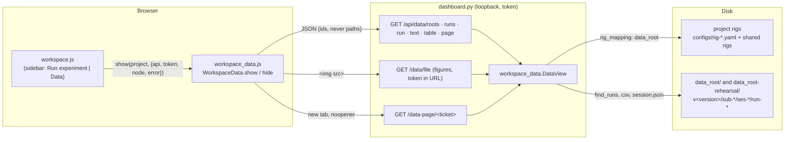

# Experiment workspace

`alhazen dashboard` opens a local web app for managing downstream Alhazen
experiments. The launcher is separate from the [live session monitor](live_monitor.md):
it configures and starts processes, while the monitor receives trial data and
keeps its existing keyboard-pause policy.

```bash
alhazen dashboard --project ~/projects/amodal-averaging --project ~/projects/kde-vergence
```

**On Windows, start it as `python -m alhazen dashboard`** (same arguments).
The `alhazen` command is a small `alhazen.exe` launcher in the environment's
`Scripts` folder, and Windows locks a running program's file: reinstalling
alhazen into that environment while a dashboard started as `alhazen dashboard`
is running fails part-way on the lock and can leave alhazen uninstalled there,
while the running dashboard carries on as if nothing happened. Started with
`python -m`, the dashboard holds only `python.exe`, which a reinstall never
touches.

The folders are remembered. Next time, `alhazen dashboard` is enough. Add more
with **Add experiment**, using the path to a checkout containing `run.py`.
Nothing is installed by registering a folder. Choose a Python interpreter in
**Project settings** if the experiment needs a particular conda environment or
virtual environment. Otherwise the launcher uses the project's `.venv` when
present, then its own interpreter. The project's `src/` and root are placed
first on the child's `PYTHONPATH`; nothing of the launcher's own installation
is, so the interpreter you choose must have `alhazen-vision` installed (an
experiment's `pyproject.toml` requires it). Registering a folder checks this by
importing alhazen with that interpreter, refuses with the reason when it
cannot, and records the alhazen and Python versions it found, and the
[shared rigs](rigs.md) that alhazen ships.

## The page



The sidebar lists the registered experiments by their **title**. An
experiment declares it in its `pyproject.toml`, read as a file (the
workspace never imports experiment code):

```toml
[tool.alhazen]
title = "Amodal averaging"
```

Without one, its short name stands in: the `[project] name` (the *slug*,
`amodal-averaging`), else the folder's name. The title heads the page, the
breadcrumb and the browser tab (`Amodal averaging · Alhazen`); the slug and
the folder follow under the heading in small print. A title that is there but
is not a non-empty string is reported in red under the heading, and the
experiment is shown under its slug meanwhile.

The selected experiment opens into two views, remembered per experiment:
**Run experiment** (the launch form, run output and history, below) and
**Data** (the experiment's recorded data; its content comes from
`workspace_data.js`, and the page says "Data inspection is not available"
when that script is missing).

The **Auto / Light / Dark** switch at the foot of the sidebar picks the
colours: Auto follows the operating system's light or dark setting, and the
choice is remembered in the browser. The framed live monitor is its own page
and keeps its own colours.

Dark is black: its colours are those of the owner's VS Code theme, *Deepdark
Material Theme | Full Black Version* — a #080808 page, a #0c0c0c sidebar and
cards edged in #3d3d3c, blue (#00a4f3) buttons and links, and the selected
experiment in yellow on grey (#f3c900 on #212121), as the theme shows a
selected item. Three colours depart from the theme so that text keeps a
contrast of 4.5:1 and a field's border 3:1 (WCAG AA): the text on the blue
button is near-black, not white (white on #00a4f3 is 2.8:1); the error red
is lightened from #f3002b to #f64262; and a field's border is #6d6d6d, not
the theme's #50504f. `workspace.css` lists every colour with the theme key
it comes from, and a test checks the contrast of every pair it draws.

## Configure and run

1. Select an experiment in the sidebar.
2. Choose a mode and its options. **Rig**, a section of its own, lists every
   rig by its owner and name — `amodal-averaging/lab` for the experiment's
   `configs/rig-lab.yaml`, `alhazen/mac` for a shared one — in two groups:
   **This experiment**, its `configs/rig-<name>.yaml` files (subdirectories
   and `.yml` included), and **Shared (alhazen)**, the rigs the project's
   alhazen ships ([Rigs](rigs.md)). The same spelling works on the command
   line (`--rig amodal-averaging/lab`). A shared rig the experiment's own rig
   of the same name hides is left out of the menu; the command line still
   reaches it as `--rig alhazen/lab`. The menu opens on the laptop — the
   development machine, a window and no devices: the experiment's own
   `configs/rig-laptop.yaml` when it has one, else `alhazen/laptop`, else the
   first rig listed. Under the menu, the rig's facts as it
   would run — merged, for one that extends — as a short list: **Screen**,
   **Size**, **Display**, **Live monitor**, and **Rig**, whose it is and the
   shared rig it extends (`amodal-averaging/lab · this experiment's
   configs/rig-lab.yaml · extends alhazen/lab`). A development rig — one
   whose settings say `real_data: false`, as the laptop the menu opens on
   does ([Rigs](rigs.md#5-real-data-only-on-a-rig-meant-for-it)) — adds
   **Real data: refused**. In **Run experiment** on such a rig, the note
   under the launch button says, as a warning, that the launch will be
   refused and what to choose instead; it does not disable the button. The
   launch itself is refused by the launcher before a run record or anything
   else is written, in the words the session itself would use and naming
   the rigs in the menu that do collect, and the page shows that in its
   error banner. Every other mode launches on a development rig as before.
   A project registered before shared rigs were listed shows none, and says
   so: save its **Project settings** to register it again.
3. **Task parameters**, below the rig, starts with the menu of the
   experiment's parameter files: the files in `configs/` whose names start
   with `task` or `params`, each shown without its `task-`/`params-` prefix
   and ending (`configs/task-pilot.yaml` is `pilot`, `configs/task.yaml` is
   `task`, `configs/presets/task-x.yaml` is `presets/x`; two files that would
   read the same show their paths). With a Task menu it opens on the selected
   task's own file — the one run.py's table names — and only that: a task
   whose entry names no file (`None`), or one the project lacks, opens on
   **No file (the task's own defaults)**, runs on the defaults in its code and
   launches without `--params`; the other files stay in the menu for a
   deliberate choice, never pre-selected. Without a task table it opens on
   `task.yaml`, else the first file. A launch with a file sends that file's
   (edited) values, so its run folder has its `params.yaml`. An experiment
   with no parameter file at all shows no menu: its task runs on the defaults
   written in its code (run.py's `default_params=` or the task's own), and
   launches without `--params`. When the task's parameter choices cannot be
   read (its code fails to import, or run.py builds `task_class` in a way the
   workspace cannot follow), a one-line reason is shown — the error's last
   line — with the full error folded under **Full error**.
4. Choose text parameters from dropdowns; text lists use dropdowns with
   checkboxes. Choices come from the task model's enums and defaults, keeping
   the current value available. Keyboard bindings offer common keys. Unbounded
   custom strings can still be entered through the **Text (YAML or JSON)**
   editor; switching to it from Fields shows the current values as JSON,
   which is valid YAML, and either notation may be typed. Numeric arrays use
   JSON notation in the fields editor. Search filters nested fields.
   Measure rig hides the task parameters entirely, as do standalone scripts
   without a parameter-file option. Hidden task parameters are not sent to
   those jobs.
5. Add any extra `run.py` arguments (below), and start the run. Run and test require a subject ID and the subject's **Initials**
   (1 to 5 letters, sent uppercase as `--initials`); simulate can use its own
   default subject and needs no initials. Initials that break the rule are
   refused on the page in the command line's words ("initials must be 1 to 5
   letters, such as HD"), and again by the launcher, before a run is made.
   They are recorded with the session — never in a file name — and checked
   against the subject's recorded initials: a subject id already recorded with
   other initials is refused ([data on disk](data.md) §2). The history and the
   run summary show who each session was for, `sub-01 · HD`. A project whose
   interpreter runs an alhazen older than 2.0 does not know `--initials`: its
   run and test launches stop at once with that usage error in the console,
   and the fix is to move the project to alhazen 2.0. Only simulate accepts
   headless, and only test accepts mouse gaze.
6. Follow the console or view generated media. Images can be enlarged or saved.
   Movies appear once recording finishes, with native playback and seeking.

### The random seed

**Random seed** starts empty, with the placeholder *new each run*. An empty
field sends no `--seed`, so a simulate, test or run session draws a fresh
seed, as `run.py` does when it is typed without one, and records it in
`session.log` and `config_snapshot.yaml`. Every session then gets its own
trial order, jitters and, where a task draws it, block order. A typed seed
is sent as `--seed`, which is how a session is repeated. Demo and movie use
seed 0 when the field is empty, as on the command line, and the field says
so. Measure and the experiment's own scripts take no seed, so the field is
hidden for them.

The history and the run summary show the seed each session ran with:
`seed 2718281828`, or `seed new` until the session has said which one it
drew. A session prints the seed before trial one:

```
seed: 2718281828 (drawn for this run; --seed 2718281828 repeats it)
```

The launcher reads that line from the run's console while the run is active,
and keeps it in `run.json` (`seed`) once the run ends. A run started with a
typed seed records that seed at launch. A run recorded before 2.3.0 shows the
seed its command passed, which was 0 unless one was typed; that is how the
sessions that all ran with seed 0 can be found. A project whose alhazen
predates the line never says, and its sessions stay `seed new`; the seed is
still in each run's `session.log`.



### PsychoPy: said before the launch, not after it

Registering a project (Add, or **Project settings → Save**) asks its
interpreter which alhazen, which Python and which PsychoPy it has. PsychoPy is
looked up, never imported (importing it takes seconds and starts its window
and audio libraries): `importlib.util.find_spec("psychopy")`, then the
installed version from its metadata. The project record keeps it as
`psychopy_version`: a version, `null` when the interpreter cannot import
PsychoPy, or absent for a project registered before the dashboard asked —
which means *unknown*, not *missing*.

When the chosen launch will open a PsychoPy window and the record says the
interpreter has none, the launch footer shows a warning naming the
interpreter and the fix: `pip install "alhazen-vision[psychopy]"` in that
environment, or another interpreter in Project settings. For an old record it
says the answer is unknown and asks for a re-registration. It warns and never
blocks, because which launches need PsychoPy is inferred from the modes:

| Launch | Opens a PsychoPy window |
|---|---|
| demo, measure | always, whatever the rig's display backend |
| test, run | when the rig's `display.backend` is `psychopy` (the default) |
| simulate | the same, unless **Headless** is ticked |
| movie, the experiment's own scripts | not known to; no warning |



A launch that goes ahead anyway without PsychoPy stops at once with one
message, whichever mode it is (`CANNOT DEMO:`, `CANNOT RUN:`,
`CANNOT MEASURE:`, `CANNOT CALIBRATE:`), naming the interpreter and the
command that installs PsychoPy into it — the same words the footer uses.

The six modes are **simulate**, **demo**, **movie**, **test**, **run** and
**measure**. Demo, test, run and measure still use a physical display and its
usual keyboard controls; the browser is not a replacement renderer. In demo,
use the viewer's screenshot control to send images to the run's gallery.
Movies use the task's `movie_clips` implementation and require the movie extra
in the selected interpreter. A mode a task has not implemented fails visibly
in its console, exactly as it would from `run.py`.

**Several tasks in one experiment.** A `run.py` that declares its tasks as a
table and hands it to alhazen —

```python
TASKS = {
    "mib-search": (MIBSearchTask, HERE / "configs" / "task-search-rdk.yaml"),
    "mt-tuning": (MTTuningTask, HERE / "configs" / "task-tuning.yaml"),
}
run_experiment(tasks=TASKS, default_rig=..., argv=sys.argv[1:])
```

— gets a **Task** menu. The page lists the table's names with the first
selected (or the one run.py's `default_task=` names, while a run.py still
passes that argument, deprecated since alhazen 2.5), reads the chosen task's
parameter choices, preselects that task's parameter file in the Task
parameters menu when the table names one, sends `--task <name>` right after
the mode on every launch, and shows the task beside the mode in the history.
Every session names its task, so no launch leaves `--task` out for run.py to
fill in: from alhazen 3.0 a command without it is refused. The
launcher reads the table from `run.py` itself (the way it finds rigs and
scripts), so it must be a module-level dict literal with string keys and, for
the preset, each entry's second element written as `HERE / "configs" / "x.yaml"`
(with `HERE` bound from `__file__`) or as a string path; a `tasks=` written
any other way is reported under the menu, with the shape expected, and a
launch of that project is refused with the same words. A `run.py` that
declares one task (`task_class=`) has no menu, and its launches are named all
the same: when the project's alhazen is 2.5 or later, the launcher sends
`--task` with the task's own name, which the task's parameter schema reports
(an older alhazen's `run.py` takes no `--task` for one task, so it is sent
none). A `--task` typed in the extra arguments names it instead, for an
experiment that reads its own. A launch whose task name cannot be read — the
schema fails to load, or `run.py` builds `task_class` where the file alone
cannot follow it — is refused, saying to type `--task <name>` in the extra
arguments. A project registered under an older alhazen keeps that version in
its record until **Project settings** is saved again.

**Extra run.py arguments** go to the experiment's entry point after the
launcher's own flags, in every mode. The field is split like a shell command
line: quote an argument that contains spaces, and write paths with forward
slashes, since a backslash escapes the character after it. It is how a runner
flag the form has no control for is given: `--curriculum configs/shaping.yaml`,
`--run 3`, or measure mode's `--skip` — and, for an experiment that reads its
own `--task` from the command line instead of declaring a table, how its task
is named. An extra argument naming a flag the launcher sets from the form is
refused, naming the flag, before anything is written, so a run's recorded
settings cannot be contradicted from the text field. Those flags are `--mode`,
`--rig`, `--params`, `--seed`, `--no-live-monitor-browser`, `--sub`, `--ses`,
`--initials`, `--trials-per-condition`, `--headless`, `--mouse`, `--windowed`, `--out`,
`--scale`, `--sheet`, `--columns`, `--clip` and `--screenshots`, in either the
`--seed 5` or the `--seed=5` spelling, and `--task` for a project with a Task
menu; every other flag passes through.

**Preview images** draws every stimulus an experiment declares, for an
experiment whose pyproject.toml names the function that draws them
(`[tool.alhazen] stimuli`; [How to](how-to.md#preview-an-experiments-stimuli)).
It runs `alhazen preview --project <experiment> --rig <rig> --out <run>/media`
in the project's interpreter: one PNG per stimulus and an index, at the
chosen rig's pixel scale. It takes no task and no parameter file, because
neither changes what an experiment shows, so the form hides the Task menu
and the parameter file for it. Its reserved flags are `--out`, `--rig` and
`--project`. It replaces the button the experiment's own `preview.py` would
get. A declaration that cannot be used keeps the button, and launching it
says why. The project's own alhazen must have the command; an older one
stops the run with `invalid choice: 'preview'` in its console.

For an experiment that declares no stimuli, the launcher discovers
standalone `src/<package>/preview.py` and `movie.py` modules when they
declare a literal `--out` argparse option and a `__main__` entry point.
**Preview images** then runs the experiment's own PNG generator; **Movie
script** runs its standalone recorder, which offers additional sheet options.
The launcher passes `--rig` and `--params` or `--task-config` when the script
supports them; those and `--out` are the flags reserved for a script, and
anything else it declares goes in the same extra-arguments field, whose help
lists the flags the script offers. Scripts that are only internal viewer
helpers (such as KDE's preview module) are not presented as runnable image
generators; use demo or movie instead.

Parameter choices are read from the class passed to `run_experiment(task_class=...)`
— or, with a Task menu, from the chosen entry of `run_experiment(tasks=...)` —
in a separate process using the project's selected Python interpreter. This
imports the task but does not execute the `run.py` main block or start a session.

Each launch writes an immutable parameter file when parameters were supplied,
a copy of the rig, the actual argument list and working directory, console
output, and its own media folder. Source configuration files are never edited.
The experiment's parameter model still validates values before a session
starts, so unsupported values produce the same errors as the CLI. An
experiment's rig is passed to the process at its original path, to preserve
relative-path semantics; a shared rig is passed by name, `--rig alhazen/lab`,
as it would be typed. The copy, `rig.yaml`, is the file itself for a whole
rig; for a rig that extends a shared one it is the merged rig — the one file
alone would not say what ran — with the experiment's file as written kept
beside it as `rig-source.yaml`. `run.json` records the rig launched (`rig`),
its name (`rig_name`) and whose it is (`rig_source`: `experiment` or
`alhazen`), and the history shows the qualified name (`amodal-averaging/lab`,
`alhazen/lab`). It also records the session's `seed` ([above](#the-random-seed)).
Session data retains the experiment's normal real/rehearsal paths.

Only one job runs at a time in a workspace. **Stop run** interrupts the run:
SIGINT to its process group on POSIX, a console break (`CTRL_BREAK_EVENT`) on
Windows, which `alhazen run` and every `run.py` built on `run_experiment` turn
into the same `KeyboardInterrupt` as Ctrl+C. The session then tears down as
usual — trials file, manifest, tracker recording — and has thirty seconds to
finish, because an EyeLink EDF transfer plus manifest hashing can take that
long. A run still alive after that is killed: its status becomes **killed**
rather than **cancelled**, its `run.json` records `"stopped": "forced"`, and its
console log ends with a line saying the data may be incomplete. Standalone
preview and movie scripts do not go through `run_experiment`, so a break ends
them at once. Closing the browser does not stop a run; Ctrl+C in the launcher
terminal does. Runs and their output survive restart. A job left marked
running after an unexpected server exit is shown as **interrupted**, not
successful; inspect the OS for surviving processes before restarting hardware
after a crash. On Windows the break is delivered at the run's next Python
statement (a blocking wait delays it), and a forced termination ends the direct
child only; descendants may need to be stopped separately.

## Live monitor

The [live session monitor](live_monitor.md) is a separate loopback server that the
session process starts when the rig has `live_monitor.enabled: true`; the runner
prints its address on the console before trial one (`live monitor: http://127.0.0.1:…`)
and the launcher relays it. The Run output card's
**Live monitor** tab embeds that page while the run is active, so the session's
trials, eye-tracker panels and pause menu are watched from the workspace
without a second browser tab. **Open monitor in new tab ↗** beside the tabs
opens the same page on its own. The monitor keeps its own token and its
pause-only controls; the workspace adds nothing to them, and the launcher
passes `--no-live-monitor-browser` so the session does not open a browser of its
own as well.

For a run started from the workspace, the tab is brought up automatically the
first time its monitor URL appears; a run picked from the history keeps whatever
tab is open. Before the URL appears, the tab says that it is waiting for the
session to open its monitor — or, when the selected rig has
`live_monitor.enabled: false` (the default for a rig without the block), that the
setting must be turned on in the rig YAML. The rig summary under the rig menu
shows the same fact as **live monitor: on/off** — for a rig that extends a
shared one, the setting of the merged rig.

The monitor's server closes with the session. Once the run has finished, the
frame is emptied and replaced by a note: the monitor's final state was saved in
the run's data directory as `figures/live_monitor.html` (and
`figures/live_monitor_state.json`), which opens on its own with no server. A
run recorded by a project on an alhazen before 2.0 has them under their old
names, `figures/dashboard.html` and `figures/dashboard_state.json`, and the
note names both. A browser error page for a server that no longer exists is
never left in the tab.

Embedding needs the monitor to allow being framed, so its responses carry
`frame-ancestors 'self' http://127.0.0.1:* http://localhost:*` in their
Content-Security-Policy: local pages may frame it, nothing else may. The frame
is sandboxed (`allow-scripts allow-same-origin allow-downloads allow-modals`):
the monitor page runs its own script against its own server, can save a figure
and show a dialog, and cannot navigate the workspace or open windows from it.
Running `python run.py` from a terminal is unchanged: the monitor then opens in
its own browser tab as before.

## Data

Each experiment's **Data** view reads the sessions it has saved: pick a data
folder, browse its runs, open one and load its trials. It only reads —
nothing in a data folder is changed — and it imports none of the
experiment's code.

### How it fits together



The page's navigation opens the view with
`window.WorkspaceData.show(projectRecord, {api, token, node, error})` and
leaves it with `WorkspaceData.hide()`; the view fills `<div id="data-view">`
by creating elements, never by writing markup, since everything it shows
comes from files.

### Data folders

A project does not say where its data goes; its rigs do. The folders offered
are, for every rig in the Rig menu (the experiment's own and the shared ones
its alhazen ships), the rig's `data_root` — merged, for a rig that
`extends` a shared one, exactly as a launch merges it — resolved against the
project folder when relative, plus its rehearsal sibling
`<data_root>-rehearsal`, where test and simulate write ([Modes](modes.md)).
Each folder is labelled with the rigs that write there and whether it holds
real or rehearsal data. Only folders that exist are offered; the others are
listed under a closed "N more data folders not created yet". A rig that
cannot be read, or names no `data_root`, is named at the top rather than
skipped.

### Runs

The run table lists every run folder `alhazen.data.find_runs` finds in the
folder, in both layouts: version (`pre-2.0` for a run recorded before
alhazen 2.0, which has no version folder), subject and initials, session,
run, task, mode, date, number of trials, rig. The fields come from the run's
`session.json`, or for a pre-2.0 run from its `config_snapshot.yaml` (which
has no mode). The trial count is `report.yaml`'s when the run wrote one, and
otherwise the trials file's lines, shown as `≈N` (its tooltip says so): listing counts lines rather
than parsing a CSV, so a folder of hundreds of runs lists quickly. Menus
filter by version, subject and task. A run whose records cannot be read is
still listed, flagged ⚠, and its problem is said under the table.

Clicking a run opens it: a summary of `session.json` (experiment and version,
task, mode, subject, session and run, seed, when, rig, params file, alhazen),
the files in the folder, buttons that show its text records
(`session.json`, `config_snapshot.yaml`, `rig.yaml`, `rig-source.yaml`,
`params.yaml`, `report.yaml`, `manifest.yaml`, and the last 64 KiB of
`session.log`; other files are listed, not shown), the images under
`figures/`, and **Open saved live monitor ↗** for
`figures/live_monitor.html` (`figures/dashboard.html` before 2.0).

### Tables

**Load trials table** loads the run's `*_trials.csv`; the menu beside it
picks the events, frames or paradigm table instead. Check several runs and
**Load and pool** to read one table from all of them: the rows are stacked,
the columns are the union of the files' (a run without one gets empty
cells), and three columns are added in front — `run` (the folder's id),
`subject`, `session` — so pooled rows stay distinguishable. A CSV column
with one of those names keeps it, and the added one is called
`subject (folder)`. Headers sort (numerically for a numeric column; empty
cells last), the text box keeps the rows in which any cell contains the text,
and the count says how many rows match. The first 500 matching rows are
drawn; sorting and filtering bring the others up.

At most 50 000 rows are sent per load, pooled runs together; a table cut
there says so, with the file's full count. A file that cannot be parsed (a
cell over the csv module's size limit, a file that is not UTF-8, an empty
file) fails the load with the run, the file and the line named. A row with
more or fewer cells than the header is kept, padded or cut to the header,
and named.

**Numbers are parsed in the browser.** The server sends each cell as the
CSV's own text: a CSV has no types, and the page decides per column whether
it sorts by value. A cell is a number when it looks like one (`0x10` and
`Infinity` do not), `True` and `False` (how the trials file writes a
boolean) are 1 and 0, an empty cell is missing, and anything else is text.
A column sorts by value when every non-empty cell is a number, and as text
otherwise.

### Safety

Every route is read-only, on loopback, and needs the workspace token (an
`` carries it in its URL, like the gallery's media). The browser sends
only ids: a data folder's id (computed by the server from the rigs and
looked up again on every request), a run's path relative to that folder, a
file's name relative to the run. A run id must have a run folder's shape
(`[v<version>/]sub-<ID>/ses-<NNN>/run-<NN>…`), and every path is resolved,
symlinks included, and refused when it leaves its folder. Text is served
only for the records listed above; files only for images under `figures/`,
under a `sandbox` Content-Security-Policy so an SVG's script can never run
as the workspace.

The saved live monitor page is a self-contained file with inline script,
which the workspace's own policy forbids, and it reads `sessionStorage`,
which a sandboxed page cannot. So it is served under its own policy — inline
script and style, and nothing else: no requests, frames or forms — and
reached through a random link valid for two minutes, not the token: an
address opened in a tab is readable by the page and kept in the browser's
history, and the token must be in neither. The tab is opened with
`noopener`, so it gets nothing of the workspace's tab.

### Experiment figures (planned)

An experiment will later be able to declare its own analysis figures —
functions of one or several run folders that return a figure — and the Data
view will show them in a card of their own, under the table. Because the
workspace never imports experiment code, those functions will run in the
project's own interpreter, the way the parameter schema is read today
(`workspace._read_schema`), through a new route in `workspace_data.py`; the
view only lists and shows the images they produce, as the Run card shows a
run's `figures/` today. The places to extend are marked in both files'
header comments.

## Storage and local access

By default, state is under `~/.alhazen/live_monitor/`:

```text
projects.json
runs/<unique-id>/
  run.json          # the command, status — and subject, session, initials for a session
  params.yaml       # when supplied
  rig.yaml          # the rig as it ran (merged, when it extends a shared one)
  rig-source.yaml   # the experiment's file as written, when it extends one
  console.log
  media/
```

Use `--state-dir PATH` for a different workspace, `--port PORT` for a fixed
port, or `--no-browser` to print the URL without opening it. One server holds a
workspace at a time: a second `alhazen dashboard` on the same workspace is refused,
and the refusal names the process that has it and the address of its page, so you
can open that page, stop that process, or start another workspace with
`--state-dir`. The UI requires
no Node server, build step or internet resources. Its assets ship in the Python
wheel, the font among them: text is set in Nunito (SIL Open Font License,
`cli/assets/fonts/OFL.txt`), a Latin subset of the variable font from the
google/fonts repository, served by the dashboard itself (`/fonts/…`, CSP
`font-src 'self'`), with the system's sans-serif as the fallback. The logo is
an inline SVG in the page and, standalone, the tab's icon (`/favicon.svg`): an
A painted in the Ouchi illusion — a checkerboard of 4:1 bricks laid
horizontally, and inside the letter the same bricks upright and shifted by
half a brick, so the A shows only through the change of orientation. The
letter is the outline of Nunito's capital A at weight 800, kept as an SVG path
rather than text, so it looks the same in every browser and in the favicon
(which cannot load the page's font). The sidebar draws it at 56 px with bricks
one pixel wide; the favicon uses bricks nearly twice as wide, because a
browser tab draws it at 16-32 px.

The server binds to `127.0.0.1` only and authenticates API/media requests with
a random per-server token. The opening URL carries it in a fragment, which
the page removes and stores for reloads. Host and origin checks reject remote
web pages; media is limited to supported image/video files inside each run's
output directory, including symlink resolution. Byte-range responses allow
video seeking. Requests are limited to 1 MiB and the visible console is the
last 64 KiB; the complete log remains on disk. The gallery lists up to 500
artifacts per run.

Only add trusted local experiment repositories: launching one executes its
Python code with your account's permissions. This app is a local launcher,
not a remote multi-user service or a sandbox for untrusted experiments.
