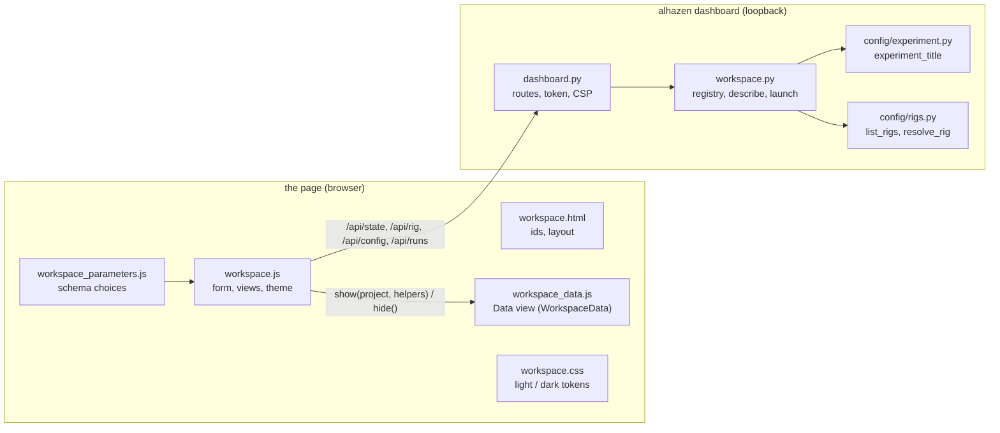

# Experiment workspace

`alhazen dashboard` opens a local web app for managing downstream Alhazen
experiments. The launcher is separate from the [live session monitor](live_monitor.md):
it configures and starts processes, while the monitor receives trial data and
keeps its existing keyboard-pause policy.

```bash
alhazen dashboard --project ~/projects/amodal-averaging --project ~/projects/kde-vergence
```

The folders are remembered. Next time, `alhazen dashboard` is enough. Add more
with **Add experiment**, using the path to a checkout containing `run.py`.
Nothing is installed by registering a folder. Choose a Python interpreter in
**Project settings** if the experiment needs a particular conda environment or
virtual environment. Otherwise the launcher uses the project's `.venv` when
present, then its own interpreter. The project's `src/` and root are placed
first on the child's `PYTHONPATH`; nothing of the launcher's own installation
is, so the interpreter you choose must have `alhazen-vision` installed (an
experiment's `pyproject.toml` requires it). Registering a folder checks this by
importing alhazen with that interpreter, refuses with the reason when it
cannot, and records the alhazen and Python versions it found, and the
[shared rigs](rigs.md) that alhazen ships.

## The page



The sidebar lists the registered experiments by their **title**. An
experiment declares it in its `pyproject.toml`, read as a file (the
workspace never imports experiment code):

```toml
[tool.alhazen]
title = "Amodal averaging"
```

Without one, its short name stands in: the `[project] name` (the *slug*,
`amodal-averaging`), else the folder's name. The title heads the page, the
breadcrumb and the browser tab (`Amodal averaging · Alhazen`); the slug and
the folder follow under the heading in small print. A title that is there but
is not a non-empty string is reported in red under the heading, and the
experiment is shown under its slug meanwhile.

The selected experiment opens into two views, remembered per experiment:
**Run experiment** (the launch form, run output and history, below) and
**Data** (the experiment's recorded data; its content comes from
`workspace_data.js`, and the page says "Data inspection is not available"
when that script is missing).

The **Auto / Light / Dark** switch at the foot of the sidebar picks the
colours: Auto follows the operating system's light or dark setting, and the
choice is remembered in the browser. The framed live monitor is its own page
and keeps its own colours.

## Configure and run

1. Select an experiment in the sidebar.
2. Choose a mode and its options. **Rig**, a section of its own, lists every
   rig by its owner and name — `amodal-averaging/lab` for the experiment's
   `configs/rig-lab.yaml`, `alhazen/mac` for a shared one — in two groups:
   **This experiment**, its `configs/rig-<name>.yaml` files (subdirectories
   and `.yml` included), and **Shared (alhazen)**, the rigs the project's
   alhazen ships ([Rigs](rigs.md)). The same spelling works on the command
   line (`--rig amodal-averaging/lab`). An experiment rig that extends a shared
   one says so (`amodal-averaging/lab · extends alhazen/lab`). A shared rig the
   experiment's own rig of the same name hides is left out of the menu, and
   the note under it names it and how the command line still reaches it
   (`--rig alhazen/lab`). The summary under the menu describes the rig as it
   would run — merged, for one that extends — and says whose it is. A project
   registered before shared rigs were listed shows none, and says so: save its
   **Project settings** to register it again.
3. **Task parameters**, below the rig, starts with the menu of the
   experiment's parameter files: the files in `configs/` whose names start
   with `task` or `params`, each shown without its `task-`/`params-` prefix
   and ending (`configs/task-pilot.yaml` is `pilot`, `configs/task.yaml` is
   `task`, `configs/presets/task-x.yaml` is `presets/x`; two files that would
   read the same show their paths). It opens on the selected task's own file,
   else `task.yaml`, else the first file, and every launch sends that file's
   (edited) values, so every run folder has its `params.yaml`. An experiment
   with no parameter file at all shows no menu: its task runs on the defaults
   written in its code (run.py's `default_params=` or the task's own), and
   launches without `--params`.
4. Choose text parameters from dropdowns; text lists use dropdowns with
   checkboxes. Choices come from the task model's enums and defaults, keeping
   the current value available. Keyboard bindings offer common keys. Unbounded
   custom strings can still be entered through the **Text (YAML or JSON)**
   editor; switching to it from Fields shows the current values as JSON,
   which is valid YAML, and either notation may be typed. Numeric arrays use
   JSON notation in the fields editor. Search filters nested fields.
   Measure rig hides the task parameters entirely, as do standalone scripts
   without a parameter-file option. Hidden task parameters are not sent to
   those jobs.
5. Add any extra `run.py` arguments (below), and start the run. Run and test require a subject ID and the subject's **Initials**
   (1 to 5 letters, sent uppercase as `--initials`); simulate can use its own
   default subject and needs no initials. Initials that break the rule are
   refused on the page in the command line's words ("initials must be 1 to 5
   letters, such as HD"), and again by the launcher, before a run is made.
   They are recorded with the session — never in a file name — and checked
   against the subject's recorded initials: a subject id already recorded with
   other initials is refused ([data on disk](data.md) §2). The history and the
   run summary show who each session was for, `sub-01 · HD`. A project whose
   interpreter runs an alhazen older than 2.0 does not know `--initials`: its
   run and test launches stop at once with that usage error in the console,
   and the fix is to move the project to alhazen 2.0. Only simulate accepts
   headless, and only test accepts mouse gaze.
6. Follow the console or view generated media. Images can be enlarged or saved.
   Movies appear once recording finishes, with native playback and seeking.

The six modes are **simulate**, **demo**, **movie**, **test**, **run** and
**measure**. Demo, test, run and measure still use a physical display and its
usual keyboard controls; the browser is not a replacement renderer. In demo,
use the viewer's screenshot control to send images to the run's gallery.
Movies use the task's `movie_clips` implementation and require the movie extra
in the selected interpreter. A mode a task has not implemented fails visibly
in its console, exactly as it would from `run.py`.

**Several tasks in one experiment.** A `run.py` that declares its tasks as a
table and hands it to alhazen —

```python
TASKS = {
    "mib-search": (MIBSearchTask, HERE / "configs" / "task-search-rdk.yaml"),
    "mt-tuning": (MTTuningTask, HERE / "configs" / "task-tuning.yaml"),
}
run_experiment(tasks=TASKS, default_task="mib-search", default_rig=..., argv=sys.argv[1:])
```

— gets a **Task** menu. The page lists the table's names with the default
selected, reads the chosen task's parameter choices, preselects that task's
parameter file in the Task parameters menu when the table names one, sends `--task <name>`
right after the mode, and shows the task beside the mode in the history. The
launcher reads the table from `run.py` itself (the way it finds rigs and
scripts), so it must be a module-level dict literal with string keys and, for
the preset, each entry's second element written as `HERE / "configs" / "x.yaml"`
(with `HERE` bound from `__file__`) or as a string path; a `tasks=` written
any other way is reported under the menu, with the shape expected, and a
launch of that project is refused with the same words. A `run.py` that
declares one task (`task_class=`) has no menu and takes no task.

**Extra run.py arguments** go to the experiment's entry point after the
launcher's own flags, in every mode. The field is split like a shell command
line: quote an argument that contains spaces, and write paths with forward
slashes, since a backslash escapes the character after it. It is how a runner
flag the form has no control for is given: `--curriculum configs/shaping.yaml`,
`--run 3`, or measure mode's `--skip` — and, for an experiment that reads its
own `--task` from the command line instead of declaring a table, how its task
is named. An extra argument naming a flag the launcher sets from the form is
refused, naming the flag, before anything is written, so a run's recorded
settings cannot be contradicted from the text field. Those flags are `--mode`,
`--rig`, `--params`, `--seed`, `--no-live-monitor-browser`, `--sub`, `--ses`,
`--initials`, `--trials-per-condition`, `--headless`, `--mouse`, `--windowed`, `--out`,
`--scale`, `--sheet`, `--columns`, `--clip` and `--screenshots`, in either the
`--seed 5` or the `--seed=5` spelling, and `--task` for a project with a Task
menu; every other flag passes through.

The launcher discovers standalone `src/<package>/preview.py` and `movie.py`
modules when they declare a literal `--out` argparse option and a `__main__`
entry point. **Preview images** runs Amodal's PNG generator; **Movie script**
runs its standalone recorder, which offers additional sheet options. The
launcher passes `--rig` and `--params` or `--task-config` when the script
supports them; those and `--out` are the flags reserved for a script, and
anything else it declares goes in the same extra-arguments field, whose help
lists the flags the script offers. Scripts that are only internal viewer
helpers (such as KDE's preview module) are not presented as runnable image
generators; use demo or movie instead.

Parameter choices are read from the class passed to `run_experiment(task_class=...)`
— or, with a Task menu, from the chosen entry of `run_experiment(tasks=...)` —
in a separate process using the project's selected Python interpreter. This
imports the task but does not execute the `run.py` main block or start a session.

Each launch writes an immutable parameter file when parameters were supplied,
a copy of the rig, the actual argument list and working directory, console
output, and its own media folder. Source configuration files are never edited.
The experiment's parameter model still validates values before a session
starts, so unsupported values produce the same errors as the CLI. An
experiment's rig is passed to the process at its original path, to preserve
relative-path semantics; a shared rig is passed by name, `--rig alhazen/lab`,
as it would be typed. The copy, `rig.yaml`, is the file itself for a whole
rig; for a rig that extends a shared one it is the merged rig — the one file
alone would not say what ran — with the experiment's file as written kept
beside it as `rig-source.yaml`. `run.json` records the rig launched (`rig`),
its name (`rig_name`) and whose it is (`rig_source`: `experiment` or
`alhazen`), and the history shows the qualified name (`amodal-averaging/lab`,
`alhazen/lab`). Session data retains the
experiment's normal real/rehearsal paths.

Only one job runs at a time in a workspace. **Stop run** interrupts the run:
SIGINT to its process group on POSIX, a console break (`CTRL_BREAK_EVENT`) on
Windows, which `alhazen run` and every `run.py` built on `run_experiment` turn
into the same `KeyboardInterrupt` as Ctrl+C. The session then tears down as
usual — trials file, manifest, tracker recording — and has thirty seconds to
finish, because an EyeLink EDF transfer plus manifest hashing can take that
long. A run still alive after that is killed: its status becomes **killed**
rather than **cancelled**, its `run.json` records `"stopped": "forced"`, and its
console log ends with a line saying the data may be incomplete. Standalone
preview and movie scripts do not go through `run_experiment`, so a break ends
them at once. Closing the browser does not stop a run; Ctrl+C in the launcher
terminal does. Runs and their output survive restart. A job left marked
running after an unexpected server exit is shown as **interrupted**, not
successful; inspect the OS for surviving processes before restarting hardware
after a crash. On Windows the break is delivered at the run's next Python
statement (a blocking wait delays it), and a forced termination ends the direct
child only; descendants may need to be stopped separately.

## Live monitor

The [live session monitor](live_monitor.md) is a separate loopback server that the
session process starts when the rig has `live_monitor.enabled: true`; the runner
prints its address on the console before trial one (`live monitor: http://127.0.0.1:…`)
and the launcher relays it. The Run output card's
**Live monitor** tab embeds that page while the run is active, so the session's
trials, eye-tracker panels and pause menu are watched from the workspace
without a second browser tab. **Open monitor in new tab ↗** beside the tabs
opens the same page on its own. The monitor keeps its own token and its
pause-only controls; the workspace adds nothing to them, and the launcher
passes `--no-live-monitor-browser` so the session does not open a browser of its
own as well.

For a run started from the workspace, the tab is brought up automatically the
first time its monitor URL appears; a run picked from the history keeps whatever
tab is open. Before the URL appears, the tab says that it is waiting for the
session to open its monitor — or, when the selected rig has
`live_monitor.enabled: false` (the default for a rig without the block), that the
setting must be turned on in the rig YAML. The rig summary under the rig menu
shows the same fact as **live monitor: on/off** — for a rig that extends a
shared one, the setting of the merged rig.

The monitor's server closes with the session. Once the run has finished, the
frame is emptied and replaced by a note: the monitor's final state was saved in
the run's data directory as `figures/live_monitor.html` (and
`figures/live_monitor_state.json`), which opens on its own with no server. A
run recorded by a project on an alhazen before 2.0 has them under their old
names, `figures/dashboard.html` and `figures/dashboard_state.json`, and the
note names both. A browser error page for a server that no longer exists is
never left in the tab.

Embedding needs the monitor to allow being framed, so its responses carry
`frame-ancestors 'self' http://127.0.0.1:* http://localhost:*` in their
Content-Security-Policy: local pages may frame it, nothing else may. The frame
is sandboxed (`allow-scripts allow-same-origin allow-downloads allow-modals`):
the monitor page runs its own script against its own server, can save a figure
and show a dialog, and cannot navigate the workspace or open windows from it.
Running `python run.py` from a terminal is unchanged: the monitor then opens in
its own browser tab as before.

## Storage and local access

By default, state is under `~/.alhazen/live_monitor/`:

```text
projects.json
runs/<unique-id>/
  run.json          # the command, status — and subject, session, initials for a session
  params.yaml       # when supplied
  rig.yaml          # the rig as it ran (merged, when it extends a shared one)
  rig-source.yaml   # the experiment's file as written, when it extends one
  console.log
  media/
```

Use `--state-dir PATH` for a different workspace, `--port PORT` for a fixed
port, or `--no-browser` to print the URL without opening it. One server holds a
workspace at a time: a second `alhazen dashboard` on the same workspace is refused,
and the refusal names the process that has it and the address of its page, so you
can open that page, stop that process, or start another workspace with
`--state-dir`. The UI requires
no Node server, build step, external fonts or internet resources: text is set
in the system's own friendly sans-serif (a rounded face where there is one),
and the logo is an inline SVG. Its assets ship in the Python wheel.

The server binds to `127.0.0.1` only and authenticates API/media requests with
a random per-server token. The opening URL carries it in a fragment, which
the page removes and stores for reloads. Host and origin checks reject remote
web pages; media is limited to supported image/video files inside each run's
output directory, including symlink resolution. Byte-range responses allow
video seeking. Requests are limited to 1 MiB and the visible console is the
last 64 KiB; the complete log remains on disk. The gallery lists up to 500
artifacts per run.

Only add trusted local experiment repositories: launching one executes its
Python code with your account's permissions. This app is a local launcher,
not a remote multi-user service or a sandbox for untrusted experiments.
